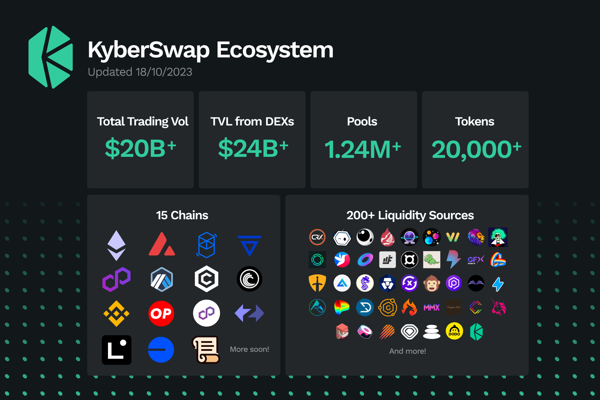

# Introduction to KyberSwap

Kyber Network is building a world where anyone can freely, reliably and effortlessly trade their funds on their own terms. Founded on [decentralized finance](getting-started/foundational-topics/decentralized-finance/) (DeFi) principles of open access, KyberSwap is a multichain [aggregator](getting-started/foundational-topics/decentralized-finance/dex-aggregator.md) and DeFi hub that empowers users with the insights and tools to trade and generate yield without intermediaries. All the above while being fast, secure, and easy-to-use. Whichever your path to financial autonomy, KyberSwap has got you covered.

<figure><figcaption>
The KyberSwap Ecosystem
</figcaption></figure>

With more than 100+ projects building on top of KyberSwap, our solutions have facilitated over US$20B in transactions for thousands of traders and liquidity providers since its inception. KyberSwap's development is governed by the [KyberDAO](governance/kyberdao/), a community platform that empowers [KNC](governance/knc-token/) (Kyber Network Crystal) token holders to [vote](https://kyberswap.com/kyberdao/vote) on or [create](https://kyberswap.canny.io/feature-request) proposals which will go on to influence KyberSwap's roadmap. As DeFi's open and permissionless liquidity backbone, KyberSwap continues to generate synergies across its ever expanding ecosystem which now comprises of more than [100 connected projects across 15 chains](getting-started/supported-exchanges-and-networks.md).&#x20;


For more information on Kyber Network, the organization, please visit the official [Kyber Network page](https://kyber.network/).&#x20;


### KyberSwap Solutions

* [**KyberAI**](kyberswap-solutions/kyberai/): Discover your next big opportunity with AI-powered trading insights for over 4000+ tokens across [7 chains](kyberswap-solutions/kyberai/#supported-chains). In addition to conveniently surfacing multiple [on-chain](kyberswap-solutions/kyberai/on-chain-indicators/) and [technical indicators](kyberswap-solutions/kyberai/technical-indicators/), KyberAI leverages the power of machine learning to assign each token a [KyberScore](kyberswap-solutions/kyberai/kyberscore.md), a single number indicating the extent of a token's bullishness or bearishness over the next 24 hours.
* [**KyberSwap Aggregator**](kyberswap-solutions/kyberswap-aggregator/): Instantly swap at superior rates with our intelligent trade route scanner. Connected to over 100+ liquidity sources across 15 chains, the KyberSwap Aggregator [splits and reroutes trades](kyberswap-solutions/kyberswap-aggregator/concepts/dynamic-trade-routing.md) via  capitally efficient sources thereby ensuring favourable swap rates while encouraging greater market stability.&#x20;
* [**Limit Order**](kyberswap-solutions/limit-order/): Set your preferred swap rates and enjoy gasless, slippage-free, and zero-fee trades powered by our wide network of takers. Stay in control of your assets as orders are [automatically settled on-chain](kyberswap-solutions/limit-order/concepts/off-chain-relay.md) only when the market moves in your favor.
* [**KyberSwap Interface**](kyberswap-solutions/kyberswap-interface/): A one stop [web interface](https://kyberswap.com/) providing convenient and open access to some of the best liquidity solutions and experiences in DeFi. This includes taking advantage of KyberSwap's Aggregator to [swap at the superior rates](kyberswap-solutions/kyberswap-interface/user-guides/instantly-swap-at-superior-rates.md), [earning boosted yields](kyberswap-solutions/kyberswap-interface/user-guides/earn-yield-by-contributing-liquidity.md) through providing liquidity to KyberSwap's [Classic](liquidity-solutions/kyberswap-classic/user-guides/add-liquidity-to-an-existing-classic-pool.md) and [Elastic](liquidity-solutions/kyberswap-elastic/user-guides/add-liquidity-to-an-existing-elastic-pool.md) protocols, [discovering trending tokens](kyberswap-solutions/kyberai/) before the rest of the market, and much more...
* [**KyberSwap Widget**](kyberswap-solutions/kyberswap-widget/): Plug and play superior rates directly from your app with just a few lines of code. Our [endlessly customizable widget](kyberswap-solutions/kyberswap-widget/developer-guides/customizing-the-kyberswap-widget.md) enables integrators to seamlessly blend superior rates into their dApps with easily configure trade routes, fees, and themes.
* [**KyberSwap Cross-Chain Swaps**](kyberswap-solutions/kyberswap-interface/user-guides/swap-between-different-tokens-across-chains.md): Swap between tokens on any chain with a single transaction. KyberSwap has integrated with the [Squid](https://docs.squidrouter.com/) swap and liquidity routing protocol thereby enabling users to perform cross-chain swaps straight from the [KyberSwap Interface](https://kyberswap.com/cross-chain).

### Liquidity Solutions


**KyberSwap Elastic Security Incident**

On 22 Nov 2023, the Elastic protocol experienced a security incident. More details can be found via our [official channels](https://x.com/KyberNetwork?s=20).

All other KyberSwap products ([Aggregator](kyberswap-solutions/kyberswap-aggregator/), [Limit Order](kyberswap-solutions/limit-order/), & [Classic](liquidity-solutions/kyberswap-classic/)) continue to be fully operational.


* [**KyberSwap Classic**](liquidity-solutions/kyberswap-classic/): Amplify your returns through [programmable pricing curves](liquidity-solutions/kyberswap-classic/concepts/dynamic-pricing-curves.md) as well as [dynamic auto-adjusting fees](liquidity-solutions/kyberswap-classic/concepts/flexible-fee-adjustment.md) which responds to market conditions. Deposit your tokens into capitally efficient pools and let the protocol optimize trading spreads (i.e. fees) based on the market volatility.
* [**KyberSwap Elastic**](liquidity-solutions/kyberswap-elastic/): Add liquidity into [customizable price ranges](liquidity-solutions/kyberswap-elastic/concepts/concentrated-liquidity.md) and [automatically compound your yields](liquidity-solutions/kyberswap-elastic/concepts/reinvestment-curve.md). Your concentrated liquidity positions are safeguarded against front-runners with our native [Anti-Sniping feature](liquidity-solutions/kyberswap-elastic/concepts/anti-sniping-mechanism.md).
* [**Elastic Static Farms**](liquidity-solutions/kyberswap-elastic/concepts/tick-based-farming.md#dynamic-farms): Continue earning concentrated liquidity farming rewards no matter the market conditions by [adding liquidity towards an operator-configured price range](liquidity-solutions/kyberswap-elastic/user-guides/yield-farming-on-static-farms.md).
* [**Elastic Dynamic Farms**](liquidity-solutions/kyberswap-elastic/concepts/tick-based-farming.md#static-farms): [Add liquidity into customized price ranges](liquidity-solutions/kyberswap-elastic/user-guides/yield-farming-on-dynamic-farms.md) and get additional farming rewards when the market trades within your selected range.
