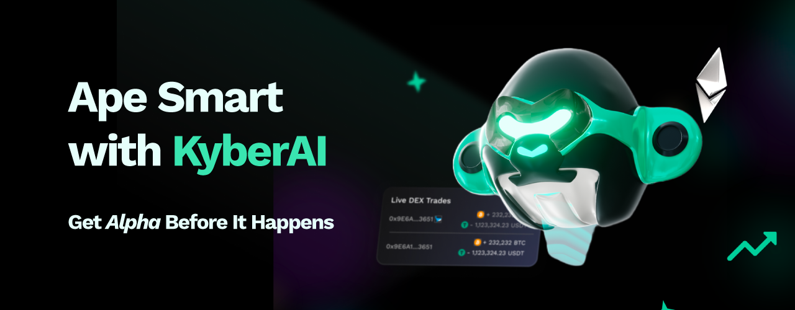

# KyberAI


#### KyberSwap: One place for all your DeFi trading needs

Here at KyberSwap, we understand that the trading journey can easily become overwhelming, even for seasoned traders. This is especially so in DeFi, where rapid innovation brings with it amazing opportunities but also a significant amount of novel due diligence on the part of the trader. In an effort to bring more transparency into the DeFi space and empower DeFi users at all stages of their trading journey, KyberSwap has enhanced our current trading suite with valuable data insights derived via KyberAI.

With the introduction of KyberAI, users will be able to confidently answer the most important trading questions, all conveniently accessed via the [KyberSwap Interface](../kyberswap-interface/):

* [**KyberAI's KyberScore**](kyberscore.md): Which token will likely be bullish or bearish in the short term? How do I identify tokens with the most trading potential?&#x20;
* **KyberAI** [**On-Chain**](on-chain-indicators/) **and** [**Technical**](technical-indicators/) **Indicators**: What other data do I need to make an informed trade decision once I've shortlisted a token? How can these data points be combined to provide further insights?
* [**KyberSwap Aggregator**](../kyberswap-aggregator/): How do I [get superior rates](../kyberswap-interface/user-guides/instantly-swap-at-superior-rates.md) once I've made the decision to buy or sell a token?&#x20;
* [**KyberSwap Limit Order**](../limit-order/): How do I [trade tokens based on my identified entry and exit price](../kyberswap-interface/user-guides/trade-at-your-preferred-rates.md)?&#x20;
* **KyberSwap** [**Classic**](../../liquidity-solutions/kyberswap-classic/) **and** [**Elastic**](../../liquidity-solutions/kyberswap-elastic/): How do I [maximize yields](../kyberswap-interface/user-guides/earn-yield-by-contributing-liquidity.md) by taking advantage of market volatility?&#x20;


## Overview

<figure><figcaption></figcaption></figure>

KyberAI was conceived with the intention of surfacing valuable market data that would empower KyberSwap users to make data-driven trades. With KyberAI, users gain access to a wealth of market data that is usually only afforded to institutional traders or high net worth individuals. KyberAI aggregates both [on-chain](on-chain-indicators/) and [off-chain](technical-indicators/) data across [multiple chains](./#supported-chains) and condenses this wealth of data into actionable insights which can be conveniently accessed via the [KyberSwap Interface](https://kyberswap.com/discover).&#x20;

Critically, KyberAI has also launched with our flagship [KyberScore ](kyberscore.md)which leverages the latest advancements in AI to provide users with valuable insights into token performance in the DeFi markets. By taking advantage of a range of [off-chain](../../getting-started/foundational-topics/decentralized-technologies/on-chain-vs-off-chain-data.md) technical analysis metrics as well as [on-chain](../../getting-started/foundational-topics/decentralized-technologies/on-chain-vs-off-chain-data.md) signals, the KyberScore model has been optimized to identify whenever a token has bullish or bearish potential in the next 24 hours. KyberScore condenses all the complexities of interpreting multiple market factors into a single number enabling traders of all abilities to make more informed trading decisions.

With trading strategies powered by KyberAI insights, you can ape smartly into your next big opportunity! Opportunities are not just limited to traders as the insights uncovered might also provide yield generation opportunities and impermanent loss mitigation strategies based on the expected volatility. Everyone benefits from greater data transparency and KyberAI is trailblazing the path for democratized DeFi data insights.


#### Disclaimer: Not financial advice

KyberAI was created with the intention of empowering our users with the data insights required to make informed trading decisions. Through democratizing data, KyberAI equips our users with tools that were largely limited to institutions and high net worth individuals. Users must exercise due diligence in their trading decisions with the best trading strategies incorporating the insights enabled by KyberAI.


## Supported Chains

KyberAI currently supports more than 4000 tokens deployed across the following 7 chains:

* Ethereum (ChainID: 1)
* BSC (ChainID: 56)
* Arbitrum (ChainID: 42161)
* Polygon PoS (ChainID: 137)
* Optimism (ChainID: 10)
* Fantom (ChainID: 250)
* Avalanche (ChainID: 43114)

## Next Steps

<table data-card-size="large" data-view="cards"><thead><tr><th></th><th data-hidden></th><th data-hidden></th><th data-hidden data-card-target data-type="content-ref"></th></tr></thead><tbody><tr><td><a href="kyberscore.md"><strong>Explore KyberScore</strong></a></td><td></td><td></td><td><a href="kyberscore.md">kyberscore.md</a></td></tr><tr><td><a href="user-guides/deep-dive-into-token-data.md"><strong>Deep Dive Into Token Data</strong></a></td><td></td><td></td><td><a href="user-guides/deep-dive-into-token-data.md">deep-dive-into-token-data.md</a></td></tr><tr><td><a href="user-guides/discover-promising-tokens.md"><strong>Discover Trending Tokens</strong></a></td><td></td><td></td><td><a href="user-guides/discover-promising-tokens.md">discover-promising-tokens.md</a></td></tr><tr><td><a href="user-guides/add-tokens-to-watchlist.md"><strong>Add Tokens To Watchlist</strong></a></td><td></td><td></td><td></td></tr><tr><td><a href="user-guides/get-notifications-for-your-favourite-tokens.md"><strong>Get Notifications For Your Favourite Tokens</strong></a></td><td></td><td></td><td><a href="user-guides/get-notifications-for-your-favourite-tokens.md">get-notifications-for-your-favourite-tokens.md</a></td></tr></tbody></table>
