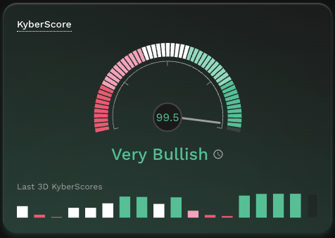
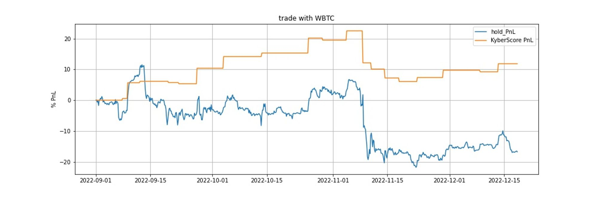
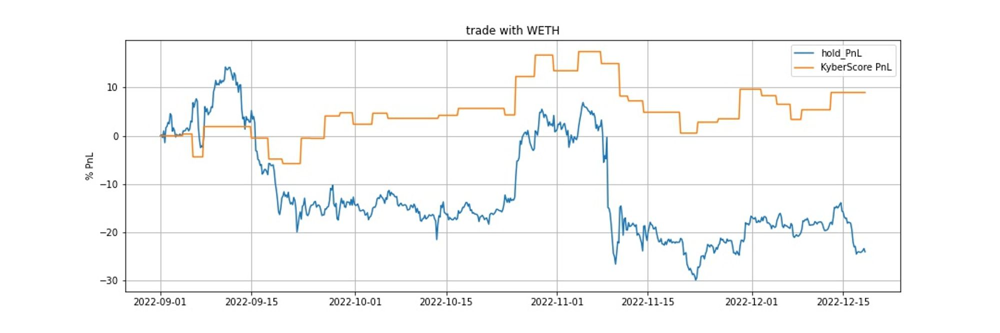
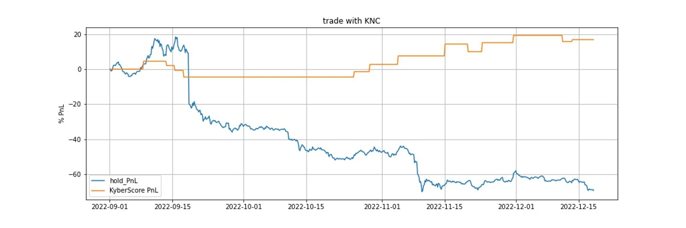
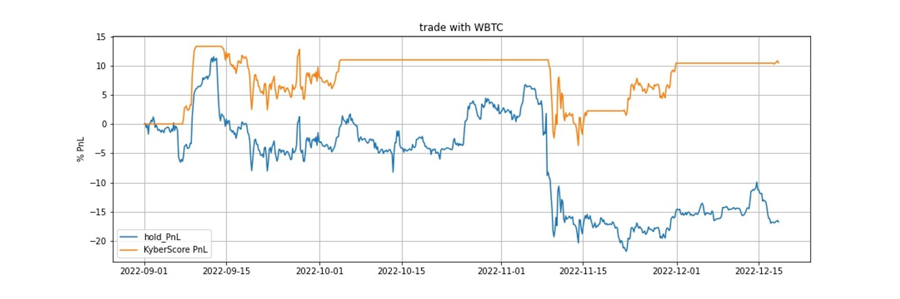
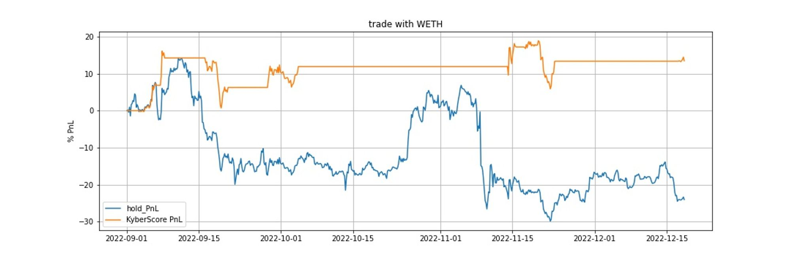
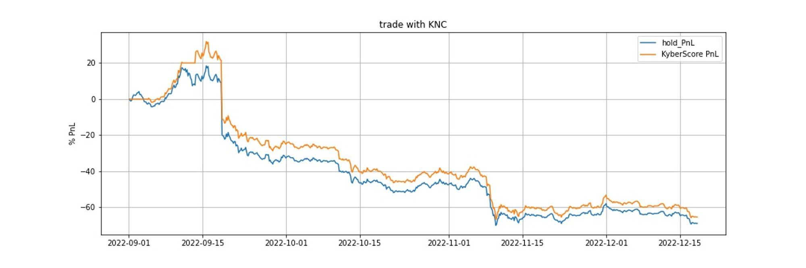

# KyberScore


#### Disclaimer: Not financial advice

KyberAI was created with the intention of empowering our users with the data insights required to make informed trading decisions. Through democratizing data, KyberAI equips our users with tools that were largely limited to institutions and high net worth individuals. Users must exercise due diligence in their trading decisions with the best trading strategies incorporating the insights enabled by KyberAI.


## Overview

<figure><figcaption>
KyberScore
</figcaption></figure>

In keeping to the permissionless and transparent ethos of DeFi, KyberScore was a key component of our solution to democratize data insights for all. A single number that could be easily understood and utilized by traders of all levels, whether it was an advanced trader looking to filter potential opportunities for further analysis or a new trader trying to discover undervalued tokens. While condensing all the complexities of a token and its market dynamics into a single number seems overly bold, the research team here at KyberSwap has managed to leverage the latest advancements in machine learning to create a provably accurate general prediction model. In other words, AI-powered trading insights for all!

## What is KyberScore?

At its core, KyberScore reflects the probability that a token will enter into bullish or bearish territory over the next 24 hours. Ranging from 0-100, a KyberScore closer to 100 indicates that the model anticipates that the token price will very likely increase at anytime over the next 24 hours and vice versa. KyberScores are recomputed every 4 hours based on multiple on-chain and off-chain data points. Users can potentially gauge market directionality by examining relationships between the most recent set of KyberScores for a token (see [backtesting](kyberscore.md#backtesting-with-trading-strategies) for more details).

Critically, by contrasting KyberScores across tokens, users are quickly able to deduce which token will likely outperform or underperform the mean. Moreover, KyberScore represents the token performance for a token across all the supported chains hence users can even compare tokens on different networks easily.


#### Calculating KyberScore for tokens deployed on multiple chains

KyberScore is meant to represent a token's overall performance and was hence designed to be chain agnostic. With DeFi expanding significantly across multiple chains ([KyberSwap included](../../getting-started/supported-exchanges-and-networks.md)), token teams have also taken this opportunity to launch their tokens across a multitude of chains. Consequently, to account for any inter-chain variances for the same token, KyberScore aggregates on-chain data from all the supported chains to determine the net movement of the factor being tracked.

Please refer to [KyberAI Supported Chains](./#supported-chains) for the full list of chains supported by KyberScore.


## Mechanism

The purpose of KyberScore is deceivingly simple, it is a single number indicating the token performance over the next 24 hours. As token prices can be influenced by an infinite number of factors, the KyberScore model must be general enough to apply to all different token types and their unique market contexts. For example, short term social sentiment (coming soon) has a much higher probability of predicting meme token performance as compared to utility tokens. As such, the KyberScore model was trained using a years worth of both on-chain trading data and off-chain technical analysis data sourced from 2,334 tokens. This diversity of training data enables the KyberScore model to be applied across more than 4,000 tokens across 7 chains!

### Data sets: Best of both worlds

KyberScore makes use of both [on-chain and off-chain data](../../getting-started/foundational-topics/decentralized-technologies/on-chain-vs-off-chain-data.md) to provide a holistic view of the market, all captured within a single KyberScore. Through backtesting the KyberScore model, it was discovered that this hybrid approach provided the best results. The wealth of on-chain data held significant value but required considerable processing resources in order to uncover data-driven market insights. On the other hand, integrating off-chain OHLCV data through tried and tested technical indicators further optimized the KyberScore model's predictive ability. By distilling all the complexities of each indicator into the model, KyberScore is able to leverage the best of both worlds to provide a valuable yet easily-understandable data point.



Through extensive testing with various types of on-chain data, the KyberSwap research team has narrowed down the on-chain data ingested to the following data types:

* [**Netflow to CEX**](on-chain-indicators/netflow-to-cex.md): The net value of tokens (in USD) that are being transferred in/out of CEX wallet addresses.&#x20;
* [**Netflow to Whale Wallets**](on-chain-indicators/netflow-to-whale-wallets.md): The net value of tokens (in USD) that are being transferred in/out of whale wallet addresses.&#x20;
* [**Number of Transfers**](on-chain-indicators/number-of-transfers.md): The total number of on-chain transfers between wallets for the token.
* [**Number of Holders**](on-chain-indicators/number-of-holders.md): The total number of wallet addresses currently holding the token on-chain.

To smoothen out the fluctuations of the crypto market, KyberScore takes the moving average of the on-chain factors being measured. The moving average is the average price of an asset over a specific period and is useful in modulating any sudden spikes within the period being measured. To get the moving average, the value for each period is summed and divided by the total number of periods.



Based on the off-chain OHLCV data, KyberScore extracts further insights through leveraging multiple technical indicators such as:

* **Simple Moving Average (SMA)**: The is the average price of an asset within a certain time period. SMA is calculated by aggregating the price of the asset for each period and dividing the sum by the number of periods for the timeframe being measured. In doing so, fluctuations within the timeframe measured are smoothened out providing clearer insights into the the direction which the asset is trending.
* **Exponential Moving Average (EMA)**: The EMA builds on top of the SMA by prioritizing recent price data which is assumed to be more relevant. EMA assigns a greater weight to more recent price data which skews the average in favor of the latest market data. Consequently, EMA is able to respond faster to price changes and therefore uncover upcoming trends earlier.
* **Moving Average Convergence Divergence (MACD)**: MACD is a momentum indicator that measures the relationship between a shorter moving average and longer moving average. It showcases the strength of the short term trend against the longer term trend as an indicator of future price momentum. To calculate the MACD, the longer term EMA (usually 26 periods) is divided by the shorter term EMA (usually 12 periods). The MACD line centers on a zero line which it oscillates around whereby a positive value indicates upward momentum and a negative value indicates downward momentum. This MACD is then compared against a signal line which is the EMA of the MACD values (usually 9 periods). If the MACD line crosses above the signal, it is a bullish sign and vice versa.&#x20;
* **Relative Strength Index (RSI)**: RSI is a momentum indicator which measures both the speed and size of price changes. To get the RSI, the average gains is divided by the average loses over a specific time period. This ratio allows traders to compare the relative strength of the current price movement against past movements to identify when a token is overbought or oversold. If the token price diverges from the RSI, it could mean that a reversal might be incoming.

In addition to technical analysis methods, the model also measures the historic returns and relative volatility to generate the KyberScore.



Note that KyberScore performance is continuously being monitored against the actual token performance to identify any additional indicators which might improve KyberScore's predictive capabilities.

### KyberScore model

The bulk of KyberScore's complexity lies in condensing all the aforementioned factors into a single number as this entails uncovering less obvious relationships between data sets. Moreover, the model must also be able to isolate and smoothen out the effects of a single factor on the final KyberScore. To achieve the above, KyberScore uses a probabilistic approach to iteratively classify and assign weights to each factor based on regressive testing. In plain english, the KyberScore model compares its predicted output against the expected values and continues to test different combinations of factors to gradually narrow this gap. With this approach, the KyberScore model is always taking small steps in the right direction based on uncovering correlations between individual factors and the overall KyberScore.

In keeping up with rapid developments in the crypto space, KyberScores are refreshed every hour based on the last 37 days of token data. This data period was selected as it provided the most optimal results when predicting token performance over the next 24 hours. Consequently, KyberScores can only be computed for tokens with at least 37 days worth of on-chain data. This not only ensures the applicability (i.e. detecting abnormalities, etc.) of the KyberScore model but also serves as a qualifying criteria for more trustworthy tokens. It is important to note that the KyberScore model has been trained based on a year's worth of historical data and will continue to be iterated upon as more factors and data sets become available. With KyberScore already producing such promising results (see below), the KyberSwap team remains optimistic about the future potential of the model.


#### Stablecoins

Note that due to the nature of stablecoins being a fixed unit-of-account, KyberScores are not generated for stablecoins.


## KyberScore evaluation

Based on our extensive testing, KyberScore has consistently managed to anticipate the relative performance of a token over the next 24 hours. The graphs below highlights this fact by comparing the KyberScore for BTC against its historical price over various intervals. Note that the on-chain data used to calculate BTC's KyberScore is based on the WBTC data across the supported EVM chains.

<figure><figcaption>
Comparing KyberScore with BTC historical price movements for Sept 2022
</figcaption></figure>

<figure><figcaption>
Comparing KyberScore with BTC historical price movements for Oct 2022
</figcaption></figure>

<figure><figcaption>
Comparing KyberScore with BTC historical price movements for Nov 2022 - 15 Dec 2022
</figcaption></figure>

Notice the correlation between the KyberScore (green dots) with BTC price (blue line) at times when the KyberScore diverges significantly from the neutral 0.5 baseline (note that the KyberScore displayed in the UI adjusts the KyberScore by a factor of 100 for improved readability, that is KyberScore of 0.5 in the test is equivalent to 50 in the UI). The direction of BTC price movement correlates strongly with the extent of this KyberScore divergence therefore validating the effectiveness of KyberScore as a predictor of a token's price movement in the next 24 hours.

### Backtesting with trading strategies

To validate the value-add of KyberScore insights for a trading strategy, a simulation was carried out comparing a static hold strategy against different strategies that trades based on KyberScore thresholds. This simulation covered 5 different tokens (WBTC, WETH, KNC, UNI, LINK) and was based on data from 01/09/2023 until 18/12/2023. Both strategies tested starts out with all assets being held in stablecoins with the strategy being run according to the following rules:

* **Intraday hold:** If KyberScore is greater than the set threshold, this indicates a bullish market and the token is bought. Over the next 24 hours, the strategy will sell the tokens for profit if token prices increased more than 4% from initial price. Alternatively, losses will be minimized by selling the token if token prices decreased by more than 4% from initial price. In trading speak, profit taking at +4% and stop loss at -4%. If neither of these conditions are met after 24 hours, the token will be sold at the market rate.
* **Buy and hold:** If KyberScore is under the lower threshold for 5 consecutive intervals (i.e. 20 hours as KyberScore was previously refreshed every 4 hours), this indicates that the token is oversold and the strategy will purchase these undervalued tokens. Tokens are sold when the KyberScore goes above the upper threshold for 5 consecutive intervals, the tokens are then sold as this indicates an overbought token. Bought tokens are held until the sell condition is reached.

#### Selection of KyberScore thresholds

For each of our tests, the thresholds were selected based on the relative volatility of the token:



**Buy threshold:**

* 75: WBTC, WETH
* 90: KNC, UNI, LINK



**Buy threshold:**

* 25: WBTC, WETH
* 10: KNC, UNI, LINK

**Sell threshold:**

* 75: WBTC, WETH
* 90: KNC, UNI, LINK



As you integrate KyberScore insights into your trading strategy, it is recommended that such thresholds be adjusted according to your specific trading needs.

#### Trading strategy results: Intraday hold

For all tokens tracked, an intraday hold trading strategy using KyberScore thresholds was able to outperform a standard holding strategy (i.e. tokens are held from beginning to end of the test period).

<figure><figcaption>
Intraday hold strategy for WBTC compared to standard hold strategy
</figcaption></figure>

<figure><figcaption>
Intraday hold strategy for WETH compared to standard hold strategy
</figcaption></figure>

<figure><figcaption>
Intraday hold strategy for KNC compared to standard hold strategy
</figcaption></figure>

<table><thead><tr><th width="120">Token</th><th width="127">Threshold</th><th width="169">No of trades</th><th>Strategy PnL</th><th>Hold PnL</th></tr></thead><tbody><tr><td>WBTC</td><td>75</td><td>20</td><td>+10%</td><td>-16%</td></tr><tr><td>WETH</td><td>75</td><td>33</td><td>-1%</td><td>-24%</td></tr><tr><td>KNC</td><td>90</td><td>13</td><td>+12%</td><td>-69%</td></tr><tr><td>UNI</td><td>90</td><td>30</td><td>-1.8%</td><td>-12%</td></tr><tr><td>LINK</td><td>90</td><td>23</td><td>+54%</td><td>-9.5%</td></tr></tbody></table>

#### Trading strategy results: Buy and hold

For all tokens tracked, a buy and hold trading strategy using KyberScore buy and sell thresholds was able to outperform a standard holding strategy (i.e. tokens are held from beginning to end of the test period).

<figure><figcaption>
Buy and hold strategy for WBTC compared to standard hold strategy
</figcaption></figure>

<figure><figcaption>
Buy and hold strategy for WETH compared to standard hold strategy
</figcaption></figure>

<figure><figcaption>
Buy and hold strategy for KNC compared to standard hold strategy
</figcaption></figure>

<table><thead><tr><th width="102">Token</th><th width="143">Buy Threshold</th><th width="142">Sell Threshold</th><th width="132">No of trades</th><th width="133">Strategy PnL</th><th>Hold PnL</th></tr></thead><tbody><tr><td>WBTC</td><td>25</td><td>75</td><td>9</td><td>+10%</td><td>-16%</td></tr><tr><td>WETH</td><td>25</td><td>75</td><td>13</td><td>+13%</td><td>-24%</td></tr><tr><td>KNC</td><td>10</td><td>90</td><td>3</td><td>-62%</td><td>-69%</td></tr><tr><td>UNI</td><td>10</td><td>90</td><td>3</td><td>+14%</td><td>-12%</td></tr><tr><td>LINK</td><td>10</td><td>90</td><td>1</td><td>+1%</td><td>-9.5%</td></tr></tbody></table>

## Data source(s)



ERC20 [`Transfer`](https://docs.openzeppelin.com/contracts/4.x/api/token/erc20#IERC20-Transfer-address-address-uint256-) events emitted by token contracts and logged on-chain. Refer to individual indicators for further details regarding how further insights are extracted from the raw data:

* [**Netflow to CEX**](on-chain-indicators/netflow-to-cex.md)
* [**Netflow to Whale Wallets**](on-chain-indicators/netflow-to-whale-wallets.md)
* [**Number of Transfers**](on-chain-indicators/number-of-transfers.md)
* [**Number of Holders**](on-chain-indicators/number-of-holders.md)



#### OHLCV data sourced from:

#### CoinMarketCap

**API**: [https://pro-api.coinmarketcap.com](https://pro-api.coinmarketcap.com)

* /v2/cryptocurrency/ohlcv/historical

#### CoinGecko

**API**: [https://pro-api.coingecko.com/api](https://pro-api.coingecko.com/api)

* /v3/coins/{token\_id}/ohlc


