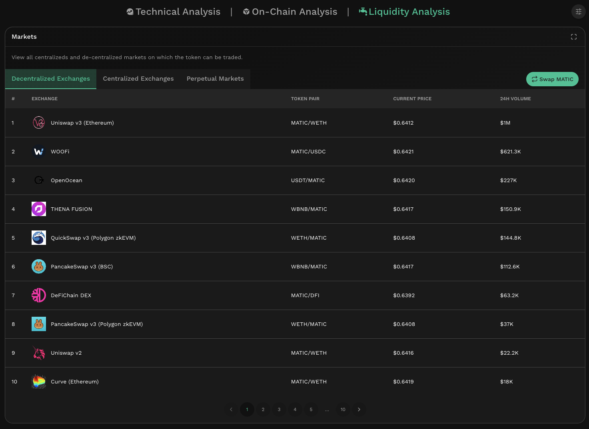
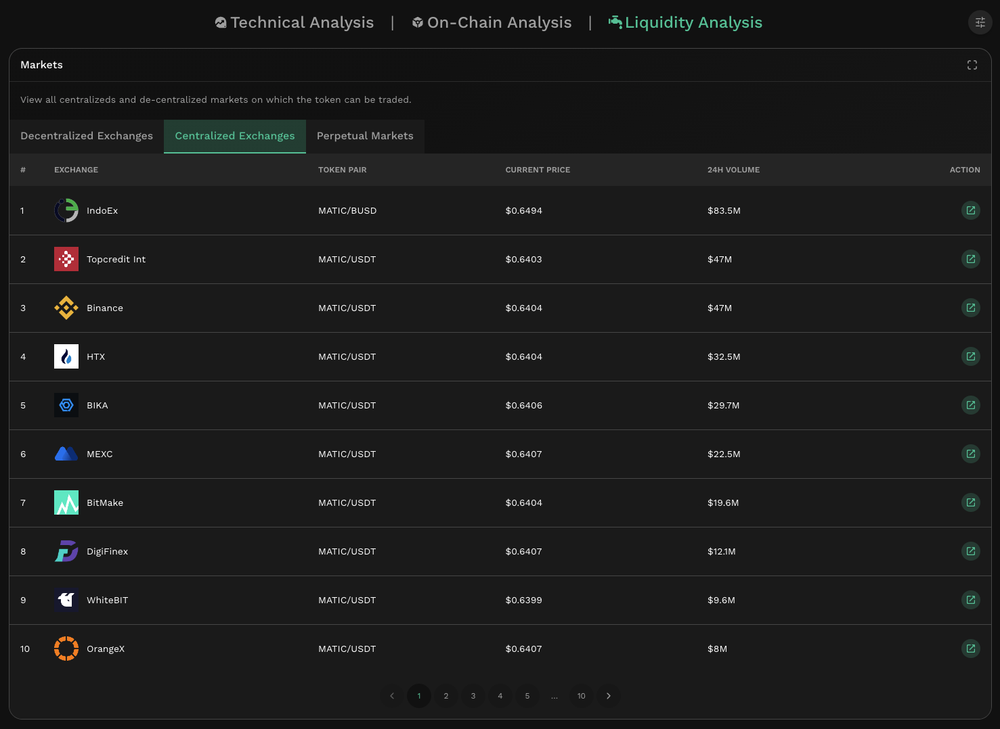
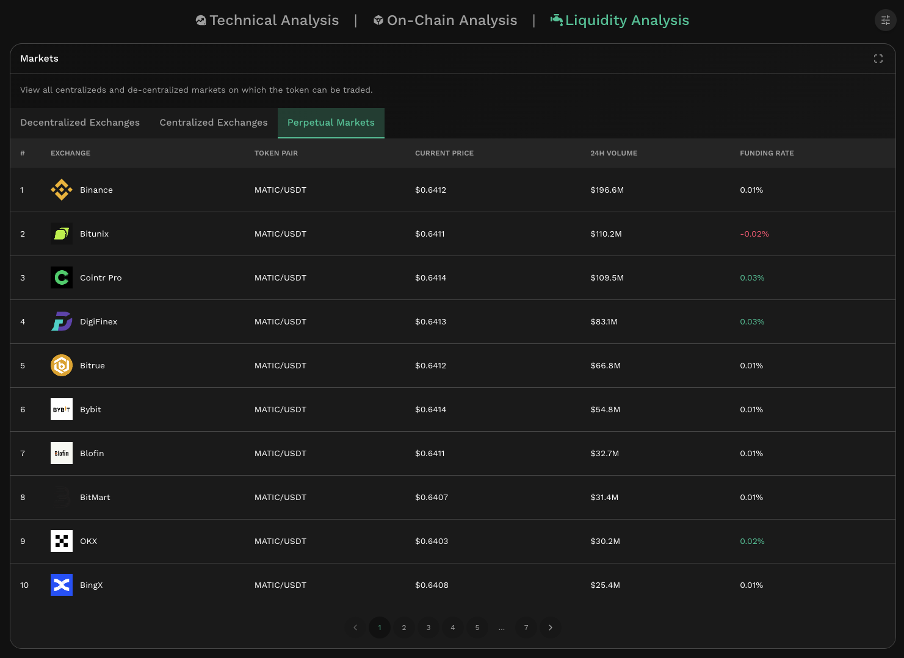

# Liquidity Analysis

## Overview

Discover where tokens are being traded. KyberAI's Liquidity Analysis tab enables users to view the trade volume distribution of tokens across multiple exchanges and even related perpetual markets. From decentralized exchanges to centralized exchanges, gain insights to the most liquid sources on a per token basis.

Through looking for relationships between exchange trading volumes, you can infer how decentralized the markets for a specific token are. Consequently, the trading volume facilitated also implies the potential price impact risks that a trade on a particular exchange will face.

If the number of liquidity sources gets too overwhelming, you can always avoid the complexity of sourcing superior rates by trading via the [KyberSwap Aggregator](../kyberswap-aggregator/).

### Decentralized Exchanges

<figure><figcaption>
DEX Token Liquidity
</figcaption></figure>

The trading volume of the token across [Decentralized Exchanges](../../getting-started/foundational-topics/decentralized-finance/decentralised-exchange-dex.md).

### Centralized Exchanges

<figure><figcaption>
CEX Token Liquidity
</figcaption></figure>

The trading volume of the token across Centralized Exchanges (i.e. exchanges who custody your assets).

### Perpetual Markets

<figure><figcaption>
Token Perpetual Markets
</figcaption></figure>

The trading volume of the token's perpetual markets. You can [learn more about perpetual markets here](technical-indicators/funding-rate-on-cex.md#perpetuals-step-by-step).
