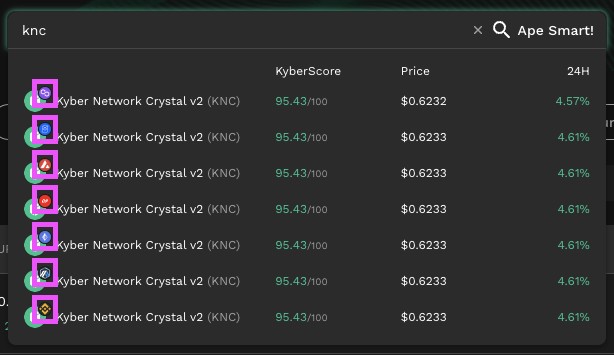

# On-Chain Indicators

## Overview

Users can realize the power of on-chain data by conveniently accessing all the various indicators that KyberAI has queried, sorted, and processed via the KyberSwap Interface. KyberAI enables users to view trends for the most important on-chain metrics as well as mix-and-match key indicators to derive further insights. To gain even further insights and context, the on-chain indicators can be combined with [off-chain technical indicators](../technical-indicators/). You can refer to [On-Chain vs Off-Chain Data](../../../getting-started/foundational-topics/decentralized-technologies/on-chain-vs-off-chain-data.md) for more information on how this hybrid approach equips KyberAI users with the tools required to make data-driven trades.


#### Cross-chain data

The data displayed across all on-chain indicators are specific to the selected chain. With DeFi expanding significantly across multiple chains ([KyberSwap included](../../../getting-started/supported-exchanges-and-networks.md)), token teams have also taken this opportunity to launch their tokens across a [multitude of chains](../../../getting-started/supported-exchanges-and-networks.md).

When searching for tokens, you will be able to see which chain data is being queried.

To avoid any confusion, the selected chain is also indicated at the top of the "Explore" page.


## On-Chain Indicators

<table data-view="cards"><thead><tr><th></th><th data-hidden></th><th data-hidden></th><th data-hidden data-card-target data-type="content-ref"></th></tr></thead><tbody><tr><td><a href="number-of-trades.md"><strong>Number Of Trades</strong></a></td><td></td><td></td><td><a href="number-of-trades.md">number-of-trades.md</a></td></tr><tr><td><a href="trading-volume.md"><strong>Trading Volume</strong></a></td><td></td><td></td><td><a href="trading-volume.md">trading-volume.md</a></td></tr><tr><td><a href="netflow-to-whale-wallets.md"><strong>Netflow To Whale Wallets</strong></a></td><td></td><td></td><td><a href="netflow-to-whale-wallets.md">netflow-to-whale-wallets.md</a></td></tr><tr><td><a href="netflow-to-cex.md"><strong>Netflow To CEX</strong></a></td><td></td><td></td><td><a href="netflow-to-cex.md">netflow-to-cex.md</a></td></tr><tr><td><a href="number-of-transfers.md"><strong>Number Of Transfers</strong></a></td><td></td><td></td><td><a href="number-of-transfers.md">number-of-transfers.md</a></td></tr><tr><td><a href="volume-of-transfers.md"><strong>Volume Of Transfers</strong></a></td><td></td><td></td><td><a href="volume-of-transfers.md">volume-of-transfers.md</a></td></tr><tr><td><a href="top-holders.md"><strong>Top Holders</strong></a></td><td></td><td></td><td><a href="top-holders.md">top-holders.md</a></td></tr></tbody></table>
