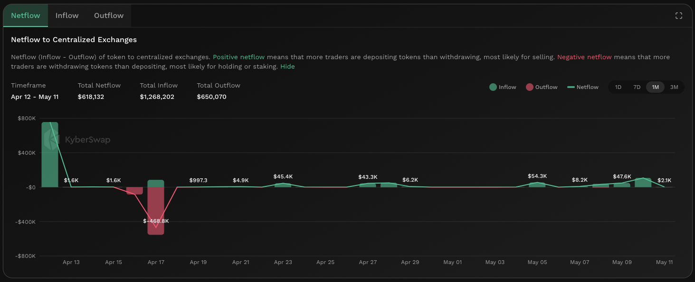

# Netflow To CEX


#### In one sentence

The net value of tokens (in USD) that are being transferred in/out of major centralized exchange wallet addresses.&#x20;


## Overview

<figure><figcaption>
Netflow to CEX wallets
</figcaption></figure>

The netflow to CEX measures the net total USD value of tokens which are being transferred to and from major CEX wallets. Inflows refers to tokens being deposited to the CEX wallet while outflows refers to when tokens are withdrawn from said wallet. From the perspective of the CEX, inflows results in the token being credited to the user's CEX account while outflows results from a user's request to withdraw tokens from their CEX account.

CEXs play an important role as fiat to token on/off-ramps. As such, the netflow to CEX acts as a proxy as to how much value is being transferred in and out of tokens. Critically, the proportion of trades which results in the token being converted to and from fiat value rails will be dependent on CEX data transparency. KyberAI surfaces this data to enable users to conduct further research into the respective CEXs. KyberAI currently tracks the following CEXs:

* [Binance](https://www.binance.com/en)
* [Coinbase](https://www.coinbase.com/)
* [OKX](https://www.okx.com/)
* [KuCoin](https://www.kucoin.com/)
* [Kraken](https://www.kraken.com/)
* [Crypto.com](https://crypto.com/)

There are a few pieces of information that can be assumed based on CEX inflows and outflows:

* **CEX token whitelisting**: Unlike [DEXs](../../../getting-started/foundational-topics/decentralized-finance/decentralised-exchange-dex.md), tokens must first be whitelisted by the CEX before it can be traded. As such, by listing a token, CEXs are indirectly endorsing the token which implies that the token has managed to get a reasonable amount of traction. Nonetheless, such whitelistings have to be considered in conjunction with the CEX's reputation as each CEX has different token listing criterias. Note that CEXs are not able to control token inflows in the case that a user transfers an unsupported token to the wallet address.
* **Positive netflow**: A constant inflow of tokens to CEX addresses indicates that users are depositing their tokens to CEXs and is generally assumed to be a bearish signal. While CEXs do offer additional non-trading services to incentivize deposits (i.e. staking, interest earning products, etc.), the aggregate impact of inflows to CEXs usually indicates that users are planning to sell the token on CEXs. By selling via a CEX, users can easily convert their tokens to fiat and also avoid gas fees.
* **Negative netflow**: A constant outflow of tokens from CEX addresses indicates that users are buying the token on CEXs and transferring it to their own wallets for safekeeping or staking. CEXs act as an on-ramp for fiat to tokens and hence such outflows suggests that there is an increased demand for the token. Aside from purely market factors, another key driver of outflows could be due to a lost of trust in the ability of CEXs to honour token withdrawals and hence users might transfer their balances into their own wallets for safekeeping.


#### Cross-chain data

Data shown in graph is specific to the selected chain. For the same token, the KyberAI interface allows users to toggle between the supported chains. Refer [On-Chain Indicators](./) for more info.


## Improving trades with Netflow to CEX


#### Disclaimer: Not financial advice

KyberAI was created with the intention of empowering our users with the data insights required to make informed trading decisions. Users must exercise due diligence in their trading decisions with the best trading strategies incorporating the insights enabled by KyberAI.


By comparing CEX netflows against previous periods, the netflow to CEX indicates the direction as well as scale of tokens that are likely being earmarked for trades on CEXs. A positive netflow suggests that users are depositing tokens into their CEX accounts to be sold whereas a negative netflow suggests that users are withdrawing tokens from their CEX accounts, likely for staking or safekeeping purposes.

Sudden changes in the total volume transferred between CEX accounts could indicate increased interest in the token. This could be bullish or bearish depending on the ratio of inflows to outflows whereby a higher ratio of inflows is bearish and vice versa. Of note, CEXs are able to act as on and off-ramps for fiat to token conversions hence it is likely that a portion of the netflow is being transferred in and out of fiat value rails.

The total volume of flows to CEXs should be taken in context with the average historical value of CEX holdings, as well as the [trading volume on DEXs](trading-volume.md). Checking against the above data sets will provide a better indication as to which trading venue has an outsized impact on the token price. In the case of the majority of tokens being traded on CEXs, users will have to conduct further research based on the data made available by CEXs. Some possible insights include the type of token holders (i.e. token holders that prefer storing their tokens on the exchange) or even opportunities for arbitrage between CEXs and DEXs.

## Data source(s)

ERC20 [`Transfer`](https://docs.openzeppelin.com/contracts/4.x/api/token/erc20#IERC20-Transfer-address-address-uint256-) events emitted by token contracts and logged on-chain. The `Transfer` events are filtered against CEX addresses to identify CEX transfers. Following this, shortlisted transfers are then converted into its USD equivalent. Data is refreshed every hour.
