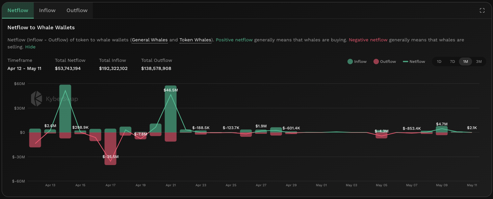

# Netflow To Whale Wallets


#### In one sentence

The net value of tokens (in USD) that are being transferred in/out of whale wallet addresses.&#x20;


## Overview

<figure><figcaption>
Netflow to whale wallets
</figcaption></figure>

The netflow to whale wallets measures the net total USD value of tokens which are being transferred to and from whale wallets. Inflows refers to tokens being deposited to the whale wallet while outflows refers to when tokens are withdrawn from said wallet. Inflow and outflow can be an outcome of direct wallet transfers or [DEX](../../../getting-started/foundational-topics/decentralized-finance/decentralised-exchange-dex.md) swaps. KyberAI defines 2 classes of whales:

* **General whales**: Wallets with assets totalling over USD5M across supported chains.
* **Token whales**: Wallets that hold more than 1% of the total token supply for a particular token.

This dual definition of whales allows KyberAI to capture the major market players across tokens as well as whales for tokens with a smaller market cap. The list of whale wallets are refreshed every 2 weeks to identify which wallets currently hold the most market clout.

Positive netflow indicates that whales might be accumulating the token while a negative netflow indicates a sell-off of the token. Given their size, it is usually assumed that whale wallets are more likely to be up to date with the latest news on a specific token, hence whale wallets would likely be one of the first movers based on the latest information. Moreover, given their relative size, any buys or sells from a whale wallet tends to have a large [price impact](../../../getting-started/foundational-topics/decentralized-finance/price-impact.md) resulting in markets moving according to their trades. Due to their ability to move markets, any coordinated flow of tokens from whale wallets usually results in significant price movements.

Do note that addresses belonging to DEX smart contracts, CEXs, as well as multi-sig wallets are excluded from this list hence the whale wallet lists identifies individual whale wallets (i.e. EOA addresses). This is because such addresses tend to accumulate a large portion of the tokens but are not actively trading the token. Critically, tokens which have been transferred to DEX smart contract addresses could be used for both DEX swaps as well as liquidity provision hence such a large transfer out of a whale wallet requires further investigation as to whether it is a bullish or bearish signal.


#### Cross-chain data

Data shown in graph is specific to the selected chain. For the same token, the KyberAI interface allows users to toggle between the supported chains. Refer [On-Chain Indicators](./) for more info.


## Improving trades with Netflow to Whale Wallets


#### Disclaimer: Not financial advice

KyberAI was created with the intention of empowering our users with the data insights required to make informed trading decisions. Users must exercise due diligence in their trading decisions with the best trading strategies incorporating the insights enabled by KyberAI.


Netflow to whale wallets enable users to view the actions of market movers as well as understand the distribution of tokens to whale vs general wallets. A significant positive netflow indicates that whales are buying and accumulating the token. This could result in significant price impacts if their trades are relatively large compared to the total market volume. Moreover, by holding a large number of tokens in their wallets, whales also decrease the token's liquidity through limiting the available supply resulting in further swings in the token's price.

In the other direction, significant negative netflow indicates that whales are selling and cashing out of the token. This negative netflow has to be taken into consideration with the price movement as well as the change in the [number of holders](number-of-holders.md). If there are significant outflows from whale wallets but the price remains relatively unchanged, it could indicate that the supply is being absorbed by smaller holders. Moreover, if the number of holders increases significantly after whale outflows, it suggests that there are many smaller traders who are sitting on the sideline waiting for a good opportunity to enter the market. Of note, adding tokens to a liquidity pool also qualifies as an outflow hence further care is required when interpreting outflow data.

It must also be noted that some whales have a significant social media presence, hence any significant outflows could also result in a decrease in both price and number of holders in which case the whale outflow triggers the next downturn and vice versa. By comparing the rate of change to previous periods, users can pre-empt any major market movements that might be triggered by said whales.

## Data source(s)

ERC20 [`Transfer`](https://docs.openzeppelin.com/contracts/4.x/api/token/erc20#IERC20-Transfer-address-address-uint256-) events emitted by token contracts and logged on-chain. The `Transfer` events are filtered against Whale addresses to identify transfers to and from whale wallets. Following this, shortlisted transfers are then converted into its USD equivalent. Data is refreshed every hour while the list of whale wallets are refreshed every 2 weeks.
