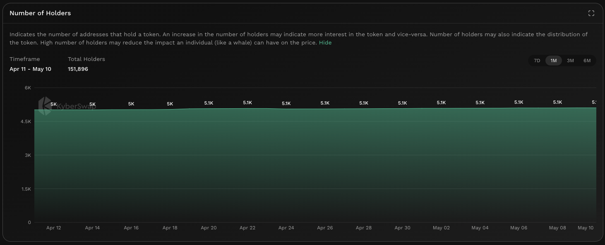

# Number Of Holders


#### In one sentence

The total number of wallet addresses currently holding the token on-chain.


## Overview

<figure><figcaption>
Number of holders
</figcaption></figure>

The number of holders counts the number of wallet addresses that currently hold the token. The rate of change in the number of holders can be used as a gauge as to the interest in the token. Aside from indicating interest in the token, the number of holders may also be used to approximate the token's distribution. A high number of token holders will likely dampen the effect of any single individual (i.e. whales) and also implies that there are a large number of users that are willing to hold onto the token.&#x20;

Note that the number of holders has to be considered in conjunction with whether the token was airdropped willingly to an address versus claimed. In the earlier case, the number of token holders might be wildly inflated especially since users did not actively choose to hold the tokens in their wallets. This will be highly dependent on individual token projects so care has to be taken to understand how the token was initially distributed.

Moreover, for wrapped native tokens such as WETH, it is important to note that a significant portion of the supply might be held in the native coin of the chain. In such cases, the token wrapper contract is only able to account for the number of users who have willingly wrapped their coins or bought the wrapped token equivalent.

Another factor to consider is the token holdings by [AMM DEX ](../../../getting-started/foundational-topics/decentralized-finance/automated-market-maker.md)contract addresses. In such cases, the tokens used to market make are held in the contract address reserves which no individual controls (assuming it is a securely designed token). If the token has a significant amount of holders that are willing to hold the token long term but want to generate yield via AMMs, the holder count might be lower than the actual holders. Similar logic applies to users holding tokens on CEXs as all tokens are held on the CEXs address but in this case the address is owned by the CEX operator. This can also be extended to DAO governance contracts where tokens are usually staked in order to be eligible to participate in token governance.


#### Cross-chain data

Data shown in graph is specific to the selected chain. For the same token, the KyberAI interface allows users to toggle between the supported chains. Refer [On-Chain Indicators](./) for more info.


## Improving trades with Number of Holders


#### Disclaimer: Not financial advice

KyberAI was created with the intention of empowering our users with the data insights required to make informed trading decisions. Users must exercise due diligence in their trading decisions with the best trading strategies incorporating the insights enabled by KyberAI.


A high number of token holders indicates a high level of interest in the token but this has to be taken in context with how the tokens were initially distributed (i.e. passively airdropped vs actively claimed). By comparing the number of token holders across previous periods, you can get an idea of the direction as well as the rate of change with regards to interest in the token.&#x20;

To get a more comprehensive view of the token, the number of holders should be considered together with other factors such as the distribution of tokens to [top holders ](top-holders.md)or [whale wallets](netflow-to-whale-wallets.md). This distribution will provide a better framework for analyzing the token as an overallocation to whale wallets might indicate that token action is dependent on a few individuals and might not be as widely adopted as initially indicated.&#x20;

In addition to whale wallets, users should also view the proportion of tokens which are allocated to DEX contract addresses, DAO contract address, as well as CEX controlled addresses. For DEX addresses, liquidity providers might be willing to hold the token but have decided to generate yield while holding via [AMM DEXs](../../../getting-started/foundational-topics/decentralized-finance/automated-market-maker.md). For DAO contract addresses, tokens are staked in the governance contract for the purposes of voting. For CEXs, there will be a subset of holders who are more comfortable not holding their private keys and have opted for the custodial and yield generation services which CEXs provide. In all cases, the total number of holders will be undercounted as the token is not sitting idly in the holder's wallet.

## Data source(s)

ERC20 [`Transfer`](https://docs.openzeppelin.com/contracts/4.x/api/token/erc20#IERC20-Transfer-address-address-uint256-) events emitted by token contracts and logged on-chain. The `Transfer` events are aggregated with a count being conducted on addresses with non-zero balances. Data is refreshed daily.
