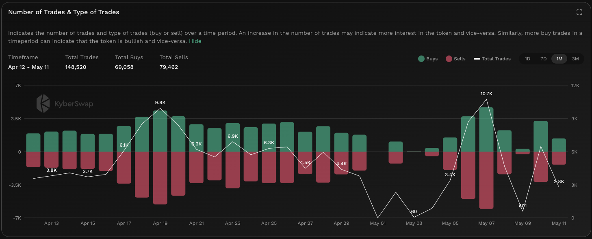

# Number Of Trades


#### In one sentence

The total number and types of trades across DeFi protocols which involves the token.


## Overview

<figure><figcaption>
Number of trades
</figcaption></figure>

The number of trades counts the total swaps and swap types which have occured across various [DEXs](../../../getting-started/foundational-topics/decentralized-finance/decentralised-exchange-dex.md) for the specific token. Trades are split into two categories with green indicating a buy and red indicating a sell. By comparing the totals of each trade type, users will be able to get a sense of the relative buy/sell pressure based on trade counts. Moreover, when comparing trade counts across past periods, it is also possible to deduce whether interest in the token has increased or decreased based on the history of the specific token.

Note that the number of trades differs from [number of transfers](number-of-transfers.md), as the former only accounts for transfers between DEX smart contract addresses and EOA addresses while the latter counts transfers between EOA addresses. In other words, number of trades counts the DEX trades while number of transfers count the number of direct peer-to-peer transfers.


#### Cross-chain data

Data shown in graph is specific to the selected chain. For the same token, the KyberAI interface allows users to toggle between the supported chains. Refer [On-Chain Indicators](./) for more info.


## Improving trades with Number of Trades


#### Disclaimer: Not financial advice

KyberAI was created with the intention of empowering our users with the data insights required to make informed trading decisions. Users must exercise due diligence in their trading decisions with the best trading strategies incorporating the insights enabled by KyberAI.


The number of trades acts as a proxy for interest in a particular token with a sudden increase in trade counts indicating recent interest in the token. Successive periods of increased trade counts indicate that the token is likely experiencing a significant surge of interest. This increase in interest can be either negative or positive depending on the ratio of buys and sells. If the number of trades for a token consistently increases with buys outnumbering sells, it could be a sign that more users are buying and holding the token. The opposite applies if the increase in number of trades is accompanied by a higher sell ratio.

High trade counts with relatively balanced buys and sells might imply higher market volatility with numerous buy and sell trades cancelling out each other. In cases where the trade counts are low, token liquidity might also be limited due to a constrained supply. The total number of trades must be taken into context with the [trade volume](trading-volume.md) to get a more holistic picture of the market as a single high value trade can have as big an impact as hundreds of smaller trades. High trade counts is a good indicator of general retail interest but needs to be checked against [transactions from whale wallets](netflow-to-whale-wallets.md) as these are the traders who have the power to move the markets significantly.

## Data source(s)

ERC20 [`Transfer`](https://docs.openzeppelin.com/contracts/4.x/api/token/erc20#IERC20-Transfer-address-address-uint256-) events emitted by token contracts and logged on-chain. The `Transfer` events are filtered against DEX and Aggregator addresses to identify DeFi trades. Data is refreshed every hour.
