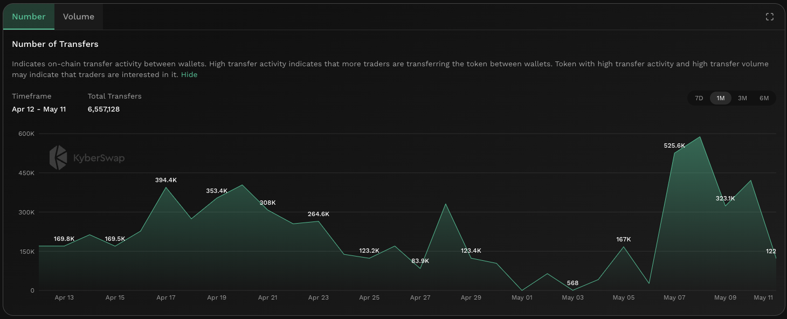

# Number Of Transfers


#### In one sentence

The total number of on-chain transfers between user addresses for the token.


## Overview

<figure><figcaption>
Number of transfers
</figcaption></figure>

The number of transfers counts the total transfers between user address (i.e. EOA accounts) for the specific token. By comparing the total number of transfers across past periods, it is possible to deduce whether interest in the token has increased or decreased based on the history of the specific token. Critically, by comparing the number of transfers agains the [number of trades](number-of-trades.md), this ratio might indicate that the token is being used for more than just swaps which warrants further investigation.

Note that the number of transfers differs from [number of trades](number-of-trades.md), as the latter only accounts for transfers between DEX smart contract addresses and EOA addresses while the former counts transfers between EOA addresses. In other words, number of trades counts the DEX trades while number of transfers count the number of direct peer-to-peer transfers.


#### Cross-chain data

Data shown in graph is specific to the selected chain. For the same token, the KyberAI interface allows users to toggle between the supported chains. Refer [On-Chain Indicators](./) for more info.


## Improving trades with Number of Transfers


#### Disclaimer: Not financial advice

KyberAI was created with the intention of empowering our users with the data insights required to make informed trading decisions. Users must exercise due diligence in their trading decisions with the best trading strategies incorporating the insights enabled by KyberAI.


The number of transfers acts as a good proxy for the total general interest of the token. A higher number of transfers over multiple periods indicates that there is a sustained interest in the token. When comparing the transfer count to previous periods, users can also see when there was a sudden spike in interest and whether this interest lead to more gradual growth or an immediate decline.&#x20;

Taken in isolation, the number of transfers is unable to provide further guidance as to whether the token is bullish or bearish as it is indifferent to transfers resulting from buys or sells. To solve this, the [number of trades](number-of-trades.md) provides a more price specific view as it takes into account trade types. Critically, by comparing the [number of trades](number-of-trades.md) against the number of transfers, this ratio provides a good indication of interest in the token outside of trading. This might be a good indicator as to whether the token is driving value via wider adoption through various means (i.e. utility, payments, etc.).

## Data source(s)

ERC20 [`Transfer`](https://docs.openzeppelin.com/contracts/4.x/api/token/erc20#IERC20-Transfer-address-address-uint256-) events emitted by token contracts and logged on-chain. The `Transfer` events are filtered based on transfers between EOA addresses. Data is refreshed every hour.
