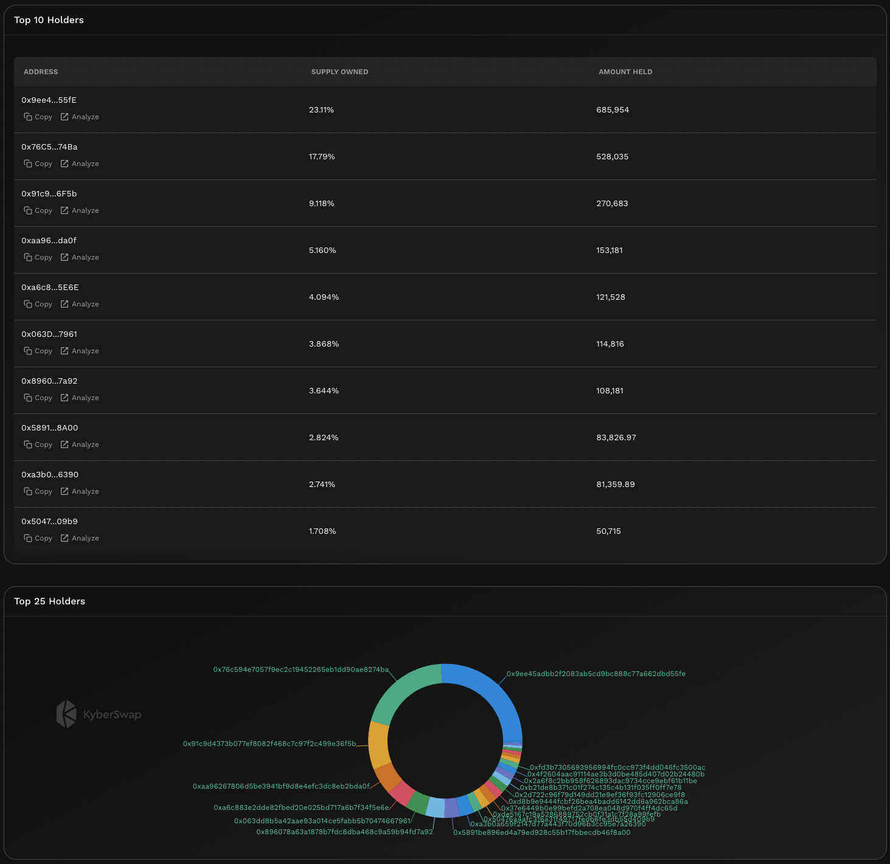

# Top Holders


#### In one sentence

The top 10/25 user wallets which currently has the highest token balances on-chain.


## Overview

The top holders indicates the EOA wallet addresses with the highest on-chain token balances. Each of the top 25 addresses are displayed with the proportion of token supply held indicated for the top 10 addresses. Through identifying the top holders, users can analyze the transactions of the wallets which have the biggest potential to move the markets. Furthermore, by tracking the activities of the identified wallets, users can also identify other tokens held by the wallet and discern any patterns.

<figure><figcaption>
Top 10 and 25 token holders
</figcaption></figure>

There are certain general observations that can be made depending on the owner of the address as well as the proportion of tokens held:

* **Individual token holders (i.e. whales)**: Whale wallet addresses are the least predictable as it depends on the profile of the individual behind the wallet. Some individuals might have a significant public presence with their wallets being known and in such cases, certain patterns can be explored. One way of potentially sourcing out the owner's public presence is by using [ENS checkers](https://app.ens.domains/) and cross-checking against social media handles. Even in cases where the whale is unknown, additional insights can be gained from using blockchain scanners (i.e. [Etherscan](https://etherscan.io/)) to view the whale's transactions or even other tokens which she might be holding.&#x20;
* **Institution address**: The address owner could also be an institution in which case further research has to be done based on their publicly available information. By checking the transactions and holding for the institutional address, users can also discover connections between the institution and the token. For example, is the institution address a VC which invested in the token team and if so, is there a vesting schedule. Note that if the wallet is a multisig wallet (i.e. a smart contract address), it will not be included in this list.

Note that the top holders list excludes smart contract addresses and CEX reserve addresses. This is because such addresses tend to accumulate a large portion of the tokens but are not actively trading the token. Nonetheless, users should still keep an eye on such addresses as further insights can be drawn from such wallet holdings:

* **CEX controlled addresses**: Any tokens on CEXs will have to be whitelisted and hence tokens held in the CEX address implies that the token has been endorsed by the CEX (each CEX carries different trust assumptions). A high proportion of tokens held in CEX addresses indicates that there is a significant amount of trades and market making that occurs on CEXs for the token and hence the CEX market could have an outsized effect on the overall market. This requires further investigation into CEX off-chain data. Moreover, there might be users who utilize CEX custodial services to safe-keep their tokens.
* [**DEX** ](../../../getting-started/foundational-topics/decentralized-finance/decentralised-exchange-dex.md)**contract addresses**: In contrast to CEXs, DEXs allow any tokens to be added as liquidity as long as the token implements the ERC20 standard. A high proportion of tokens held in DEX contract addresses implies that liquidity providers are willing to hold onto the tokens in order to [generate yield](../../kyberswap-interface/user-guides/earn-yield-by-contributing-liquidity.md). This will have to be cross-checked against the [number of trades](number-of-trades.md) which indicates whether token demand correlates to the supply.
* **DAO governance reserves**: A high proportion of tokens held by the DAO governance address might imply that the token experiences active governance participation. Furthermore, tokens held in governance reserves also implies that there is less circulating supply hence liquidity for the token on the open market will be more limited.

With the above data being available on-chain, users have an unlimited number of ways to analyze individual wallets and identify any opportunities. The list above is not a conclusive list of potential actors and as DeFi grows, it is only expected that new groups with more specific goals will emerge.


#### Cross-chain data

Data shown in graph is specific to the selected chain. For the same token, the KyberAI interface allows users to toggle between the supported chains. Refer [On-Chain Indicators](./) for more info.


## Improving trades with Top Holders


#### Disclaimer: Not financial advice

KyberAI was created with the intention of empowering our users with the data insights required to make informed trading decisions. Users must exercise due diligence in their trading decisions with the best trading strategies incorporating the insights enabled by KyberAI.


While the list of top holders makes explicit the wallet addresses with the most potential to move the markets, real value can only be derived from further investigations into each individual wallet. This is because the entity or individual that controls the wallet will have vastly different profiles (see categories above). Keeping track of transactions from those wallets will provide an indication as to the direction of market movement but it is only after the fact that the transaction has been finalized. By deep diving into the transaction history of such addresses as well as making the connections with off-chain data sources (i.e. websites, socials, etc.), users might be able to discover unique opportunities through novel relationships.

At an aggregate level, the total proportion of tokens owned by the top holders is also an indication of how widely the token value has been distributed. If the top wallets hold a disproportionate amount of the total token supply, the market for that token can be easily manipulated by said wallets. A lower ratio of tokens held by the top wallets might be an indication that the token is more evenly distributed which bids well for the decentralization aspect of the token.

## Data sources(s)

Third-party data is refreshed daily.
