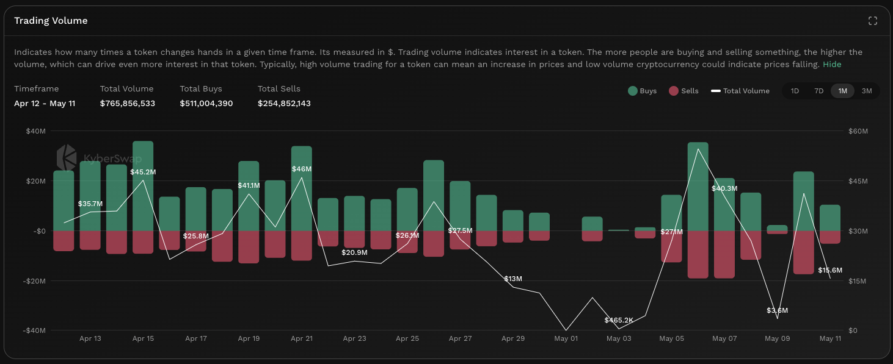

# Trading Volume


#### In one sentence

The total value (in USD) of all DeFi protocol swaps involving the token.


## Overview

<figure><figcaption>
Trading volume
</figcaption></figure>

The trading volume aggregates the total USD value as well as swap types which have occured across various [DEXs](../../../getting-started/foundational-topics/decentralized-finance/decentralised-exchange-dex.md) for the specific token. Trades are split into two categories with green indicating a buy and red indicating a sell. By comparing the totals of each trade type, users will be able to get a sense of the relative buy/sell pressure based on trade volume. Moreover, when comparing trade volumes across past periods, it is also possible to deduce whether interest in the token has increased or decreased based on the history of the specific token.

It is crucial to note that as the trading volume is denominated in USD, the actual token units traded will scale according to the price of the token. For example, a 2,000USD trade results in 1 unit of ETH being traded if the market price for ETH is 2,000USD at the point of trade but only 0.91 units of ETH if the market price for ETH is 2,200USD. This becomes more important when trying to value the token based on its actual usage as token ecosystems usually define their functions based on the number of tokens instead of the USD value of a token.


#### Cross-chain data

Data shown in graph is specific to the selected chain. For the same token, the KyberAI interface allows users to toggle between the supported chains. Refer [On-Chain Indicators](./) for more info.


## Improving trades with Trading Volume


#### Disclaimer: Not financial advice

KyberAI was created with the intention of empowering our users with the data insights required to make informed trading decisions. Users must exercise due diligence in their trading decisions with the best trading strategies incorporating the insights enabled by KyberAI.


Similar to the [number of trades](number-of-trades.md), the trading volume acts as a proxy for the interest in a particular token with a sudden increase in trade volume indicating recent interest in the token. Successive periods of increased trade volume indicate that the token is likely experiencing a significant surge of interest. This increase in interest can be either negative or positive depending on the ratio of buys and sells. If the trading volume for a token consistently increases with buys outnumbering sells, it could be a sign that more users are buying and holding the token. The opposite applies if the increase in trade volume is accompanied by a higher sell ratio.

High trade volume with relatively balanced buys and sells might imply higher market volatility with buy and sell volumes cancelling out each other. In cases where the trade volume is low, token liquidity might also be limited due to a constrained supply. The trade volume must be taken into context with the [trade count ](number-of-trades.md)to get a more holistic picture of the market as a single high value trade can have as big an impact as hundreds of smaller trades. High trade volumes is a good indicator that whales are trading the token and hence checking the [top token holder wallet transactions](top-holders.md) or [netflow to whale wallets](netflow-to-whale-wallets.md) might be able to give a better picture as to the cause of price increases or decreases.

Note that the trading volume tracks only on-chain trades via [DEXs](../../../getting-started/foundational-topics/decentralized-finance/decentralised-exchange-dex.md) and hence token swaps on CEXs are excluded from this total. This is because transfer of tokens within CEX accounts are done on their own internal ledgers so as not to incur the hefty gas fees. For a more comprehensive picture, users should also view the [netflow to CEX](netflow-to-cex.md) to understand how much value is being traded on CEXs. The CEX trading volume can be significant depending on the token.

## Data source(s)

ERC20 [`Transfer`](https://docs.openzeppelin.com/contracts/4.x/api/token/erc20#IERC20-Transfer-address-address-uint256-) events emitted by token contracts and logged on-chain. The `Transfer` events are filtered against DEX and Aggregator addresses to identify DeFi trades. Following this, trades are then converted into its USD equivalent. Data is refreshed every hour.
