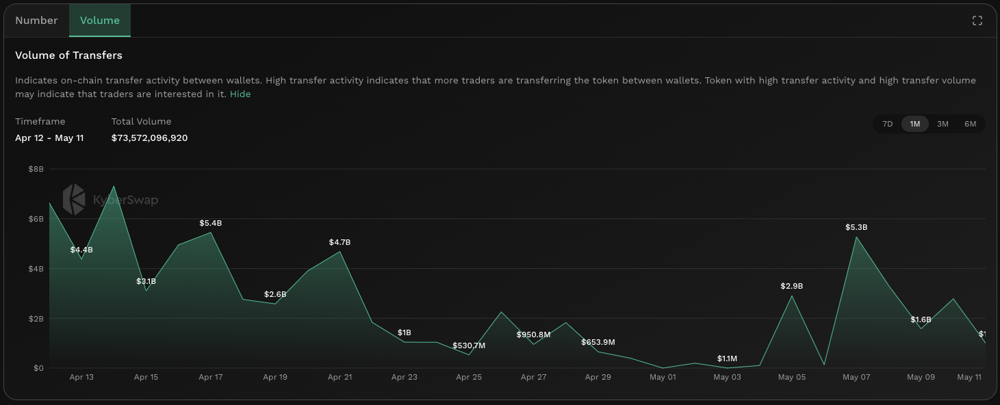

# Volume Of Transfers


#### In one sentence

The total USD value of on-chain transfers between user wallets for the token.


## Overview

<figure><figcaption>
Volume of transfers
</figcaption></figure>

The volume of transfers is the total USD value of all on-chain transfers between user wallets (i.e. EOA addresses) for a specific token. The transfer volume tracks the total value of tokens that is being moved on-chain outside of swaps. By comparing the total transfer volume across past periods, it is possible to deduce whether interest in the token has increased or decreased based on the history of the specific token. Critically, by comparing the volume of transfers agains the [trading volume](trading-volume.md), the total value of direct transfers between addresses can be implied. The relative scale of this difference provides a peek into the dollar value of the token outside of just trades and warrants further investigation.

Note that the volume of transfers differs from [trading volume](trading-volume.md), as the latter is the total USD value of DEX trades involving the token whereas the former is the USD value of all transfers of the token between addresses (i.e. direct transfers). Put more technically, the volume of transfers measures the USD value of all EOA-to-EOA wallets while the trading volume measures the USD value of transfers between EOA addresses and DEX smart contract addresses.

It is crucial to note that as the trading volume is denominated in USD, it is also highly dependent on the price movements of the token. For example, if 1ETH was transferred when its price was USD2,000, the volume of transfers would be increased by USD2,000 but if the next day ETH price increases to USD2,200, the same token unit transfer increases the volume of transfers by USD2,200. As such, the transfer volume has to be taken in context with token price movements.


#### Cross-chain data

Data shown in graph is specific to the selected chain. For the same token, the KyberAI interface allows users to toggle between the supported chains. Refer [On-Chain Indicators](./) for more info.


## Improving trades with Number of Transfers


#### Disclaimer: Not financial advice

KyberAI was created with the intention of empowering our users with the data insights required to make informed trading decisions. Users must exercise due diligence in their trading decisions with the best trading strategies incorporating the insights enabled by KyberAI.


Similar to the [number of transfers](number-of-transfers.md), the volume of transfers acts as a proxy for the total general interest in the token. Successive periods of increased transfer volume indicates that the token is likely experiencing a significant surge in interest. When comparing the transfer volume to previous periods, users can also see when there was a sudden spike in interest and whether this interest lead to more gradual growth or an immediate decline.&#x20;

Taken in isolation, the volume of transfers is unable to provide further guidance as to whether the token is bullish or bearish as it is indifferent to transfers resulting from buys or sells. To solve this, the [trade volume](trading-volume.md) provides a more price specific view as it takes into account trade types. Critically, by comparing the [trade volume](trading-volume.md) against the volume of transfers, this ratio provides a good indication of interest in the token outside of trading. This might be a good indicator as to whether the token is driving value via wider adoption through various means (i.e. utility, payments, etc.).

In cases where the transfer volume is low, token liquidity might also be limited due to a constrained supply. The transfer volume must be taken into context with the [transfer count](number-of-transfers.md) to get a more holistic picture of the market as a single high value transfer can have as big an impact as hundreds of smaller transfers done. For example, a single high value transfer between wallets owned by a [whale](netflow-to-whale-wallets.md) is much less valuable as hundreds of transfers by users actually using the token.

Note that the volume of transfers tracks only on-chain transfers and hence movements of the tokens on CEXs are excluded from this total. This is because transfer of tokens within CEX accounts are done on their own internal ledgers so as not to incur the hefty gas fees. For a more comprehensive picture, users should also view the [netflow to CEX](netflow-to-cex.md) to understand how much value is being moved in and out of CEXs for trading purposes.

## Data source(s)

The USD value of ERC20 [`Transfer`](https://docs.openzeppelin.com/contracts/4.x/api/token/erc20#IERC20-Transfer-address-address-uint256-) events emitted by token contracts and logged on-chain. The `Transfer` events are filtered based on transfers between EOA addresses. Data is refreshed every hour.
