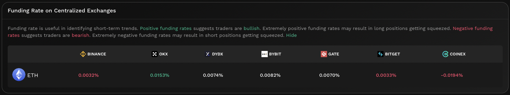

# Funding Rate On CEX


#### In one sentence

Periodic funding premium which is paid to traders with open short/long positions that ensures that perpetuals trade close to or at the spot market price.


## Overview

<figure><figcaption>
CEX funding rate
</figcaption></figure>

Funding rates on CEXs are usually a good indicator as to how traders believe the market will move in the near future. This is because through the use of perpetuals, traders have already priced in the uncertainty of time through committing funds upfront to a contract which will be worth a fixed amount in the future. In simplest terms, perpetual traders are trading based on the future value of the asset. The difference between the current spot market price and expected future value is the funding rate. As such, funding rates make concrete the premium that traders are willing to pay to obtain the asset in the short term.

Cryptocurreny perpetuals are cash-settled meaning that only the equivalent cash value is settled with no actual exchange of tokens taking place. As such, traders only have to prefund a cash account in order to participate in the perpetuals market. One consequence of this design is that perpetual traders never holds the underlying token. Hence, in jurisdictions where regulatory guidance is developing with regards to direct token holdings, these institutions might instead choose to trade perpetuals instead of the token in order to gain exposure to the token's price movement.

The funding rate is a product of the perpetual futures contract market which in itself is considerably complicated. As such, to appreciate why funding rates are one of the key indicators of future price movements, we need to first understand perpetuals as an asset. To this end, the section below unpacks all the complexities of perpetual futures by progressively building upon key concepts.

Note that funding rates are dependent upon CEXs supporting contracts for the token. In cases where there are no CEX contracts for the token, no funding rate will be displayed.&#x20;


#### Cross-chain data

Data shown in graph is sourced from multiple CEX venues with futures contracts involving the token. As such contracts are chain agnostic, the funding rates shown are indicative for the token as a whole. In other words, the funding rate is chain agnostic and applies for the same token across all chains.


## Perpetuals: Step-by-step

### Derivatives 

Perpetual swaps, sometimes referred to as perps, are one of the more complex types of financial derivatives. A derivative is a financial contract which parties enter into that derive their value from an underlying asset. There are many reasons to do so but for our purposes, such a derivative enables the fluctuation risks of the underlying asset to instead be sold off to speculators in the derivative markets. That is, those that only want the fixed value of the underlying asset sells their potential profit/loses arising from fluctuations to other market participants.

### Futures 

Underlying this solution is a fundamental problem of pricing in the uncertainty of time. As such, the base derivative that perpetuals built on top of are futures. Futures are a legal contract between parties to buy and sell an asset at a predetermined price at a specified time in the future.

There are 2 key considerations when entering into a futures contract:

* The price at which the contract will be settled upon expiry
* The date of expiry

The benefit of a futures contract should now become more apparent as by setting the above 2 in stone, parties to the agreement gets a guarantee that they will be able to trade the underlying asset at a fixed price on a given date.

#### Futures example

The concept behind futures becomes much more intuitive when applied to the agricultural industry such as grains. As a grain farmer, in order to grow grains, there are multiple costs which the farmer will have to incur upfront before their grains are ready to be sold. This includes:

* Sourcing the seeds
* Irrigating the soil
* Planting the seeds
* Growing the crop (water, fertiliser, pesticides, etc.)
* Harvesting the grains
* Processing the grains

All the above might take up to a few months with farmers not seeing a single dollar for their grains until the the first grain is sold. Moreover, the price of grain then might vary significantly from when the grains were first planted. As such, to minimise such risks, the farmer might decide to enter into a futures contract where the buyer agrees to purchase all the grains at a fixed price in the future when the grains are ready to be sold. The farmer gets a guaranteed future price while the buyer stands to profit/lose depending on the difference between the futures and market price at the point of the contract expiring.

Substituting grains above for a token, you can begin to see how futures contracts places a price on all the future uncertainty of the token (up to the futures expiry date).

### Perpetuals 

Based on the above definitions, perpetuals are essentially futures with no expiration date. This is made possible in the crypto space due to the nature of the asset class which is digital and therefore not susceptible to any degradation over time. Perpetuals are one of the most liquid products in crypto as it is designed to mimic the spot market while offering access to cheap leverage. In order to achieve this, there are a few concepts unique to perpetuals:

* Requirement for a price peg to ensure perpetuals are trading close to or equal to the spot market price.
* An open interest which is the number of futures contracts which have yet to be closed by their holders.
* **A funding premium which is paid by the contract buyer/seller to align the contract price with the spot market. The funding rate is the difference between the price of the perpetual vs the weighted average of all major spot exchanges.**
* Introduction of an initial and maintenance margin for those trading on leverage. The initial margin is the minimum value that needs to be paid in order to open a leveraged position and therefore acts as collateral. The maintenance margin is the minimum amount of collateral required in order to keep the position open.
* A liquidation mechanism which sends a forced order into the market when the open position is no longer sufficiently covered by the collateral.

Due to the capital efficiency which perpetuals enable, perpetuals play a significant role in token price discovery as it materialises the future value of the token which a significant section of the market is already trading on.

## Funding intervals, payments, and interest rates

Given that perpetuals do not have a defined end date, the funding rate will usually be charged based on funding intervals (usually 8 hours). During a funding interval, if the funding rate is positive (perpetuals trade above spot), long traders will pay short traders. Alternatively, if the funding rate is negative (perpetuals trade below spot), short traders will pay longs. The premium charged or received by a trader is directly proportional to the size of their position. In general, if perpetuals consistently trade at a premium of \~1% to spot, short traders can expect a 1% return every interval at the expense of long traders.

CEX funding rates will usually also include an interest rate component which is meant to account for the interest rate difference between holding the perpetual vs the underlying asset. This interest rate will vary for different contract pairs as it heavily depends on the underlying asset.

## Improving trades with CEX funding rates


#### Disclaimer: Not financial advice

KyberAI was created with the intention of empowering our users with the data insights required to make informed trading decisions. Users must exercise due diligence in their trading decisions with the best trading strategies incorporating the insights enabled by KyberAI.


A positive funding rate indicates that the perpetual market is expecting the future price of the token to increase from the current spot price, hence positive funding rates suggests traders are bullish. On the other hand, a negative funding rate indicates that the perpetual market is expecting the future price of the token to decrease from the current spot price, hence negative funding rates suggests traders are bullish.

If funding rates remain high but the spot price continues to trade sideways, it might be an indicator that a selloff is imminent. Alternatively, if funding rates remain low but the spot price maintains its sideways movement, it might be an indicator that the token might experience significant surge in demand in the near term.

The extent of this bullish/bearish sentiment can be correlated to the value of the funding rate. Extremely high funding rates indicates significant upside potential but could also result in long positions being squeezed (i.e. long traders are forced to sell the asset to cover the funding premium). The opposite applies in extremely negative funding rates where short positions might get squeezed. See [Liquidations On CEX](liquidations-on-cex.md) for more info.

## Data source(s)



**API**: [https://open-api.coinglass.com/public/v2/funding](https://open-api.coinglass.com/public/v2/funding)



Data is refreshed every hour.
