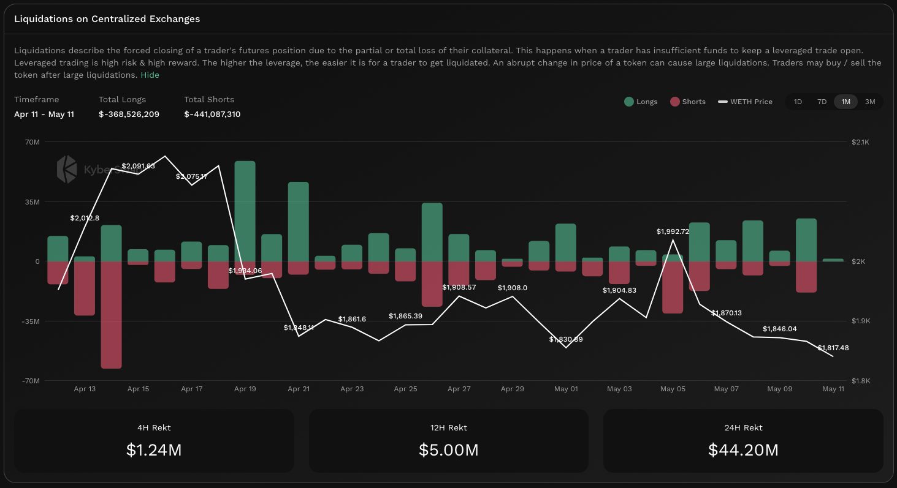

# Liquidations On CEX


#### In one sentence

The total USD value of all futures positions which were force closed due to traders having insufficient funds to keep their leveraged trades open.


## Overview

<figure><figcaption>
CEX liquidations
</figcaption></figure>

Liquidations on CEXs serves as a market volatility gauge as it measures the total liquidation volume for all leveraged positions across CEXs. Liquidations occur whenever a trader has insufficient funds to keep the leveraged position open and therefore the CEX is forced to liquidate their position to ensure contract fulfilment. In a leveraged position, a trader commits funds to a contract which enables a leveraged position to be opened based on this collateral. Traders are usually able to adjust the collateral at any time. Hence, if liquidation volumes are high, it indicates that traders had insufficient time to react to the sudden movement in prices.

While this liquidation mechanism ensures the health of the futures market, the aggregate effect of mass liquidations in times of high volatility usually results in the token being significantly oversold/overbought in the short term. This is because liquidations tend to have a cascading effect as individual positions are forcefully closed resulting in further liquidations of neighbouring open positions (a.k.a. a squeeze). Such an effect is particularly pronounced the further the price spikes from the spot price as this movement is greatly magnified by the open position's leverage.

Cryptocurreny perpetuals are cash-settled meaning that only the equivalent cash value is settled with no actual exchange of tokens taking place. As such, traders only have to prefund a cash account in order to participate in the perpetuals market. One consequence of this design is that perpetuals traders never holds the underlying token. Hence, in jurisdictions where regulatory guidance is developing with regards to direct token holding, these institutions might instead choose to trade perpetuals instead of the token in order to gain exposure to the token's price movement.

Note that liquidations are dependent upon CEXs supporting contracts for the token. In cases where there are no CEX contracts for the token, no liquidations will be displayed.


#### Cross-chain data

Data shown in graph is aggregated across all CEX venues with futures contracts involving the token. As such contracts are chain agnostic, the liquidation volumes shown are indicative for the token as a whole. In other words, the liquidation volume is chain agnostic and applies for the same token across all chains.


## Margin, positions, leverage, and liquidations

To understand how liquidations can snowball, we need to understand how leverage works in the futures market. You can refer to this short section on [Futures](funding-rate-on-cex.md#0848) if you need a refresher on how futures function. At its core, futures are effectively derivative contracts whose value is "derived" from an underlying asset. This means that the trader does not need to actually hold the underlying asset to be exposed to movements in that asset price.

#### Margin

To open positions in a futures contract, CEXs will require that a trader first fund a futures account whose total value will act as collateral for the contract. The trader will have to add funds based on an initial margin which is slightly higher (usually \~10%) than the maintenance margin. Based on the collateral value, traders are eligible to open a long or short position against the futures contract as long as their account balance is always above the maintenance margin. This futures contract provides them the right (not obligation) to buy the underlying asset at the contract stated price at a specified time in the future. Critically, notice that the underlying asset never needs to switch hands hence the futures contract is cash-settled upon being exercised.

#### Positions

Long and short positions are two sides of a trade which enables traders to speculate on the direction of price movements. A long position indicates that a trader is bullish and expects to make a profit based on the future price of the asset versus the price agreed on contract creation. The opposite applies for short positions where traders are bearish and their profit is derived from the extent that the price of the underlying asset drops from the agreed price. Note that for every futures contract created, there must be a matching long and short position in order for the contract to be closed. This is incentivized via [funding rates](funding-rate-on-cex.md).

#### Leverage

Being a derivative product, this enables the contract to define the unit price of the contract which is multiplied by the underlying asset index to get the notional trade value per contract. For example, a 50 contract size would mean a contract value of USD100,000 (assume ETH price is USD2,000) for every ETHUSD contract traded. Similarly, a 10 contract size would mean a contract value of USD20,000 per contract.

This is where leverage comes into play as the contract size definition is directly proportional to the amount of leverage which traders can get exposure to by opening a position in that contract. Any changes to the underlying asset index would be multiplied by the contract unit to realize the actual gains or losses. Movements in the underlying index are usually spaced based on a contract specified tick size that determines the minimum step amount for the index.

Taking the ETHUSD contract with a 10 contract size, each dollar movement away from the initial USD2,000 is worth USD10. For example, if ETH drops by 10USD, USD100 will be debited from the margin account of the long trader and credited to the short trader when the funding interval runs. If the initial margin requirements to be eligible to open a position is USD2,000, a 0.5% drop in Ethereum price resulted in a 5% profit for the trader holding the short position. For a much lower capital outlay, returns can be supercharged based on the leverage ratio. Of course, this also goes in the other direction whereby the long trader would have lost 5% of his initial margin for the same 0.5% drop in Ethereum price.

#### Liquidations

As a trader's risks are amplified by the amount of leverage selected, CEXs implement a liquidation mechanism which caps a traders maximum loss. This not only protects the trader but also ensures that the contract terms can be fulfilled thereby ensuring continued market confidence.&#x20;

This liquidation mechanism essentially force closes a trader's position if there are insufficient funds in the trader's futures account to maintain the position. The maintenance margin determines the threshold at which the liquidation process will be triggered. Recall that at every funding interval, shorts pay longs whenever the [funding rate](funding-rate-on-cex.md) is negative and vice versa. As such, if the trader is on the losing side of the trade, the amount required to fulfil the funding rate will be directly debited from their futures account. This might cause the trader's position to be forced closed if their balance drops below the maintenance margin.

As markets can be extremely volatile, CEXs will require the maintenance margin of the trader's futures account to be set at a certain amount above zero. This provides a buffer in the case whereby extreme price swings results in the futures account balance going significantly below the maintenance margin. With this buffer, traders losses will not be greater than the available collateral therefore ensuring that the whole system remains functional.

## Liquidation example

For simplicity, the example below ignores the funding rate to focus on the liquidation mechanism. Note that the example below has been generalized as not all CEXs implement the same risk management mechanisms (i.e. liquidation mechanisms, thresholds, partial vs full liquidations, margin requirements, etc.).

Alice decides to fund a CEX futures account to participate in the futures market. The initial margin required is USD1,000 with the maintenance margin being set at USD900. Alice transfers USD1,000 to the account and is now able to open a position against a futures contract.

Alice is bullish on ETH and sees that there is an existing futures contract for ETH/USDT with 10x leverage. Based on her initial margin of USD1,000, Alice opens a long position with a contract price based on the current USD2,000 ETH value. We therefore get the following:

$$
contractSize = 10;contractPrice = 2,000; indexTickSize = 1
$$

$$
contractValue_{initial} = contractSize*currentPrice=20,000
$$

The next day, extremely negative news causes ETH to rapidly fall to ETH1,950. Based on this fall, the contract value at the point of the funding interval is:

$$
contractValue_{day1}=10*1,950=19,500
$$

When the [funding interval](funding-rate-on-cex.md#funding-intervals-payments-and-interest-rates) is reached, USD500 is debited form Alice's account to cover the funding rate to the short trader.  Following this debit, Alice's remaining balance of USD500 is now significantly below the maintenance margin of USD900 and her position is therefore forced closed. This is done by the CEX through creating a short position of the same value as the initial long position created by Alice which effectively nets Alice's losing position.

Note that with an $$indexTickSize$$ of 1, every USD1 move in ETH's price causes a USD10 profit/loss for the futures trader (i.e. a 10x leverage). In this example Alice lost USD500 due to a USD50 drop in ETH price. This is a 50% loss of her initial capital due to a 2.5% drop in ETH price. While this is a significant loss on Alice's end, the aggregate result of the liquidation might result in neighboring positions being liquidated as well due to the netting of Alice's position.&#x20;

## Improving trades with CEX liquidations


#### Disclaimer: Not financial advice

KyberAI was created with the intention of empowering our users with the data insights required to make informed trading decisions. Users must exercise due diligence in their trading decisions with the best trading strategies incorporating the insights enabled by KyberAI.


There is an inverse relationship between liquidations and token price movements whereby the market tends to move in the opposite direction of net liquidations (i.e. difference between shorts vs longs liquidated). If the total shorts liquidated significantly outweighs the longs, this indicates that the market is bullish as the spot price has moved against the short sellers resulting in significant short liquidations. Likewise, if the total longs liquidated outweighs the shorts, this indicates that the market is bearish as the spot price has moved against the long sellers resulting in significant long liquidations. The total volume of liquidations is a good proxy for market activity as it tracks how much short term interest a token is getting.

## Data source(s)



**API**: [https://open-api.coinglass.com/public/v2/liquidation\_history](https://open-api.coinglass.com/public/v2/liquidation\_history)

**API**: [https://open-api.coinglass.com/public/v2/liquidation\_info](https://open-api.coinglass.com/public/v2/liquidation\_info)



Data is refreshed every hour.
