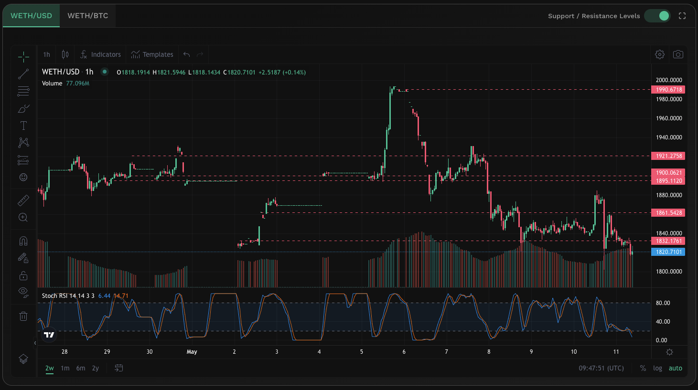

# Live Charts


#### In one sentence

An interactive chart that displays the historical price of the token together with the relevant technical indicators for further analysis.


## Overview

<figure><figcaption>
Live charts tool
</figcaption></figure>

The live charts provide users with a single interactive price chart which conveniently compiles price data as well as related technical indicators identified by KyberAI. Designed to empower our users, the live charts come with a myriad of tools that enable users to conduct their own technical analysis directly on the chart. Users are able to choose between USD or BTC as the base value reference with data being refreshed every 30 seconds.

KyberAI technical indicators

* [**Support and resistance levels**](support-and-resistance-levels.md)
* **Exponential Moving Average (EMA)**: The EMA builds on top of the SMA by prioritizing recent price data which is assumed to be more relevant. EMA assigns a greater weight to more recent price data which skews the average in favor of the latest market data. Consequently, EMA is able to respond faster to price changes and therefore uncover upcoming trends earlier.
* **Relative Strength Index (RSI)**: RSI is a momentum indicator which measures both the speed and size of price changes. To get the RSI, the average gains is divided by the average loses over a specific time period. This ratio allows traders to compare the relative strength of the current price movement against past movements to identify when a token is overbought or oversold. If the token price diverges from the RSI, it could mean that a reversal might be incoming.

Live charts technical tools

* **Indicators**: Select from a wide list of popular indicators to overlay on chart.
* **Chart types**: Select your preferred chart display.
* **Chart interval**: Select your preferred charting interval and timeframe.
* **Cursors**: Customize pointer design.
* **Trend line**: Draw trend lines on top of the price chart.
* **Gann and Fibonacci**: Conveniently identify support and resistance levels based on Gann and Fibonacci techniques.
* **Geometric shapes**: Brush, highlight, or add shapes to your technical analysis.
* **Annotation**: Add comments and markers to your analysis.
* **Patterns**: Identify patterns with preset helper tools.
* **Predictions and measurements**: Measure exact price movements and likelihood of future predictions.
* **Icons**: Add icons to your chart.
* **Measure**: Measure the price movement, chart interval, as well as volume traded within a selected area on the chart.
* **Zoom**: Magnify the portion of the chart displayed.
* **Magnet**: Configure how easily your cursor will snap to the OHLC of nearby candles.

## Improving trades with Live Charts


#### Disclaimer: Not financial advice

KyberAI was created with the intention of empowering our users with the data insights required to make informed trading decisions. Users must exercise due diligence in their trading decisions with the best trading strategies incorporating the insights enabled by KyberAI.


The live chart provides you with all the tools required to conduct further technical analysis based on the most updated pricing data. Given such a varying toolset, the live charts require users to mix-and-match all the different tools in order to come up with a trading strategy that best suits their investment profile. While there is no limit as to how complex live chart tooling can get, it can also quickly become overwhelming. As such, a good place to start is by understanding the major [technical indicators](./) as suggested by KyberAI.

## Data source(s)



**API**: [https://pro-api.coinmarketcap.com](https://pro-api.coinmarketcap.com)

* /v2/cryptocurrency/quotes/historical
* /v2/cryptocurrency/quotes/latest
* /v2/cryptocurrency/ohlcv/historical



**API**: [https://pro-api.coingecko.com/api](https://pro-api.coingecko.com/api)

* /v3/coins/{token\_id}/market\_chart/range
* /v3/coins/markets
* /v3/coins/{token\_id}/ohlc



Price is refreshed every minute with OHLCV data refreshed every 5 minutes.
