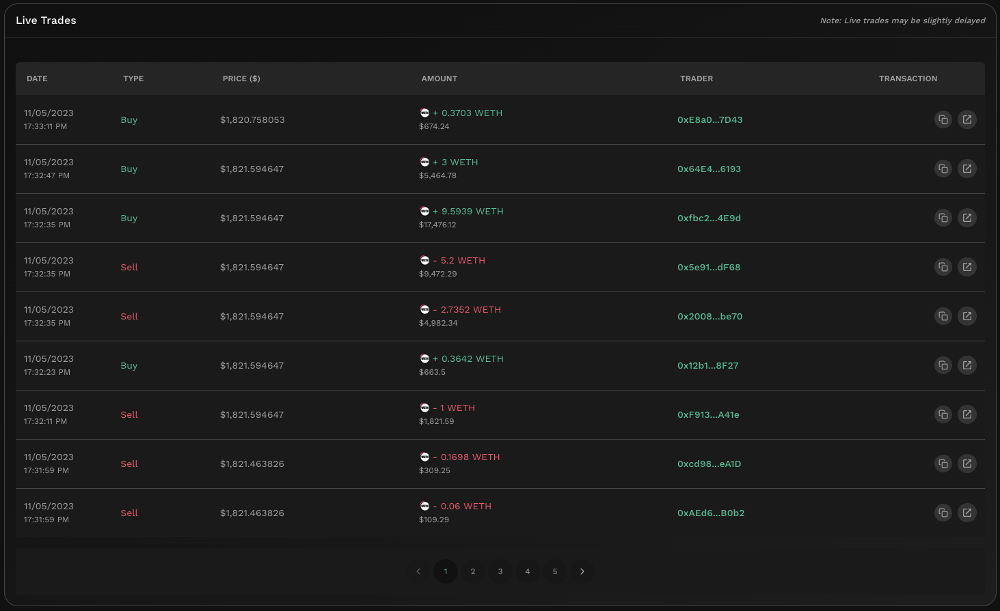

# Live Trades


#### In one sentence

Displays the 50 latest DEX trades involving the token as well as the USD value of the trade.


## Overview

<figure><figcaption></figcaption></figure>

The live trades section showcases the latest 50 token transactions that were executed via a [DEX](../../../getting-started/foundational-topics/decentralized-finance/decentralised-exchange-dex.md). All trades involving the token are captured hence this captures any token-to-token swaps. The USD value of the trade as well as the price at which it was executed is computed to enable users to better contextualize the latest market value flows.

For each of the latest 50 transaction, users will be able to see the following information:

* **Date**: A timestamp of when the transaction was completed.
* **Type**: The type of transaction whether it was a buy or sell.
* **Price**: The executed price of the token trade in USD.
* **Amount**: The total units of tokens traded as well as the value of the transaction in USD.
* **Trader**: The address of the trader who executed the trade. You can view the more details about the trader by clicking on the address.
* **Transaction**: The transaction hash of the trade. You can copy the hash or view the transaction on a blockchain scanner.

Based on the data above, users will be able to glance the direction of the latest trades and if there were any recent trades that were significant enough to move the markets. Note that the trades displayed are specific to the chain selected.


#### Cross-chain data

Data shown in graph is specific to the selected chain. For the same token, the KyberAI interface allows users to toggle between the supported chains. Refer [On-Chain Indicators](../on-chain-indicators/) for more info.


## Improving trades with Live Trades


#### Disclaimer: Not financial advice

KyberAI was created with the intention of empowering our users with the data insights required to make informed trading decisions. Users must exercise due diligence in their trading decisions with the best trading strategies incorporating the insights enabled by KyberAI.


Live trades are the most objective reflection of the current market sentiment as it showcases the latest completed trades. If the number of buy trades significantly outpaces sell trades, it indicates that the token is experiencing significant upwards pressure in the immediate term and vice versa. Moreover, if there are a significant amount of new transactions with every refresh interval (30 seconds), this is also a sign that the token has an active market and is frequently traded. Given the immediate nature of live trades as compared to other indicators which require a longer period to refresh, live trades can act as an early warning signal as to the short-term market direction.

By itself, the live trades are not particularly useful due to its short term nature but more valuable insights can be extracted when combined with other indicators. For instance, combined with [Support & Resistance Levels](support-and-resistance-levels.md), the live trades can help to identify if there is going to be a breakthrough in the price movements. Another example is when comparing with [Netflow To CEX](../on-chain-indicators/netflow-to-cex.md), whereby if there is a net inflow to CEXs and a significant ratio of live sell trades, it supports the hypothesis that the token is facing immediate downwards price pressure.

## Data source(s)

ERC20 `Transfer` events emitted by token contracts and logged on-chain. Data is refreshed every 10 seconds with a 2 minute lag in real-time data.
