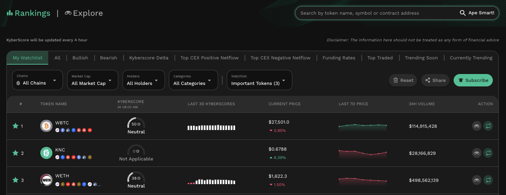
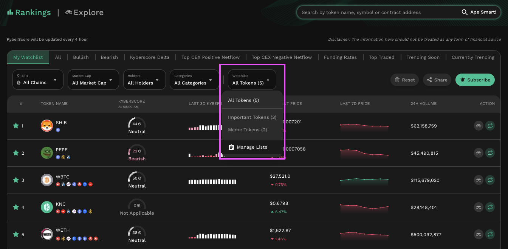
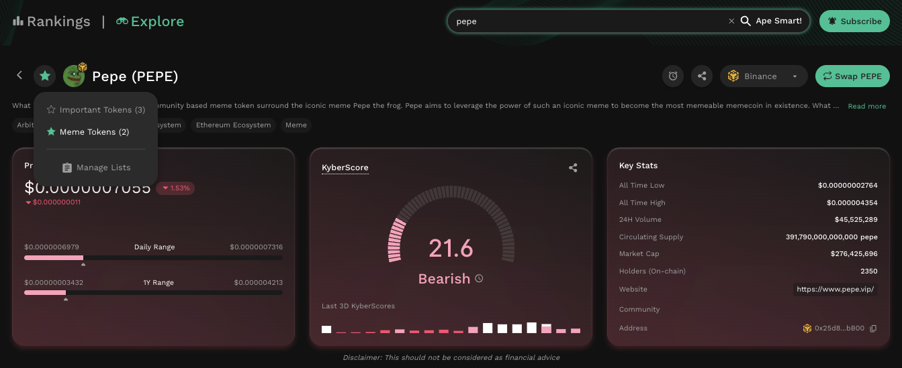
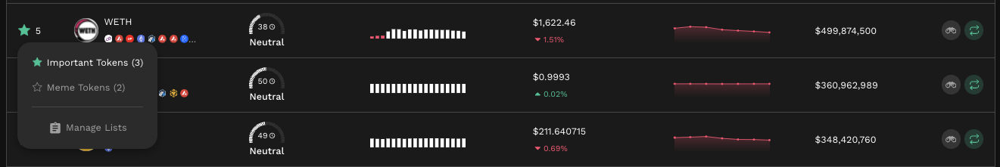
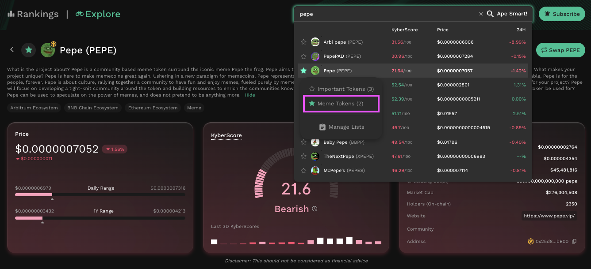
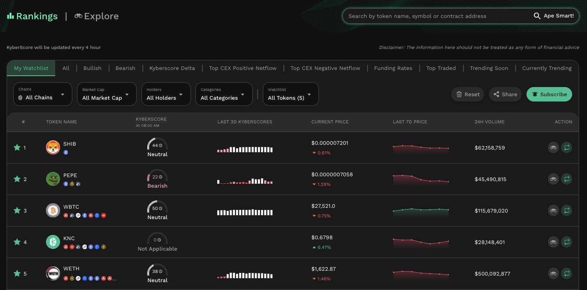
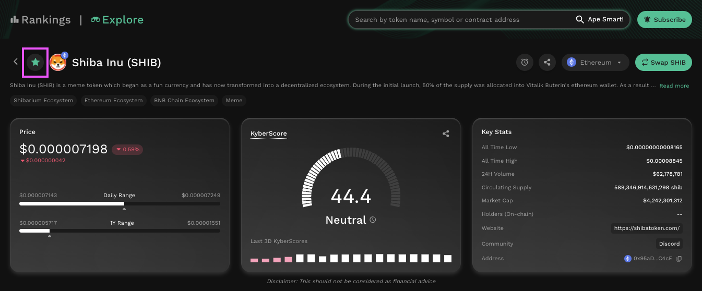
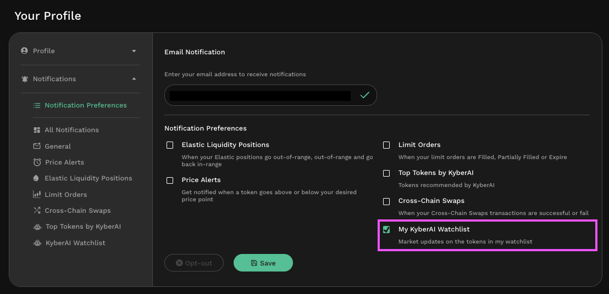

# Add Tokens To Watchlist


#### Disclaimer: Not financial advice

KyberAI was created with the intention of empowering our users with the data insights required to make informed trading decisions. Users must exercise due diligence in their trading decisions with the best trading strategies incorporating the insights enabled by KyberAI.


## Introduction

<figure><figcaption>
Customize your own token watchlist
</figcaption></figure>

With KyberAI, you can also conveniently keep track of all your favourite tokens across multiple watchlists. By creating a new watchlist category and adding tokens to your watchlist, you will be able to view all your saved tokens in a single dashboard which allows you easily compare between tokens at a glance. This includes:

* The token's KyberScore as well as the last 3 days of KyberScore data
* The current token price as well as the price over the last 7 days
* The 24 hour trade volume of the token

Note that the watchlist will be saved to the address which was connected to KyberAI hence your watchlists will be available from anywhere as long as you're logged in with the same address.

Supercharge your trading journey with KyberAI

1. [Sign In To KyberAI With Ethereum ](sign-in-to-kyberai-with-ethereum.md)
2. [Discover Promising Tokens ](discover-promising-tokens.md)
3. [Deep Dive Into Token Data ](deep-dive-into-token-data.md)
4. **Add Tokens To Watchlist <-**
5. [Get Notified On Your Favourite Tokens](get-notifications-for-your-favourite-tokens.md)
6. Buy Or Sell Tokens
   * [Instantly Swap At The Best Rates](broken-reference)
   * [Swap At Your Preferred Rates](../../kyberswap-interface/user-guides/trade-at-your-preferred-rates.md)

## Adding your favourite tokens to your watchlist

### Step 1: Identify tokens to be added

KyberAI provides multiple options for users to discover the most promising tokens. This can be through viewing [KyberAI's token rankings](discover-promising-tokens.md) or [exploring token details](deep-dive-into-token-data.md). Whichever the path taken, once you've identified a token worth tracking, you can proceed to add them to your watchlist to view all your shortlisted tokens in one place.

### Step 2: Personalize watchlist categories

Keep track of your favourite token categories by creating multiple watchlists. You can create and manage your watchlists from the watchlist page. Additionally, this management functionality is also availabe whenever you favourite a token (step below).

<figure><figcaption>
Create a new watchlist
</figcaption></figure>

### Step 3: Add tokens to watchlist

For ease of use, KyberAI allows tokens to be added to a watchlist via 3 methods:



If you're on the [Explore page](deep-dive-into-token-data.md), you can easily add the token to your watchlist by selecting the watchlist button at the top left of the page:

<figure><figcaption>
Add to watchlist from Explore page
</figcaption></figure>



If you're on the [Rankings page](discover-promising-tokens.md), you will be able to add the token by selecting the watchlist button on the left of the token entry:

<figure><figcaption>
Add to watchlist from rankings page
</figcaption></figure>



You can also add to your watchlists via the search bar.

<figure><figcaption>
Add to watchlist via search
</figcaption></figure>



### Step 4: View watchlist tokens

Once a token has been added to the watchlist, you will be able to view all watchlisted tokens on the Rankings page under the "My Watchlist" tab.

<figure><figcaption>
My watchlist with the added tokens
</figcaption></figure>

Notice that across KyberAI, tokens which have been added to the watchlist will be indicated by the bright green star (i.e. the watchlist icon).

<figure><figcaption>
Watchlist token on the Explore page
</figcaption></figure>

### Step 5: Subscribe to watchlist notifications

You can also subscribe to get market updates on tokens in your watchlist by selecting the subscribe button.

<figure><figcaption>
Watchlist notifications
</figcaption></figure>
