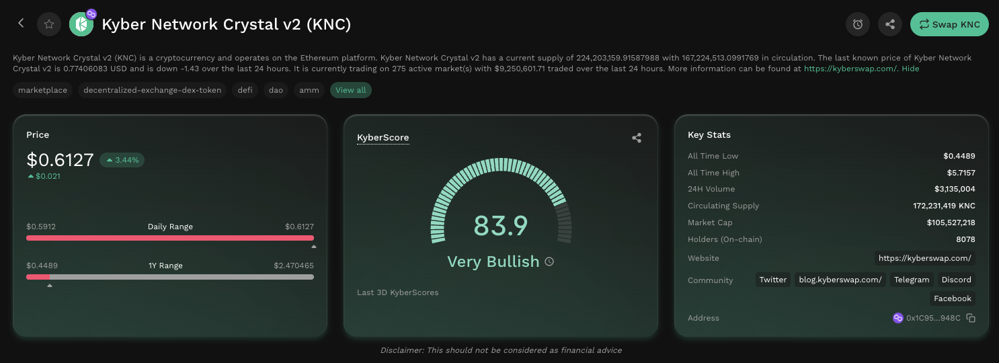
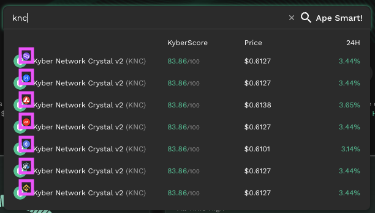

# Deep Dive Into Token Data


#### Disclaimer: Not financial advice

KyberAI was created with the intention of empowering our users with the data insights required to make informed trading decisions. Users must exercise due diligence in their trading decisions with the best trading strategies incorporating the insights enabled by KyberAI.


## Introduction

Once you've [shortlisted some of the most promising tokens](discover-promising-tokens.md) that suits your particular trading strategy, KyberAI provides you with more fine-grained data insights that allows you to eventually settle on tokens which are worthy of further action. KyberAI does all the hard work of processing and configuring key market indicators into easily-digestible formats which can be accessed directly from the KyberSwap UI. Moreover, for the more advanced traders, KyberAI also exposes a full suite of interactive technical analysis tools that grants the user free-reign to mix-and-match any number of strategies.

Once you've identified your next big opportunity, you can [instantly market buy tokens](broken-reference) using the [KyberSwap Aggregator](../../kyberswap-aggregator/) or [set up a limit order to enter at your preferred price](../../kyberswap-interface/user-guides/trade-at-your-preferred-rates.md) with [KyberSwap Limit Orders](../../limit-order/).

Supercharge your trading journey with KyberAI

1. [Sign In To KyberAI With Ethereum ](sign-in-to-kyberai-with-ethereum.md)
2. [Discover Promising Tokens ](discover-promising-tokens.md)
3. **Deep Dive Into Token Data <-**
4. [Add Tokens To Watchlist](add-tokens-to-watchlist.md)
5. [Get Notified On Your Favourite Tokens](get-notifications-for-your-favourite-tokens.md)
6. Buy Or Sell Tokens
   * [Instantly Swap At The Best Rates](broken-reference)
   * [Swap At Your Preferred Rates](../../kyberswap-interface/user-guides/trade-at-your-preferred-rates.md)

## Explore

KyberAI provides an [Explore page](https://kyberswap.com/KyberAI/Explore/ethereum/0xc02aaa39b223fe8d0a0e5c4f27ead9083c756cc2) for each of the 4,000+ supported tokens. Through the Explore page, users will be able to view all of the most critical token-related market data which consists of both on-chain and off-chain data. KyberAI helps to make sense of the wealth of raw data by presenting the data in coherent and easily recognizable forms. No matter your trading strategy, this diversity of data ensures that KyberAI has got you covered.

To provide users with a comprehensive view of the markets, the Explore page consists of 4 distinct sections:

* [**Token Overview**](deep-dive-into-token-data.md#token-overview): A summary of the token as well as key macro indicators that enable users to quickly gain an appreciation of the token market. Critically, this section also exposes a token's [KyberScore](../kyberscore.md) which enables traders to see if this token's price is likely bullish or bearish in the next 24 hours.
* [**On-Chain Analysis**](../on-chain-indicators/): All the critical on-chain metrics condensed into various graphs and charts for easy viewing. This includes on-chain data such as trading volume, transfers, netflow to whales & CEXs, as well as the token holders. Please refer to [On-Chain Indicators](../on-chain-indicators/) for a complete explanation of each indicator and how your trading strategy can benefit from integrating such on-chain indicators.
* [**Technical Analysis**](../technical-indicators/): A compilation of the most important off-chain market and price data which comes fully equipped with an interactive technical analysis toolbox. Traders can view CEX contract data, support & resistance levels, the latest trades, as well as conduct their own technical analysis. Please refer to [Technical Indicators](../technical-indicators/) for a complete explanation of each indicator and how your trading strategy can benefit from integrating such pricing indicators.
* [**Liquidity Analysis**](../liquidity-analysis.md): View the market distribution across all centralized and decentralized exchanges supporting the token. This includes trade volumes across DEXs, CEXs, as well as perpetual markets.

Due to the extent of insights that are provided for On-chain Analysis and Technical Analysis, there is a dedicated section for to each of these data categories (linked above). The content on the Docs is meant to provide users an in-depth view as to why the specific indicator was chosen and how it can be leveraged As KyberAI develops, we will be releasing strategy specific content showcasing how KyberAI insights can be leveraged to inform trading strategies with different approaches.

### Token overview

The token overview is the first thing which users will see when navigating to a token's Explore page. It is meant to provide traders with all the information required to frame the specific token within the wider crypto market (i.e. a macro view of the token).

<figure><figcaption>
Token overview for KNC
</figcaption></figure>

Note that the boxes will be colored according to their KyberScore whereby bullish tokens are colored green, bearish tokens are red, and neutral tokens are grey.

The token overview consists of the following token data which are sourced from [CoinMarketCap](https://coinmarketcap.com/api/documentation/v1/) and [CoinGecko](https://www.coingecko.com/en/api/documentation):

* **Description**: A short writeup about the token.
* **Tags**: A collection of tags which describes the token based on well-known categories.&#x20;
* **Price**: Displays the current price as well as the last 24 hours price movement in both absolute and percentage terms. The daily and yearly ranges are also provided at the bottom to provide users further context as to where the current price stands relative to the daily and yearly highs and lows.
* **KyberScore**: A single number computed by KyberAI indicating the token performance over the next 24 hours. Please refer to [KyberScore](../kyberscore.md) for further details.
* **Key Stats**: A summary of the token's macro statistics that includes: the highest and lowest price achieved by the token; the 24 hour [traded volume](../on-chain-indicators/trading-volume.md); the token's circulating supply indicating the number of tokens available for trade or other purposes; the market cap of the token indicating the USD value of all existing tokens; the number of on-chain token holders; the official website of the token; the social profiles related to the token; and the contract address of the token.

The token overview section also allows you to take various actions based on your analysis of the token:

* [Add Tokens To Watchlist](add-tokens-to-watchlist.md)
* [Get Notifications For Your Favourite Tokens](get-notifications-for-your-favourite-tokens.md)
* Share promising tokens with the community
* [Instantly Swap At The Best Rates](broken-reference)

## Gain a comprehensive view of your shortlisted tokens

### Step 1: Shortlist the most promising tokens

Before diving head first into a specific token, KyberAI enables you to [Discover Promising Tokens](discover-promising-tokens.md) via our ranking feature. This significantly reduces the amount of time and resources required to identify trading opportunities. You can refer to the previous [guide](discover-promising-tokens.md) for more details on the various ranking approaches that enable users to filter tokens based on their most important criteria.

Alternatively, if you already have a few tokens in mind, you can skip straight to the next step.

### Step 2: View chain-specific token data

There are 2 ways to access the token's Explore page to view the token data: straight from the rankings pages or via a manual search. In both cases, do note that the data displayed on the Explore page will be chain specific hence do pay attention to the chain indicator which is located at the top right of the token logo. You can view all the supported chains and their logos on the [Supported Exchanges And Networks](../../../getting-started/supported-exchanges-and-networks.md) page. KyberAI currently supports more than 4,000 tokens across [7 chains](../#supported-chains).



For tokens on the [rankings page](discover-promising-tokens.md), tokens which have been deployed to multiple chains will have multiple chain logos located below the token name. Upon selecting the token, users will also have to select the specific chain for which to view the token data. For tokens on a single-chain, clicking the row will directly navigate users to the Explore page for the token on the single chain.

<figure><figcaption>
Select chain to display chain-specific data
</figcaption></figure>



If you would like to view the token data for a specific token that is not on the rankings page, you can access the Explore page directly via using the search bar located at the top right of the page. Do note that the search will list all matching tokens across multiple chains hence for tokens deployed on multiple chains, do take note of the specific chain.

<figure><figcaption>
Search for a specific token
</figcaption></figure>



### Step 3: Doing Your Own Research Supercharged

Once you are on the Explore page, take your time to run through the wealth of data that is available for each token. All the key pieces of token data are presented objectively for your reference and hence its real value will be determined by how you leverage it towards your trading strategy.

For traders looking to expand their trading toolbox, the documentation on [On-Chain Indicators](../on-chain-indicators/) and [Technical Indicators](../technical-indicators/) will provide a good starting point to understand the value of such data and how to utilize it properly. As for experienced traders, KyberAI's interactive [TA Live Charts](../technical-indicators/live-charts.md) provides you with a full suite of tools which can be combined to create strategies that suit your particular trading goals. &#x20;
