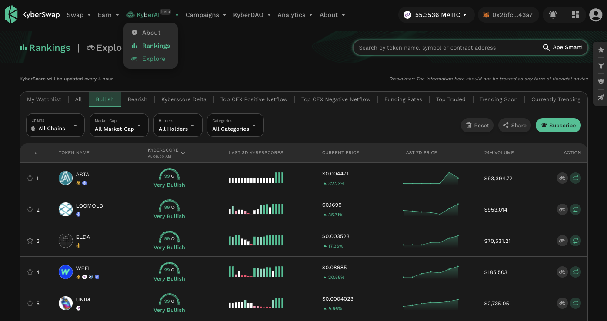
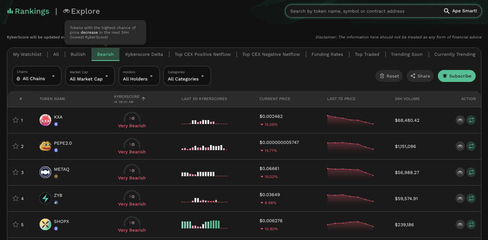
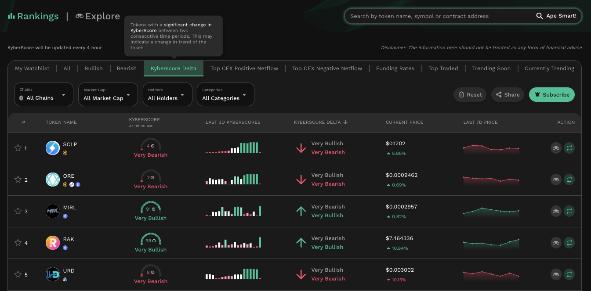
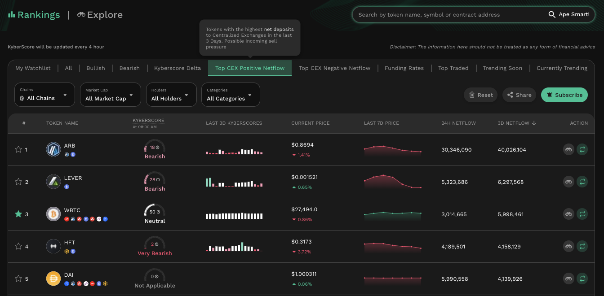
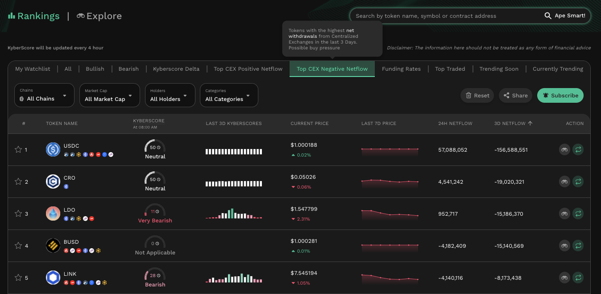
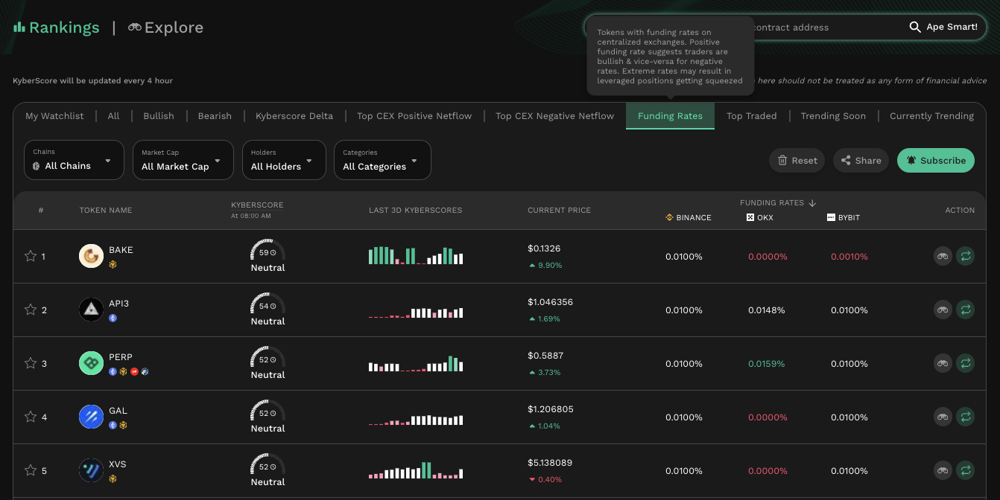
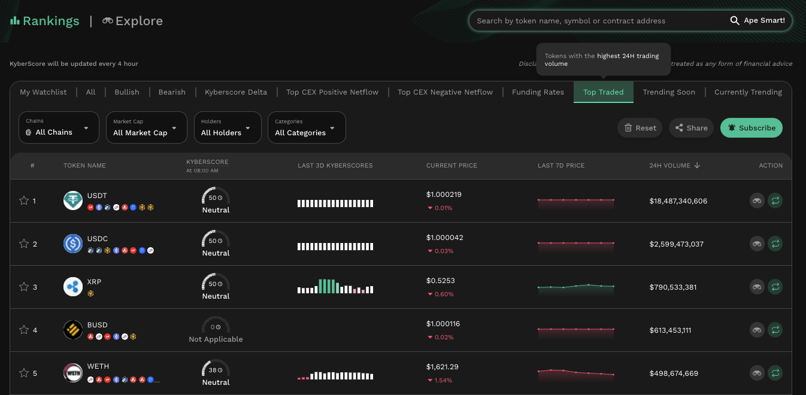
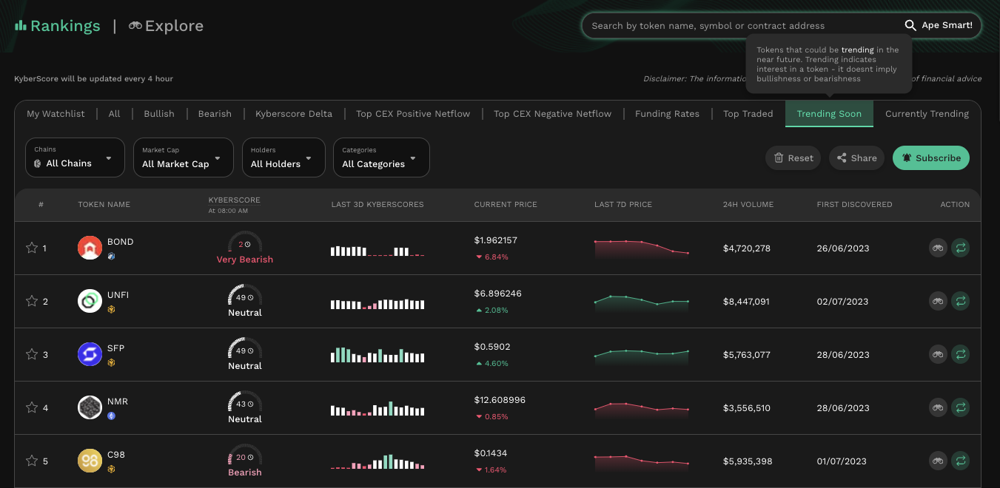
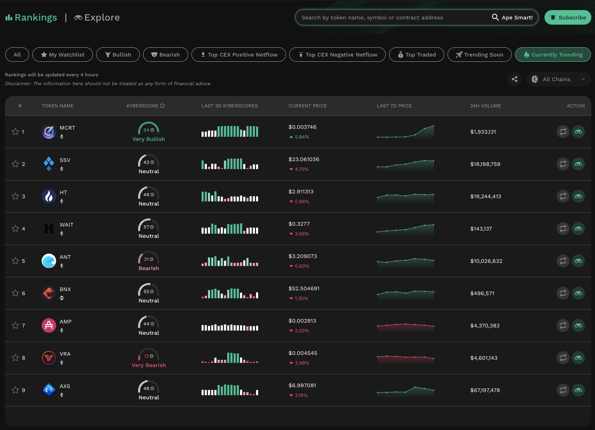

# Discover Promising Tokens


#### Disclaimer: Not financial advice

KyberAI was created with the intention of empowering our users with the data insights required to make informed trading decisions. Users must exercise due diligence in their trading decisions with the best trading strategies incorporating the insights enabled by KyberAI.


## Introduction

The very first step in any trading journey is to shortlist tokens which have the greatest potential for profits. Given that DeFi is permissionless, there are thousands of tokens spread out across multiple chains which makes such a shortlisting process a non-trivial task. To add to this, such opportunities are usually also extremely time sensitive hence further limiting the number of tokens that can be explored.

As a token's price can be impacted by an endless number of factors, KyberAI provides various token rankings for traders looking to embark on their token trading journey. As each ranking prioritizes a particular approach, traders are free to choose from the myriad of options which best suites their trading strategy. All the rankings were built with a single goal in mind: how can KyberSwap empower traders of all levels during their token discovery phase.

Upon shortlisting tokens from the various rankings, traders can also add the tokens to their watchlist to compare the tokens as well as receive [notifications](../../kyberswap-interface/notifications/) regarding their shortlisted tokens.

Supercharge your trading journey with KyberAI

1. [Sign In To KyberAI With Ethereum ](sign-in-to-kyberai-with-ethereum.md)
2. **Discover Promising Tokens <-**
3. [Deep Dive Into Token Data](deep-dive-into-token-data.md)
4. [Add Tokens To Watchlist](add-tokens-to-watchlist.md)
5. [Get Notified On Your Favourite Tokens](get-notifications-for-your-favourite-tokens.md)
6. Buy Or Sell Tokens
   * [Instantly Swap At The Best Rates](broken-reference)
   * [Swap At Your Preferred Rates](../../kyberswap-interface/user-guides/trade-at-your-preferred-rates.md)

## Rankings

You can navigate to the various rankings page from the KyberAI dropdown in the navigation bar. Note that your wallet address must have been whitelisted for the relevant link to appear in the dropdown. Please refer to [Sign In To KyberAI With Ethereum](sign-in-to-kyberai-with-ethereum.md) for more details.

<figure><figcaption>
Rankings navigation
</figcaption></figure>

Upon loading the page, you will be provided a variety of ranking options to choose from. You can also filter the rankings based on:

* Chains
* Market Cap
* Number of Holders
* Various Token Categories

Note that for every token ranked, KyberSwap provides you the option to:

* [Deep Dive Into Token Data](deep-dive-into-token-data.md) by clicking into the token entry or;&#x20;
* [Instantly Swap At The Best Rates](broken-reference) for the selected token by clicking the swap action button

KyberSwap ensures that your trading journey can be completed all via a single interface.

### Bullish

<figure><figcaption>
Most bullish tokens
</figcaption></figure>

Tokens are sorted in descending order based on their [KyberScore](../kyberscore.md). This ranking prioritizes the **tokens which have the most positive price potential over the next 24 hours**.

### Bearish

<figure><figcaption>
Most bearish tokens
</figcaption></figure>

Tokens are sorted in ascending order based on their [KyberScore](../kyberscore.md). This ranking highlights the **tokens which will likely have the most negative price movements over the next 24 hours**.

### KyberScore Delta

<figure><figcaption>
Tokens with significant KyberScore changes
</figcaption></figure>

Tokens are sorted based on the largest change in their [KyberScores](../kyberscore.md) between two consecutive time periods. This enables you to discover tokens which might be experiencing a trend reversal soon.

### Top CEX Positive Netflow

<figure><figcaption>
Top tokens with the highest CEX deposits
</figcaption></figure>

Tokens are sorted in descending order based on the **total USD volume of tokens which are being transferred into CEX addresses (i.e. CEX deposits)**. Positive CEX netflow indicates that tokens might be transferred from self-custodial wallets to CEXs in order to cash out of the token for fiat. This has to be taken in consideration with the Negative CEX netflow for a complete view of the [Netflow To CEX](../on-chain-indicators/netflow-to-cex.md).

### Top CEX Negative Netflow

<figure><figcaption>
Top tokens with the highest CEX withdrawals
</figcaption></figure>

Tokens are sorted in descending order based on the **total USD volume of tokens which are being transferred out of CEX addresses (i.e. CEX withdrawals)**. Negative CEX netflow indicates that users might have bought tokens using fiat on the CEX and are looking to transfer the tokens to self-custodial wallets for safekeeping or other purposes (DeFi, governance, etc.). This has to be taken in consideration with the Positive CEX netflow for a complete view of the [Netflow To CEX](../on-chain-indicators/netflow-to-cex.md).

### Funding Rates

<figure><figcaption>
Tokens with the highest funding rates
</figcaption></figure>

Tokens are sorted based on the value of their [funding rates](../technical-indicators/funding-rate-on-cex.md) on various CEXs. Tokens can be sorted based on positive or negative funding rates. Positive funding rates are a bullish signal and vice versa.

### Top Traded

<figure><figcaption>
Top tokens by trading volume
</figcaption></figure>

Tokens are sorted in descending order based on the **total USD volume of all on-chain trades**. This ranking prioritizes the most actively traded tokens across DeFi swap protocols as measured by the token's [Trading Volume](../on-chain-indicators/trading-volume.md).

### Trending Soon

<figure><figcaption></figcaption></figure>

Tokens are ranked based on KyberSwap's trend detection algorithm which has been trained to identify increasing interest in the token in the near future using a combination of trading volume, price data, market cap, and other on-chain data sets. These tokens may not be trending now, but could very well be trending soon.

### Currently Trending

<figure><figcaption>
Currently trending tokens
</figcaption></figure>

Tokens are ranked based on current data gleaned from top data aggregators such as CoinGecko and CoinMarketCap.
