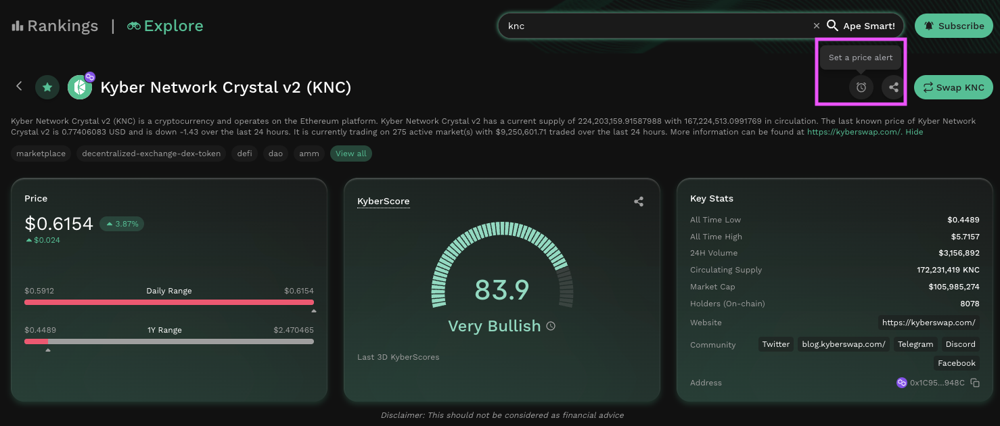
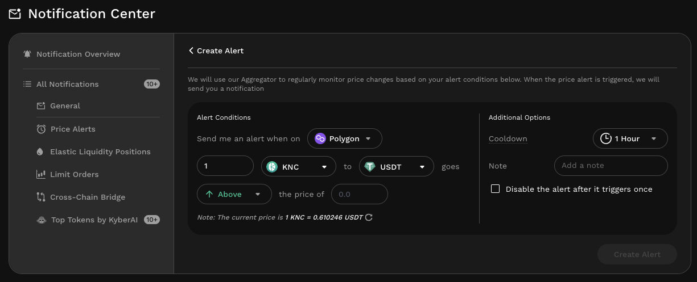

# Get Notifications For Your Favourite Tokens


#### Disclaimer: Not financial advice

KyberAI was created with the intention of empowering our users with the data insights required to make informed trading decisions. Users must exercise due diligence in their trading decisions with the best trading strategies incorporating the insights enabled by KyberAI.


## Introduction

KyberAI also comes equipped with a [notification feature](../../kyberswap-interface/notifications/) which enables traders to setup [customized price alerts](../../kyberswap-interface/notifications/#price-alerts) for all token pairs. Stay on top of the market that never sleeps by configuring notifications whenever a target price is met. Notifications will be delivered  to your [notification center](../../kyberswap-interface/notifications/notification-center.md) on the KyberSwap interface with the option to receive it directly in your email inbox.

Supercharge your trading journey with KyberAI

1. [Sign In To KyberAI With Ethereum ](sign-in-to-kyberai-with-ethereum.md)
2. [Discover Promising Tokens ](discover-promising-tokens.md)
3. [Deep Dive Into Token Data ](deep-dive-into-token-data.md)
4. [Add Tokens To Watchlist ](add-tokens-to-watchlist.md)
5. **Get Notified On Your Favourite Tokens <-**
6. Buy Or Sell Tokens
   * [Instantly Swap At The Best Rates](broken-reference)
   * [Swap At Your Preferred Rates](../../kyberswap-interface/user-guides/trade-at-your-preferred-rates.md)

## Keep track of your favourite tokens

### Step 1: Identify tokens for price alerts

KyberAI provides multiple options for users to discover the most promising tokens. This can be through viewing [KyberAI's token rankings](discover-promising-tokens.md) or [exploring token details](deep-dive-into-token-data.md). Whichever the path taken, once you've identified a token worth tracking, you can proceed to add them to configure a price alert for the token.

### Step 2: Setup your price alert

You can configure price alerts for a token from the [Explore page](deep-dive-into-token-data.md). The price alert feature can be accessed via the alarm icon on the top right of the page.

<figure><figcaption>
Set a price alert
</figcaption></figure>

Upon selecting the icon, the price alert configuration screen will be displayed. You can choose the token pair and price as well as the chain for which the price alert will apply to. Note that you can also setup thresholds which will act as the trigger point for the alert (i.e. price above or below a target).

<figure><figcaption>
Configure price alert
</figcaption></figure>
