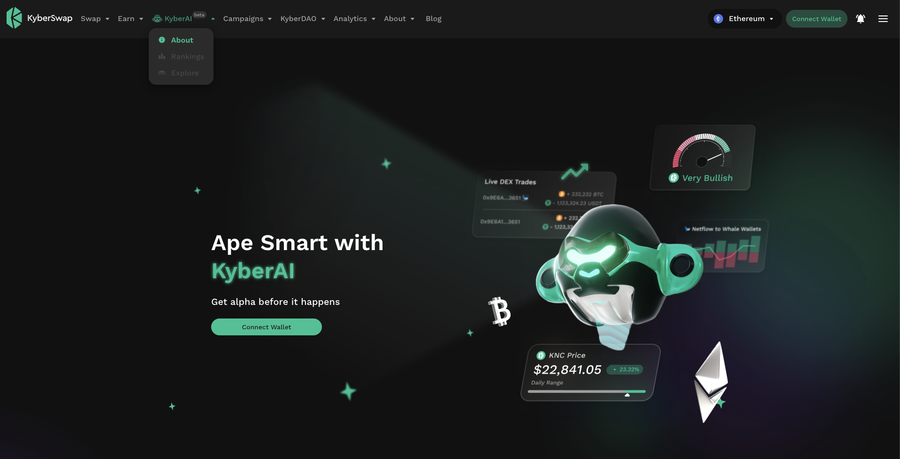
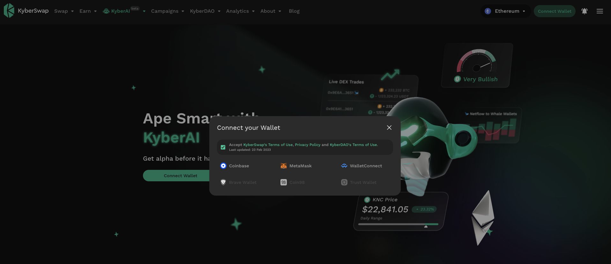
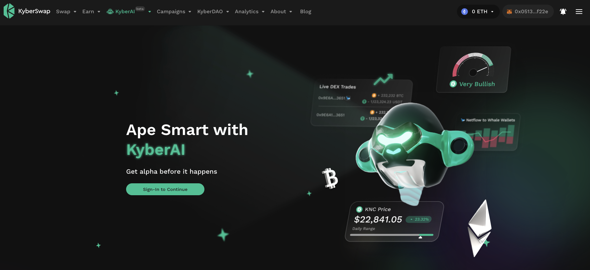
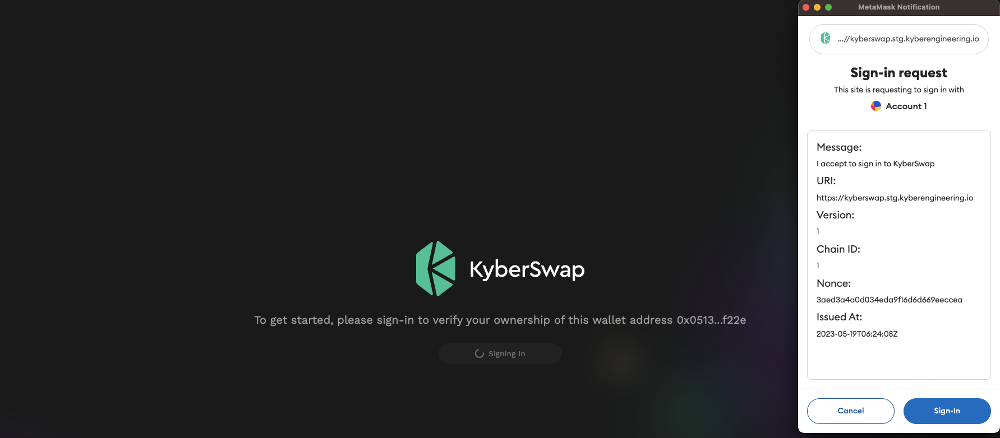
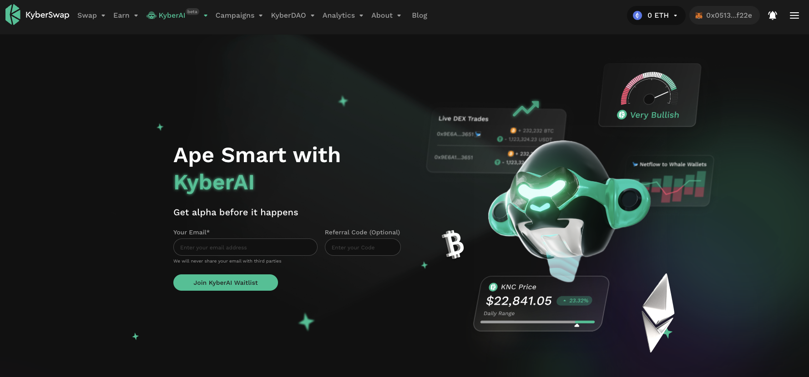

# Sign In To KyberAI With Ethereum

## Introduction

KyberAI was created with the intention of democratizing trading insights for all hence KyberAI's features are accessible to anyone with an Ethereum wallet. As KyberAI is rolled out to the public, it will undergo multiple rounds of limited beta testing to garner further feedback from our most active ecosystem members. This ensures that, at the point of public release, the data insights made available via KyberAI will drive significant value-add to any trading strategy right off the bat.

Leveraging upon the amazing work of [Sign-In With Ethereum](https://docs.login.xyz/), KyberAI users will now be able to sign into the KyberAI interface using their Ethereum wallets. By validating the selected EVM address against a preferred email address, no personally identifiable information needs to be shared with KyberSwap in order to utilize KyberAI trading insights. The linked email will only be used for the purposes of endorsing users as well as for communications.

Supercharge your trading journey with KyberAI

1. **Sign In To KyberAI With Ethereum <-**
2. [Discover Promising Tokens](discover-promising-tokens.md)
3. [Deep Dive Into Token Data](deep-dive-into-token-data.md)
4. [Add Tokens To Watchlist](add-tokens-to-watchlist.md)
5. [Get Notified On Your Favourite Tokens](get-notifications-for-your-favourite-tokens.md)
6. Buy Or Sell Tokens
   * [Instantly Swap At The Best Rates](broken-reference)
   * [Swap At Your Preferred Rates](../../kyberswap-interface/user-guides/trade-at-your-preferred-rates.md)

## Access valuable trading insights

### Step 1: Connect your wallet

The KyberAI interface can be accessed via the navigation bar. Upon navigating to the KyberAI page, you will then be able to see an overview of KyberAI and most importantly, sign up for KyberAI by connecting your wallet.

<figure><figcaption>
KyberAI overview
</figcaption></figure>

Click on the "**Connect Wallet**" button on the page. This will bring up the wallet selection pop-up where the various wallet connection options will be displayed. Note that this is similar to the general [Connect Your Wallet](../../kyberswap-interface/user-guides/connect-your-wallet.md) guide as by establishing a connection, this wallet will be used for all interactions with the KyberSwap UI.

<figure><figcaption>
Select the wallet to be connected
</figcaption></figure>

To proceed with the connection, check the box if you agree to our Terms of Use and Privacy Policy. This will then allow you to select your preferred Web3 wallet that will be connected with the KyberSwap app. Authorise the connection in your chosen Web3 wallet's UI.

### Step 2: Sign in with your Ethereum address

Upon connecting your wallet, you will then be prompted to sign in to KyberAI. You will have to be connected to the Ethereum mainnet (ChainID: 1) in order to sign into KyberAI. Please refer to [Switching Networks](../../kyberswap-interface/user-guides/selecting-preferred-network.md) if you require further guidance on how to change the connected network.

<figure><figcaption>
Sign into KyberAI with SIWE
</figcaption></figure>

Click on the "**Sign-In To Continue**" and you should be prompted to sign a transaction with your wallet. Note that no funds are required for this action as signing the request just indicates that you have agreed to use this Ethereum address to sign into the service (i.e. for KyberSwap to identify you by your address).&#x20;

<figure><figcaption>
Sign in with MetaMask
</figcaption></figure>

### Step 3: Join the KyberAI waitlist

Once you have signed in with Ethereum, you can join the KyberAI waitlist (see [Introduction](sign-in-to-kyberai-with-ethereum.md#introduction) on beta testing) by entering your preferred communication email as well as referral code, if any.

<figure><figcaption>
Join the KyberAI waitlist
</figcaption></figure>

You will be notified once your address has been whitelisted and you can then begin your journey into the world of AI powered data insights!
