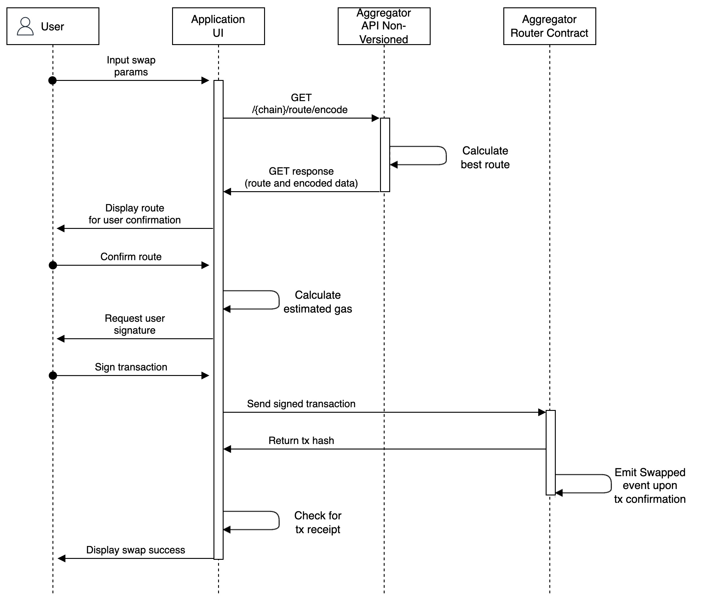

# Upgrading To APIv1

## Overview

Following feedback on the initial non-versioned API, KyberSwap has implemented a more performant APIv1 which improves the response time for getting a route via offloading encoding requirements to a separate post method. With this upgrade, APIv1 brings the following improvements:

* Reduced latency which enables gas estimation calculations to be more accurate
* Reduces the risk of stale encoded data which could potentially lead to failed transactions on the UI
* Functional separation which enables more precise data handling and compute

## Swap flow: Non-versioned vs V1

As part of the APIv1 upgrade, querying of the route data and the encoded data has been separated into their own respective calls. This stands in contrast to the non-versioned API whereby both the route and encoded data are returned in a single [`GET`](../aggregator-api-specification/evm-swaps.md#chain-route-encode) query.

Due to this functional separation, applications have more flexibility when handling route refreshes prior to user confirming the swap route. For example, if rates need to be refreshed, the application will just have to query the APIv1 [`GET`](../aggregator-api-specification/evm-swaps.md#chain-api-v1-routes) endpoint which will return just the route summary. As the encoded data does not have to be processed at this stage, responses are much faster and redundant encodings are avoided.

Moreover, given the reduced latency for each call in APIv1, this reduces the likelihood that the returned data will be stale hence mitigating transaction failure risks. Routes are secured (i.e. "locked-in") via the APIv1 [`POST`](../aggregator-api-specification/evm-swaps.md#chain-api-v1-route-build) which returns the encoded data to be sent to the [`MetaAggregationRouterV2`](../contracts/aggregator-contract-addresses.md) contract.

### Non-versioned API swap flow

Route and encoded data returned in single `GET` call.

<figure><figcaption>
Non-Versioned API sequence diagram
</figcaption></figure>

### APIv1 swap flow

Route summary returned in `GET` response and encoded data returned in `POST` response.

<figure><figcaption>
APIv1 sequence diagram
</figcaption></figure>

## Field mappings

As part of this upgrade, some of the parameters have also been modified to make it more intuitive. The table below maps the relevant changes for avoidance of doubt.

* Non-versioned API `GET`: [`/{chain}/route/encode`](../aggregator-api-specification/evm-swaps.md#chain-route-encode)
* APIv1 `GET`: [`/{chain}/api/v1/routes`](../aggregator-api-specification/evm-swaps.md#chain-api-v1-routes)
* APIv1 `POST`: [`/{chain}/api/v1/route/build`](../aggregator-api-specification/evm-swaps.md#chain-api-v1-route-build)

### Request

| API GET           | APIv1 GET       | APIv1 POST              |
| ----------------- | --------------- | ----------------------- |
| tokenIn\*         | tokenIn\*       | -                       |
| tokenOut\*        | tokenOut\*      | -                       |
| amountIn\*        | amountIn\*      | -                       |
| saveGas           | saveGas         | -                       |
| slippageTolerance | -               | slippageTolerance       |
| isInBps           | isInBps         | -                       |
| chargeFeeBy       | chargeFeeBy     | -                       |
| feeReceiver       | feeReceiver     | -                       |
| feeAmount         | feeAmount       | -                       |
| deadline          | -               | deadline                |
| to\*              | -               | recipient\*             |
| clientData        | -               | source                  |
| -                 | includedSources | -                       |
| -                 | excludedSources | -                       |
| -                 | gasInclude      | -                       |
| -                 | gasPrice        | -                       |
| -                 | -               | routeSummary\*          |
| -                 | -               | sender\*                |
| -                 | -               | skipSimulateTransaction |

### Response


The response parameters have been slightly altered in the `[V1]POST` API. The relevant parameter keys are provided below ( non-versioned -> `[V1]`):

* `inputAmount` -> `amountIn`
* `encodedSwapData` -> `data`


| API GET           | APIv1 GET         | APIv1 POST    |
| ----------------- | ----------------- | ------------- |
| inputAmount       | amountIn          | amountIn      |
| outputAmount      | amountOut         | amountOut     |
| totalGas          | gas               | gas           |
| gasPriceGwei      | gasPrice          |               |
| gasUsd            | gasUsd            | gasUsd        |
| amountInUsd       | amountInUsd       | amountInUsd   |
| amountOutUsd      | amountOutUsd      | amountOutUsd  |
| receiveUsd        | -                 | -             |
| swaps             | route             | -             |
| pool              | pool              | -             |
| tokenIn           | tokenIn           | -             |
| tokenOut          | tokenOut          | -             |
| swapAmount        | swapAmount        | -             |
| amountOut         | amountOut         | -             |
| limitReturnAmount | limitReturnAmount | -             |
| maxPrice          | -                 | -             |
| exchange          | exchange          | -             |
| poolLength        | poolLength        | -             |
| poolType          | poolType          | -             |
| tokens            | -                 | -             |
| address           | -                 | -             |
| symbol            | -                 | -             |
| name              | -                 | -             |
| price             | -                 | -             |
| decimals          | -                 | -             |
| encodedSwapData   | -                 | data          |
| routerAddress     | routerAddress     | routerAddress |
| -                 | code              | code          |
| -                 | message           | message       |
| -                 | data              | data          |
| -                 | routeSummary      | -             |
| -                 | extraFee          | -             |
| -                 | feeAmount         | -             |
| -                 | chargeFeeBy       | -             |
| -                 | isInBps           | -             |
| -                 | feeReceiver       | -             |
