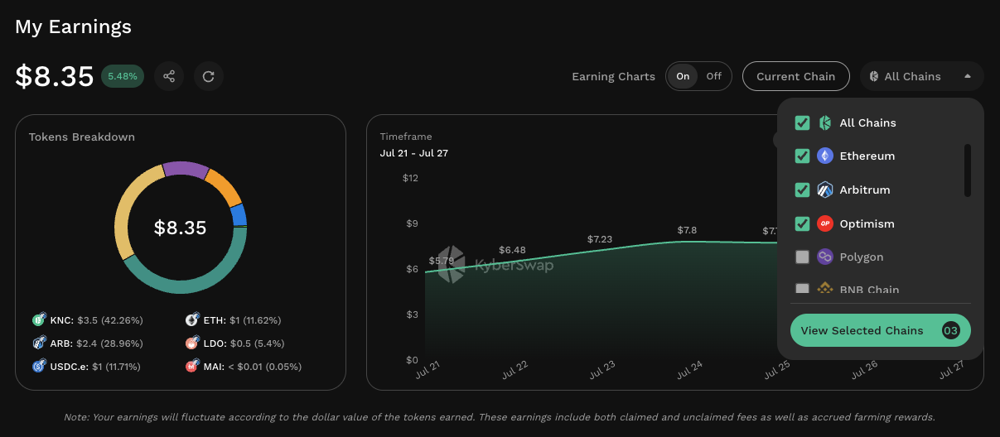
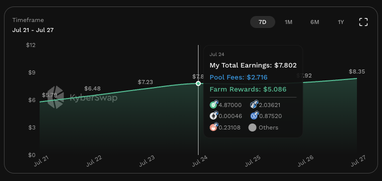
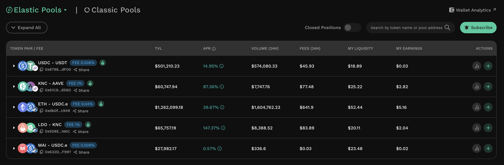
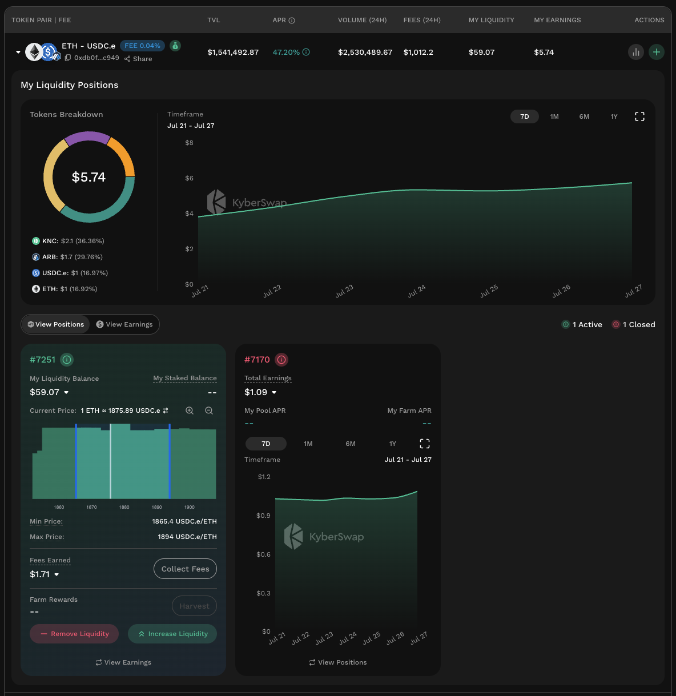

# One-Stop Earnings Dashboard

## Introduction

<figure><figcaption>
My Earnings Overview
</figcaption></figure>

The My Earnings page functions as a one-stop dashboard for LPs to monitor their KyberSwap earnings across all supported chains. This includes all fees and farming rewards that were previously claimed as well as the earnings which have yet to be claimed.&#x20;


#### My Earnings dollar value calculation

For convenience, all dollar values quoted are in USD and are based on the current market price of the token.


With My Earnings, LPs have the ability to further break down their earnings based on the following dimensions:

* **Chains**: My Earnings will be available across all KyberSwap Elastic and Classic supported chains. Please refer to [Supported Exchanges And Chains](../../../getting-started/supported-exchanges-and-networks.md) for the full list of supported networks.
* **Tokens**: As an open and permissionless dApp, LPs are able to create pools between any ERC-20 token hence the My Earnings page will also reflect the number of ERC-20 tokens earned as well as their dollar value.
* **Pools**: For each pool where a LP has an open position, My Earnings will also display the relevant pool and any other positions within the pool. Additionally, LPs can also view closed positions if they want to compare the ranges and APRs across positions in time.
* **Time**: LPs are able to view data based on 7D, 1M, 6M, or 1Y timeframes. Such flexibility enables more fine-tuned management of positions according to the LP's intended market making period.

[Connect your wallet](../user-guides/connect-your-wallet.md) once, and gain insights to all your liquidity contributions for that address across all KyberSwap supported chains!


#### My Earnings data availability

To ensure that LPs have a comprehensive and updated view of their earnings, the My Earnings page displays the complete historical earnings data for the connected address. This means that LPs will be able to view earnings from when they first started using KyberSwap which includes earnings from [Elastic Legacy](../../../reference/legacy/elastic-legacy/).


## Earnings overview

<figure><figcaption>
My Earnings overview
</figcaption></figure>

The overview section summarizes a LP's total earnings across all chains where KyberSwap liquidity protocols are supported. The earnings dollar value is reflected at the top with an accompanying daily percentage movement indicator.


#### Chain selection

My Earnings page will display the earnings for the [connected address](../user-guides/connect-your-wallet.md) across all chains by default. LPs can select their preferred chain via the chain selector in the top right. This will apply to the page as a whole.


### Tokens breakdown

<figure><figcaption>
Earnings token distribution
</figcaption></figure>

The LPs earnings will be divided into the 9 highest earning tokens with all other tokens being grouped under the "Others" category. This percentage breakdown enables LPs to view what are their top performing tokens and their overall weight on their earnings. The relevant tokens are highlighted based on the bar which the LP hovers above.

### Timeframe

<figure><figcaption>
Accumulated earnings over various timeframes
</figcaption></figure>

The Timeframe section allows LPs to view their accumulated earnings over multiple time period, with the longest being a year. Through this, LPs can observe how their earnings have grown over multiple timeframes as well as the distribution of their earnings.&#x20;

Note that as the chart reflects the earning's dollar value, it can also fluctuate depending on the value of each token that was earned.

## My Pools

<figure><figcaption>
My Earnings Pools
</figcaption></figure>

Based on the liquidity protocol selected, LPs will be able to view all pools where they have an open position. This includes the pool's fee tier, market data, as well as farming eligibility. LPs can expand each pool to view position data. Moreover, LPs also have the option to open the analytics page for the pool or add liquidity to the pools via the action buttons.

Note that closed positions can also be displayed by toggling with the "Close Positions" switch. When enabled, all of a LPs historical pools and relevant positions will be displayed.

## My Liquidity Positions

<figure><figcaption>
Open and closed positions for the pool
</figcaption></figure>

For every pool that a LP has contributed liquidity to, LPs can access all the relevant positions by expanding each of the sections. This will reveal each position's information, status, as well as earnings. LPs can toggle between the position and earnings data by using the switch at the top or individually flipping the cards.

Additionally, My Earnings also allows LPs to conveniently manage individual positions directly from the page itself.
