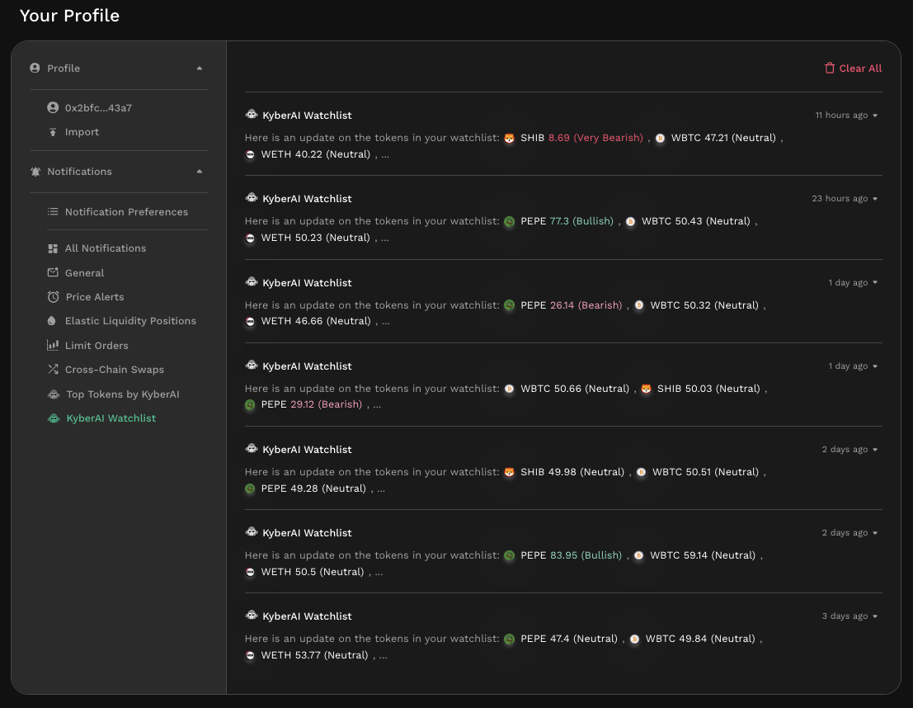

# Notifications

## Overview

The sleepless nights caused by erratic price swings almost functions as a rite of passage into the crypto market which never sleeps. Unlike traditional finance where markets are open during local waking hours, DeFi markets are never closed, even on global holidays. At KyberSwap, we understand that keeping abreast of market movements 24/7 is an impossible ask. To this end, KyberSwap has implemented a notification feature that enables our users to subscribe to customized notifications as well as receive event updates via their preferred communication channels.

As notifications have been integrated across various KyberSwap solutions, users will no longer have to worry about missing out on the latest updates. This includes:

* [Price alerts](./#price-alerts) for token pairs on specific chains when your target price is met
* [Liquidity pool alerts](./#elastic-active-range-alerts) when your position goes in/out of range
* [Limit order notifications](./#limit-order-alerts) when your order has been filled
* [Token bridging alerts](./#bridge-asset) when your cross-chain transaction is completed

With KyberSwap's notification feature, users are able to focus their time and efforts on more important things whether it is identifying the [next big opportunity](./#discover) or just catching up on their sleep.

## Notification channels

KyberSwap currently supports notifications via:

* [Notification Center](notification-center.md): The notification center allows users of the KyberSwap dapp to receive and manage notifications directly on the [KyberSwap Interface](../). Notification preferences, rules, as well as communication channels can be managed via the notification center in the browser.

<figure><figcaption>
KyberSwap Interface notifications
</figcaption></figure>

* [Email Notification](broken-reference): Users can opt to receive preset notifications straight to their inbox by linking their crypto account with their preferred email. This can be configured via the [Notification Center overview](notification-center.md#notification-center-overview).

## Types of notifications

KyberSwap users are able to subscribe to active notifications across the following:

### Price Alerts

<figure><figcaption>
Create a price alert
</figcaption></figure>

Setup your target price and receive a notification whenever the market price for the token pair specified meets your target. Price alerts can be configured for any token pair that have been [imported](../user-guides/add-your-favourite-tokens.md) on the KyberSwap Interface. Alerts can be created with a cooldown across all KyberSwap [supported chains](../../../getting-started/supported-exchanges-and-networks.md).

Users can also toggle their active alerts via the Notification Center.

<figure><figcaption>
Toggle active alerts
</figcaption></figure>

With price alerts, users are able to monitor price actions and adjust their trade strategy accordingly be it [updating existing limit orders](../../limit-order/user-guides/update-limit-orders.md) or [executing an immediate swap](broken-reference).

<figure><figcaption>
Price alerts history
</figcaption></figure>

### Elastic Active Range Alerts

<figure><figcaption>
Liquidity position notifications
</figcaption></figure>

[Create an Elastic pool position](../../../liquidity-solutions/kyberswap-elastic/user-guides/elastic-pool-creation.md) and receive notifications whenever your position goes in or out of range. Maximize your yields by timing your liquidity [removals](../../../liquidity-solutions/kyberswap-elastic/user-guides/removing-liquidity-on-elastic.md) and [additions](../../../liquidity-solutions/kyberswap-elastic/user-guides/add-liquidity-to-an-existing-elastic-pool.md) according to the markets.

### Limit Order Alerts

<figure><figcaption>
Limit order notification
</figcaption></figure>

[Create a limit order ](../user-guides/trade-at-your-preferred-rates.md)and receive a notification whenever your order gets fully or partially filled. KyberSwap will also send out notifications if any of your active orders has expired. Predefine your trades and receive updates whenever there's a matching trade or change in status.

### KyberAI Watchlist

<figure><figcaption>
KyberAI watchlist
</figcaption></figure>

[Add your favourite tokens to your KyberAI watchlist](../../kyberai/user-guides/add-tokens-to-watchlist.md) and get notified of their latest [KyberScores](../../kyberai/kyberscore.md) and prices.
