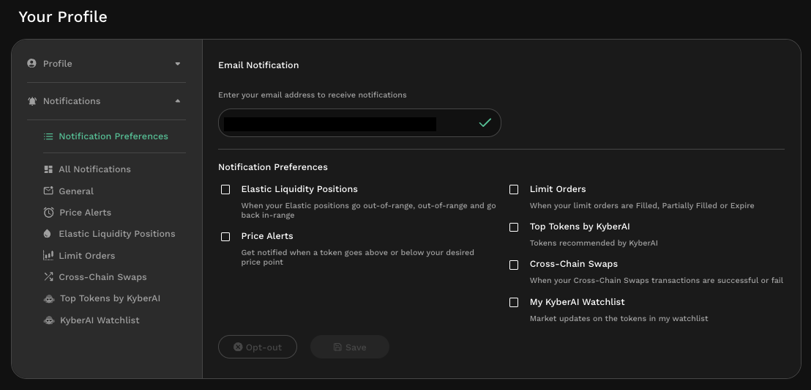

# Notification Center

## Introduction

The notification center functions as the control panel for all KyberSwap notifications. In addition to having a view of all notifications within a single page, the notification centre allows users to subscribe to multiple [notification types](./#types-of-notifications), configure notification thresholds, and redirect notifications to their [preferred channels](./#notification-channels).

## Notification quick view

The KyberSwap Interface enables users to conveniently peek the latest notifications for their connected account via the UI. Users of the KyberSwap UI will be notified via the bell icon for any KyberSwap related notifications, be it for customized alerts which are delivered via "My inbox" or KyberSwap updates which are delivered via "General".

<figure><figcaption>
Notification quick view
</figcaption></figure>

## Access the notification center

The notification centre can be accessed on all devices via the [KyberSwap Interface](../). Users can open the notification centre control panel by selecting the "Notification Center" under the settings tab in the top right of the [KyberSwap UI](https://kyberswap.com/swap/). Alternatively, it can be accessed directly via [https://kyberswap.com/swap/notification-center](https://kyberswap.com/swap/notification-center).

<figure><figcaption>
Notification centre navigation
</figcaption></figure>

## Notification Center overview

Upon opening the notification center, users will be able to configure their preferred [notification types](./#types-of-notifications) as well as the [channels](./#notification-channels) through which the selected notifications will be delivered.

<figure><figcaption>
Notification Center
</figcaption></figure>

## Notifications

All notifications can be accessed via the "All Notifications" section of the Notification Center. Users are also able to filter the notifications via the various available [notification types](./#types-of-notifications). Notifications are sorted by date with the newest notifications being prioritized.

<figure><figcaption>
All Notifications
</figcaption></figure>
