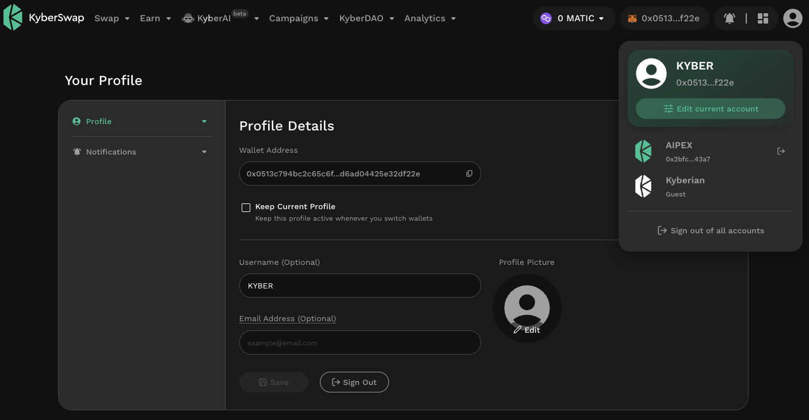

# Profile Creation

## Introduction

At KyberSwap, we understand that many DeFi users utilize multiple wallets to diversify and secure their funds. As such, [KyberSwap Profiles](./) enables users to enjoy a similar trading experience across all addresses by choosing a master profile. Alternatively, users can also choose to create separate profiles for each address without ever mixing the profiles and addresses. A guest profile is also available for users who want to continue using KyberSwap without signing in.&#x20;

Aside from a one profile per address limitation, users are free to configure their profile and address connections according to their personal preferences. Addresses and profiles can only be linked following user input on the KyberSwap Interface.

## Profile Creation

<figure><figcaption>
Add an account
</figcaption></figure>

A guest account is created by default for every KyberSwap user however users can create a profile by selecting the "Add Account" option under the Profile menu. By adding an account, you will be prompted to sign in with your Ethereum address which will require the transaction to be signed in your connected wallet.

<figure><figcaption>
Sign in with Ethereum via MetaMask
</figcaption></figure>

A new profile will have been automatically created following the successful sign in with Ethereum whereupon you will be able to see the new profile with the linked wallet address.

<figure><figcaption>
Signed into KyberSwap Profile
</figcaption></figure>

## Multiple profiles

<figure><figcaption>
Create multiple profiles
</figcaption></figure>

Users can create multiple profiles by changing their wallet address and repeating the steps as per the [Profile Creation](profile-creation.md#profile-creation) section above. Additional profiles will be added to the profile dropdown where users can then select their preferred profile.

## Switching profiles

<figure><figcaption>
Select master profile
</figcaption></figure>

Users can manually switch profiles via the Profile menu or select a master profile which will be applied to all connected addresses. Note that off-chain services are delivered via the selected profile.
