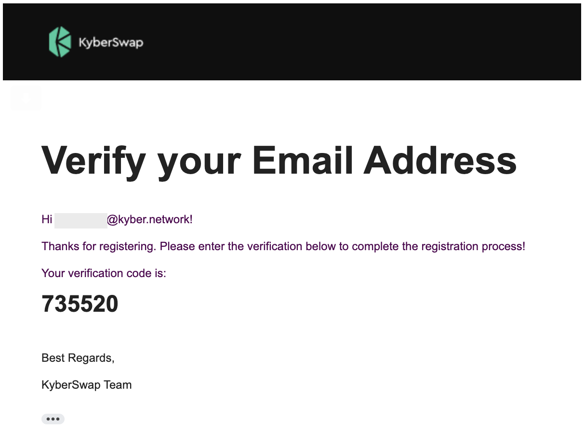
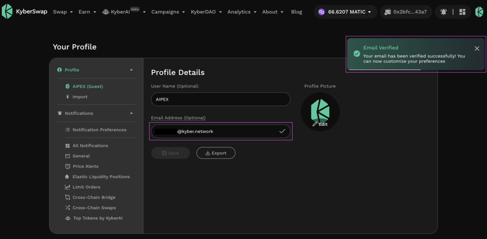

# Profile Customization

## Introduction

KyberSwap users can now customize their trading experience with [KyberSwap Profiles](./). Users can change their profile picture, set their [notification preferences](../notifications/), and even give their profile a nickname. The list of profile customization options will only continue to grow as KyberSwap continues to build more value-added off-chain services for our users.

Note that basic customization options are also available for the guest accounts where users have yet to sign in with their Ethereum wallets. To learn more about creating and managing multiple profiles, please refer to [Profile Creation](profile-creation.md).

## Profile Picture

<figure><figcaption>
Change your profile picture
</figcaption></figure>

Users can change their profile picture via the [profile management page](https://kyberswap.com/manage/profile). Once changed, the profile picture will be visible thorughout the KyberSwap UI as long as the profile is selected.

<figure><figcaption>
Profile picture updated
</figcaption></figure>

## User Name

<figure><figcaption>
Personalize your username
</figcaption></figure>

Users can also give their profile a nickname by changing the user name under the [profile management page](https://kyberswap.com/manage/profile).

## Email

By adding an email to the profile, users will be able to receive notifications and other communication content directly in their inbox. Note that this step is optional and is provided as a supplementary service for users who want the added convenience. The linked email will only be used for the purposes communications.

<figure><figcaption>
Add an email address
</figcaption></figure>

Do note that the linking of an email address requires the email to be verified via a 2-step verification process. An email containing the 2FA verification code will be sent to the indicated email whereupon users will have to copy the code over to the KyberSwap Interface. Upon successful verification, the connected email will be indicated with a green tick mark.

<figure><figcaption>
Verfication email with the 2FA code
</figcaption></figure>

<figure><figcaption>
Input the 2FA code to confirm email
</figcaption></figure>

<figure><figcaption>
Email verified and connected
</figcaption></figure>
