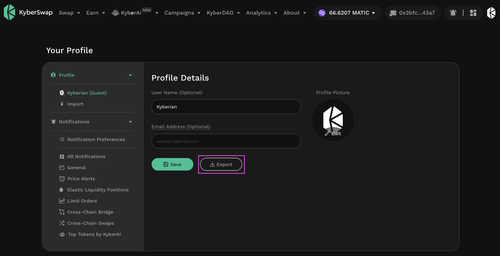
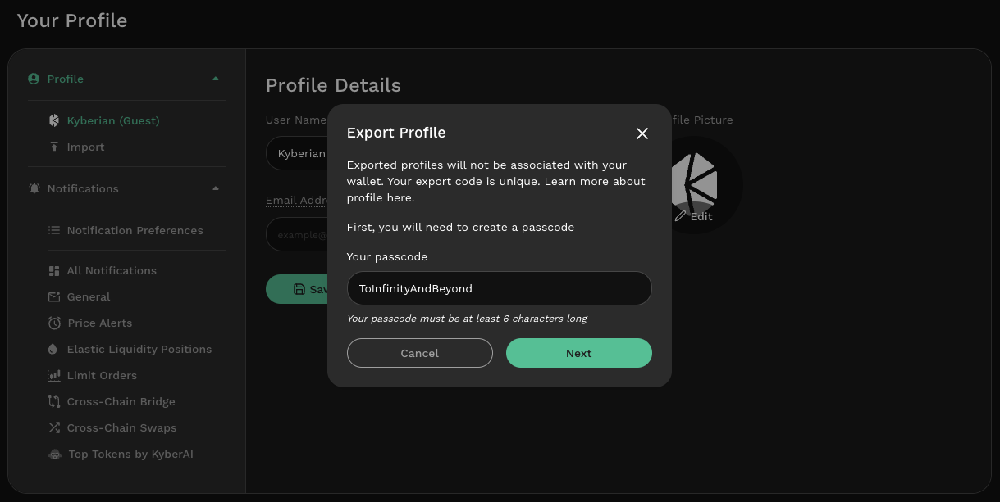
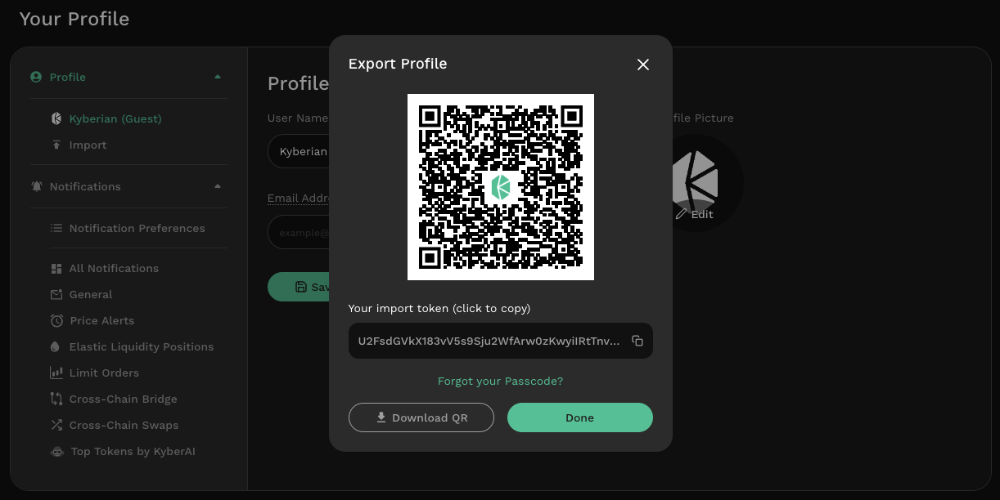

# Sync Profile Across Devices

## Introduction

By simply signing in with the same address, users can enjoy the same great trading experience across all devices. [Create a profile](profile-creation.md), [customize it on any device once](profile-customization.md), and your profile will be synced  across all devices connected to the same Ethereum address.

For users who prefer not to sign in with their Ethereum address, KyberSwap Profiles also provides the option for users to export and import their guest profiles across devices using QR codes.

## Sign In With Ethereum

Once a profile has been created, users will be able to access the profile by signing into KyberSwap with the same Ethereum address across any of their devices. Any changes made to the profile on one device will be automatically synced across all devices connected to the same Ethereum address.

For an overview on how to create and manage multiple profiles, please refer to the [Profile Creation](profile-creation.md) page.

## Guest Profiles

Users can export their guest profiles to be used on other devices if they do not wish to sign in with Ethereum. Note that exported profiles will not be associated with the wallets. The export function can be found on the [profile management page](https://kyberswap.com/manage/profile).

<figure><figcaption>
Export guest profile
</figcaption></figure>

To ensure that only you have access to your customized profile, a password is required when exporting the profile. Do take note of this password as it will be required when importing the profile to your new device.

<figure><figcaption>
Password protected export
</figcaption></figure>

Once a password has been set, the profile can then be easily copied across to another device by scanning the provided QR code or pasting the import token into the profile import function.

<figure><figcaption>
Export profile QR and token
</figcaption></figure>
