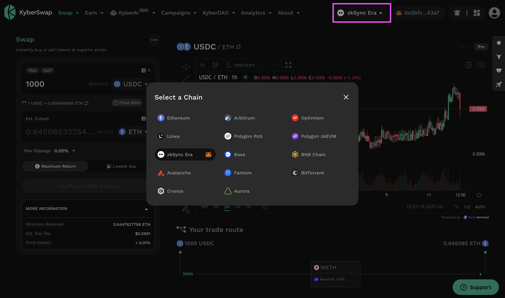
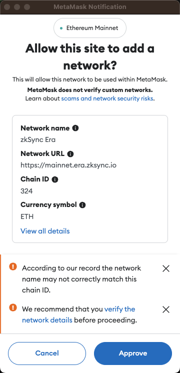
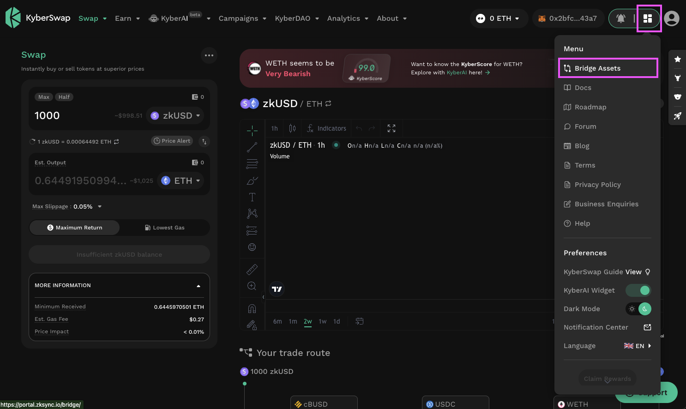

# Bridge Your Assets Across Multiple Chains

## Introduction

KyberSwap has included links to various native bridges that enable you to conveniently navigate to the official bridge for the chain that you are connected to:

* [BSC (ChainID: 56)](https://www.bnbchain.org/en/bridge)
* [Arbitrum (ChainID: 42161)](https://bridge.arbitrum.io/)
* [Polygon PoS (ChainID: 137)](https://wallet.polygon.technology/?redirectOnConnect=%2FzkEVM-Bridge%2Fbridge%3Ffaster-bridges%3Dtrue)
* [Optimism (ChainID: 10)](https://app.optimism.io/bridge/deposit)
* [Avalanche (ChainID: 43114)](https://core.app/bridge/)
* [Cronos (ChainID: 25)](https://cronos.org/bridge/)
* [Base (ChainID: 8453)](https://bridge.base.org/deposit)
* [zkSync Era (ChainID: 324)](https://portal.zksync.io/bridge/)
* [Polygon zkEVM (ChainID: 1101)](https://wallet.polygon.technology/?redirectOnConnect=%2FzkEVM-Bridge%2Fbridge%3Ffaster-bridges%3Dtrue)
* [Linea (ChainID: 59144)](https://bridge.linea.build/)

Trader Flow

1. [Connect Your Wallet ](connect-your-wallet.md)
2. [Switching Networks ](selecting-preferred-network.md)
3. Get Tokens
   * [Get Crypto With Fiat](get-crypto-with-fiat.md)
   * **Bridge Your Tokens <-**
4. Swap Tokens
   * [Instantly Swap At Superior Rates ](instantly-swap-at-superior-rates.md)
   * [Swap At Your Preferred Rates ](trade-at-your-preferred-rates.md)
   * [Swap Between Different Tokens Across Chains](swap-between-different-tokens-across-chains.md)

## Bridge your token from one chain to the next

### Step 1: Connect to the destination chain

Select the chain which you are bridging to by using KyberSwap's chain selector tool.&#x20;

<figure><figcaption>
Select chain
</figcaption></figure>

If this is the first time connecting to a specific chain, you will have to approve adding the network provider to your wallet's list of providers.

<figure><figcaption>
Add network to MetaMask
</figcaption></figure>

### Step 2: Open the KyberSwap menu

Once connected to the target network, you can then access the native bridges via the menu in the top right.

<figure><figcaption>
Navigate to the chain's native bridge
</figcaption></figure>
