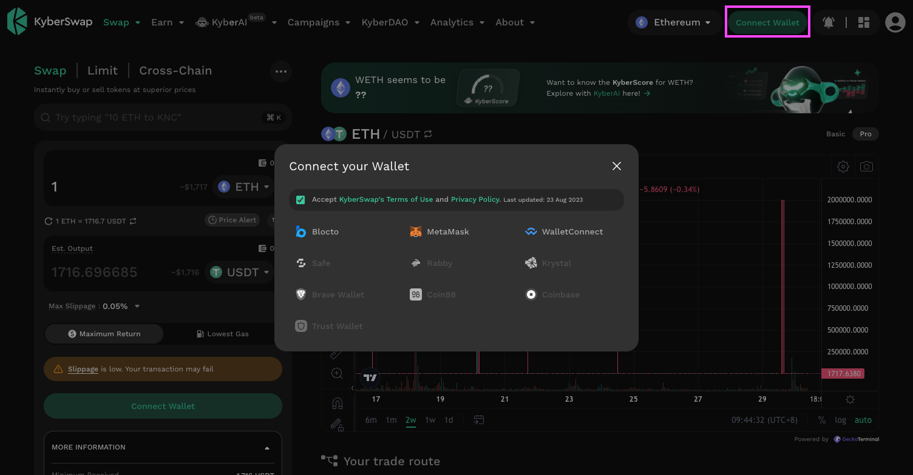

# Connect Your Wallet

## Before you begin

As a Decentralized platform, KyberSwap does not offer users “accounts” in the traditional sense. We do not store your private data and all transactions on our platform take place through the use of [Web3 wallets](../../../getting-started/foundational-topics/decentralized-technologies/wallets.md). Connecting your Web3 wallet to the KyberSwap platform will enable you to use the full suite of KyberSwap's onchain features.

KyberSwap has integrated with the leading wallet providers allowing you to select your favourite wallet:

* [Blocto](https://blocto.io/)
* [Brave Wallet](https://brave.com/wallet/)
* [Coin98](https://coin98.com/)
* [Coinbase](https://www.coinbase.com/wallet)
* [Krystal](https://linktr.ee/krystalwallet)
* [Metamask](https://metamask.io/)
* [Rabby](https://rabby.io/)
* [Safe](https://safe.global/wallet)
* [Trust Wallet](https://trustwallet.com/)
* [WalletConnect](https://walletconnect.com/)

Please refer to the respective wallet provider resources on how to setup your wallet.

Liquidity Provider Flow

Still deciding on which solution suits you best?&#x20;

* **Overview**: [Earn Yield By Contributing Liquidity](earn-yield-by-contributing-liquidity.md)
* **Detailed comparison**:  [Classic vs Elastic](../../../liquidity-solutions/classic-vs-elastic/)&#x20;

#### Next steps

1. **Connect Your Wallet <-**
2. [Switching Networks](selecting-preferred-network.md)
3. [Earn Yield By Contributing Liquidity](earn-yield-by-contributing-liquidity.md)

Trader Flow

1. **Connect Your Wallet <-**
2. [Switching Networks](selecting-preferred-network.md)
3. Get Tokens
   * [Get Crypto With Fiat](get-crypto-with-fiat.md)
   * [Bridge Your Tokens](bridge-your-assets-across-multiple-chains.md)
4. Swap Tokens
   * [Instantly Swap At Superior Rates](instantly-swap-at-superior-rates.md)
   * [Swap At Your Preferred Rates](trade-at-your-preferred-rates.md)
   * [Swap Between Different Tokens Across Chains](swap-between-different-tokens-across-chains.md)

## Connecting your Web3 wallet

To connect your Web3 wallet, click on the **Connect Wallet button** at the top right of the page. This will bring up the wallet selection pop-up where the various wallet connection options will be displayed.

<figure><figcaption></figcaption></figure>

To proceed with the connection, check the box if you agree to our Terms of Use and Privacy Policy. This will then allow you to select your preferred Web3 wallet that will be connected with the KyberSwap app. Authorise the connection in your chosen Web3 wallet's UI.

Next, select the Web3 wallet that you would like to use to connect to KyberSwap and authorize the connection to KyberSwap on your chosen Web3 wallet’s UI.&#x20;

### MetaMask Example

For the example below, we are connecting to KyberSwap with MetaMask.

<figure><figcaption>
Select MetaMask account to connect
</figcaption></figure>

<figure><figcaption>
Confirm connection
</figcaption></figure>

Once confirmed, you should be able to see the same wallet account being reflected on the top right of the KyberSwap app. You can even click on the connected account to bring up a handy account summary.

<figure><figcaption>
KyberSwap Wallet Helper
</figcaption></figure>

## Funding your wallet

To ensure the security of the network, all transactions on a public blockchain (i.e. Ethereum, Polygon, etc.) requires a small fee to be paid in return for being processed by the network. Fees are paid in the selected chain's [native currency](../../../getting-started/foundational-topics/decentralized-finance/tokens.md#coins-vs-tokens) (i.e. ETH on Ethereum, MATIC on Polygon, etc.) and does not go towards KyberSwap.&#x20;

If you do not have the required funds, you will first need to purchase some from a centralised exchange before sending it to your wallet address. Feel free to reach out to the KyberSwap team on [Discord](https://discord.gg/NB3vc8J9uv) if you have further questions.&#x20;
