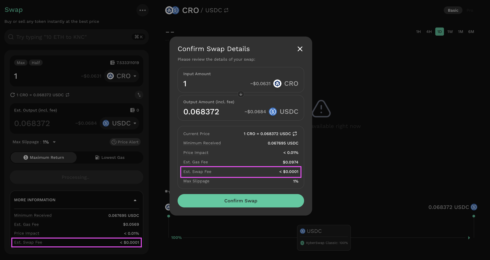

# Instantly Swap At Superior Rates

## Introduction

KyberSwap allows you to swap tokens easily at superior rates by aggregating liquidity from different DEXs and aggregators on the network. Through splitting and optimizing trade routes across various liquidity sources, KyberSwap is able to source favourable rates for your swap.

Please refer to [Supported Exchanges and Networks](../../../getting-started/supported-exchanges-and-networks.md) for the full list of decentralized exchanges which have been integrated with KyberSwap.

Trader Flow

1. [Connect Your Wallet ](connect-your-wallet.md)
2. [Switching Networks ](selecting-preferred-network.md)
3. Get Tokens
   * [Get Crypto With Fiat](get-crypto-with-fiat.md)
   * [Bridge Your Tokens](bridge-your-assets-across-multiple-chains.md)
4. Swap Tokens
   * **Instantly Swap At Superior Rates** **<-**
   * [Swap At Your Preferred Rates](trade-at-your-preferred-rates.md)
   * [Swap Between Different Tokens Across Chains](swap-between-different-tokens-across-chains.md)

## Find superior rates for your swaps

### **Step 1: Connect your wallet**

[Connect your Web3 wallet to KyberSwap](connect-your-wallet.md) and [select the network](selecting-preferred-network.md) that you would like to use for the swap using the selector at the top right of the Swap page.

<figure><figcaption>
Connected chain and wallet
</figcaption></figure>

### **Step 2:** Specify your swap pair

&#x20;You can either do this manually using the individual token selection buttons on the swap screen.

<figure><figcaption>
Specify tokens individually
</figcaption></figure>

or by searching for your desired swap pair using the search field. (The keyboard shortcut Ctrl+K also opens this search feature.)

<figure><figcaption>
Swap via smart search
</figcaption></figure>


#### Fee-on-transfer tokens

Note that certain ERC20 token smart contracts implement a fee-on-transfer (FOT) mechanism whereby for every token transfer, a percentage of the tokens are burned or distributed to various wallets. As a permissionless dapp, KyberSwap enables users to [Add Their Favourite Tokens](add-your-favourite-tokens.md) and hence do not limit the type of tokens traded as long as the token follows the [ERC20 standard](https://docs.openzeppelin.com/contracts/4.x/erc20).

Specific to swaps against [AMM DEXs](../../../getting-started/foundational-topics/decentralized-finance/automated-market-maker.md), tokens undergo multiple hops between various smart contracts during the course of a single swap. Multiple contracts are required to ensure the security of the swap as well as the accountability that accompanies clear functional separation between different smart contract teams. Given that FOT tokens are designed to charge a tax on every transfer, each token hop will incur a tax which is usually a percentage of the transfer amount.

For standard AMM swaps, the FOT tax will be charged twice as tokens are transferred from the pool contract to the executor contract to the recipient. If the swap involves a commission fee (configured by integrators or referees), an additional hop to the router contract is required to collect the fees.

For swaps, the token transfer happens after the swap logic has been processed based on the market price (i.e. calculating input/output amount). As such, the party that incurs the FOT tax will be dependent on the direction of the swap:

* For standard token to FOT token trades, the trader will receive FOT token minus the FOT tax.
* For FOT token to standard token trades, the pool will receive FOT token minus the FOT tax. Traders will not incur the FOT tax in this case.

Note that the FOT tax is specified in the FOT token's smart contract (i.e. the FOT token team) hence KyberSwap does not have any control over the FOT mechanism. Users are advised to trade such tokens at their own risk as KyberSwap was optimized to handle the standard ERC20 implementation.


### **Step 3**: Configure swap amount

Specify the amount you would like to swap by either typing in an amount manually or by using the “Max” and “Half” buttons to swap pre-set proportions of your wallet balance. An estimate of the amount returned should appear in the quote field.


#### Route refresh: Ensuring optimal rates

Do note that the KyberSwap Interface will continuously update the swap rates in order to source superior rates for your swap given the changing market conditions. As such, you will always be able to see the latest proposed route and rates prior to clicking the "Swap" button.

Upon clicking the "Swap" button, KyberSwap Aggregator will attempt to secure the final route that will be displayed on the "Confirm Swap" pop-up (see [Step 5](instantly-swap-at-superior-rates.md#step-5-confirm-the-swap)).


KyberSwap Interface allows users to customize trade parameters which enables greater trade security or even more advanced trade strategies. Refer to [Customizing trade parameters](instantly-swap-at-superior-rates.md#customizing-trade-parameters) section for more details.


#### Max slippage: Protecting your trades

KyberSwap enables you to avoid any negative trade outcomes by setting a Max Slippage. Please refer to [Customizing trade parameters](instantly-swap-at-superior-rates.md#customizing-trade-parameters) below for further details or [Slippage](../../../getting-started/foundational-topics/decentralized-finance/slippage.md) if you would like to understand the concept better.


<figure><figcaption>
Specify swap amount
</figcaption></figure>


#### Swap fees: Supporting transactions on low trading volume chains

For chains which have low trading volumes, trades via the KyberSwap UI are charged a small % fee which goes into offsetting the operational costs for KyberSwap on that chain.

The fees charged will be dependent on the token pair whereby **stable-stable swaps (i.e. USDC/DAI) will be charged 0.04% while swaps involving non-stable tokens (i.e. USDC/KNC, KNC/WETH) are charged 0.1%**.&#x20;

In order to support infrastructure and maintenance requirements, KyberSwap charges a 0.04% fee for swaps between the following identified stables and chains:

* Cronos (ChainID: 25) - [USDC](https://cronoscan.com/address/0xc21223249ca28397b4b6541dffaecc539bff0c59), [DAI](https://cronoscan.com/address/0xF2001B145b43032AAF5Ee2884e456CCd805F677D), [USDT](https://cronoscan.com/address/0x66e428c3f67a68878562e79A0234c1F83c208770), [BUSD](https://cronoscan.com/address/0xC74D59A548ecf7fc1754bb7810D716E9Ac3e3AE5), [MAI](https://cronoscan.com/address/0x2Ae35c8E3D4bD57e8898FF7cd2bBff87166EF8cb)
* Velas (ChainID: 106) - [USDC](https://evmexplorer.velas.com/address/0xe2C120f188eBd5389F71Cf4d9C16d05b62A58993), [USDT](https://evmexplorer.velas.com/address/0x01445C31581c354b7338AC35693AB2001B50b9aE), [BUSD](https://evmexplorer.velas.com/address/0xc111c29A988AE0C0087D97b33C6E6766808A3BD3)
* Aurora (ChainID: 1313161554) - [USDC.e](https://explorer.mainnet.aurora.dev/address/0xB12BFcA5A55806AaF64E99521918A4bf0fC40802), [USDT.e](https://explorer.mainnet.aurora.dev/address/0x4988a896b1227218e4A686fdE5EabdcAbd91571f), [DAI](https://explorer.mainnet.aurora.dev/address/0xe3520349F477A5F6EB06107066048508498A291b)
* Oasis (ChainID: 42262) - [USDC](https://explorer.emerald.oasis.dev/address/0x80A16016cC4A2E6a2CACA8a4a498b1699fF0f844/transactions), [USDT](https://explorer.emerald.oasis.dev/address/0x6Cb9750a92643382e020eA9a170AbB83Df05F30B/transactions), [BUSD](https://explorer.emerald.oasis.dev/address/0x639A647fbe20b6c8ac19E48E2de44ea792c62c5C/transactions)

All other swaps involving tokens not listed above will be charged a 0.1% fee. This will enable the KyberSwap UI to continue supporting swaps on low volume chains based on the trading activity on that chain.\
\
\
\
Any fees charged will be clearly stated on the swap page as well as again on the swap confirmation page. The estimated output amount displayed will be inclusive of the fees.\



### **Step 4**: Approve or permit contract to swap tokens

Approve or Permit KyberSwap to swap the tokens on your behalf. Proceed to Step 5 if token approval/permit is not required.

If this is the first time you are swapping this token on this network using this wallet, the "Swap" button will be greyed out. You will first need to approve/permit the KyberSwap smart contract to spend your tokens before proceeding with the swap.

In the pursuit of greater gas savings for our users, KyberSwap has implemented a permit option for tokens which follow the [ERC-2612](https://eips.ethereum.org/EIPS/eip-2612) standard. In contrast to the basic [ERC20](../../../getting-started/foundational-topics/decentralized-finance/tokens.md#token-standards) token implementation, ERC-2612 enables gasless approvals of smart contract allowances with just a signed message. In other words, approving a token via "Permit" does not require any gas and achieves the same effect as the ERC20 "Approve". If you see a "Permit" button, it means your token is eligible for gasless approvals!


#### Permitable tokens

Please refer to [Permitable Tokens](../../../reference/permitable-tokens.md) for the full list of tokens which have implemented the ERC-2612 standard.




Click on the "Permit \[Token]" button to allow KyberSwap to swap the tokens on your behalf.

<figure><figcaption>
Permit EIP-2612 compatible tokens
</figcaption></figure>

To ensure the safety of your tokens, users will be prompted to sign the transaction for the exact amount in their wallet UI. By signing the permit request, this ensures that KyberSwap is only able to swap the exact number of tokens from your wallet. As long as the accumulated tokens for current or future swaps exceeds this limit, another permit process will be required.

Upon signing the permit, you will then be able to proceed with the swap.

<figure><figcaption>
Note the value in the signature request matches the swap amount
</figcaption></figure>


#### A note on permits

By permitting the swap, you are authorizing KyberSwap to swap the exact amount of tokens specified in the trade for the next 24 hours. This 24 hour deadline is implemented as a safety mechanism to ensure that the permit expires in case a corresponding swap order was not submitted or in the highly improbable event that an order was not filled. A new permit will be required upon the expiration of the current permit.&#x20;

Note that the granting of a permit and the confirmation of a swap ([step 5](instantly-swap-at-superior-rates.md#step-5-confirm-the-swap)) are separate transactions whereby the latter is unable to proceed without the completion of the former. More importantly, as opposed to permits, swaps will always require gas to be paid as token transfers have to be confirmed by the network. As such, in the case whereby a swap remains in a pending state, it is possible to cancel the swap transaction in your wallet while the permit remains valid until expiry. If a future swap requires more tokens than an existing permit, the user will be requested to sign a new permit.




Click on the "Approve \[Token]" button to allow KyberSwap to swap the tokens on your behalf.

<figure><figcaption>
Approve token
</figcaption></figure>

To ensure the safety of your tokens, KyberSwap will also prompt you to select an allowance limit for the token being approved. By setting an allowance limit, this ensures that KyberSwap is only able to swap the specified number of tokens from your wallet. As long as the accumulated tokens for current or future swaps exceeds this limit, another approve process will be required. You can either set a custom allowance limit or opt for an infinite limit.

Hovering your mouse above the options will also bring up the helpers for your convenience.&#x20;

<figure><figcaption>
Infinite allowance helper
</figcaption></figure>

<figure><figcaption>
Custom allowance helper
</figcaption></figure>

Note that setting a custom allowance limit via the KyberSwap UI will be available for all wallets except for MetaMask and Trust Wallet. For these, users will be prompted to set the allowance limit directly in their wallet UI. This avoids any tx failures caused by amount mismatch.

<figure><figcaption>
Set allowance limit in MetaMask
</figcaption></figure>

Upon confirming an allowance limit, your wallet will then prompt you to sign the transaction request with the relevant gas fees.



### **Step 5**: Confirm the swap

Click the “Swap” button to bring up the confirmation screen.&#x20;


#### Route confirmation and market volatility

Do note that once the final route has been secured, the details related to your swap will be available for your review in the "Confirm Swap Details" pop-up.

In times of volatility, the market conditions might have changed in-between clicking the "Swap" button and the "Confirm Swap Details" pop-up being displayed. KyberSwap will display the latest rates in the "Confirm Swap Details" pop-up for you to review.

**If there is a change in the price, to protect you, you will need to accept the new price before proceeding with the swap. Refer tabs below for the various scenarios.**

Please review the swap information in full prior to confirmation as the final secured route might differ from the swap screen (see [Step 3](instantly-swap-at-superior-rates.md#step-3-configure-swap-amount)). As an additional safeguard, KyberSwap highly recommends that users take advantage of our "Max Slippage" feature (refer to [Customizing trade parameters](instantly-swap-at-superior-rates.md#customizing-trade-parameters)).


#### Price changes (==, ++, --)



If there are no changes to the swap price between viewing the route and confirming the route, the UI will display the following "Confirm Swap Details" pop-up.

<figure><figcaption>
Confirm swap with no change in price
</figcaption></figure>



In the case whereby the market has moved in the trader's favor, the "Confirm Swap Details" pop-up will display the greater amount and users can proceed with the swap. The user can continue to swap at even better rates thanks to KyberSwap sourcing the most optimal and updated route.

<figure><figcaption>
Confirm swap with better rates
</figcaption></figure>



In cases whereby market conditions have moved against the trader, KyberSwap will display various warnings depending on the severity of the price deviation. To protect our users, additional safeguards are put in place to ensure that users are always in full control of their trades.&#x20;

#### Price drops by less than 1% (price drop <1%)

A warning is displayed but no additional steps are required to confirm the swap.

<figure><figcaption>
Confirm swap for price drop &#x3C; 1%
</figcaption></figure>

#### Price drops more than 1% but less than 5% (1%< price drop < 5%)

A warning is displayed and user will have to accept the new amount by clicking on the "Accept New Amount" button.

<figure><figcaption>
Accept new amount for 1% &#x3C; price drop &#x3C; 5%
</figcaption></figure>

#### Price drops more than 5% but less than 10% (5%< price drop < 10%)

A strong warning is displayed and user will have to accept the new amount by clicking on the "Accept New Amount" button.

<figure><figcaption>
Accept new amount for 5% &#x3C; price drop &#x3C; 10%
</figcaption></figure>

#### Price drops more than 10% (10%< price drop)

A warning is displayed and user will have to accept the new amount by clicking on the "Accept New Amount" button. Additionally, users will have to manually type in their confirmation to validate that they consent to the significant price deviation.

<figure><figcaption>
Accept new amount for price drop &#x3C; 10%
</figcaption></figure>

<figure><figcaption>
Manual confirmation of price drop greater than 10%
</figcaption></figure>



In all the above cases, the confirmation screen will always display a few key pieces of information for review:

* **Output amount:** Estimated return after the Swap.


#### KyberSwap positive slippage surplus collection

For every swap executed by the KyberSwap Aggregator, users will be able to see an estimated output amount based on the current price as well as a minimum received that takes into account the [max slippage setting](instantly-swap-at-superior-rates.md#customizing-trade-parameters). KyberSwap Aggregator will always strive to execute swaps at the estimated output amount and revert the transaction if the minimum received amount is not achieved.

In the event that the market moves in favor of the trade which results in a surplus of tokens above the estimated output amount (i.e positive slippage), this surplus will initially accrue to KyberSwap. Surplus sharing programs will be explored as the KyberSwap ecosystem grows to be more self-sufficient. **Critically, traders will always get the estimated output amount as long as the swap is executed at or above the current rate**.&#x20;

Note that this surplus is different from fees as it only applies in cases where the executed swap rate is better than the estimated rate at point of transaction confirmation. Please refer to [slippage ](../../../getting-started/foundational-topics/decentralized-finance/slippage.md)for more information.


* **Current Price**: the rate at which the swap will happen (this can be inverted using the 🔁 button).
* **Minimum Received**: This is the minimum amount of output tokens that you will receive from the swap. The swap will only be completed if this minimum amount threshold is achieved else the transaction will revert.
* **Gas Fee**: The estimated network fee associated with this transaction.
* **Price Impact**: The estimated change in the market price due to the size of your transaction.


#### Price impact

Do take note of the resulting price impact of your trade as this will determine the final average price of your trade. Higher trade volumes relative to available liquidity will result in each additional token unit being acquired at a higher price. As such, a higher price impact would result in subpar swap rates.

Please refer to the [Price Impact](../../../getting-started/foundational-topics/decentralized-finance/price-impact.md) page for further details. Consider [placing a limit order](trade-at-your-preferred-rates.md) instead.


* **Slippage**: The estimated difference between the expected price and final price of the trade. Slippage is an inherent characteristic of all active markets whose risks can only be mitigated. For more detailed insights, please refer to [Slippage](../../../getting-started/foundational-topics/decentralized-finance/slippage.md).

Click the “Confirm Swap” button to proceed. You should see the Transaction Submitted screen appear. You can click on "View Transaction" to see your transaction on the blockchain explorer. Additionally, you can add the token to MetaMask if you haven't already done so.

<figure><figcaption>
Transaction broadcasted confirmation
</figcaption></figure>

You should also see the transaction appear in your account’s transaction history.

<figure><figcaption>
Transaction history in the KyberSwap wallet UI
</figcaption></figure>

## Customizing trade parameters

<figure><figcaption>
Advanced swap settings
</figcaption></figure>

The KyberSwap Interface also provides additional features for more advanced traders that allow customisation of the following trade parameters:

* **Max Slippage:** The maximum amount of slippage before the trade is reverted. Slippage refers to the difference between the expected and final price at which the trade was executed. As market conditions can change between the submission and execution of the trade, this guarantees that the trade will only be executed if the final price is within the expected price interval. For more details on slippage, refer to our [Foundational Topics](../../../getting-started/foundational-topics/decentralized-finance/slippage.md).


#### Max Slippage setting

While KyberSwap recommends keeping the Max Slippage as low as possible to ensure that trades are executed at favourable rates, such transactions might face a higher failure rate in times of extreme market volatility.

Setting a higher Max slippage increases the likelihood of transaction success but comes with greater risks of worse rates due to market volatility as well as the presence of frontrunning opportunities. **KyberSwap highly recommends setting a Max Slippage for all swaps to protect your trades.**


* **Transaction Time Limit:** The amount of time from submission that the transaction is valid for. If the transaction is not executed within the specified time frame, the transaction will be cancelled.
* **Degen Mode:** Refer to [Degen Mode](instantly-swap-at-superior-rates.md#degen-mode-tread-carefully) section below.
* **Liquidity Sources:** Select the liquidity sources (i.e. DEXes) through which your trade will be routed. By default, all KyberSwap supported DEXes on the connected chain will be selected. You can view the list of supported DEXs on each chain on the [Supported Exchanges And Networks Page](../../../getting-started/supported-exchanges-and-networks.md).

These settings can be accessed via selecting the slider icons on the main swap page:

<figure><figcaption>
Access trade settings
</figcaption></figure>

## Degen Mode: Tread carefully

KyberSwap implemented Degen Mode for our most "advanced" apes. While KyberSwap has consistently iterated upon industry-leading safeguards to enable our users to trade safely, we are aware that some advanced traders might find these protective features inconvenient. As such, switching to Degen Mode allows users to conduct high impact trades without any confirmation prompts nor price impact limits.


#### Price deviations

Note that even with Degen Mode turned on, any significant price deviations that occurs while the swap is being secured will still require user confirmation. Please refer to [Route confirmation and market volatility](instantly-swap-at-superior-rates.md#step-5-confirm-the-swap) for more details.


### Overriding safeguards

By turning on Degen Mode, multiple safeguards will be overridden allowing users to:

* Configure max slippage ≥ 20% and ≤ 50%
* Confirm trades with price impact ≥10%
* Proceed with swaps when price impact is unable to be calculated

### Activating Degen Mode


#### Advanced traders only

Tread carefully when turning on Degen Mode as [slippage](../../../getting-started/foundational-topics/decentralized-finance/slippage.md) and [price impact](../../../getting-started/foundational-topics/decentralized-finance/price-impact.md) risks are not conservatively capped which could result in significant losses. **KyberSwap recommends that users only activate Degen Mode if you are fully aware of the risks of unprotected trades.**


Degen Mode can be toggled on via the "[Advanced Settings](instantly-swap-at-superior-rates.md#customizing-trade-parameters)" pop-up covered in the previous section.

<figure><figcaption>
Degen Mode toggle
</figcaption></figure>

Upon toggling the Degen Mode switch, you will be prompted to manually confirm the switch.

<figure><figcaption>
Confirm Degen Mode
</figcaption></figure>

As a safety precaution, Degen Mode will be auto-disabled after 30 minutes of being switched on.
