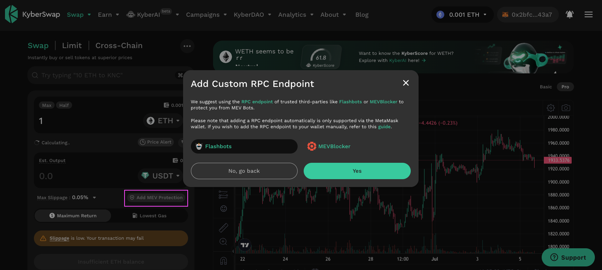
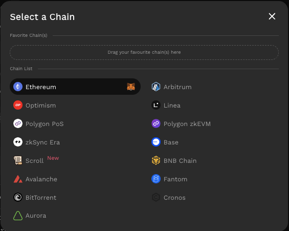

# Switching Networks

## Introduction

KyberSwap supports the trading of more than 20,000 tokens across the majority of the most established DeFi chains. KyberSwap provides seamless access to liquidity across chains directly from the KyberSwap app. For the full list of chains which KyberSwap has been integrated with, you can refer to [Supported Exchanges and Networks](../../../getting-started/supported-exchanges-and-networks.md).

Liquidity Provider Flow

Still deciding on which solution suits you best?&#x20;

* **Overview**: [Earn Yield By Contributing Liquidity](earn-yield-by-contributing-liquidity.md)
* **Detailed comparison**:  [Classic vs Elastic](../../../liquidity-solutions/classic-vs-elastic/)&#x20;

#### Next steps

1. [Connect Your Wallet](connect-your-wallet.md)&#x20;
2. **Switching Networks <-**
3. [Earn Yield By Contributing Liquidity](earn-yield-by-contributing-liquidity.md)

Trader Flow

1. [Connect Your Wallet ](connect-your-wallet.md)
2. **Switching Networks <-**
3. Get Tokens
   * [Get Crypto With Fiat](get-crypto-with-fiat.md)
   * [Bridge Your Tokens](bridge-your-assets-across-multiple-chains.md)
4. Swap Tokens
   * [Instantly Swap At Superior Rates](instantly-swap-at-superior-rates.md)
   * [Swap At Your Preferred Rates](trade-at-your-preferred-rates.md)
   * [Swap Between Different Tokens Across Chains](swap-between-different-tokens-across-chains.md)

## MEV protection on Ethereum

<figure><figcaption>
MEV protected RPCs
</figcaption></figure>

To protect transactions on Ethereum against [MEV strategies](../../../getting-started/foundational-topics/decentralized-finance/maximal-extractable-value-mev.md), KyberSwap provides users with the option to select MEV protected [RPCs](../../../getting-started/foundational-topics/decentralized-technologies/rpc.md) such as [Flashbots ](https://www.flashbots.net/)and [MEVBlocker](https://mevblocker.io/). Transactions via such RPCs will undergo a different transaction ordering process and therefore enjoy protection from multiple MEV strategies.&#x20;

It is important that you understand the pros and cons of using MEV protected RPCs. This will help you make an informed decision as to the suitability of such RPCs with regards to your DeFi goals. MEV protected RPCs will be indicated with the green shield icon.

Flashbots

**What is Flashbots?**

Flashbots Protect [RPC](../../../getting-started/foundational-topics/decentralized-technologies/rpc.md) allows regular users to easily submit their transactions to the Flashbots Auction by using a custom RPC endpoint in their wallet. Everything should be the same for users, except transactions are sent to the Flashbots builder instead of the public mempool.

Key benefits to using the Flashbots RPC endpoint:

* **Frontrunning protection:** your transaction will not be seen by hungry sandwich bots in the public mempool.
*   **No failed transactions:** your transaction will only be included if it doesn't include any reverts, so you don't pay for failed transactions.

    > Note: your transaction could be uncled, emitted to the mempool, and then included on-chain.

Privacy notice: **Flashbots Protect RPC does not track** any kind of user information (i.e. IP, location, etc.). No user information is ever stored or even logged.

Click [here](https://docs.flashbots.net/flashbots-protect/overview) for more information on Flashbots Protect RPC.

**Flashbots on** [**KyberSwap.com**](https://kyberswap.com/swap/ethereum)

KyberSwap provides its user the option to conveniently connect to the Flashbots RPC when trading on the Ethereum mainnet.

MEVBlocker

**What is MEVBlocker?**

MEV Blocker facilitates an auction between a network of “searchers” who are given the opportunity to backrun your transactions. In return, they protect you from frontrunning and sandwich attacks - the nasty types of MEV that exploit Ethereum users every day.

Click [here](https://mevblocker.io/) for more information on MEVBlocker.

**MEVBlocker on** [**KyberSwap.com**](https://kyberswap.com/swap/ethereum)

KyberSwap provides its user the option to conveniently connect to the MEVBlocker RPC when trading on the Ethereum mainnet.

Disclaimer on use of Third-party Integration/Service

For ease of communication, KyberSwap is referred to as "we" in this disclaimer. Any natural persons or other entities who engages in any activities on KyberSwap shall be considered as the user of KyberSwap, and is referred to as "you" in the disclaimer. We hereby remind you of the risks involved in using third-party services (referred to herein as “third-party services”).

1. Your use of any third-party services on KyberSwap is your personal decision and we have no control over it.
2. We are not responsible for the audit of any third-party services, nor do we make any commitments or guarantees on the validity, accuracy, correctness, reliability, quality, stability, completeness and/or timeliness of the technology and information involved in such third-party services and their associated services.
3. You are solely responsible for all outcomes arising from your choice to use the third-party services and their associated services.
4. You shall make your own judgement and evaluation as to whether any third-party services and its associated services comply with the applicable laws, regulations and relevant policy requirements of your jurisdiction. We do not provide any recommendation and opinions on this subject apart from recommending you to strictly abide by the laws and regulations of your jurisdiction.
5. Outcomes and occurrences which arise out of your use of any third-party services, including but not limited to legal issues, contract liability issues, and economic loss issues, shall be resolved between you and the relevant third-party services. We are not responsible for the resolution of any outcomes or disputes arising from your choice to use the third-party services.
6. We will not share any information with any third-party services unless under your consent. Once we receive your consent, you shall be solely responsible for all legal liabilities and disputes resulting from any third-party services access to your personal information and such labilities and disputes shall be resolved between you and the relevant third-party services.

**Our provision of access to third-party services on KyberSwap does not amount to any kind of recommendation, endorsement, or advice to use any third-party services or its associated services.**

## Switching your active network

### **Step 1: Connect your wallet**

Upon [connecting your wallet](connect-your-wallet.md), KyberSwap would have automatically defaulted to the network per your wallet's setting. You can view the active network on the top right of the KyberSwap app.

<figure><figcaption>
KyberSwap connected to Ethereum
</figcaption></figure>

In the example above, KyberSwap has connected to the Ethereum Mainnet as per the MetaMask setting.&#x20;

### **Step 2: Switch networks**

To change the network, you can select the dropdown which will display the full list of chain options for you to choose from. Please refer to [Supported Exchanges And Networks](../../../getting-started/supported-exchanges-and-networks.md) for the full details.

<figure><figcaption>
KyberSwap supported chains
</figcaption></figure>

Select your preferred chain and you should then be prompted by your wallet to confirm the network change.&#x20;


#### MEV protection

KyberSwap enables users to select MEV protected RPCs. Please refer to [MEV protection on Ethereum](selecting-preferred-network.md#mev-protection-on-ethereum) for further details.


If this is your first time connecting to a chain, your wallet provider should display the details of the chain for your verification. The below is an example of adding the Polygon chain and confirming the chain switch using MetaMask.

<figure><figcaption>
Adding a Polygon chain to MetaMask
</figcaption></figure>

<figure><figcaption>
Switch to Polygon chain on Metamask
</figcaption></figure>

Once the switch has been approved, KyberSwap would then be connected to your selected network as can be verified via the active chain displayed in the top right of the KyberSwap app.

<figure><figcaption>
KyberSwap connected to Polygon
</figcaption></figure>

## Bonus: Favourite your most used networks

You can drag-and-drop your most used networks into your favourite chains section for easy access:

<figure><figcaption>
Save your favourite chains
</figcaption></figure>
