# Swap Between Different Tokens Across Chains

## Introduction



KyberSwap has integrated the Squid cross-chain swap and liquidity routing protocol to enable our users to perform cross-chain swaps directly on [https://kyberswap.com/cross-chain](https://kyberswap.com/cross-chain).

More information can be found on our third-party integration [page](../../../reference/third-party-integrations.md).

Trader Flow

1. [Connect Your Wallet ](connect-your-wallet.md)
2. [Switching Networks ](selecting-preferred-network.md)
3. Get Tokens
   * [Get Crypto With Fiat](get-crypto-with-fiat.md)
   * [Bridge Your Tokens](bridge-your-assets-across-multiple-chains.md)
4. Swap Tokens
   * [Instantly Swap At Superior Rates](instantly-swap-at-superior-rates.md)&#x20;
   * [Swap At Your Preferred Rates ](trade-at-your-preferred-rates.md)
   * **Swap Between Tokens On Different Chains <-**

Disclaimer on use of Third-party Integration/Service

For ease of communication, KyberSwap is referred to as "we" in this disclaimer. Any natural persons or other entities who engages in any activities on KyberSwap shall be considered as the user of KyberSwap, and is referred to as "you" in the disclaimer. We hereby remind you of the risks involved in using third-party services (referred to herein as “third-party services”).

1. Your use of any third-party services on KyberSwap is your personal decision and we have no control over it.
2. We are not responsible for the audit of any third-party services, nor do we make any commitments or guarantees on the validity, accuracy, correctness, reliability, quality, stability, completeness and/or timeliness of the technology and information involved in such third-party services and their associated services.
3. You are solely responsible for all outcomes arising from your choice to use the third-party services and their associated services.
4. You shall make your own judgement and evaluation as to whether any third-party services and its associated services comply with the applicable laws, regulations and relevant policy requirements of your jurisdiction. We do not provide any recommendation and opinions on this subject apart from recommending you to strictly abide by the laws and regulations of your jurisdiction.
5. Outcomes and occurrences which arise out of your use of any third-party services, including but not limited to legal issues, contract liability issues, and economic loss issues, shall be resolved between you and the relevant third-party services. We are not responsible for the resolution of any outcomes or disputes arising from your choice to use the third-party services.
6. We will not share any information with any third-party services unless under your consent. Once we receive your consent, you shall be solely responsible for all legal liabilities and disputes resulting from any third-party services access to your personal information and such labilities and disputes shall be resolved between you and the relevant third-party services.

**Our provision of access to third-party services on KyberSwap does not amount to any kind of recommendation, endorsement, or advice to use any third-party services or its associated services.**

## Axelar x Squid

#### What is Axelar?

Axelar delivers secure cross-chain communication for Web3, enabling you to build Interchain dApps that grow beyond a single chain. _Secure_ means Axelar is built on proof-of-stake, the battle-tested approach used by Ethereum, Polygon, Cosmos, and more. _Cross-chain communication_ means you can build a complete experience for your users that lets them interact with any asset, any application, on any chain with one click.

Click [**here**](https://docs.axelar.dev/) for more information on Axelar.

#### What is axlUSDC?

axlUSDC is a wrapped, multi-chain representation of USDC, a dollar stablecoin. For each unit of axlUSDC, there is a unit of USDC locked in an Axelar Gateway on Ethereum. axlUSDC is secured by a dynamic validator set running delegated Proof-of-Stake, which holds key shares in the Axelar Gateways via multi-party cryptography.

Click [**here**](https://docs.axelar.dev/learn/axlusdc) for more information on axlUSDC.

#### What is Squid?

Squid is the cross-chain swap and liquidity routing protocol on [Axelar Network](https://axelar.network/).&#x20;

Squid utilises existing DEXs to swap and send any native token between chains. This can be done via their SDK, Front End or Contracts directly.

Swaps are composable with Axelar's generalised message passing, so Squid can enable _one-click_ transactions between any application and any user, using any asset.&#x20;

Buy NFTs from any marketplace, use multi-chain DeFi, play a game on another chain, all without signing multiple transactions or downloading multiple wallets.

Click [**here**](https://docs.squidrouter.com/) for more information on Squid.

#### Why Axelar x Squid?

<figure>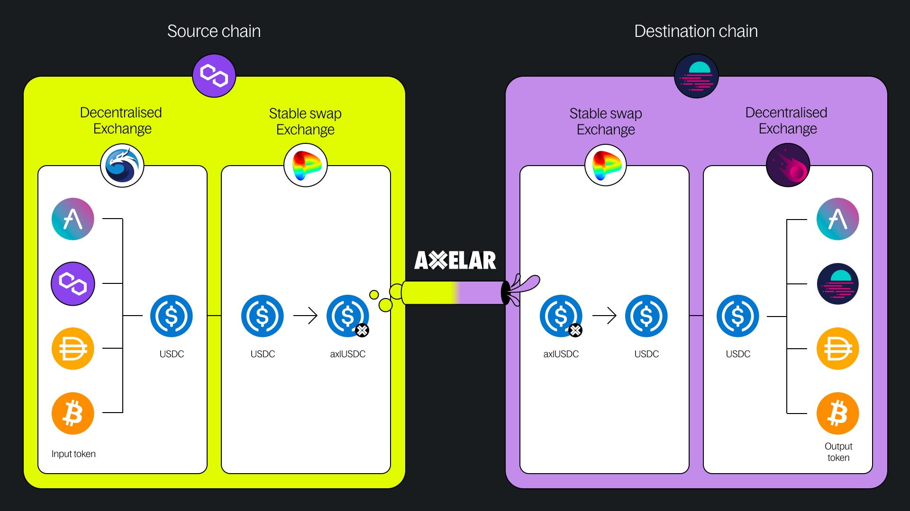<figcaption>
<a href="https://docs.squidrouter.com/architecture/liquidity-model">Squid liquidity model</a>
</figcaption></figure>

By routing transactions through axlUSDC/USDC stable swap pools as well as USDC/native token pools, Squid supports swapping of any token combination across supported chains. Built on top of Axelar, Squid leverages Axelar's general cross-chain messaging abilities as well as its axlUSDC ecosystem to enable secure cross-chain token swaps.

## KyberSwap Integration

<figure>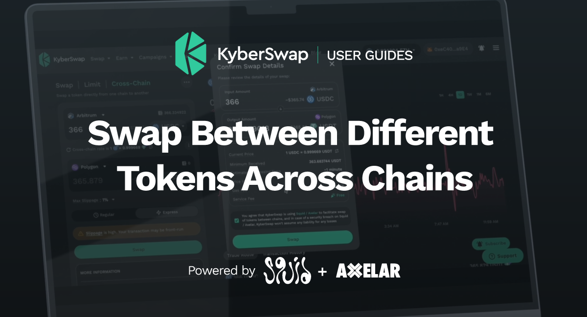<figcaption>
KyberSwap x Squid
</figcaption></figure>

Squid is integrated on KyberSwap through API front end functionality to provide users with an option to conveniently swap tokens across the following supported chains:

* Ethereum (ChainID: 1)
* BSC (ChainID: 56)
* Arbitrum (ChainID: 42161)
* Polygon PoS (ChainID: 137)
* Optimism (ChainID: 10)
* Fantom (ChainID: 250)
* Avalanche (ChainID: 43114)
* Linea (ChainID: 59144)

## Swap tokens across chains

### **Step 1: Connect your wallet**

You can navigate to the cross-chain swap page via the Swap dropdown in the navbar or by directly pasting the following URL in your browser address bar: [https://kyberswap.com/cross-chain](https://kyberswap.com/cross-chain).

[Connect your Web3 wallet to KyberSwap](connect-your-wallet.md) and [select the network](selecting-preferred-network.md) that you would like to use for the swap using the selector at the top right of the Swap page.

<figure>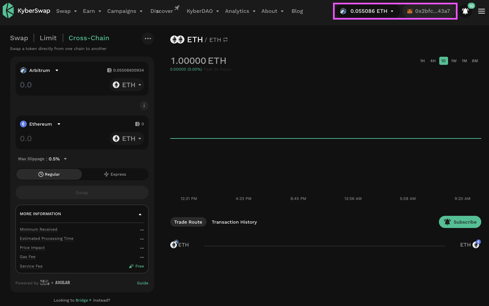<figcaption>
Connected chain and wallet
</figcaption></figure>

### **Step 2:** Specify your chain and tokens to be swapped

As this is a cross-chain swap (i.e. swapping tokens on an origin chain to a different token on a destination chain), you will have to specify the following swap parameters:

* **Origin chain**: The input chain where the input token you are swapping out from is hosted. The origin chain will have to match the connected chain in step 1.
* **Input token**: The token to swap out from the origin chain.
* **Destination chain**: The output chain to receive the output tokens from the swap.&#x20;
* **Output token**: The token to receive on the destination chain. Note that tokens will be sent to the same address on the destination chain (i.e. the address used to send input tokens will be equivalent to the output token address but on a different chain).

<figure>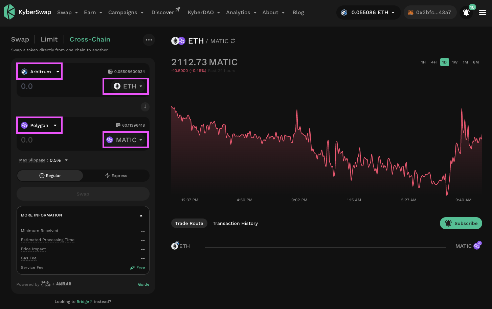<figcaption>
Select chain and token
</figcaption></figure>

### **Step 3**: Configure cross-chain swap amount

Specify the amount you would like to swap by either typing in an amount manually or by clicking the account balance in the input form to swap all tokens in your wallet. An estimate of the amount returned should appear in the quote field.


#### Protecting against slippage

KyberSwap Interface allows users to customize trade parameters which enables greater trade security or even more advanced trade strategies. Refer to [Customizing trade parameters](swap-between-different-tokens-across-chains.md#customizing-trade-parameters) section for more details.


<figure>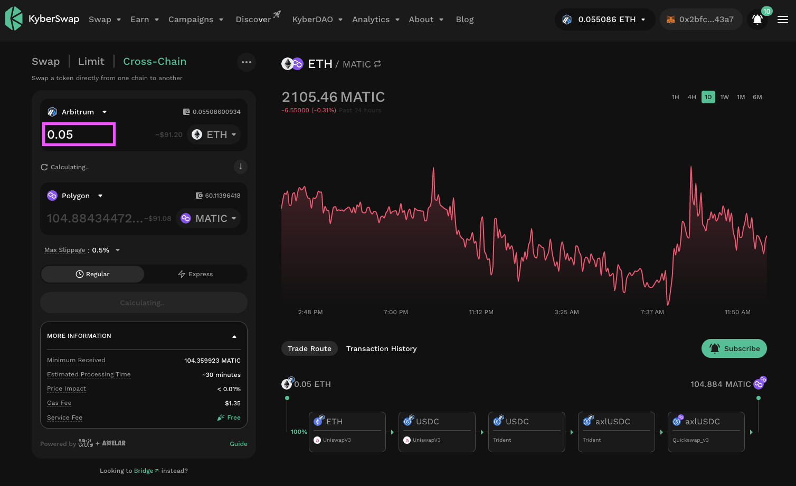<figcaption>
Specify cross-chain swap amount
</figcaption></figure>


[classic-vs-elastic](../../../liquidity-solutions/classic-vs-elastic/)



#### Squid Slippage Handling

As market conditions can change during processing of the cross-chain swap, Axelar implements a safeguard against excessive [slippage](../../../getting-started/foundational-topics/decentralized-finance/slippage.md) by transferring axlUSDC to the trader's wallet if the slippage for the last token swap exceeds the configured slippage. Please refer to [Squid Docs](https://docs.squidrouter.com/architecture/fallback-behaviour-on-failed-transactions) for more information about this fallback behaviour. In such cases, you can view your axlUSDC directly in the KyberSwap UI.

You can refer to [Axelars Docs](https://docs.axelar.dev/dev/reference/mainnet-contract-addresses#assets) for the full list of axlUSDC contract addresses across the supported chains.


### **Step 4**: Approve or permit contract to swap tokens

Approve or Permit KyberSwap to swap the tokens on your behalf. Proceed to Step 5 if token approval/permit is not required.

If this is the first time you are swapping this token on this network using this wallet, the "Swap" button will be greyed out. You will first need to approve/permit the KyberSwap smart contract to spend your tokens before proceeding with the swap.

In the pursuit of greater gas savings for our users, KyberSwap has implemented a permit option for tokens which follow the [ERC-2612](https://eips.ethereum.org/EIPS/eip-2612) standard. In contrast to the basic [ERC20](../../../getting-started/foundational-topics/decentralized-finance/tokens.md#token-standards) token implementation, ERC-2612 enables gasless approvals of smart contract allowances with just a signed message. In other words, approving a token via "Permit" does not require any gas and achieves the same effect as the ERC20 "Approve". If you see a "Permit" button, it means your token is eligible for gasless approvals!


#### Permitable tokens

Please refer to [Permitable Tokens](../../../reference/permitable-tokens.md) for the full list of tokens which have implemented the ERC-2612 standard.




Click on the "Permit \[Token]" button to allow KyberSwap to swap the tokens on your behalf.

<figure><figcaption>
Permit EIP-2612 compatible tokens
</figcaption></figure>

To ensure the safety of your tokens, users will be prompted to sign the transaction for the exact amount in their wallet UI. By signing the permit request, this ensures that KyberSwap is only able to swap the exact number of tokens from your wallet. As long as the accumulated tokens for current or future swaps exceeds this limit, another permit process will be required.

Upon signing the permit, you will then be able to proceed with the swap.

<figure><figcaption>
Note the value in the signature request matches the swap amount
</figcaption></figure>


#### A note on permits

By permitting the swap, you are authorizing KyberSwap to swap the exact amount of tokens specified in the trade for the next 24 hours. This 24 hour deadline is implemented as a safety mechanism to ensure that the permit expires in case a corresponding swap order was not submitted or in the highly improbable event that an order was not filled. A new permit will be required upon the expiration of the current permit.&#x20;

Note that the granting of a permit and the confirmation of a swap ([step 5](swap-between-different-tokens-across-chains.md#step-5-confirm-the-swap)) are separate transactions whereby the latter is unable to proceed without the completion of the former. More importantly, as opposed to permits, swaps will always require gas to be paid as token transfers have to be confirmed by the network. As such, in the case whereby a swap remains in a pending state, it is possible to cancel the swap transaction in your wallet while the permit remains valid until expiry. If a future swap requires more tokens than an existing permit, the user will be requested to sign a new permit.




Click on the "Approve \[Token]" button to allow KyberSwap to swap the tokens on your behalf.

<figure><figcaption>
Approve token
</figcaption></figure>

To ensure the safety of your tokens, KyberSwap will also prompt you to select an allowance limit for the token being approved. By setting an allowance limit, this ensures that KyberSwap is only able to swap the specified number of tokens from your wallet. As long as the accumulated tokens for current or future swaps exceeds this limit, another approve process will be required. You can either set a custom allowance limit or opt for an infinite limit.

Hovering your mouse above the options will also bring up the helpers for your convenience.&#x20;

<figure><figcaption>
Infinite allowance helper
</figcaption></figure>

<figure><figcaption>
Custom allowance helper
</figcaption></figure>

Note that setting a custom allowance limit via the KyberSwap UI will be available for all wallets except for MetaMask and Trust Wallet. For these, users will be prompted to set the allowance limit directly in their wallet UI. This avoids any tx failures caused by amount mismatch.

<figure><figcaption>
Set allowance limit in MetaMask
</figcaption></figure>

Upon confirming an allowance limit, your wallet will then prompt you to sign the transaction request with the relevant gas fees.



### **Step 5**: Confirm the swap

Click the “Swap” button to bring up the confirmation screen.&#x20;



In the case of the standard flow where the cross-chain swap:

* is not expected to result in significant [price impact](../../../getting-started/foundational-topics/decentralized-finance/price-impact.md) or;
* has not been [configured](broken-reference) with an aggressive max [slippage](../../../getting-started/foundational-topics/decentralized-finance/slippage.md);

the confirmation pop-up will be as follows:

<figure>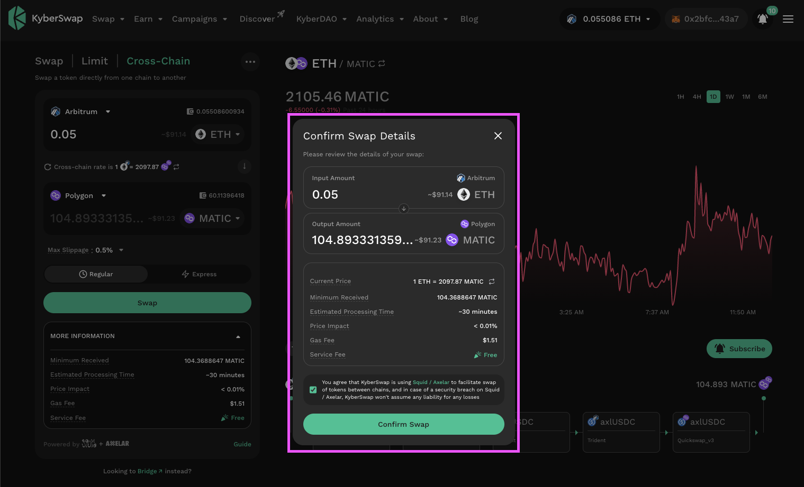<figcaption>
Confirm the swap
</figcaption></figure>



To protect our users from front-running, the confirmation pop-up will display a warning whenever a more aggressive max slippage has been configured for the swap.

<figure>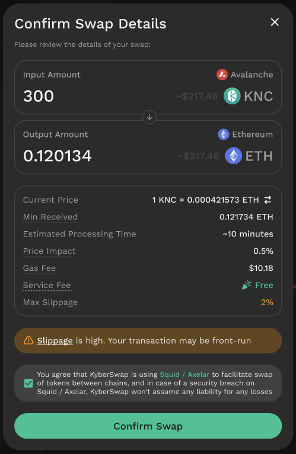<figcaption>
Slippage warning
</figcaption></figure>



Depending on the available liquidity for the tokens being swapped, the expected [price impact ](../../../getting-started/foundational-topics/decentralized-finance/price-impact.md)could be significant. In such cases, the KyberSwap UI will display various warnings depending on the severity of the expected price impact. In the exceptional case that the price impact can not be determined, the swap will be disabled to ensure no negative impact to the trader.

**Price impact is greater than 2% but below 10%**

<figure>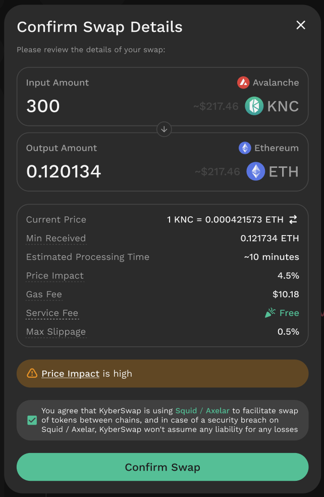<figcaption>
Moderate price impact
</figcaption></figure>

**Price impact is greater than or equal to 10%**

<figure>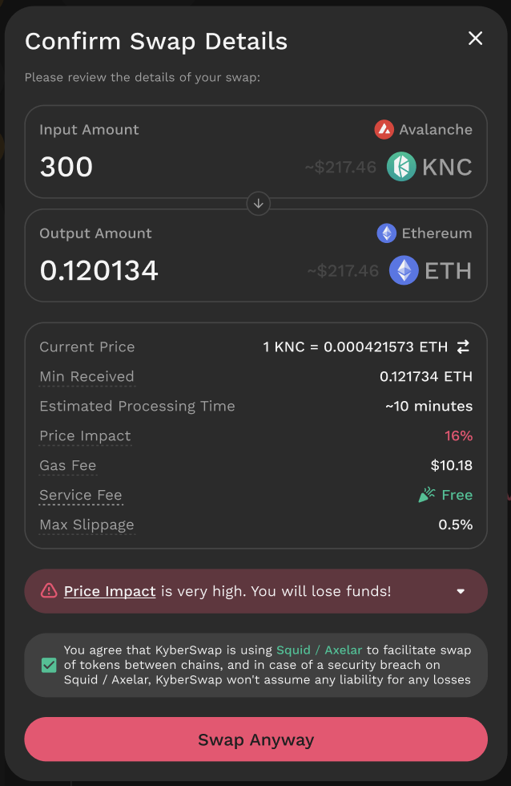<figcaption>
Extremely high price impact
</figcaption></figure>

Note that to proceed with swaps with extremely high price impact, users must enable [Degen Mode](broken-reference).




#### Third-party integration: Squid

Note that in order to proceed with the cross-chain swap, users must acknowledge that the swap will be handled by [Squid x Axelar](swap-between-different-tokens-across-chains.md#axelar-x-squid). As such, users are encouraged to visit [Squid's Docs](https://docs.squidrouter.com/architecture/liquidity-model) to understand how their swaps are being routed and secured across the supported chains.&#x20;


In all the above cases, the confirmation screen will always display a few key pieces of information for review:

* **Output Amount**: Estimated return of output tokens on the destination chain after the swap.
* **Current Price**: The rate at which the swap will happen (this can be inverted using the 🔁 button). Note that the rate is computed based on the response received from the [Squid API](https://docs.squidrouter.com/api/get-a-route).
* **Minimum Received**: This is the minimum amount of output tokens that you will receive on the destination chain from the cross-chain swap. The swap will only be completed if this minimum amount threshold is achieved else the transaction will revert. Refer [Squid API](https://docs.squidrouter.com/api/get-a-route).
* **Estimated Processing Time**: The expected amount of time for the output tokens to be received on the destination chain once the origin chain has executed the cross-chain swap. Refer Squid [Transaction times](https://docs.squidrouter.com/architecture/transaction-times-and-fees#transaction-times) for more information.
* **Price Impact**: The estimated change in the market price due to the size of your transaction.


#### Price impact

Do take note of the resulting price impact of your trade as this will determine the final average price of your trade. Higher trade volumes relative to available liquidity will result in each additional token unit being acquired at a higher price. As such, a higher price impact would result in subpar swap rates.

Please refer to the [Price Impact](../../../getting-started/foundational-topics/decentralized-finance/price-impact.md) page for further details.


* **Gas Fee**: The estimated network fee associated with this transaction. As a cross-chain swap involves transactions occurring across two chains, Squid simplifies the fees by charging a fixed network gas fee for all cross-chain transfers.
* **Service Fee**: Cross-chain swap fees charged by Squid for servicing the swap across-chains. Note that this differs from the gas fees which is required for the blockchain to process your transactions as well as the message relay fees which ensures the security of the cross-chain messages by incentivizing the relayers.


#### Squid x Axelar fees

As an integrator, KyberSwap does not charge any additional fees for cross-chain swaps and have provided the functionality as a convenience feature for our users to quickly swap between tokens on different chains.&#x20;

For more information on the fees that are incurred during a cross-chain swap, please refer to the Squid documentation on [Fees](https://docs.squidrouter.com/architecture/transaction-times-and-fees#fees) and [Gas Fees](https://docs.squidrouter.com/widget/information-for-integrators#gas-fees).&#x20;


Upon confirming the swap in the UI, you will be prompted to sign the transaction in your wallet. In this example, we are using the MetaMask wallet to confirm the swap transaction.

<figure>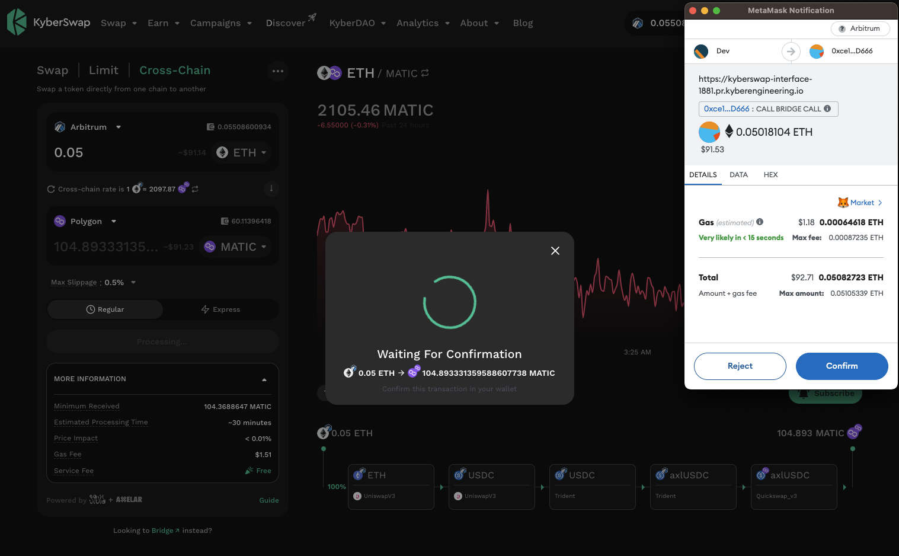<figcaption>
Confirm transaction in wallet
</figcaption></figure>

Once the transaction has been confirmed in the wallet, your swap transaction will then be submitted to the network to be executed. You should see the Transaction Submitted screen appear. You can click on "View Transaction" to see your transaction on the blockchain explorer.&#x20;

Upon the transaction being executed, KyberSwap will also send a notification to alert you that the cross-chain swap has been accepted by the network and is currently being processed.&#x20;

<figure>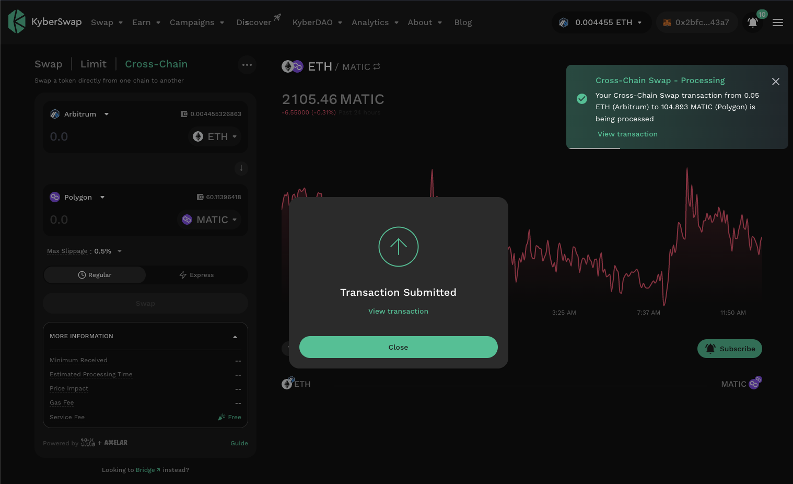<figcaption>
Swap successfully executed on input chain
</figcaption></figure>

As the swap requires value to be moved across different chains, each with their own security mechanisms, the end-to-end transaction will require additional time to be finalized. You can view the status of your cross-chain transaction by bringing up the KyberSwap wallet explorer.

<figure>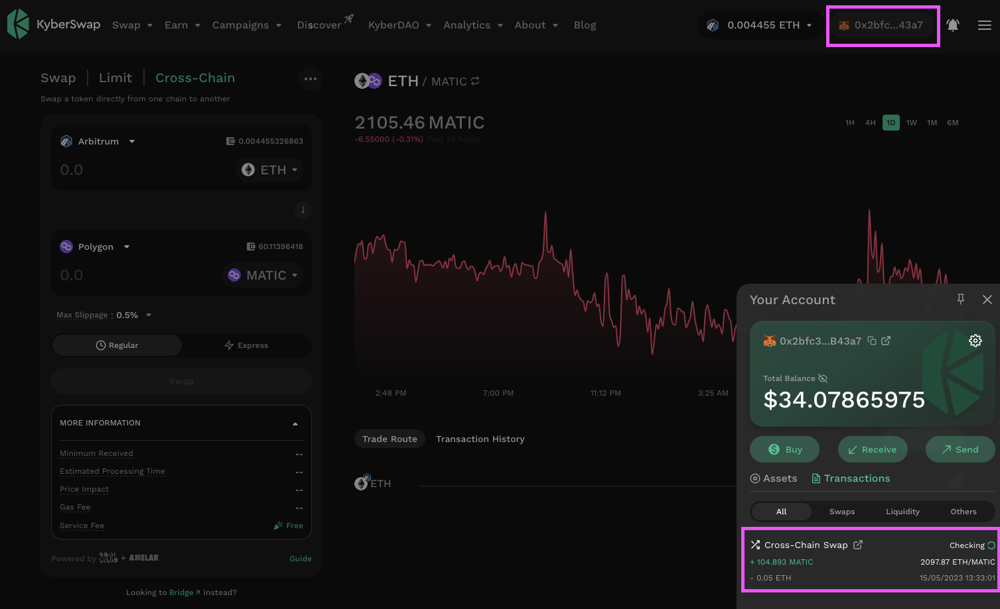<figcaption>
Cross-chain transaction in the KyberSwap wallet explorer
</figcaption></figure>
