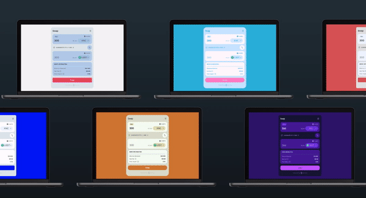
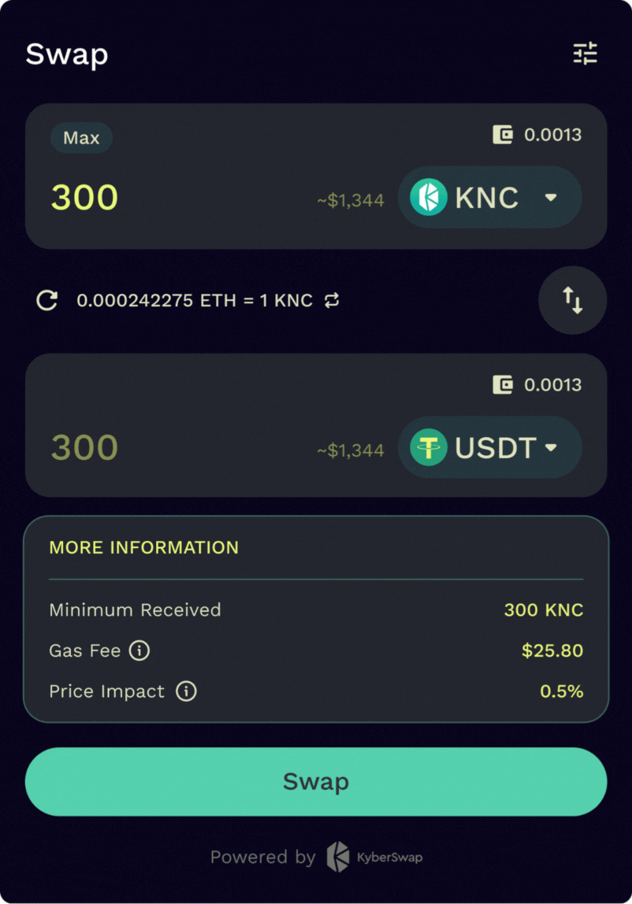

# KyberSwap Widget

## Overview

<figure><figcaption><p>The KyberSwap Widget</p></figcaption></figure>

KyberSwap Widget provides users of your website with a handy tool for token swaps at superior rates. The KyberSwap Widget supports swaps across all Aggregator EVM chains. Please refer to [Supported Exchanges and Networks ](../../getting-started/supported-exchanges-and-networks.md)for the full list of supported chains.

For guides on how to integrate the KyberSwap Widget into your app, you can refer to [Integrating The KyberSwap Widget](developer-guides/integrating-the-kyberswap-widget.md).

## Example use cases

* Building a custom front-end for KyberSwap
* Swapping assets in a Defi application

## Endlessly customizable

You can customize the colors, font, and token list to match your app theme.. Alternatively, you can use our slightly modified sample `theme` to create your own look and feel.

<figure><figcaption><p>Customize KyberSwap Widget</p></figcaption></figure>

```javascript
const theme: Theme = {
  primary: '#1C1C1C',
  secondary: '#0F0F0F',
  dialog: '#313131',
  borderRadius: '20px',
  buttonRadius: '24px',
  stroke: '#505050',
  interactive: '#292929',
  accent: '##28E0B9',
  success: '189470',
  warning: 'FF9901',
  error: 'FF537B',
  text: '#FFFFFF',
  subtext: 'A9A9A9',
  fontFamily: 'Work Sans',
}
```

## Next steps

<details>

<summary>Developers</summary>

* [Explore key Aggregator concepts](../kyberswap-aggregator/concepts/)
* [Get the best rates straight in your app with the KyberSwap widget](broken-reference)

</details>
