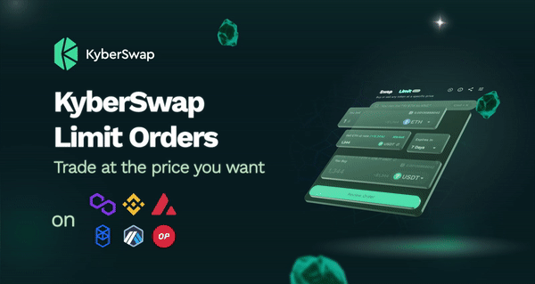

# Limit Order

## Overview

<figure><figcaption>
KyberSwap Limit Order
</figcaption></figure>

KyberSwap Limit Order was created to enable our users to trade on their own terms. This means users are able to predefine their preferred swap rates which are automatically settled on-chain by KyberSwap's network of takers. Create, modify, and cancel limit orders for free with KyberSwap Limit Order.

No more having to monitor the markets around the clock waiting for your target price to be reached. Trades are always settled when prices favor the trader, meaning that users might actually receive more tokens than expected. Critically, users have complete ownership of their assets until a matching trade has been found.


#### Supported tokens and chains

KyberSwap Limit Orders support all [ERC20](../../getting-started/foundational-topics/decentralized-finance/tokens.md#token-standards) tokens and the full list of supported chains can be found on [Supported Exchanges And Networks](../../getting-started/supported-exchanges-and-networks.md).


The [KyberSwap Interface](https://kyberswap.com/limit/) provides a convenient interface to easily create, modify, and track all your orders. KyberSwap has also implemented a suite of Limit Order APIs that enable developers to  seamlessly integrate limit order functionality within their apps.


#### Out of scope

_We will not provide an order book interface for users to visualize the limit order (_[_example_](https://dex.raydium.io/)_). This is something we can consider in the future_


## Aggregator integration

To increase the likelihood that limit orders will be filled, KyberSwap Limit Orders has been integrated as an additional liquidity source on the [KyberSwap Aggregator](../kyberswap-aggregator/). This means that swaps via the Aggregator will also be routed through active limit orders which effectively increases the pool of potential takers for a limit order. By combining solutions, KyberSwap enables our users to discover the best liquidity sources for their trades.

<figure><figcaption>
An Aggregator swap routed via Limit Orders
</figcaption></figure>

## Next Steps

Liquidity Providers

* [Discover how limit orders are routed to your pool](concepts/off-chain-relay.md)

Traders

* [Learn how KyberSwap sources the best liquidity for your swap](concepts/off-chain-relay.md)
* [Trade at your preferred rates on the KyberSwap Interface](../kyberswap-interface/user-guides/trade-at-your-preferred-rates.md)

Developers

* [Explore key Limit Order concepts](concepts/)
* [Create an order using the Limit Order API](limit-order-api-specification/)
* [View Limit Order contract code and addresses](contracts/)

