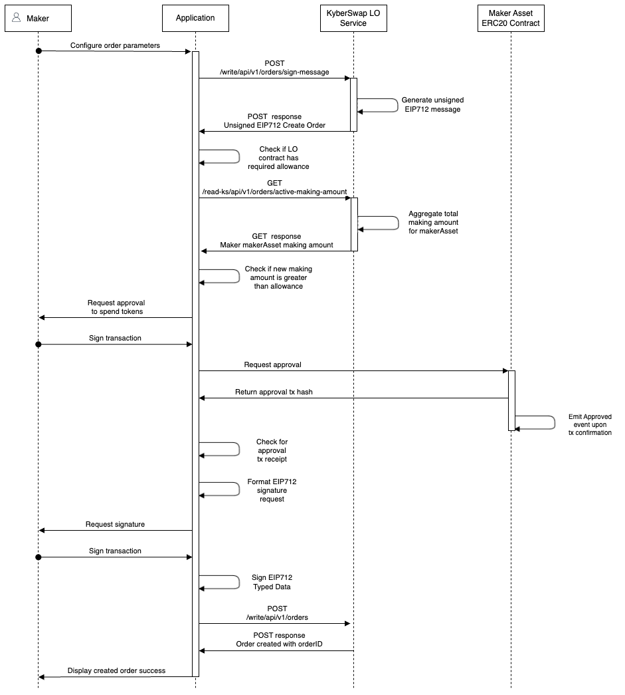
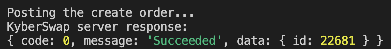

# Create Limit Order

## Overview

KyberSwap Limit Order enables Makers to create orders without incurring gas. To achieve this, signed Maker orders are stored off-chain but settled by the Takers on-chain. By gaslessly signing the off-chain order,  a Maker pre-commits to a limit order whose parameters can't be tampered with ensuring order predicatability and security. Please refer to [Off-Chain Relay, On-Chain Settlement](../concepts/off-chain-relay.md) for a design overview.&#x20;

## Sequence diagram

<figure><figcaption></figcaption></figure>

KyberSwap exposes 2 APIs which Makers will need to call to create a new order:

* [**`/write/api/v1/orders/sign-message`**](../limit-order-api-specification/maker-apis.md#create-order-s): Get the EIP712 create order message to be signed. The response of this API will need to be signed with [Sign Typed Data v4](https://eips.ethereum.org/EIPS/eip-712) before submitting create order request below.
* [**`/write/api/v1/orders`**](../limit-order-api-specification/maker-apis.md#create-order-s): Create new order(s) by sending in order params which includes the signed EIP712 message.

In addition to the above, Makers are also able to query their active making amount to aid with token approvals:

* [**`/read-ks/api/v1/orders/active-making-amount`**](../limit-order-api-specification/maker-apis.md#read-ks-api-v1-orders-active-making-amount): The aggregated making amount for the Maker given a specific token.

## TypeScript Example


**Limit Order API Demo**

The code snippets in the guide below have been extracted from our demo GitHub repo which showcases the full end-to-end Limit Order operations in a TypeScript environment.




### Step 1: Get the unsigned EIP712 Create Order message

To create a new limit order, the Maker must first specify the order parameters to be sent to the KyberSwap LO Service via the POST request body:

```typescript
const requestBody: CreateOrderUnsignedBody = {
    chainId: ChainId.MATIC.toString(),
    makerAsset: makerAsset.address, // USDC
    takerAsset: takerAsset.address, // KNC
    maker: signerAddress,
    allowedSenders: [signerAddress], // Included so that only our account can fill this order
    makingAmount: "10000", // 0.01 USDC
    takingAmount: "20000000000000000", // 0.02 KNC
    expiredAt: Math.floor(Date.now() / 1000) + 60 * 60 // 60mins
};
```

[postCreateOrdersUnsigned.ts](https://github.com/KyberNetwork/ks-limit-order-API-demo/blob/e34660faf165d6c6b5763327b6e8e34bf8bc9e01/src/operations/maker/postCreateOrdersUnsigned.ts#L27)

As part of the order configuration, note that the `makingAmount` and `takingAmount` are denominated in wei units and dependent on the [decimals](https://docs.openzeppelin.com/contracts/2.x/erc20#a-note-on-decimals) configured in the asset's ERC20 contract. The `allowedSenders` parameter is optional but have been included for the purposes of this demo so that only our controlled address can fill the created order.

The `makerAsset` and `takerAsset` are defined in the [`constants.ts`](https://github.com/KyberNetwork/ks-limit-order-API-demo/blob/main/src/libs/constants.ts) file to enable convenient reuse across various operations.

Full details for each parameter can be found via the [Get Unsigned Create Order Message API specification](../limit-order-api-specification/maker-apis.md#write-api-v1-orders-sign-message). Upon posting the above request body to `/write/api/v1/orders/sign-message`, the KyberSwap LO Service will return an unsigned [EIP712](https://eips.ethereum.org/EIPS/eip-712) Create Order message.

### Step 2: Check Limit Order contract spending allowance

Before signing the order creation message, we will first need to ensure that the LO smart contract has sufficient [allowance to spend the Maker's ERC20 token](https://docs.openzeppelin.com/contracts/2.x/api/token/erc20#IERC20-allowance-address-address-). This ensures that when a Taker fills the order, the LO smart contract has the necessary approvals to transfer the specified `makerAsset` amount from the Maker's wallet.&#x20;


**KyberSwap Limit Order Contract Addresses**

Please refer to [Limit Order Contract Addresses](https://docs.kyberswap.com/kyberswap-solutions/limit-order/contracts/limit-order-contract-addresses) for the exact addresses for KyberSwap Limit Order for each supported chain.


To get the Maker's current making amount for a specific token, KyberSwap exposes a `/read-ks/api/v1/orders/active-making-amount` API:

```typescript
const targetPathConfig = {
    params: {
        chainId: ChainId.MATIC,
        makerAsset: makerAsset.address,
        maker: signerAddress
    }
};
```

[getMakerActiveAmount.ts](https://github.com/KyberNetwork/ks-limit-order-API-demo/blob/e34660faf165d6c6b5763327b6e8e34bf8bc9e01/src/operations/maker/getMakerActiveAmount.ts#L12C2-L12C2)

Note that the new order making amount will have to be added to the current making amount. In other words, when creating a new order, the **KyberSwap service checks that it has sufficient allowance across all open Maker orders**.

```typescript
const currentMakingAmount = await getMakerActiveAmount();
const newMakingAmount = Number(currentMakingAmount) + Number(unsignedOrderReqBody.makingAmount);
```

[postCreateOrder.ts](https://github.com/KyberNetwork/ks-limit-order-API-demo/blob/e34660faf165d6c6b5763327b6e8e34bf8bc9e01/src/operations/maker/postCreateOrder.ts#L25)

If there is insufficient spending allowance, we can then request for a higher allowance via the `makerAsset` ERC20 token contract using our `getTokenApproval()` helper function:

```typescript
if (Number(limitOrderContractAllowance) < spendingAmount) {
    console.log(`Insufficient allowance, getting approval for ${await tokenContract.symbol()}...`);
    try {
        // Call the ERC20 approve method
        const approvalTx = await tokenContract.approve(
            spenderAddress, 
            BigInt(spendingAmount), 
            {maxFeePerGas: 100000000000, maxPriorityFeePerGas: 100000000000}
            );

        // Wait for the approve tx to be executed
        const approvalTxReceipt = await approvalTx.wait();
        console.log(`Approve tx executed with hash: ${approvalTxReceipt?.hash}`);

    } catch(error) {
        console.log(error);
    }
};    
```

[approval.ts](https://github.com/KyberNetwork/ks-limit-order-API-demo/blob/e34660faf165d6c6b5763327b6e8e34bf8bc9e01/src/libs/approval.ts#L21)

### Step 3: Sign the EIP712 Create Order message

Once we have the necessary allowances in place, we can then go ahead and request the signature from the Maker:

```typescript
const signature = await signer.signTypedData(
    unsignedOrderReturnData.domain,
    { Order: unsignedOrderReturnData.types.Order },
    unsignedOrderReturnData.message
);
```

[postCreateOrder.ts](https://github.com/KyberNetwork/ks-limit-order-API-demo/blob/e34660faf165d6c6b5763327b6e8e34bf8bc9e01/src/operations/maker/postCreateOrder.ts#L39)


**EIP712 Sign Typed Data**

[EIP712 ](https://eips.ethereum.org/EIPS/eip-712)exposes human-readable data for user's to view prior to signing the transaction.

Our example assumes a pure Node.js implementation and therefore uses the ethers.js [`signTypedData()`](https://docs.ethers.org/v6/api/providers/#Signer-signTypedData) function to sign the EIP712 message. **Note that the `type` object used is per the `primaryType` that is returned by the KyberSwap LO Service.**

For further information on how to implement this from the browser UI, you can also take reference from MetaMask's [SignTypedData V4](https://docs.metamask.io/guide/signing-data.html#signtypeddata-v4).


### Step 4: Format the create order request body

With the maker-signed transaction, we can then format the request body according to the `/write/api/v1/orders` specs:

```typescript
const requestBody: CreateOrderSignedBody = {
    ...unsignedOrderReqBody,
    salt: unsignedOrderReturnData.message.salt,
    signature: signature
};
```

[postCreateOrder.ts](https://github.com/KyberNetwork/ks-limit-order-API-demo/blob/e34660faf165d6c6b5763327b6e8e34bf8bc9e01/src/operations/maker/postCreateOrder.ts#L46)

Note that apart from appending the signature to the existing request body from our earlier API call, we are also extracting the salt that was returned.

### Step 5: Post the create order

We are now ready to call the `/write/api/v1/orders` API with the formatted create order message:

```typescript
const {data} = await axios.post(
    LimitOrderDomain+targetPath,
    requestBody
);
```

[postCreateOrder.ts](https://github.com/KyberNetwork/ks-limit-order-API-demo/blob/e34660faf165d6c6b5763327b6e8e34bf8bc9e01/src/operations/maker/postCreateOrder.ts#L54)

Note that the KyberSwap Limit Order domain is stored under [`constants.ts`](https://github.com/KyberNetwork/ks-limit-order-API-demo/blob/main/src/libs/constants.ts) for easy retrieval across various API operations.

Once the KyberSwap LO service receives the creation order, a new off-chain order will be created in it's orderbook from which our network of Takers will be able to query. The created `orderId` will also be returned as part of the response values from the `/write/api/v1/orders` API.

<figure><figcaption><p>Create order success response</p></figcaption></figure>
