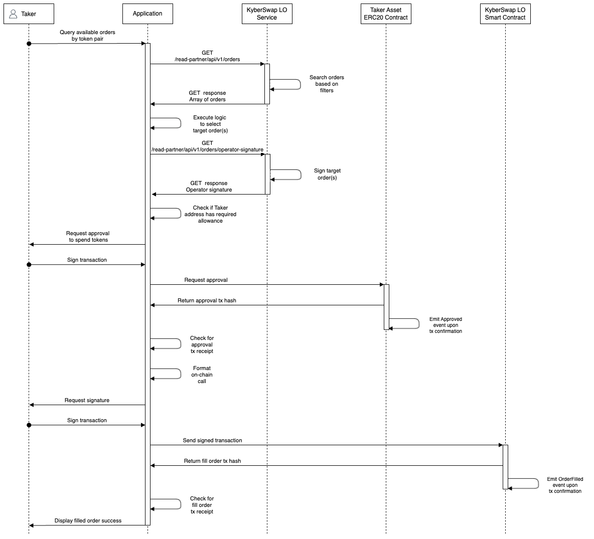
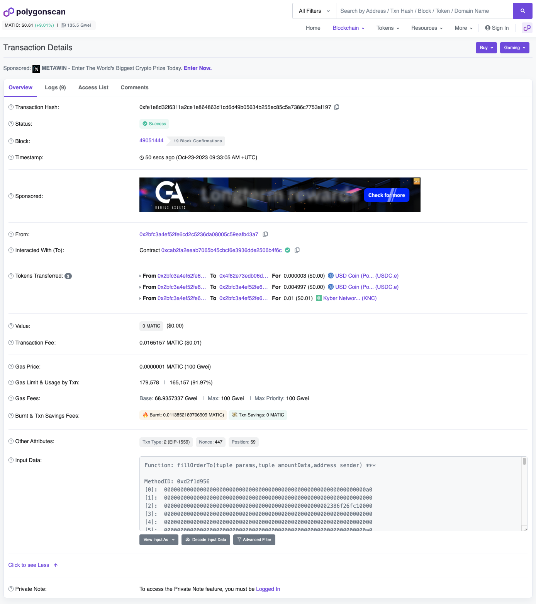

# Fill Limit Order

## Overview

Takers are able to fill any signed Maker order within the KyberSwap Limit Order order books by executing the fill order on-chain. By utilizing KyberSwap Limit Order APIs, Takers gain access to slippage-free liquidity sources which are secured via on-chain settlement.

Please refer to [Off-Chain Relay, On-Chain Settlement](../concepts/off-chain-relay.md) for more detail on this design.

<details>

<summary>Limit Order protocol fees</summary>

To support the continued development of the Limit Orders feature, KyberSwap will charge variable taker fees for orders filled on the following chains:

* Ethereum (ChainID: 1)
* BSC (ChainID: 56)
* Arbitrum (ChainID: 42161)
* Polygon PoS (ChainID: 137)
* Optimism (ChainID: 10)
* Avalanche (ChainID: 43114)
* Fantom (ChainID: 250)

The fees charged will be according to the most exotic token in the trading pair. The section below lists the fees whereby the highest fee category will apply based on the classification of the input and output tokens. There are 4 categories of tokens with an additional special category for trades involving KNC.

**Super stable (0.01%)**

* Ethereum (ChainID: 1)
  * USDC: [`0xa0b86991c6218b36c1d19d4a2e9eb0ce3606eb48`](https://etherscan.io/address/0xa0b86991c6218b36c1d19d4a2e9eb0ce3606eb48)
  * USDT: [`0xdac17f958d2ee523a2206206994597c13d831ec7`](https://etherscan.io/address/0xdac17f958d2ee523a2206206994597c13d831ec7)
  * DAI: [`0x6b175474e89094c44da98b954eedeac495271d0f`](https://etherscan.io/address/0x6b175474e89094c44da98b954eedeac495271d0f)
* BSC (ChainID: 56)
  * USDT: [`0x55d398326f99059ff775485246999027b3197955`](https://bscscan.com/address/0x55d398326f99059ff775485246999027b3197955)
  * USDC: [`0x8ac76a51cc950d9822d68b83fe1ad97b32cd580d`](https://bscscan.com/address/0x8ac76a51cc950d9822d68b83fe1ad97b32cd580d)
  * DAI: [`0x1af3f329e8be154074d8769d1ffa4ee058b1dbc3`](https://bscscan.com/address/0x1af3f329e8be154074d8769d1ffa4ee058b1dbc3)&#x20;
  * BUSD: [`0xe9e7cea3dedca5984780bafc599bd69add087d56`](https://bscscan.com/address/0xe9e7cea3dedca5984780bafc599bd69add087d56)
* Arbitrum (ChainID: 42161)
  * USDT: [`0xFd086bC7CD5C481DCC9C85ebE478A1C0b69FCbb9`](https://arbiscan.io/address/0xFd086bC7CD5C481DCC9C85ebE478A1C0b69FCbb9)
  * USDC: [`0xaf88d065e77c8cC2239327C5EDb3A432268e5831`](https://arbiscan.io/address/0xaf88d065e77c8cC2239327C5EDb3A432268e5831)
  * DAI: [`0xDA10009cBd5D07dd0CeCc66161FC93D7c9000da1`](https://arbiscan.io/address/0xDA10009cBd5D07dd0CeCc66161FC93D7c9000da1)
* Polygon (ChainID: 137)
  * USDT: [`0xc2132d05d31c914a87c6611c10748aeb04b58e8f`](https://polygonscan.com/address/0xc2132d05d31c914a87c6611c10748aeb04b58e8f)
  * USDC: [`0x2791bca1f2de4661ed88a30c99a7a9449aa84174`](https://polygonscan.com/address/0x2791bca1f2de4661ed88a30c99a7a9449aa84174)
  * DAI: [`0x8f3Cf7ad23Cd3CaDbD9735AFf958023239c6A063`](https://polygonscan.com/address/0x8f3Cf7ad23Cd3CaDbD9735AFf958023239c6A063)
* Optimism (ChainID: 10)
  * USDT: [`0x94b008aa00579c1307b0ef2c499ad98a8ce58e58`](https://optimistic.etherscan.io/address/0x94b008aa00579c1307b0ef2c499ad98a8ce58e58)
  * USDC: [`0x7f5c764cbc14f9669b88837ca1490cca17c31607`](https://optimistic.etherscan.io/address/0x7f5c764cbc14f9669b88837ca1490cca17c31607)
  * DAI: [`0xda10009cbd5d07dd0cecc66161fc93d7c9000da1`](https://optimistic.etherscan.io/address/0xda10009cbd5d07dd0cecc66161fc93d7c9000da1)
* Avalanche (ChainID: 43114)
  * USDT: [`0x9702230A8Ea53601f5cD2dc00fDBc13d4dF4A8c7`](https://snowtrace.io/address/0x9702230A8Ea53601f5cD2dc00fDBc13d4dF4A8c7)
  * USDC: [`0xB97EF9Ef8734C71904D8002F8b6Bc66Dd9c48a6E`](https://snowtrace.io/address/0xB97EF9Ef8734C71904D8002F8b6Bc66Dd9c48a6E)
  * DAI.e: [`0xd586E7F844cEa2F87f50152665BCbc2C279D8d70`](https://snowtrace.io/address/0xd586E7F844cEa2F87f50152665BCbc2C279D8d70)
  * USDT.e: [`0xc7198437980c041c805A1EDcbA50c1Ce5db95118`](https://snowtrace.io/address/0xc7198437980c041c805A1EDcbA50c1Ce5db95118)
  * USDC.e: [`0xA7D7079b0FEaD91F3e65f86E8915Cb59c1a4C664`](https://snowtrace.io/address/0xA7D7079b0FEaD91F3e65f86E8915Cb59c1a4C664)
* Fantom (ChainID: 250)
  * fUSDT: [`0x049d68029688eabf473097a2fc38ef61633a3c7a`](https://ftmscan.com/address/0x049d68029688eabf473097a2fc38ef61633a3c7a)
  * USDC: [`0x04068DA6C83AFCFA0e13ba15A6696662335D5B75`](https://ftmscan.com/address/0x04068DA6C83AFCFA0e13ba15A6696662335D5B75)
  * DAI: [`0x8D11eC38a3EB5E956B052f67Da8Bdc9bef8Abf3E`](https://ftmscan.com/address/0x8D11eC38a3EB5E956B052f67Da8Bdc9bef8Abf3E)

**Stable (0.02%)**

* Ethereum (ChainID: 1)
  * MAI: [`0x8D6CeBD76f18E1558D4DB88138e2DeFB3909fAD6`](https://etherscan.io/address/0x8D6CeBD76f18E1558D4DB88138e2DeFB3909fAD6)
  * BOB: [`0xB0B195aEFA3650A6908f15CdaC7D92F8a5791B0B`](https://etherscan.io/address/0xB0B195aEFA3650A6908f15CdaC7D92F8a5791B0B)
  * MIM: [`0x99D8a9C45b2ecA8864373A26D1459e3Dff1e17F3`](https://etherscan.io/address/0x99D8a9C45b2ecA8864373A26D1459e3Dff1e17F3)
* BSC (ChainID: 56)
  * MAI: [`0x3F56e0c36d275367b8C502090EDF38289b3dEa0d`](https://bscscan.com/address/0x3F56e0c36d275367b8C502090EDF38289b3dEa0d)
  * BOB: [`0xB0B195aEFA3650A6908f15CdaC7D92F8a5791B0B`](https://bscscan.com/address/0xB0B195aEFA3650A6908f15CdaC7D92F8a5791B0B)
  * MIM: [`0xfE19F0B51438fd612f6FD59C1dbB3eA319f433Ba`](https://bscscan.com/address/0xfE19F0B51438fd612f6FD59C1dbB3eA319f433Ba)
* Arbitrum (ChainID: 42161)
  * MAI: [`0x3F56e0c36d275367b8C502090EDF38289b3dEa0d`](https://arbiscan.io/address/0x3F56e0c36d275367b8C502090EDF38289b3dEa0d)
  * MIM: [`0xFEa7a6a0B346362BF88A9e4A88416B77a57D6c2A`](https://arbiscan.io/address/0xFEa7a6a0B346362BF88A9e4A88416B77a57D6c2A)
* Polygon (ChainID: 137)
  * MAI: [`0xa3Fa99A148fA48D14Ed51d610c367C61876997F1`](https://polygonscan.com/address/0xa3Fa99A148fA48D14Ed51d610c367C61876997F1)
  * BOB: [`0xB0B195aEFA3650A6908f15CdaC7D92F8a5791B0B`](https://polygonscan.com/address/0xB0B195aEFA3650A6908f15CdaC7D92F8a5791B0B)
  * MIM: [`0x49a0400587A7F65072c87c4910449fDcC5c47242`](https://polygonscan.com/address/0x49a0400587A7F65072c87c4910449fDcC5c47242)
* Optimism (ChainID: 10)
  * MAI: [`0xdFA46478F9e5EA86d57387849598dbFB2e964b02`](https://optimistic.etherscan.io/address/0xdFA46478F9e5EA86d57387849598dbFB2e964b02)
  * BOB: [`0xB0B195aEFA3650A6908f15CdaC7D92F8a5791B0B`](https://optimistic.etherscan.io/address/0xB0B195aEFA3650A6908f15CdaC7D92F8a5791B0B)
* Avalanche (ChainID: 43114)
  * MAI: [`0x5c49b268c9841AFF1Cc3B0a418ff5c3442eE3F3b`](https://snowtrace.io/address/0x5c49b268c9841AFF1Cc3B0a418ff5c3442eE3F3b)
  * YUSD: [`0x111111111111ed1D73f860F57b2798b683f2d325`](https://snowtrace.io/address/0x111111111111ed1D73f860F57b2798b683f2d325)
  * MIM: [`0x130966628846BFd36ff31a822705796e8cb8C18D`](https://snowtrace.io/address/0x130966628846BFd36ff31a822705796e8cb8C18D)
* Fantom (ChainID: 250)
  * MAI: [`0xfB98B335551a418cD0737375a2ea0ded62Ea213b`](https://ftmscan.com/address/0xfB98B335551a418cD0737375a2ea0ded62Ea213b)
  * MIM: [`0x82f0B8B456c1A451378467398982d4834b6829c1`](https://ftmscan.com/address/0x82f0B8B456c1A451378467398982d4834b6829c1)

**Normal (0.1%)**

* Top 200 tokens by market cap (identified via multiple on and off-chain services), excluding tokens under the super stable, stable, and KNC categories.

**Exotic (0.3%)**

* All remaining tokens not covered in the super stable, stable, normal, and KNC categories.

**KNC (0.05%)**

* Trades to and from KNC will be charged a flat 0.05% fee.

</details>

## Sequence Diagram

<figure><figcaption></figcaption></figure>

KyberSwap exposes 2 API options for Takers looking to fill orders on-chain:

* [**`/read-ks/api/v1/encode/fill-order-to`**](../limit-order-api-specification/taker-apis.md#read-ks-api-v1-encode-fill-order-to): Encode the fill order data to be sent on-chain. This API can be used to fill a single order.
* [**`/read-ks/api/v1/encode/fill-batch-orders-to`**](../limit-order-api-specification/taker-apis.md#read-ks-api-v1-encode-fill-batch-orders-to): Encode the fill batch order data to be sent on-chain. This API can be used to fill multiple orders.

In order to fill an order, Takers will first have to request an Operator signature via:

* [**`/read-partner/api/v1/orders/operator-signature`**](../limit-order-api-specification/taker-apis.md#read-partner-api-v1-orders-operator-signature): Get the KyberSwap Operator to sign the target orders so that it can be filled.

In addition to the above, Takers are also able to query active or open order(s) to aid with filtering orders to fill:

* [**`/read-partner/api/v1/orders`**](../limit-order-api-specification/taker-apis.md#read-partner-api-v1-orders): Returns orders for the queried token pair sorted by best rates in descending order.

## TypeScript Example


**Limit Order API Demo**

The code snippets in the guide below have been extracted from our demo GitHub repo which showcases the full end-to-end Limit Order operations in a TypeScript environment.




### Step 1: Get orders by best rates


**Active/Open Orders**

To proceed with this guide, users must have created an Active or Open Limit Order. Please refer to the [Create Limit Order developer guide](create-limit-order.md) for instructions on how to achieve this programmatically.


We can use the `/read-partner/api/v1/orders` to get the list of "active" or "open" orders by token pair:

```typescript
const targetPathConfig = {
    params: {
        chainId: ChainId.MATIC,
        makerAsset: makerAsset.address, // USDC
        takerAsset: takerAsset.address  // KNC  
    }
};
```

[getOrders.ts](https://github.com/KyberNetwork/ks-limit-order-API-demo/blob/e34660faf165d6c6b5763327b6e8e34bf8bc9e01/src/operations/taker/getOrders.ts#L9)

Note that the returned orders will be sorted according to the [best rates](../limit-order-api-specification/taker-apis.md#rates-calculation) in descending order. The `makerAsset` and `takerAsset` are defined in the [`constants.ts`](https://github.com/KyberNetwork/ks-limit-order-API-demo/blob/main/src/libs/constants.ts) file to enable convenient reuse across various operations.

### Step 2: Get the Operator signature for the target order

For the purposes of this guide, we will be taking the first returned order to fill:

```typescript
const orders = await getOrders();
const targetOrders = orders.filter(order => 
    order.maker.toLowerCase() == signerAddress.toLowerCase() &&
    order.makerAsset.toLowerCase() == makerAsset.address.toLowerCase() &&
    order.takerAsset.toLowerCase() == takerAsset.address.toLowerCase()
);
const targetOrderId = Number(targetOrders[0].id);
```

[getOperatorSignature.ts](https://github.com/KyberNetwork/ks-limit-order-API-demo/blob/e34660faf165d6c6b5763327b6e8e34bf8bc9e01/src/operations/taker/getOperatorSignature.ts#L20)

With our target `orderId`, we can then request for the Operator signature by calling `/read-partner/api/v1/orders/operator-signature` with the following parameters:

```typescript
const targetPathConfig = {
    params: {
        chainId: ChainId.MATIC.toString(),
        orderIds: targetOrderId
    }
};
```

[getOperatorSignature.ts](https://github.com/KyberNetwork/ks-limit-order-API-demo/blob/e34660faf165d6c6b5763327b6e8e34bf8bc9e01/src/operations/taker/getOperatorSignature.ts#L29)

For each `orderId` requested, the KyberSwap LO Service will return an `operatorSignature` which will be required as part of the fill order transaction.

### Step 3: Check Limit Order contract spending allowance

Before executing the fill order, we will first need to ensure that the LO smart contract has sufficient [allowance to spend the taker's ERC20 token](https://docs.openzeppelin.com/contracts/2.x/api/token/erc20#IERC20-allowance-address-address-). In this example, we will be filling half of the Maker order requested `takingAmount`:

```typescript
const orders = await getOrders();
const targetOrder = orders.filter(order => order.id == targetOrderId.toString());
const takingAmount = Number(targetOrder[0].takingAmount)/2;
```

[postFillOrder.ts](https://github.com/KyberNetwork/ks-limit-order-API-demo/blob/e34660faf165d6c6b5763327b6e8e34bf8bc9e01/src/operations/taker/postFillOrder.ts#L29)

If there is insufficient spending allowance, we can then request for a higher allowance via the `takerAsset` ERC20 token contract using our `getTokenApproval()` helper function:

```typescript
if (Number(limitOrderContractAllowance) < spendingAmount) {
    console.log(`Insufficient allowance, getting approval for ${await tokenContract.symbol()}...`);
    try {
        // Call the ERC20 approve method
        const approvalTx = await tokenContract.approve(
            spenderAddress, 
            BigInt(spendingAmount), 
            {maxFeePerGas: 100000000000, maxPriorityFeePerGas: 100000000000}
            );

        // Wait for the approve tx to be executed
        const approvalTxReceipt = await approvalTx.wait();
        console.log(`Approve tx executed with hash: ${approvalTxReceipt?.hash}`);

    } catch(error) {
        console.log(error);
    }
};    
```

[approval.ts](https://github.com/KyberNetwork/ks-limit-order-API-demo/blob/e34660faf165d6c6b5763327b6e8e34bf8bc9e01/src/libs/approval.ts#L21)

### Step 4: Format the fill order request body


**Filling Batch Orders**

For simplicity, the example below fills a single order using `/read-ks/api/v1/encode/fill-order-to`. KyberSwap Limit Orders exposes another `/read-ks/api/v1/encode/fill-batch-orders-to` API which enables Takers to get the encoded data to batch fill orders.&#x20;

By filling multiple orders in a single on-chain tx, batch fill orders are more efficient. The only difference between the 2 APIs is the formatting of `orderIds` and `operatorSignatures` when preparing the requestBody for the respective API.

The Fill Batch Orders API requires the order of the `orderIds` array to match their corresponding `operatorSignatures`. Full code example can be found on [postFillBatchOrders.ts](https://github.com/KyberNetwork/ks-limit-order-API-demo/blob/main/src/operations/taker/postFillBatchOrders.ts).


To get the encoded data, we will then need to format the `/read-ks/api/v1/encode/fill-order-to` request body. Note the `operatorSignature` that was returned in step 2:

```typescript
const requestBody: FillOrderBody = {
    orderId: Number(targetOrderId),
    takingAmount: takingAmount.toString(),
    thresholdAmount: '0',
    target: signerAddress,
    operatorSignature: operatorSignature[0].operatorSignature
};
```

[postFillOrder.ts](https://github.com/KyberNetwork/ks-limit-order-API-demo/blob/e34660faf165d6c6b5763327b6e8e34bf8bc9e01/src/operations/taker/postFillOrder.ts#L46)

### Step 5: Post the encode data request

With the fill order prepared, we can then request the encoded data via `/read-ks/api/v1/encode/fill-order-to`:

```typescript
const {data} = await axios.post(
    LimitOrderDomain+targetPath,
    requestBody
);
```

This will return the fill order encoded data which will be used as the calldata when executing the transaction on-chain.

### Step 6: Execute the fill order transaction on-chain

To execute the transaction, we can use our [ethers.js signer instance](https://docs.ethers.org/v6/api/providers/#ContractRunner-sendTransaction) to send the transaction with the required gas fees:

```typescript
const fillOrderTx = await signer.sendTransaction({
    data: data.data.encodedData,
    to: limitOrderContract,
    from: signerAddress,
    maxFeePerGas: 100000000000,
    maxPriorityFeePerGas: 100000000000
});
```

[postFillOrder.ts](https://github.com/KyberNetwork/ks-limit-order-API-demo/blob/e34660faf165d6c6b5763327b6e8e34bf8bc9e01/src/operations/taker/postFillOrder.ts#L63)

A transaction hash will be returned once the cancel order has been executed. You can copy this hash into a scanner (i.e. [PolygonScan](https://polygonscan.com/)) and see that your transaction has been successfully completed by the network.

<figure><figcaption><p><a href="https://polygonscan.com/tx/0xfe1e8d32f6311a2ce1e864863d1cd6d49b05634b255ec85c5a7386c7753af197">Sample fill order on Polygon</a></p></figcaption></figure>
