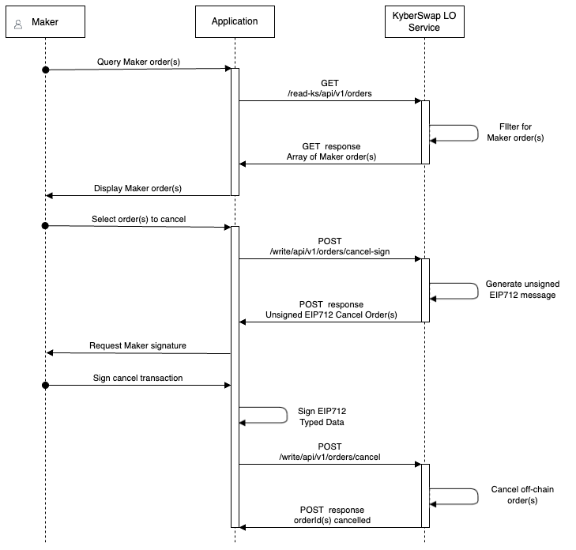

# Gasless Cancel

## Overview

In addition to [gasless order creation](create-limit-order.md), KyberSwap Limit Order Makers have the option to cancel their orders without incurring gas. As Taker order fulfilment requires both a Maker and KyberSwap Operator signature, Makers are able to cancel their orders gaslessly by instructing the KyberSwap Operator to cancel their orders.&#x20;

Please refer to [Gasless Cancellation](../concepts/gasless-cancellation.md) for more details on this design.

## Sequence Diagram

<figure><figcaption></figcaption></figure>

KyberSwap exposes 2 APIs which Makers will need to call to gaslessly cancel their order:

* [**`/write/api/v1/orders/cancel-sign`**](../limit-order-api-specification/maker-apis.md#write-api-v1-orders-cancel-sign): Get the EIP712 cancel order message to be signed. The response of this API will need to be signed with [Sign Typed Data v4](https://eips.ethereum.org/EIPS/eip-712) before submitting cancel order request below.
* [**`/write/api/v1/orders/cancel`**](../limit-order-api-specification/maker-apis.md#write-api-v1-orders-cancel): Cancel order(s) by sending in order params which includes the signed EIP712 message.

In addition to the above, Makers are also able to query their active order(s) to aid with filtering orders to cancel:

* [**`/read-ks/api/v1/orders`**](../limit-order-api-specification/maker-apis.md#read-ks-api-v1-orders): Get all orders created by a Maker address filtered by the order status.

## TypeScript Example


**Limit Order API Demo**

The code snippets in the guide below have been extracted from our demo GitHub repo which showcases the full end-to-end Limit Order operations in a TypeScript environment.




### Step 1: Get Maker orders


**Active/Open Orders**

To proceed with this guide, users must have created an Active or Open Limit Order. Please refer to the [Create Limit Order developer guide](create-limit-order.md) for instructions on how to achieve this programmatically.


We can use the `/read-ks/api/v1/orders` to get the list of "active" or "open" Maker orders:

```typescript
const targetPathConfig = {
    params: {
        chainId: ChainId.MATIC,
        maker: signerAddress,
        status: "active"
    }
};
```

[getMakerOrders.ts](https://github.com/KyberNetwork/ks-limit-order-API-demo/blob/e34660faf165d6c6b5763327b6e8e34bf8bc9e01/src/operations/maker/getMakerOrders.ts#L13)

In this case, the above query will return all of the Maker active orders from which we can then filter for our target order to cancel.

### Step 2: Get the target orderId to cancel

For our purposes, we will just take the first order which matches our `makerAsset` and `takerAsset` pair:

```typescript
const orders = await getOrders();
const targetOrder = orders.filter(order => 
    order.maker.toLowerCase() == signerAddress.toLowerCase() &&
    order.makerAsset.toLowerCase() == makerAsset.address.toLowerCase() &&
    order.takerAsset.toLowerCase() == takerAsset.address.toLowerCase()
);
const targetOrderId = Number(targetOrder[0].id);
```

[postCancelOrderUnsigned.ts](https://github.com/KyberNetwork/ks-limit-order-API-demo/blob/e34660faf165d6c6b5763327b6e8e34bf8bc9e01/src/operations/maker/postCancelOrderUnsigned.ts#L20)

### Step 3: Get the unsigned EIP712 Cancel Order message

To get the unsigned Cancel Order message, we will send the following request to the `/write/api/v1/orders/cancel-sign` endpoint:

```typescript
const requestBody: CancelOrderUnsignedBody = {
    chainId: ChainId.MATIC.toString(),
    maker: signerAddress,
    orderIds: [targetOrderId]
};
```

[postCancelOrderUnsigned.ts](https://github.com/KyberNetwork/ks-limit-order-API-demo/blob/e34660faf165d6c6b5763327b6e8e34bf8bc9e01/src/operations/maker/postCancelOrderUnsigned.ts#L29C1-L29C1)

Note that you can specify more than a single `orderId` to be cancelled by adding to the `orderIds` array. Once submitted, the KyberSwap LO Service will return an unsigned [EIP712](https://eips.ethereum.org/EIPS/eip-712) Cancel Order message.

### Step 4: Sign the EIP712 Cancel Order message

Based on the response above, we can then proceed to request the Maker's signature:

```typescript
const signature = await signer.signTypedData(
    unsignedOrderReturnData.domain,
    { CancelOrder: unsignedOrderReturnData.types.CancelOrder },
    unsignedOrderReturnData.message
);
```

[postCancelOrder.ts](https://github.com/KyberNetwork/ks-limit-order-API-demo/blob/e34660faf165d6c6b5763327b6e8e34bf8bc9e01/src/operations/maker/postCancelOrder.ts#L21)


**EIP712 Sign Typed Data**

[EIP712 ](https://eips.ethereum.org/EIPS/eip-712)exposes human-readable data for user's to view prior to signing the transaction.

Our example assumes a pure Node.js implementation and therefore uses the ethers.js [`signTypedData()`](https://docs.ethers.org/v6/api/providers/#Signer-signTypedData) function to sign the EIP712 message. **Note that the `type` object used is per the `primaryType` that is returned by the KyberSwap LO Service.**

For further information on how to implement this from the browser UI, you can also take reference from MetaMask's [SignTypedData V4](https://docs.metamask.io/guide/signing-data.html#signtypeddata-v4).


### Step 5: Format the cancel order request body

With the maker-signed transaction, we can then append the signature to the request body to be sent to `/write/api/v1/orders/cancel`:

```typescript
const requestBody: CancelOrderSignedBody = {
    ...unsignedOrderReqBody,
    signature: signature
};
```

[postCancelOrder.ts](https://github.com/KyberNetwork/ks-limit-order-API-demo/blob/e34660faf165d6c6b5763327b6e8e34bf8bc9e01/src/operations/maker/postCancelOrder.ts#L28C1-L28C1)

### Step 6: Post the gasless cancel order

We are now ready to call the `/write/api/v1/orders/cancel` API with the formatted cancel order message:

```typescript
const {data} = await axios.post(
    LimitOrderDomain+targetPath,
    requestBody,
    {headers: {Origin: 'https://kyberswap.com'}}
);
```

[postCancelOrder.ts](https://github.com/KyberNetwork/ks-limit-order-API-demo/blob/e34660faf165d6c6b5763327b6e8e34bf8bc9e01/src/operations/maker/postCancelOrder.ts#L35C2-L35C2)

Note that we have included an `Origin` header parameter as a means to authenticate the request.

Once the KyberSwap LO Service receives the gasless cancel order, the KyberSwap Operator will no longer sign the orderIds that were requested to be gaslessly cancelled. In rare cases where the KyberSwap Operator had recently signed the target orderId (i.e. when target order is close to the market price), Makers might need to wait up till a maximum of 5 minutes for the Operator signature to lapse before their order is cancelled.


**Hard Cancel**

For Makers who would like to immediately cancel their orders without waiting for the Operator signature to lapse, KyberSwap Limit Orders also offers a Hard Cancel option. By paying a small prioritization gas fee, Makers can cancel their orders immediately on-chain.

Please refer to [Hard Cancel](hard-cancel.md) for more info.


The cancelled `orderId` as well as any operator signature expiry timestamp will be returned as part of the response values from the `/write/api/v1/orders/cancel` API.

<figure><figcaption><p>Gasless cancel order success response</p></figcaption></figure>
