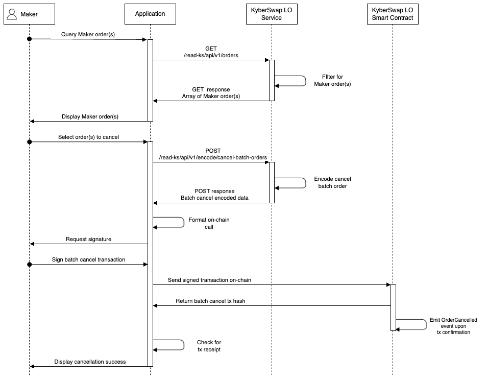
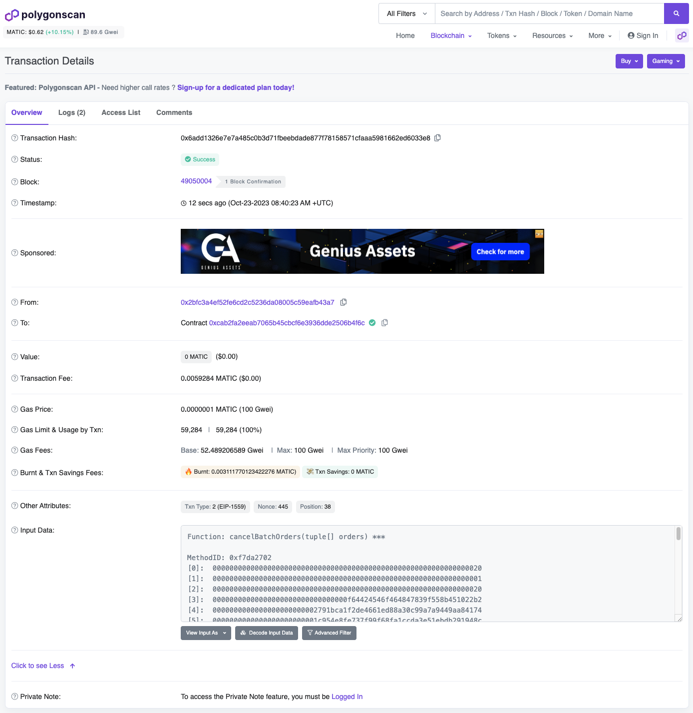

# Hard Cancel

## Overview

In cases where a Maker's orders have been requested as part of a Taker's potential fill order, Makers will have to wait for the Operator signature to lapse before their order can be [gaslessly cancelled](gasless-cancel.md). As long as the Taker's fill order is not executed, Makers still have the option to immediately cancel their orders by paying a gas fee to prioritize their cancellation on-chain. Usage of this Hard Cancel option is expected to be minimal unless the Maker's orders are consistently close to the market price.

Please refer to [Decentralized Limit Orders](../concepts/gasless-cancellation.md#decentralized-limit-orders) for more details regarding this design.

## Sequence Diagram

<figure><figcaption></figcaption></figure>

KyberSwap exposes 2 API options for Makers who wish to cancel their orders on-chain:

* [**`/read-ks/api/v1/encode/cancel-batch-orders`**](../limit-order-api-specification/maker-apis.md#read-ks-api-v1-encode-cancel-batch-orders): Encode the batch cancellation data to be sent on-chain. This API can be used to cancel a single `orderId` or multiple orders by specifying the target `orderIds`.
* [**`/read-ks/api/v1/encode/increase-nonce`**](../limit-order-api-specification/maker-apis.md#read-ks-api-v1-encode-increase-nonce): Encode the increase nonce data to be sent on-chain. By increasing the LO contract nonce tied to the Maker, the LO contract is able to nullify all existing orders.

In addition to the above, Makers are also able to query their active order(s) to aid with filtering orders to cancel:

* [**`/read-ks/api/v1/orders`**](../limit-order-api-specification/maker-apis.md#read-ks-api-v1-orders): Get all orders created by a Maker address filtered by the order status.

## TypeScript Example


**Limit Order API Demo**

The code snippets in the guide below have been extracted from our demo GitHub repo which showcases the full end-to-end Limit Order operations in a TypeScript environment.




### Step 1: Get Maker orders


**Active/Open Orders**

To proceed with this guide, users must have created an Active or Open Limit Order. Please refer to the [Create Limit Order developer guide](create-limit-order.md) for instructions on how to achieve this programmatically.


We can use the `/read-ks/api/v1/orders` to get the list of "active" or "open" Maker orders:

```typescript
const targetPathConfig = {
    params: {
        chainId: ChainId.MATIC,
        maker: signerAddress,
        status: "active"
    }
};
```

[getMakerOrders.ts](https://github.com/KyberNetwork/ks-limit-order-API-demo/blob/e34660faf165d6c6b5763327b6e8e34bf8bc9e01/src/operations/maker/getMakerOrders.ts#L13)

In this case, the above query will return all of the Maker active orders from which we can then filter for our target order to cancel.

### Step 2: Get the target orderId to cancel


**Cancel All Orders**

If you would like to cancel all orders instead, you can call `/read-ks/api/v1/encode/increase-nonce` which will return the encoded increase nonce data. This can be used in place of the encoded data from step 5 onwards.

Please refer to [`postCancelAllOrders.ts`](https://github.com/KyberNetwork/ks-limit-order-API-demo/blob/main/src/operations/maker/postCancelAllOrders.ts) for a Cancel All example.


For our purposes, we will just take the first order which matches our `makerAsset` and `takerAsset` pair:

```typescript
const orders = await getMakerOrders();
const targetOrders = orders.filter(order => 
    order.makerAsset.toLowerCase() == makerAsset.address.toLowerCase() &&
    order.takerAsset.toLowerCase() == takerAsset.address.toLowerCase()
);
const targetOrderId = Number(targetOrders[targetOrders.length-1].id);
```

[postCancelBatchOrder.ts](https://github.com/KyberNetwork/ks-limit-order-API-demo/blob/e34660faf165d6c6b5763327b6e8e34bf8bc9e01/src/operations/maker/postCancelBatchOrders.ts#L19)

### Step 3: Format the cancel order request body

The `orderId` will be included as part of the `orderIds` array:

```typescript
const requestBody: CancelBatchOrdersBody = {
    orderIds: [targetOrderId]
};
```

[postCancelBatchOrder.ts](https://github.com/KyberNetwork/ks-limit-order-API-demo/blob/e34660faf165d6c6b5763327b6e8e34bf8bc9e01/src/operations/maker/postCancelBatchOrders.ts#L32)

Note that you can include multiple `orderId`s to be encoded in the same transaction so that you will only have to pay gas once to hard cancel all the included orders.

### Step 4: Post the encode data request

With the orderIds prepared, we can then request the encoded data via `/read-ks/api/v1/encode/cancel-batch-orders`:

```typescript
const {data} = await axios.post(
    LimitOrderDomain+targetPath,
    requestBody
);
```

This will return the batch cancel encoded data which will be used as the calldata when executing the transaction on-chain.

### Step 5: Execute the batch cancel transaction on-chain

To execute the transaction, we can use our [ethers.js signer instance](https://docs.ethers.org/v6/api/providers/#ContractRunner-sendTransaction) to send the transaction with the required gas fees:

```typescript
const cancelOrderTx = await signer.sendTransaction({
    data: data.data.encodedData,
    to: limitOrderContract,
    from: signerAddress,
    maxFeePerGas: 100000000000,
    maxPriorityFeePerGas: 100000000000
});
```

[postCancelBatchOrders.ts](https://github.com/KyberNetwork/ks-limit-order-API-demo/blob/e34660faf165d6c6b5763327b6e8e34bf8bc9e01/src/operations/maker/postCancelBatchOrders.ts#L45)

A transaction hash will be returned once the cancel order has been executed. You can copy this hash into a scanner (i.e. [PolygonScan](https://polygonscan.com/)) and see that your transaction has been successfully completed by the network.

<figure><figcaption><p><a href="https://polygonscan.com/tx/0x6add1326e7e7a485c0b3d71fbeebdade877f78158571cfaaa5981662ed6033e8">Sample batch cancellation on Polygon</a></p></figcaption></figure>
