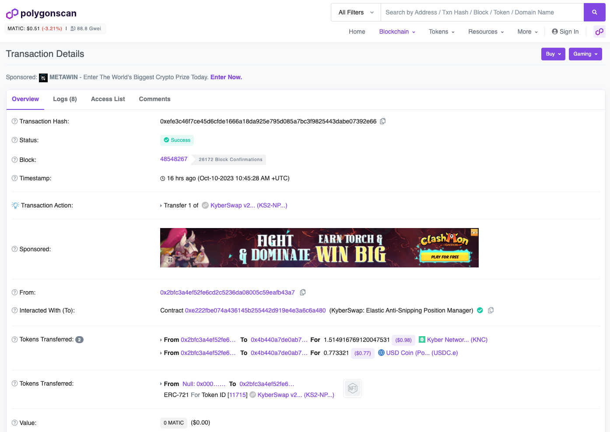

# Create A New Position


**KyberSwap Elastic Security Incident**

On 22 Nov 2023, the Elastic protocol experienced a security incident. More details can be found via our [official channels](https://x.com/KyberNetwork?s=20).

All other KyberSwap products ([Aggregator](../../../kyberswap-solutions/kyberswap-aggregator/), [Limit Order](../../../kyberswap-solutions/limit-order/), & [Classic](../../kyberswap-classic/)) continue to be fully operational.


## Introduction

The creation/minting of a new position is the very first step in contributing liquidity to Elastic contracts in exchange for market maker fees and rewards. Elastic positions are managed via the [AntiSnipAttackPositionManager](../../kyberswap-elastic/contracts/elastic-periphery-core-contracts.md#antisnipattackpositionmanager) contract which extends the base position manager contract by adding an anti-sniping feature for liquidity additions and removals.

The logic for creating a new position can be found in the `createPosition.ts` file linked below:




**Signer configuration**

In order to sign the transaction to be processed by the network, this example requires an [Ethers Signer](https://docs.ethers.org/v6/api/providers/#Signer) to be configured. Please view [Provider and Signer Setup](environment-setup.md#provider-and-signer-setup) for more information.


## Flow

1. [Get the target pool](create-a-new-position.md#step-1-get-the-target-pool)
2. [Configure the position range](create-a-new-position.md#step-2-configure-the-position-range)
3. [Create a position instance](create-a-new-position.md#step-3-create-a-position-instance)
4. [Calculate token amounts required for the mint](create-a-new-position.md#step-4-calculate-token-amounts-required-for-the-mint)
5. [Allow contract to manage signer tokens](create-a-new-position.md#step-5-allow-contract-to-manage-signer-tokens)
6. [Get the mint call parameters](create-a-new-position.md#step-6-get-the-mint-call-parameters)
7. [Execute the mint transaction](create-a-new-position.md#step-7-execute-the-mint-transaction)

## Minting a new position

### Step 1: Get the target pool

We first need to identify the pool where will create our position. Each pool can be uniquely identified by the token pair as well as the configured pool fee tier. The logic for this is covered by the [`getPool()`](https://github.com/KyberNetwork/ks-sdk-elastic-demo/blob/c7192f56dd0da1c98035abfb136a210547300109/src/operations/createPosition.ts#L136) function.

Using KyberSwap Analytics, we know that there is an existing [KNC-USDC 1% Fee Tier pool](https://analytics.kyberswap.com/elastic/polygon/pool/0x4b440a7de0ab7041934d0c171849a76cc33234fa) at the following address:

```
targetPool: 0x4b440a7de0ab7041934d0c171849a76cc33234fa
```

To programatically get the above address without prior knowledge of the pool, we can use the [`computePoolAddress()`](https://github.com/KyberNetwork/ks-sdk-elastic-demo/blob/5821e277859c743364d60dd786ec6d81bb6bc224/src/operations/quote.ts#L54-L60) function which returns the address of the pool created by the [Factory](https://polygonscan.com/address/0xC7a590291e07B9fe9E64b86c58fD8fC764308C4A) contract based on the token pair and configured fee tier.

```typescript
const poolAddress = computePoolAddress({
    factoryAddress: elasticContracts.FACTORY,
    tokenA: token0,
    tokenB: token1,
    fee: FeeAmount.EXOTIC,
    initCodeHashManualOverride: '0x00e263aaa3a2c06a89b53217a9e7aad7e15613490a72e0f95f303c4de2dc7045'
});
```

<table><thead><tr><th width="180">Params</th><th>Remarks</th></tr></thead><tbody><tr><td>factoryAddress</td><td>The Elastic Factory address. Specified in <a href="https://github.com/KyberNetwork/ks-sdk-elastic-demo/blob/main/src/libs/constants.ts"><code>constant.ts</code></a>.<br><br>Please refer to <a href="../../kyberswap-elastic/contracts/elastic-contract-addresses.md">Elastic Contract Addresses</a> for the full list of Factory addresses across various chains.</td></tr><tr><td>tokenA</td><td>Input token for the swap. Specified in <a href="https://github.com/KyberNetwork/ks-sdk-elastic-demo/blob/main/src/libs/constants.ts"><code>constant.ts</code></a>.</td></tr><tr><td>tokenB</td><td>Output token for the swap. Specified in <a href="https://github.com/KyberNetwork/ks-sdk-elastic-demo/blob/main/src/libs/constants.ts"><code>constant.ts</code></a>.</td></tr><tr><td>fee</td><td>Fee configuration as per <a href="https://github.com/KyberNetwork/ks-sdk-elastic/blob/ef95bce57f9eeebf7de7814e38022126bdc1269e/src/constants.ts#L10">FeeAmount</a> enum.</td></tr><tr><td>initCodeHashManualOverride</td><td>In order to create contracts with a known address, KyberSwap Elastic pools utilizes an <code>initCodeHash</code> value. This <code>initCodeHash</code> must be passed in whenever computing the address of such pools. More info <a href="https://ethereum.stackexchange.com/questions/76334/what-is-the-difference-between-bytecode-init-code-deployed-bytecode-creation/76335#76335">here</a>.<br><br>Elastic Pools initCodeHash:<br><code>0x00e263aaa3a2c06a89b53217a9e7aad7e15613490a72e0f95f303c4de2dc7045</code></td></tr></tbody></table>

Based on the inputs above, you should be able to see the target pool address printed in your console. You can choose different tokens/fees and validate the result against [KyberSwap Analytics](https://analytics.kyberswap.com/elastic/polygon/pools).&#x20;

### Step 2: Configure the position range

To create a position, we must first configure the position's range based on the pool's allowable [ticks](../../kyberswap-elastic/concepts/tick-range-mechanism.md). Liquidity can only be added towards discrete tick ranges which are fixed at the time of pool creation by the Factory contract.&#x20;

In addition to the token combination, a pool is also uniquely identified by the fee tier which ultimately determines the [tickSpacing](https://github.com/KyberNetwork/ks-sdk-elastic/blob/ef95bce57f9eeebf7de7814e38022126bdc1269e/src/constants.ts#L26). Consequently, we will create a new in-range position with a range that is ±3 tickSpacing away from the current tick.

```typescript
const positionTickLower = nearestUsableTick(targetPool.tickCurrent, targetPool.tickSpacing) - (3*targetPool.tickSpacing);
const positionTickUpper = nearestUsableTick(targetPool.tickCurrent, targetPool.tickSpacing) + (3*targetPool.tickSpacing);
```

### Step 3: Create a position instance

The [Position](../classes/position.md) class enables the convenient handling of a position in a TypeScript environment prior to being created on-chain. It contains the pool, liquidity, and range info required to pre-compute token amounts that are required for the mint operation.

We can use the [Position.fromAmount0()](../classes/position.md#fromamount0-public-static) function to create a Position instance that corresponds to the intended position range and `token0` amount. For the purposes of this demo, we will specify the input token amount as the value of 1 unit of the `token0` that is being maintained locally.&#x20;

```typescript
var target0Amount;
// Check if the pool token0 is equivalent to the token0 we are maintaining locally
if (targetPool.token0.address == token0const.address) {
    // Add 1 token0 worth of token0
    target0Amount =  1*(10**token0const.decimals);
} else {
    // Add 1 token 0 worth of token1
    target0Amount = 1*(10**token1const.decimals)*Number(targetPool.token1Price.toSignificant(18)); //rough estimate based on current pool price
};
```

Note that on pool creation (which is then used to create a position), the tokens are [ordered](https://github.com/KyberNetwork/ks-sdk-elastic/blob/ef95bce57f9eeebf7de7814e38022126bdc1269e/src/entities/pool.ts#L89) hence the `token0` that we have been maintaining locally (in our [`constants.ts`](https://github.com/KyberNetwork/ks-sdk-elastic/blob/main/src/constants.ts) file) might not match with the `token0` that is being maintained by the Position instance. To avoid this confusion, the token symbols are also logged into the console when displaying token amounts.

After getting the `target0Amount`, we can create the Position instance:

```typescript
const targetPosition = Position.fromAmount0({
    pool: targetPool,
    tickLower: positionTickLower,
    tickUpper: positionTickUpper,
    amount0: target0Amount,
    useFullPrecision: true
});
```

### Step 4: Calculate token amounts required for the mint

Based on the `targetPosition`, we will need to calculate the `token0` and `token1` amounts that are required for minting the position.&#x20;

```typescript
const tokenMintAmounts = targetPosition.mintAmounts;
const tokenMintAmountsSlippage = targetPosition.mintAmountsWithSlippage(new Percent(50,10000));
```

As part of position creation, `token0` and `token1` amounts will be sent from the signer's address to the position manager contract in exchange for a NFT representing the position. Hence, the signer must have the required token amounts returned in the `tokenMintAmounts`.

### Step 5: Allow contract to manage signer tokens

In addition to the signer balances, the position manager contract must also have the necessary [allowances](https://docs.openzeppelin.com/contracts/4.x/api/token/erc20#IERC20-allowance-address-address-) to spend `token0` and `token1` from the signer's address.&#x20;

We can query the existing allowances via the token contracts:

```typescript
const token0Contract = new ethers.Contract(targetPool.token0.address, ERC20ABI, signer);
const token1Contract = new ethers.Contract(targetPool.token1.address, ERC20ABI, signer);
const token0Allowance = await token0Contract.allowance(signerAddress, elasticContracts.POSITIONMANAGER);
const token1Allowance = await token1Contract.allowance(signerAddress, elasticContracts.POSITIONMANAGER);
```

If there are insufficient token allowances, we will then send an [approve](https://docs.openzeppelin.com/contracts/4.x/api/token/erc20#IERC20-approve-address-uint256-) transaction from the signer's address:

```typescript
if (token0Allowance < tokenMintAmounts.amount0) {
    const token0Amount: CurrencyAmount<Currency> = CurrencyAmount.fromRawAmount(token0const, tokenMintAmounts.amount0);
    await getTokenApproval(token0Contract, token0Amount, elasticContracts.POSITIONMANAGER);
};

if (token1Allowance < tokenMintAmounts.amount1) {
    const token1Amount: CurrencyAmount<Currency> = CurrencyAmount.fromRawAmount(token1const, tokenMintAmounts.amount1);
    await getTokenApproval(token1Contract, token1Amount, elasticContracts.POSITIONMANAGER);
};
```

Once we have the necessary allowances, we can then proceed to prepare the mint transaction.

### Step 6: Get the mint call parameters

As part of the call parameters, we will also need to pass in the nearest initialized ticks that corresponds to the position's lower and upper range. To get the updated tick data, we will be making use of the [TicksFeesReader](../../kyberswap-elastic/contracts/elastic-contract-addresses.md) contract:

```typescript
const tickReaderContract = new ethers.Contract(elasticContracts.TICKSFEEREADER, TicksFeesReaderABI, signer);
const poolAddress = getPoolAddress();

const nextInitializedTicksPosLower = await tickReaderContract.getNearestInitializedTicks(poolAddress, targetPosition.tickLower);
const nextInitializedTicksPosUpper = await tickReaderContract.getNearestInitializedTicks(poolAddress, targetPosition.tickUpper);
```

Additionally, we can also configure the mint transaction options:

```typescript
const mintOptions = {
    recipient: signerAddress,
    slippageTolerance: new Percent(50,10000), // 0.5%
    deadline: Math.floor(Date.now() / 1000) + 60 * 10, //10 mins
};
```

We can then get the call parameters by utilizing the [`NonfungiblePositionManager`](../classes/nonfungiblepositionmanager.md) helper class:

```typescript
const mintMethodParams = NonfungiblePositionManager.addCallParameters(
    targetPosition,
    [nextInitializedTicksPosLower[0], nextInitializedTicksPosUpper[0]],
    mintOptions
);
```

This will return the encoded calldata that will be sent to the network.

### Step 7: Execute the mint transaction

We are finally ready to execute the transaction by sending the transaction from the signer's address:

```typescript
const mintTx = await signer.sendTransaction({
    data: mintMethodParams.calldata,
    to: elasticContracts.POSITIONMANAGER,
    value: mintMethodParams.value,
    from: signerAddress,
    maxFeePerGas: 100000000000,
    maxPriorityFeePerGas: 100000000000
});

const mintTxReceipt = await mintTx.wait();
console.log(`Mint tx executed with hash: ${mintTxReceipt?.hash}`);
```

A transaction hash will be returned once the trade has been executed. You can copy this hash into a scanner (i.e. [PolygonScan](https://polygonscan.com/)) and see that your transaction has been successfully completed by the network.

<figure><figcaption><p><a href="https://polygonscan.com/tx/0xefe3c46f7ce45d6cfde1666a18da925e795d085a7bc3f9825443dabe07392e66">Sample position created on Polygon</a></p></figcaption></figure>
