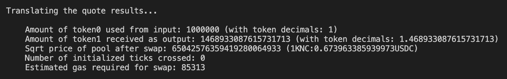

# Get A Quote


**KyberSwap Elastic Security Incident**

On 22 Nov 2023, the Elastic protocol experienced a security incident. More details can be found via our [official channels](https://x.com/KyberNetwork?s=20).

All other KyberSwap products ([Aggregator](../../../kyberswap-solutions/kyberswap-aggregator/), [Limit Order](../../../kyberswap-solutions/limit-order/), & [Classic](../../kyberswap-classic/)) continue to be fully operational.


## Introduction

Before executing a trade, you will first need to get a quote for the tokens that are being swapped. The quote is generated by the [KyberSwap Quoter contract](../../kyberswap-elastic/contracts/elastic-contract-addresses.md) and consists of the input amount consumed, the output amount received, as well as the estimated gas required for the trade.

The logic for getting a quote can be found in the `quote.ts` file linked below:



## Flow

1. [Get the address of the pool to swap against](get-a-quote.md#step-1-get-the-address-of-the-pool-to-swap-against)
2. [Extract pool information to construct Pool instance](get-a-quote.md#step-2-extract-pool-information-to-construct-pool-instance)
3. [Encode quoter call parameters](get-a-quote.md#step-3-encode-quoter-call-parameters)
4. [Call the quoter contract](get-a-quote.md#step-4-call-the-quoter-contract)
5. [Translate the call results](get-a-quote.md#step-5-translate-the-call-results)

## Trade Parameters

For our trade example, we will be swapping **1 USDC -> KNC** via the [KNC-USDC 1% Fee Tier pool](https://analytics.kyberswap.com/elastic/polygon/pool/0x4b440a7de0ab7041934d0c171849a76cc33234fa).

## Getting A Quote

### Step 1: Get the address of the pool to swap against

We first need to identify the pool through which our swap will be routed. Each pool can be uniquely identified by the token pair as well as the configured pool fee tier.

Using KyberSwap Analytics, we know that there is an existing [KNC-USDC 1% Fee Tier pool](https://analytics.kyberswap.com/elastic/polygon/pool/0x4b440a7de0ab7041934d0c171849a76cc33234fa) at the following address:

```
targetPool: 0x4b440a7de0ab7041934d0c171849a76cc33234fa
```

To programatically get the above address without prior knowledge of the pool, we can use the [`computePoolAddress()`](https://github.com/KyberNetwork/ks-sdk-elastic-demo/blob/5821e277859c743364d60dd786ec6d81bb6bc224/src/operations/quote.ts#L54-L60) function which returns the address of the pool created by the [Factory](https://polygonscan.com/address/0xC7a590291e07B9fe9E64b86c58fD8fC764308C4A) contract based on the token pair and configured fee tier.

```typescript
const poolAddress = computePoolAddress({
    factoryAddress: elasticContracts.FACTORY,
    tokenA: token0,
    tokenB: token1,
    fee: FeeAmount.EXOTIC,
    initCodeHashManualOverride: '0x00e263aaa3a2c06a89b53217a9e7aad7e15613490a72e0f95f303c4de2dc7045'
});
```

<table><thead><tr><th width="180">Params</th><th>Remarks</th></tr></thead><tbody><tr><td>factoryAddress</td><td>The Elastic Factory address. Specified in <a href="https://github.com/KyberNetwork/ks-sdk-elastic-demo/blob/main/src/libs/constants.ts"><code>constant.ts</code></a>.<br><br>Please refer to <a href="../../kyberswap-elastic/contracts/elastic-contract-addresses.md">Elastic Contract Addresses</a> for the full list of Factory addresses across various chains.</td></tr><tr><td>tokenA</td><td>Input token for the swap. Specified in <a href="https://github.com/KyberNetwork/ks-sdk-elastic-demo/blob/main/src/libs/constants.ts"><code>constant.ts</code></a>.</td></tr><tr><td>tokenB</td><td>Output token for the swap. Specified in <a href="https://github.com/KyberNetwork/ks-sdk-elastic-demo/blob/main/src/libs/constants.ts"><code>constant.ts</code></a>.</td></tr><tr><td>fee</td><td>Fee configuration as per <a href="https://github.com/KyberNetwork/ks-sdk-elastic/blob/ef95bce57f9eeebf7de7814e38022126bdc1269e/src/constants.ts#L10">FeeAmount</a> enum.</td></tr><tr><td>initCodeHashManualOverride</td><td>In order to create contracts with a known address, KyberSwap Elastic pools utilizes an <code>initCodeHash</code> value. This <code>initCodeHash</code> must be passed in whenever computing the address of such pools. More info <a href="https://ethereum.stackexchange.com/questions/76334/what-is-the-difference-between-bytecode-init-code-deployed-bytecode-creation/76335#76335">here</a>.<br><br>Elastic Pools initCodeHash:<br><code>0x00e263aaa3a2c06a89b53217a9e7aad7e15613490a72e0f95f303c4de2dc7045</code></td></tr></tbody></table>

Based on the inputs above, you should be able to see the target pool address printed in your console. You can choose different tokens/fees and validate the result against [KyberSwap Analytics](https://analytics.kyberswap.com/elastic/polygon/pools).&#x20;

### Step 2: Extract pool information to construct Pool instance

With the pool address, we can then create an Ethers Contract instance which would give us access to the pool information. To create the Contract instance, we will also need access to the pool contract ABI. For your convenience, a sample ABI has been included under `/abis/pools.json`. This pool ABI will apply to all Elastic pools.

```typescript
const poolContract = new ethers.Contract(
    poolAddress,
    PoolABI,
    getProvider()
);
```

Once the Contract instance is created, we can then pull the following information using the relevant Contract methods:

* `swapFeeUnits()`: The fee configuration of the pool.
* `getLiquidityState()`: The base and reinvest liquidity of the pool.
* `getPoolStates()`: The sqrt price and current tick of the pool.

We now have all the information required to create a [Pool](../classes/pool.md) instance.&#x20;

<figure><figcaption></figcaption></figure>

All the functions above are covered by [`getPool()`](https://github.com/KyberNetwork/ks-sdk-elastic-demo/blob/07cfe25aa476d0c507ab75c630ad4828fb6c3866/src/operations/quote.ts#L50) which returns the newly created Pool instance for the target pool.

### Step 3: Encode quoter call parameters

We can now start to form the quote call parameters to be sent to the Quoter contract. The [`SwapQuoter`](../classes/swapquoter.md) abstract class exposes a [`quoteCallParameters()`](../classes/swapquoter.md#quotecallparameters-public-static) method which handles the encoding of the relevant on-chain quote methods.

For the purposes of this example, we will route the swap via the target pool by first creating the corresponding Route instance:

```typescript
const route = new Route([pool], token0, token1);
```

We can then go ahead and encode the call parameters:

```typescript
const quoteCallParameters = SwapQuoter.quoteCallParameters(
    route,
    CurrencyAmount.fromRawAmount(token0, token0RawAmountIn),
    TradeType.EXACT_INPUT
);
```

Note that we use the [`CurrencyAmount`](../../core-sdk/classes/currencyamount.md) class to handle the raw token amount according to the token's decimal specification. Additionally, we specify the [TradeType](https://github.com/KyberNetwork/ks-sdk-core/blob/c265d1b09784660bb9aca6f0d080aace334c0ac4/src/constants.ts#L6) as `EXACT_INPUT` which takes in an exact tokenIn amount to calculate the output.

### Step 4: Call the quoter contract

With the encoded quoter call parameters, we can then use our configured Ethers provider to [call](https://docs.ethers.org/v6/api/providers/#Provider-call) the Quoter contract. Note that we are only sending the calldata from the `quoteCallParameters` to the Quoter contract.

```typescript
const returnedQuoteRaw = await getProvider().call({
    to: elasticContracts.QUOTER,
    data: quoteCallParameters.calldata
});
```

The quote will be returned as a hexstring which requires further processing to be converted into a human-readable format.

### Step 5: Translate the call results

To decode the `returnedQuoteRaw`, we will need to leverage the Quoter contract ABI which has been conveniently included with the Elastic SDK. In this case, we know that the quote was requested based on the `quoteExactInputSingle` method.

```typescript
const returnedQuote = SwapQuoter.INTERFACE.decodeFunctionResult('quoteExactInputSingle', returnedQuoteRaw);
```

After reformatting the above object, we are able to view the details of our quote printed in the console:

<figure><figcaption></figcaption></figure>
