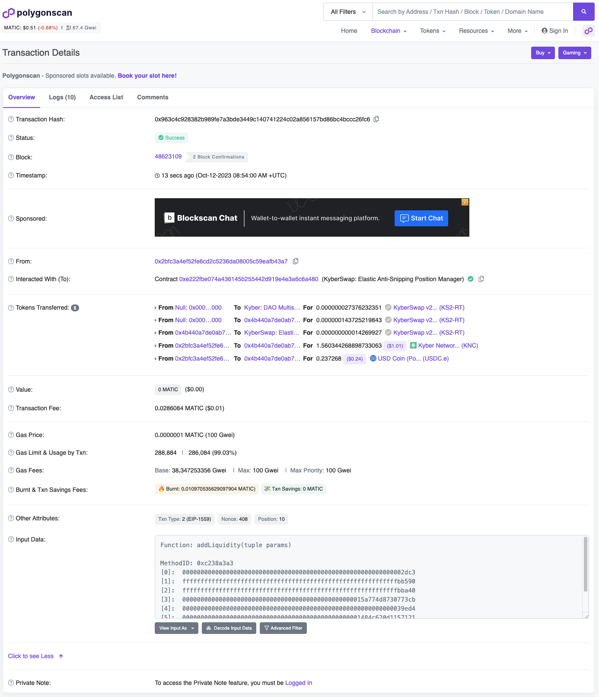

# Increase Liquidity

## Introduction

Once you have [created a new Elastic position](create-a-new-position.md), you can add additional liquidity to the existing position. Position liquidity addition is handled by the [AntiSnipAttackPositionManager](../../kyberswap-elastic/contracts/elastic-periphery-core-contracts.md#antisnipattackpositionmanager) contract which extends the base position manager contract by adding an anti-sniping feature for liquidity additions and removals.

The logic for creating a new position can be found in the `increaseLiquidity.ts` file linked below:




**Signer configuration**

In order to sign the transaction to be processed by the network, this example requires an [Ethers Signer](https://docs.ethers.org/v6/api/providers/#Signer) to be configured. Please view [Provider and Signer Setup](environment-setup.md#provider-and-signer-setup) for more information.


## Flow

1. [Get the position data](increase-liquidity.md#step-1-get-the-position-data)
2. [Create a position instance with additional liquidity amount](increase-liquidity.md#step-2-create-a-position-instance-with-additional-liquidity-amount)
3. [Calculate token amounts required for the mint](increase-liquidity.md#step-3-calculate-token-amounts-required-for-the-mint)
4. [Allow contract to manage signer tokens](increase-liquidity.md#step-4-allow-contract-to-manage-signer-tokens)
5. [Get the add liquidity call parameters](increase-liquidity.md#step-5-get-the-add-liquidity-call-parameters)
6. [Execute the add liquidity transaction](increase-liquidity.md#step-6-execute-the-add-liquidity-transaction)

## Increasing Position Liquidity


**Open Positions**

This guide requires an existing position to have been created. Each position is assigned a  position ID which enables further management of the position after creation.

Please refer to [Create A New Position](create-a-new-position.md) for the developer guide on how to create a new Elastic position.


### Step 1: Get the position data

In order to add liquidity to an existing position, we must first get the position data which includes its `positionId` (the positions unique identifier).&#x20;

Due to gas considerations, the `ownerAddress` -> `positionId` mapping is not stored on-chain. Nonetheless, to aid with Elastic integrations, KyberSwap exposes a [subgraph](https://thegraph.com/docs/en/developing/creating-a-subgraph/) for Elastic protocols across all supported chains. The addresses for each subgraph can be found on [Elastic Subgraphs](../../kyberswap-elastic/subgraphs.md).

For the purposes of this guide, we will be using the Matic subgraph which is defined under the [`getSignerPositions()`](https://github.com/KyberNetwork/ks-sdk-elastic-demo/blob/c1aca6e5b61fe76143e8b7b91be1525d38d7a6a2/src/operations/increaseLiquidity.ts#L182) function:

```typescript
https://api.thegraph.com/subgraphs/name/kybernetwork/kyberswap-elastic-matic
```

The subgraph URL above allows us to query the positions belonging to the `signerAddress`. We are also leveraging the [Axios](https://www.npmjs.com/package/axios) package to easily handle promise-based HTTP requests:

```typescript
const {data} = await axios.post(
    kyberswapSubgraphURL,
    {
        query: `
            {
                positions(
                    where: {
                        owner: "${signerAddress}",
                        pool: "${poolAddress.toLowerCase()}"
                    }
                ) {
                    id
                    liquidity
                    tickLower {
                        tickIdx
                    }
                    tickUpper {
                        tickIdx
                    }                            
                }
            }  
        `
    },
);
```

You can play around with the query by opening the explorer client in your browser using the links provided under [Elastic Subgraphs](../../kyberswap-elastic/subgraphs.md).

We then filter the positions to return only the positions with liquidity, `signerOpenPositions`. As the positions are ordered based on their `positionId` we will choose to add liquidity to the oldest position, `targetOpenPosition`.

### Step 2: Create a position instance with additional liquidity amount

Similar to the position creation guide, we will add the value of 1 unit of `token0` as the input token amount:

```typescript
var target0IncrementAmount;
// Check if the pool token0 is equivalent to the token0 we are maintaining locally
if (targetPool.token0.address == token0const.address) {
    // Add 1 token0 worth of token0
    target0IncrementAmount =  1*(10**token0const.decimals);
} else {
    // Add 1 token 0 worth of token1
    target0IncrementAmount = 1*(10**token1const.decimals)*Number(targetPool.token1Price.toSignificant(18)); //rough estimate based on current pool price
};
```

With the increment amount calculated, we can then create the new target position:

```typescript
const targetPositionNew = Position.fromAmount0({
    pool: targetPool,
    tickLower: Number(targetOpenPosition.tickLower),
    tickUpper: Number(targetOpenPosition.tickUpper),
    amount0: target0IncrementAmount,
    useFullPrecision: true
});
```

### Step 3: Calculate token amounts required for the mint

Based on the `targetPositionNew`, we will need to calculate the `token0` and `token1` amounts that are required for minting the position.&#x20;

```typescript
const tokenMintAmounts = targetPositionNew.mintAmounts;
const tokenMintAmountsSlippage = targetPositionNew.mintAmountsWithSlippage(new Percent(50,10000)); // 0.5%
```

As part of position creation, `token0` and `token1` amounts will be sent from the signer's address to the position manager contract in exchange for a NFT representing the position. Hence, the signer must have the required token amounts returned in the `tokenMintAmounts`.

### Step 4: Allow contract to manage signer tokens

In addition to the signer balances, the position manager contract must also have the necessary [allowances](https://docs.openzeppelin.com/contracts/4.x/api/token/erc20#IERC20-allowance-address-address-) to spend `token0` and `token1` from the signer's address.&#x20;

We can query the existing allowances via the token contracts:

```typescript
const token0Contract = new ethers.Contract(targetPool.token0.address, ERC20ABI, signer);
const token1Contract = new ethers.Contract(targetPool.token1.address, ERC20ABI, signer);
const token0Allowance = await token0Contract.allowance(signerAddress, elasticContracts.POSITIONMANAGER);
const token1Allowance = await token1Contract.allowance(signerAddress, elasticContracts.POSITIONMANAGER);
```

If there are insufficient token allowances, we will then send an [approve](https://docs.openzeppelin.com/contracts/4.x/api/token/erc20#IERC20-approve-address-uint256-) transaction from the signer's address:

```typescript
if (token0Allowance < tokenIncrementAmounts.amount0) {
    const token0Amount: CurrencyAmount<Currency> = CurrencyAmount.fromRawAmount(token0const, tokenIncrementAmounts.amount0);
    await getTokenApproval(token0Contract, token0Amount, elasticContracts.POSITIONMANAGER);
};

if (token1Allowance < tokenIncrementAmounts.amount1) {
    const token1Amount: CurrencyAmount<Currency> = CurrencyAmount.fromRawAmount(token1const, tokenIncrementAmounts.amount1);
    await getTokenApproval(token1Contract, token1Amount, elasticContracts.POSITIONMANAGER);
};
```

Once we have the necessary allowances, we can then proceed to prepare the add liquidity transaction.

### Step 5: Get the add liquidity call parameters

Note that unlike the position creation, we specify the `positionId` when configuring the `increaseLiquidityOptions` for the transaction. By including a `positionId`, the Elastic SDK knows that we are trying to add liquidity to an existing position:

```typescript
const increaseLiquidityOptions = {
    slippageTolerance: new Percent(50,10000), // 0.5%
    deadline: Math.floor(Date.now() / 1000) + 60 * 10, //10 mins
    tokenId: targetOpenPosition.positionId // Add liquidity to the oldest position
};
```

As part of the call parameters, we will also need to pass in the nearest initialized ticks that corresponds to the position's lower and upper range. To get the updated tick data, we will be making use of the [TicksFeesReader](../../kyberswap-elastic/contracts/elastic-contract-addresses.md) contract:

```typescript
const tickReaderContract = new ethers.Contract(elasticContracts.TICKSFEEREADER, TicksFeesReaderABI, signer);
const poolAddress = getPoolAddress();
const nextInitializedTicksPosLower = await tickReaderContract.getNearestInitializedTicks(poolAddress, targetPositionNew.tickLower);
const nextInitializedTicksPosUpper = await tickReaderContract.getNearestInitializedTicks(poolAddress, targetPositionNew.tickUpper);
```

We can then get the call parameters by utilizing the [`NonfungiblePositionManager`](../classes/nonfungiblepositionmanager.md) helper class:

```typescript
const addLiquidityParams = NonfungiblePositionManager.addCallParameters(
    targetPositionNew,
    [nextInitializedTicksPosLower[0], nextInitializedTicksPosUpper[0]],
    increaseLiquidityOptions
);
```

This will return the encoded calldata that will be sent to the network.

### Step 6: Execute the add liquidity transaction

We are finally ready to execute the transaction by sending the transaction from the signer's address:

```typescript
const mintTx = await signer.sendTransaction({
    data: addLiquidityParams.calldata,
    to: elasticContracts.POSITIONMANAGER,
    value: addLiquidityParams.value,
    from: signerAddress,
    maxFeePerGas: 100000000000,
    maxPriorityFeePerGas: 100000000000
});

const mintTxReceipt = await mintTx.wait();
console.log(`Add liquidity tx executed with hash: ${mintTxReceipt?.hash}`);
```

A transaction hash will be returned once the trade has been executed. You can copy this hash into a scanner (i.e. [PolygonScan](https://polygonscan.com/)) and see that your transaction has been successfully completed by the network.

<figure><figcaption><p><a href="https://polygonscan.com/tx/0x963c4c928382b989fe7a3bde3449c140741224c02a856157bd86bc4bccc26fc6">Sample add liquidity on Polygon</a></p></figcaption></figure>
