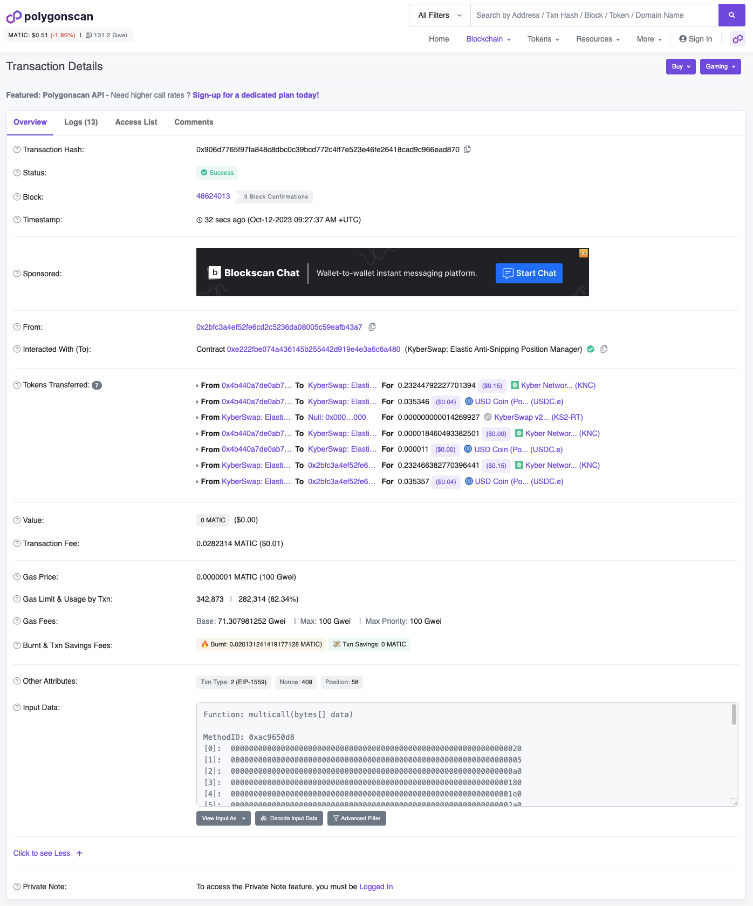

# Remove Liquidity

## Introduction

Once you have [created a new Elastic position](create-a-new-position.md), you can then choose to remove varying proportion of the position's liquidity. Removing all the position's liquidity will result in the position being closed. Position liquidity removal is handled by the [AntiSnipAttackPositionManager](../../kyberswap-elastic/contracts/elastic-periphery-core-contracts.md#antisnipattackpositionmanager) contract which extends the base position manager contract by adding an anti-sniping feature for liquidity additions and removals.

The logic for creating a new position can be found in the `removeLiquidity.ts` file linked below:




**Signer configuration**

In order to sign the transaction to be processed by the network, this example requires an [Ethers Signer](https://docs.ethers.org/v6/api/providers/#Signer) to be configured. Please view [Provider and Signer Setup](environment-setup.md#provider-and-signer-setup) for more information.


## Flow

1. [Get the position data](remove-liquidity.md#step-1-get-the-position-data)
2. [Create a position instance for liquidity removal](remove-liquidity.md#step-2-create-a-position-instance-for-liquidity-removal)
3. [Get the fees accrued to the position](remove-liquidity.md#step-3-get-the-fees-accrued-to-the-position)
4. [Configure the fee removal options](remove-liquidity.md#step-4-configure-the-fee-removal-options)
5. [Configure the liquidity removal options](remove-liquidity.md#step-5-configure-the-liquidity-removal-options)
6. [Get the remove liquidity call parameters](remove-liquidity.md#step-6-get-the-remove-liquidity-call-parameters)
7. [Execute the liquidity removal](remove-liquidity.md#step-7-execute-the-liquidity-removal)

## Removing Position Liquidity


**Open Positions**

This guide requires an existing position to have been created. Each position is assigned a  position ID which enables further management of the position after creation.

Please refer to [Create A New Position](create-a-new-position.md) for the developer guide on how to create a new Elastic position.


### Step 1: Get the position data

In order to remove liquidity from an existing position, we must first get the position data which includes its `positionId` (the positions unique identifier).&#x20;

Due to gas considerations, the `ownerAddress` -> `positionId` mapping is not stored on-chain. Nonetheless, to aid with Elastic integrations, KyberSwap exposes a [subgraph](https://thegraph.com/docs/en/developing/creating-a-subgraph/) for Elastic protocols across all supported chains. The addresses for each subgraph can be found on [Elastic Subgraphs](../../kyberswap-elastic/subgraphs.md).

For the purposes of this guide, we will be using the Matic subgraph which is defined under the [`getSignerPositions()`](https://github.com/KyberNetwork/ks-sdk-elastic-demo/blob/80500302b6e9feb432cc79759bb69a6289c490f3/src/operations/removeLiquidity.ts#L157) function:

```typescript
https://api.thegraph.com/subgraphs/name/kybernetwork/kyberswap-elastic-matic
```

The subgraph URL above allows us to query the positions belonging to the `signerAddress`. We are also leveraging the [Axios](https://www.npmjs.com/package/axios) package to easily handle promise-based HTTP requests:

```typescript
const {data} = await axios.post(
    kyberswapSubgraphURL,
    {
        query: `
            {
                positions(
                    where: {
                        owner: "${signerAddress}",
                        pool: "${poolAddress.toLowerCase()}"
                    }
                ) {
                    id
                    liquidity
                    tickLower {
                        tickIdx
                    }
                    tickUpper {
                        tickIdx
                    }                            
                }
            }  
        `
    },
);
```

You can play around with the query by opening the explorer client in your browser using the links provided under [Elastic Subgraphs](../../kyberswap-elastic/subgraphs.md).

We then filter the positions to return only the positions with liquidity, `signerOpenPositions`. As the positions are ordered based on their `positionId` we will choose to remove liquidity from the oldest position, `targetOpenPosition`.

### Step 2: Create a position instance for liquidity removal

The position data returned above allows us to instantiate a Position instance for convenient liquidity position handling:

```typescript
const targetPositionNew = new Position({
    pool: targetPool,
    liquidity: targetOpenPosition.liquidity,
    tickLower: Number(targetOpenPosition.tickLower),
    tickUpper: Number(targetOpenPosition.tickUpper)
});
```

### Step 3: Get the fees accrued to the position

Trading fees will accrue to your position if your liquidity was used to support trades. To get the total fees earned by the position, we can leverage `getTotalFeesOwedToPosition()` function exposed by the [TicksFeesReader](../../kyberswap-elastic/contracts/elastic-contract-addresses.md) contract:

```typescript
const tickReaderContract = new ethers.Contract(elasticContracts.TICKSFEEREADER, TicksFeesReaderABI, signer);
const [token0Fees, token1Fees] = await tickReaderContract.getTotalFeesOwedToPosition(elasticContracts.POSITIONMANAGER, targetPoolAddress, targetOpenPosition.positionId);
```

### Step 4: Configure the fee removal options

With the accrued fee amounts returned, we can then add it to our transaction via the `collectOptions` which will form part of the liquidity removal transaction:

```typescript
const collectOptions: CollectOptions = {
    tokenId: targetOpenPosition.positionId,
    expectedCurrencyOwed0: CurrencyAmount.fromRawAmount(targetPool.token0, Number(token0Fees)),
    expectedCurrencyOwed1: CurrencyAmount.fromRawAmount(targetPool.token1, Number(token1Fees)),
    recipient: signerAddress,
    deadline: Math.floor(Date.now() / 1000) + 60 * 10, //10 mins
    havingFee: (token0Fees != 0) // Collect fees if any
};
```

Note that `collectOptions` consists of a `havingFee` option which determines whether fees are collected together with the liquidity withdrawal. While Elastic enables partial withdrawal of position liquidity, the fees must be collected in full. Additionally, the position must have accrued fees else the transaction will throw when trying to collect zero fees.

### Step 5: Configure the liquidity removal options

In addition to the fee collection, we will also have to configure the liquidity removal options:

```typescript
const removeLiquidityOptions: RemoveLiquidityOptions = {
    slippageTolerance: new Percent(50, 10000), // 0.5%
    deadline: Math.floor(Date.now() / 1000) + 60 * 10, //10 mins
    tokenId: targetOpenPosition.positionId, // Remove liquidity from the oldest position
    liquidityPercentage: new Percent(1000, 10000), // 10%
    collectOptions: collectOptions
};
```

Notice that we specified a `liquidityPercentage` of 10% for this demo. You can change this to 100% (i.e. `new Percent(1)`) if you would like to close the position. Additionally, note that we have included the `collectOptions` from above.

### Step 6: Get the remove liquidity call parameters

We can then get the call parameters by utilizing the [`NonfungiblePositionManager`](../classes/nonfungiblepositionmanager.md) helper class:

```typescript
const removeLiquidityParams = NonfungiblePositionManager.removeCallParameters(
    targetPositionNew,
    removeLiquidityOptions
);
```

This will return the encoded calldata that will be sent to the network.

### Step 7: Execute the liquidity removal

We are finally ready to execute the transaction by sending the transaction from the signer's address:

```typescript
const removeLiquidityTx = await signer.sendTransaction({
    data: removeLiquidityParams.calldata,
    to: elasticContracts.POSITIONMANAGER,
    value: removeLiquidityParams.value,
    from: signerAddress,
    maxFeePerGas: 100000000000,
    maxPriorityFeePerGas: 100000000000
});

const removeLiquidityTxReceipt = await removeLiquidityTx.wait();
console.log(`Remove liquidity tx executed with hash: ${removeLiquidityTxReceipt?.hash}`);
```

A transaction hash will be returned once the trade has been executed. You can copy this hash into a scanner (i.e. [PolygonScan](https://polygonscan.com/)) and see that your transaction has been successfully completed by the network.

<figure><figcaption><p><a href="https://polygonscan.com/tx/0x906d7765f97fa848c8dbc0c39bcd772c4ff7e523e46fe26418cad9c966ead870">Sample liquidity removal on Polygon</a></p></figcaption></figure>
