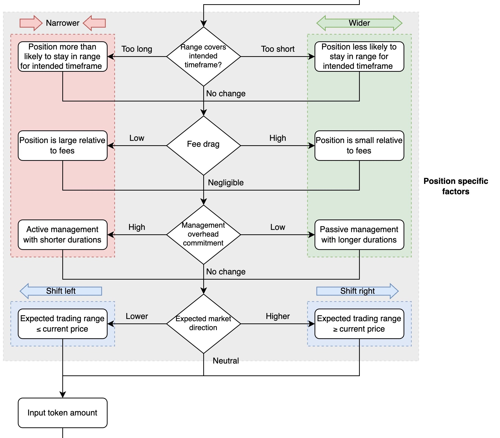

# Elastic APR Calculations

## KyberSwap Elastic APRs

As each liquidity position in Elastic is non-fungible, different formulas are required in order to provide users with a best estimate of the expected returns. To this end, KyberSwap computes the following APRs for Elastic LPs:

* [**Elastic Pool APR**](apr-calculations.md#annual-percentage-rate-apr-calculation): The APR for the pool. Calculated by sampling the fees over the active liquidity range every 30 minutes for the last 24 hours and extrapolates to an annual basis.
* [**My Pool APR**](apr-calculations.md#my-pool-apr-calculation): The APR for a specific position within a pool. My Pool APR is calculated by extrapolating the total trading fees earned since the position was created over the period of a year.
* [**Dynamic Farm APR**](apr-calculations.md#dynamic-farm-apr-calculation): The minimum APR for an active position staked in the Dynamic Farm. Dynamic Farm APR is calculated by comparing the farming rewards against the total value of all in and out of range positions in the pool.
* [**My Dynamic Farm APR**](apr-calculations.md#my-dynamic-farm-apr-calculation): The estimated APR of a position staked in the Dynamic Farm. Dynamic Farming rewards received by the position are extrapolated and compared against the position's TVL.&#x20;
* [**Static Farm Range APR**](apr-calculations.md#static-farm-range-apr-calculation): The optimal APR for a Static Farm position whose range is exactly the same as the operator defined farm range. Farming range rewards are calculated based on the [farming shares](tick-based-farming.md#static-farms) which the range has accumulated.
* [**My Static Farm APR**](apr-calculations.md#my-static-farm-apr-calculation): The expected APR of a position staked in the Static Farm. Rewards are distributed based on the farming shares which the position has accumulated.

For pools where trades occur infrequently, the APR calculations adopts a last available data approach. For example, if there is no available data in the last 24 hours, KyberSwap Elastic will display the last available 24H timeframe with APR data. This ensures that the APR displayed is more representative of actual returns especially for exotic pools where the majority of trading fees take place in short bursts.


#### Choosing The Best Range To Maximize LP Returns

A LPs returns are heavily dependent on the [position range selected](../user-guides/add-liquidity-to-an-existing-elastic-pool.md#step-4-set-your-price-range) for [concentrated liquidity](concentrated-liquidity.md) protocols such as KyberSwap Elastic. To help you maximize your potential returns, [KyberSwap Insights](https://blog.kyberswap.com/learn/insights-en/) has created a simple flow diagram which walks you through each of the key decision points when determining a position range which best suites your risk-adjusted return preferences.

View and interact with the full diagram in greater detail [here](https://blog.kyberswap.com/choosing-the-best-range-to-maximize-lp-returns-flow-chart/).&#x20;


## Elastic Pool Annual Percentage Rate (APR) calculation[​](https://docs.kyberswap.com/overview/elastic-pool-apr-calculation#annual-percentage-rate-apr-calculation) 

To demonstrate the practicality of the [reinvestment curve design](https://docs.kyberswap.com/overview/elastic-walkthrough), KyberSwap also displays an average APR for each Elastic pool. In order to provide a more accurate estimate of potential APR, the average APR calculation will have to prioritize active liquidity positions which were accumulating fees during a selected time interval. As such, APR calculations are based on the historical data for the selected pool. KyberSwap Elastic APR calculations are based on 30 minute intervals whereby the return per interval is:

$$
\frac{PoolFees}{TVL_{InRange} } * 100\%
$$

Extending this over a day, we get the sum for 48 intervals (30 min each). This is the daily return if your liquidity position was in range for the whole day:

$$
\sum_{0<x\le 48}(\frac{PoolFees}{TVL_{ InRange}}) * 100\%
$$

To get the APR from the last 24 hours of trading data, we multiply the above by the number of days in a year. The final APR calculation is as follows:

$$
\sum_{0<x\le 48}(\frac{PoolFees}{TVL_{ InRange}}) * 100\% * 365
$$


#### Data sampling and APR accuracy

To account for market volatility which could result in significant changes to the pool's liquidity within the specified 30 minute interval, the APR formula samples the data according to the following rules:

* $$PoolFees$$ is calculated at the end of the interval to account for all fees earned over the interval period
* $$TVL_{InRange}$$ is calculated at the beginning of the interval to determine positions which have supported the pool in the past

By sampling 48 times throughout a day, the APR displayed better approximates the expected APR for the pool as intraday variances are smoothened out.


### Example Elastic pool APR calculation[​](https://docs.kyberswap.com/overview/elastic-pool-apr-calculation#example-apr-calculation) 

#### Scenario[​](https://docs.kyberswap.com/overview/elastic-pool-apr-calculation#scenario) 

A user holding some `ETH` and `USDT` is planning to earn yield for her asset by contributing liquidity to a KyberSwap Elastic Pool. She visits the [Elastic Pools page](https://kyberswap.com/pools/) at 10:00 AM, 4th Jan to view the available pools and notices that the `ETH - USDT (1% fee tier)` Elastic Pool offers the highest APRs. Before committing her tokens, she would like to understand how this APR is calculated.

#### Assumptions[​](https://docs.kyberswap.com/overview/elastic-pool-apr-calculation#assumptions) 

* APR is being calculated for the `ETH - USDT (1% fee tier)` Elastic Pool at 10:00AM, 4th Jan
* The current price of the pool is 1200
* Based on the current price, the [tick ranges](https://docs.kyberswap.com/overview/elastic-walkthrough) of the pool increases in roughly 1% (\~12USD) steps:

<figure><figcaption>
Ticks
</figcaption></figure>

#### Single interval calculation[​](https://docs.kyberswap.com/overview/elastic-pool-apr-calculation#single-interval-calculation) 

To calculate the return for the earliest time interval (10:00 AM, 3rd Jan ←→ 10:30 AM, 3rd Jan):

* 30m Fees at the end of the interval = USD2000
* Pool price at the end of the interval (12 PM, 3rd Jan ←→ 12:30 PM, 3rd Jan). This is used to calculate in-range positions for this interval = 1190
* Based on above price, the 30m tick range to consider = 1188-1200 (.....1176 - **1188 - 1200** - 1212.....)

<figure><figcaption>
Position TVL
</figcaption></figure>

* TVL for active liquidity positions that supported the tick 1188-1200 at 12PM, 3rd Jan = USD9000 (aggregate TVL of position 1 + 2 + 3 below)

| Liquidity Position | Tick Range  | TVL (USD) | Included                              |
| ------------------ | ----------- | --------- | ------------------------------------- |
| 1                  | 1128 - 1200 | 1000      | <mark style="color:green;">Yes</mark> |
| 2                  | 1164 - 1236 | 3000      | <mark style="color:green;">Yes</mark> |
| 3                  | 1178 - 1212 | 5000      | <mark style="color:green;">Yes</mark> |
| 4                  | 1212 - 1272 | 2000      | <mark style="color:red;">No</mark>    |

* Return for the interval (12:00 PM, 3rd Jan ←→ 12:30 PM, 3rd Jan) = (2000/9000) \* 100% = 0.00222%

The above calculation is repeated for each of the 48 intervals with the total returns for the day being the sum of all 48 intervals. This is then multiplied by 365 days to get the final estimated APR. For simplicity, assuming all 48 intervals have the exact same fees and TVL, the APR would be 38.93% (0.00222% \* 48 \* 365 ).

## My Pool APR calculation

As each Elastic position supports [specific liquidity ranges](concentrated-liquidity.md), the APR of a position varies greatly depending on whether the position is in-range (i.e. supporting the currently active trading price)  or out-of-range (i.e. outside the active trading price). Trading fees are only distributed to positions which have supported the trade and hence the My Pool APR calculations have to consider the customized liquidity range that was selected by the user.

To account for the unique price ranges for each position, the My Pool APR calculation aggregates the trading fees that was earned by the position since its creation and extrapolates it over 365 days. In doing so, KyberSwap is able to provide a more accurate My Pool APR as the historical fees generated by that position already comprises the status of the position (i.e. in-range or out-of-range). As a result, the My Pool APR tends to smoothen out over a longer time period as variances caused by short-term market fluctuations will be distributed more evenly.

### Example My Pool APR calculation

#### Scenario

A user opens a new position in the `ETH - USDT (1% fee tier)` Elastic Pool with a dollar value of USD1000. Over the course of 30 days, the `ETH` price swings significantly and his position constantly goes in and out of range. After 30 days, the position accumulates USD50 in fees.

#### Calculation

To calculate the My Pool APR, we assume that the position will continue to earn fees at a similar rate to the last 30 days. As such, extrapolating this to 365 days, the position is expected to earn \~USD608.33 (50/30 \* 365) over the course of the year.

To get the My Pool APR, we take the expected annual earnings and divide it by the position's value:

$$
MyPoolAPR = \frac{EstimatedAnnualEarnings}{PositionCurrentValue}* 100\%
$$

$$
MyPoolAPR = \frac{608.33}{1000}*100\%=60.83\%
$$

## Dynamic Farm APR calculation

As Dynamic Farm rewards are based on the [active time of liquidity](tick-based-farming.md#elastic-farming-v1), the expected APR will be directly proportional to the amount of time which the user's underlying liquidity goes into supporting the active price. Given that this is highly dependent on the position's range which the LP has set relative to the market price, the estimated APRs for Dynamic Farms are computed using the TVL of the underlying pool (both in and out of range positions). As such, **the Dynamic Farm APRs displayed are the minimum returns that a staker can expect to receive by participating in the farm.**&#x20;

As long as the staked position supports the active price range, returns will always exceed the stated Dynamic Farm APRs. The more [concentrated](concentrated-liquidity.md) the liquidity supporting the market price, the more rewards distributed to the position. Note that positions outside the active range are not eligible for farming rewards. The Dynamic Farm APR formula below simplifies the APR calculations so as not to add on the complexity of dynamically accounting for market movements as well as customized liquidity ranges which can go in and out of range.

$$
DynamicFarmAPR=\frac{TotalFarmRewards}{TVL_{underlyingPool}}*\frac{365 \text{ days}}{Time_{totalFarm}}*100\%
$$

Note that the total farm rewards are spread across the full TVL of the underlying pool. Consequently, any position that is staked and supporting the active price will receive a higher APR due to the fact that the position's liquidity will be more concentrated than the pool's min and max range.

### Example Dynamic Farm APR calculation

#### Scenario

A farm is setup to distribute 100,000`USDT` as farming rewards for the  `ETH - USDT (1% fee tier)` Elastic Pool over the duration of 14 days. Upon the farm being launched, multiple LPs stake a total of USD300,000 to benefit from the farming rewards.

#### Calculation

For simplicity, farming rewards are distributed in `USDT` and it is assumed that `USDT` maintains it's peg with the US dollar. Note that the APR calculation is based on the USD value of the rewards and TVL. To get the farm APR, we just need to plug the values above into the formula.

$$
DynamicFarmAPR=\frac{TotalFarmRewards}{TVL_{underlyingPool}}*\frac{365 \text{ days}}{Time_{totalFarm}}*100\%
$$

$$
DynamicFarmAPR=\frac{100,000}{300,000}*\frac{365}{14}*100\%=8.69\%
$$

## My Dynamic Farm APR calculation

In a similar fashion to the My Pool APR, the My Farm APR can be obtained by extrapolating the rewards received by a staked position over the period of a year. Farming rewards are only distributed to positions which have supported the trade and hence the My Pool APR calculations have to consider the customized liquidity range that was selected by the user.

To account for the unique price ranges for each position, the My Farm APR calculation aggregates the rewards that was earned by the position over the last 24 hours and extrapolates it over 365 days. In doing so, KyberSwap is able to provide a more accurate My Farm APR as the historical rewards earned by that position already comprises the status of the position (i.e. is it in-range or out-of-range).&#x20;

In the case of My Farm APR, the rewards streamed per day is constant and known at the time of farm setup. As such, the My Farm APR will be determined by the amount of time that a staked position is in range as well as the current value of the position.

$$
MyDynamicFarmRewards_{24H}=\frac{UserInRangeStakedTVL_{24H}}{FarmInRangeStakedTVL_{24H}}*FarmRewards_{24H}
$$

The expected My Farm APR can then be extrapolated based on the daily rewards allocated to the staked position:

$$
MyDynamicFarmAPR=\frac{MyFarmRewards_{24H}}{CurrentValue_{position}}*365days*100\%
$$

In this case, the value of the rewards allocated to the user is compared against the value of the underlying position. This allows stakers to estimate their farming returns based on the liquidity that their stake has contributed to the supporting the farm's active ranges.

### Example My Dynamic Farm APR calculation

As an example, to calculate the farm APR for a staked position, we first get the total rewards that the position accrues in a day. For simplicity, assume that our sample position of USD10,000 accrues 10USD a day, we will get the following APR:

$$
MyDynamicFarmAPR=\frac{MyFarmRewards_{24H}}{CurrentValue_{position}}*365days*100\%
$$

$$
MyDynamicFarmAPR=\frac{10*365}{10,000}*100\%=36.5\%
$$

## Static Farm Range APR calculation

The APR for Static Farms as a whole is relatively straightforward:

$$
StaticFarmAPR=\frac{TotalFarmRewards}{TVL_{stakedPositions}}*\frac{365 \text{ days}}{Time_{totalFarm}}*100\%
$$

With the introduction of [weighted farm ranges](tick-based-farming.md#elastic-farming-v2) in Static Farms, the estimated APRs are heavily dependent on the specific farm range which a position is staked into. Moreover, as rewards are distributed based on the proportional share of the total farm rewards, the APR for a particular farm range is also affected by the total liquidity that has been contributed across all other farm ranges. Given this interdependence, the static farm range APR displayed is the optimal APR assuming that the staked positions have the exact same range as the operator defined farming range.


#### Getting the optimal APRs

As farming rewards are distributed according to the proportion of liquidity which a user contributes to the farming range, users will be able to realize the maximum farm APR if all the liquidity contributed goes wholly towards the selected farm range (i.e. underlying position price range = farm price range). For staked positions with a price range that is wider than the farm, the expected rewards will be adjusted accordingly as the underlying position is distributed over a wider range with farming range rewards only going towards a portion of the staked position.


$$
FarmRangeAPR=\frac{EstimatedRewards}{TVL_{range}}*\frac{365 \text{ days}}{Time_{remaining}}*100\%
$$

To get the $$EstimatedRewards$$, we need to factor in the remaining time of the farm as well as the shares of rewards assigned to the farming range.

$$
EstimatedRewards=TotalFarmRewards*\frac{Time_{remaining}}{Time_{totalFarm}}*\frac{Shares_{range}}{Shares_{farm}}
$$

Note that $$Shares_{farm}$$, is the total of all shares across positions staked to the farm. To get the shares for an individual position, a [$$Liquidity$$ ](concentrated-liquidity.md#liquidity-tracking-lp-contributions-at-a-specific-price)value is assigned to each position to determine the proportion of value which a position has contributed towards a specific price range. This $$Liquidity$$ value can then be multiplied by the weight assigned to the selected farming range which it was staked in. In doing so, Elastic Farm V2 is able to distribute rewards based on a weighted multiplier which amplifies the proportion of value contributed according to the LP's selected farm range.

$$
Shares_{range}=Liquidity_{range}*Weight_{range}
$$

In addition to the $$EstimatedRewards$$, note that the $$TVL_{range}$$ is a function of the farming range's liquidity, $$Liquidity_{range}$$. Understanding the formula is not required but suffice to say that the TVL of range depends on where the current price, $$P_{current}$$, is relative to the farming range.

Formula: Relationship between TVL, price, and farm range

The TVL of a position is pro-rata with the liquidity based on:

$$TVL=Liquidity*f(P_{rangeMin}, P_{rangeMax}, P_{current})$$

The formulas below showcases the functional relationship, $$f(P_{rangeMin}, P_{rangeMax}, P_{current})$$, between range TVL, price, and farm range. Note that $$P$$ denotes pool price (i.e. ratio of prices between $$Token_A$$ and $$Token_B$$) while $$MP$$ denotes market price (i.e. USD value).

* If $$P_{current}<P_{rangeMin}$$, position is out of range and consists of only $$Token_A$$:&#x20;

$$(\frac{1}{\sqrt{P_{rangeMin}}}-\frac{1}{\sqrt{P_{rangeMax}}})*MP_{Token_A}$$

* If $$P_{rangeMin} \leq P_{current} < P_{rangeMax}$$, position is in range:

$$\left[(\frac{1}{\sqrt{P_{current}}}-\frac{1}{\sqrt{P_{rangeMax}}})*MP_{token_A}+(\sqrt{P_{current}}-\sqrt{P_{rangeMin}})*MP_{token_B}\right]$$

* If $$P_{current} \geq P_{rangeMax}$$, position is out of range and consists of only $$Token_B$$:&#x20;

$$(\sqrt{P_{rangeMax}}-\sqrt{P_{rangeMin}})*MP_{Token_B}$$

$$
TVL_{range}=Liquidity_{range}*f(P_{rangeMin},P_{rangeMax},P_{current})
$$

With all parameters covered, we can now calculate the estimated APR for the farm range:

$$
FarmRangeAPR=\frac{EstimatedRewards}{TVL_{range}}*\frac{365 \text{ days}}{Time_{remaining}}*100\%%
$$

$$
FarmRangeAPR=EstimatedRewards*\frac{1}{TVL_{range}}*\frac{365 \text{ days}}{Time_{remaining}}*100\%
$$

$$
FarmRangeAPR=TotalFarmRewards*\frac{Time_{remaining}}{Time_{totalFarm}}*\frac{Liquidity_{range}*Weight_{range}}{Shares_{farm}}*\frac{1}{Liquidity_{range}*f(P_{rangeMin},P_{rangeMax},P_{current})}*\frac{365 \text{ days}}{Time_{remaining}}*100\%
$$

Simplifying the above, we get:

$$
FarmRangeAPR=\frac{TotalFarmRewards*Weight_{range}}{Shares_{farm}*f(P_{rangeMin},P_{rangeMax},P_{current})}*\frac{365 \text{ days}}{Time_{totalFarm}}*100\%
$$

We can substitute $$f(P_{rangeMin}, P_{rangeMax}, P_{current})$$, to represent it in terms of TVL and range liquidity:

$$
FarmRangeAPR=\frac{TotalFarmRewards*Weight_{range}*Liquidity_{range}}{Shares_{farm}*TVL_{range}}*\frac{365 \text{ days}}{Time_{totalFarm}}*100\%
$$

$$
FarmRangeAPR=\frac{TotalFarmRewards}{TVL_{range}}*\frac{Shares_{range}}{Shares_{farm}}*\frac{365 \text{ days}}{Time_{totalFarm}}*100\%
$$

The $$FarmRangeAPR$$ formula above gives us the best APR that we can expect from staking into a farm range. If the underlying position has a wider range than the selected farm range, the estimated APR for that particular position will be lower than the $$FarmRangeAPR$$. Note that there are 3 main ratios that determine the APR: the value of rewards versus the value of positions in the range, the proportion of shares staked in the farming range as a total of the farm, the time modifier to annualize the returns.

### Example Static Farm APR calculation

#### Scenario

A farm operator creates a new Static Farm for the `ETH - USDT (1% fee tier)` pool. The operator intends to distribute a total of 100,000`USDT` as farming rewards over a period of 2 weeks.

Based on `ETH` current price of USD2,000, the pool operator wants to incentivize more liquidity to be added to the higher price levels and hence creates the following farm ranges for the farm:

<table><thead><tr><th width="223">Farm range ID</th><th width="276">Farm range</th><th width="250">Weight</th></tr></thead><tbody><tr><td>A</td><td>1,900-2,100</td><td>2</td></tr><tr><td>B</td><td>2,100-2,300</td><td>5</td></tr></tbody></table>


#### Farm operators: Choosing weights

Note that for simplicity, the example utilizes weights with a small absolute value for better readability. In practice, it is recommended that the farm operator selects a higher absolute value for the farm range weights (i.e. 100s or 1000s) to enable more precise handling of farm reward distribution.


Upon the farm ranges being created, Alice decides to participate in the farm to get a portion of the farming rewards. Alice still intends to benefit from the trading fees that is distributed to her underlying position so she creates a position that matches Farm range A:

<table><thead><tr><th width="103.33333333333331">LP</th><th width="158">Position range</th><th width="165">Position TVL</th><th>Farm range staked</th></tr></thead><tbody><tr><td>Alice</td><td>1,900-2,100</td><td>USD200,000</td><td>A (Range: 1,900-2,100, Weight: 2)</td></tr></tbody></table>

#### Assumptions

* The current price of the pool is 2,000
* For simplicity, rewards are distributed in `USDT` and `USDT` maintains its peg with USD. Hence, there is no need to convert the rewards to its USD equivalent value during the calculations.
* Total rewards to be distributed is 100,000`USDT`
* Total duration of the farm is 2 weeks (i.e. 14 days)

#### Static Farm APR - Single staker

As Alice is the only LP who has staked into the farm, the TVL of all staked positions in the farm is equivalent to Alice's contributions. Hence, calculating the farm APR is straightforward:

$$
StaticFarmAPR=\frac{TotalFarmRewards}{TVL_{stakedPositions}}*\frac{365 \text{ days}}{Time_{totalFarm}}*100\%
$$

$$
StaticFarmAPR=\frac{100,000}{200,000}*\frac{365}{14}*100\%=13.04\%
$$

Note that the expected rewards are extrapolated over the course of 365 days to get the APR.

#### Static Farm APR - Single staker

Currently, only farm range A contains a staked position hence the total number of shares in the range is equivalent to the total shares issued for the farm. Recall that rewards are distributed based on the number of shares issued to a staked position. The total rewards allocated to a farming range is therefore the aggregate of all position shares that have staked in that farm range.&#x20;

As Alice is the only staker and she has chosen farm range A, all shares are currently allocated to farm range A. To get the shares for an individual position, a $$Liquidity$$ value is assigned to each position to determine the proportion of value which a position has contributed towards a specific price range. The formula for $$Liquidity$$ can be found [here](tick-based-farming.md#calculating-liquidity).

For completeness, the calculations are provided below :

$$
Shares_{Alice}=Liquidity_{Alice}*Weight_{range}
$$

$$
Shares_{Alice}=185,567.50*2=371,135
$$

With only a single staker:

$$
Shares_{Alice}=Shares_{rangeA}=Shares_{farm}
$$

$$
TVL_{Alice}=TVL_{Range}=TVL_{farm}
$$

As such, the farm range APR is:

$$
FarmRangeAPR=\frac{TotalFarmRewards}{TVL_{range}}*\frac{Shares_{range}}{Shares_{farm}}*\frac{365 \text{ days}}{Time_{totalFarm}}*100\%
$$

$$
FarmRangeAPR=\frac{100,000}{200,000}*\frac{371,135}{371,135}*\frac{365}{14}*100\%=13.04\%
$$

#### Static Farm APR - Multiple stakers

Assuming that Bob also participates in the farm upon farm creation, we now have to account for the proportion of liquidity contributed by each LP. This logic can be repeated for however many stakers in the farm based on their selected farm range. We will stick to 2 stakers for readability.

Bob decides that the potential rewards from purely farming is significant enough that he creates a position to farm the rewards from farm range B:

<table><thead><tr><th width="103.33333333333331">LP</th><th width="158">Position range</th><th width="165">Position TVL</th><th>Farm range staked</th></tr></thead><tbody><tr><td>Alice</td><td>1,900-2,100</td><td>USD200,000</td><td>A (Range: 1,900-2,100, Weight: 2)</td></tr><tr><td>Bob</td><td>2,100-2,300</td><td>USD100,000</td><td>B (Range: 2,100-2,300, Weight: 5)</td></tr></tbody></table>

Based on the 2 staked positions above, the TVL of all staked positions now includes an additional position that is staked in farm range B. As such, the farm APR can be recalculated as:

$$
StaticFarmAPR=\frac{TotalFarmRewards}{TVL_{stakedPositions}}*\frac{365 \text{ days}}{Time_{totalFarm}}*100\%
$$

$$
StaticFarmAPR=\frac{TotalFarmRewards}{TVL_{Alice}+TVL_{Bob}}*\frac{365 \text{ days}}{Time_{totalFarm}}*100\%
$$

$$
StaticFarmAPR=\frac{100,000}{200,000+100,000}*\frac{365}{14}*100\%=8.69\%
$$

#### Static Farm Range APR - Multiple stakers

With each farming range having a staked position, we now need to recalculate the farm range APRs based on the relative liquidity as well as weights assigned to each range. We already have the shares allocated to Alice and hence have to compute Bob's share:

$$
Shares_{Bob}=Liquidity_{Bob}*Weight_{range}
$$

$$
Shares_{Bob}=51,527.93*5=257,640
$$

With Bob's shares calculated, we can now compute the APR for each of the farm ranges.

**Farm range A APR:**

$$
FarmRangeAAPR=\frac{TotalFarmRewards}{TVL_{rangeA}}*\frac{Shares_{rangeA}}{Shares_{farm}}*\frac{365 \text{ days}}{Time_{totalFarm}}*100\%
$$

$$
FarmRangeAAPR=\frac{100,000}{200,000}*\frac{371,135}{371,135+257,639}*\frac{365}{14}*100\%=7.69\%
$$

**Farm range B APR**

$$
FarmRangeBAPR=\frac{TotalFarmRewards}{TVL_{rangeB}}*\frac{Shares_{rangeB}}{Shares_{farm}}*\frac{365 \text{ days}}{Time_{totalFarm}}*100\%
$$

$$
FarmRangeBAPR=\frac{100,000}{100,000}*\frac{257,639}{371,135+257,639}*\frac{365}{14}*100\%=10.7\%
$$

Notice that with multiple stakers, the APR for each farm range as well as the farm as a whole will vary depending on how much liquidity is being added to each farming range. Farming rewards are distributed based on how much liquidity goes to support each of the operator-defined weighted ranges. The weights assigned to each range enables the efficient distribution of rewards in accordance to the operator's preferred price ranges. This is then reflected accordingly by comparing the APRs between farming ranges for the same farm.

## My Static Farm APR calculation

As the $$FarmRangeAPR$$ formula is independent of the time staked and proportion of value staked, it can easily be extended to calculate the estimated APR for a specific position by switching out the farm range with the position's range. Note that since rewards are constantly streamed, the returns can be normalized to an annual basis without relying on the exact time of a position being staked. Moreover, the $$f(P_{positionMin},P_{positionMax},P_{current})$$ takes into account the TVL and liquidity of the position.

$$
MyStaticFarmAPR=\frac{TotalFarmRewards*Weight_{positionRange}}{Shares_{farm}*f(P_{positionMin},P_{positionMax},P_{current})}*\frac{365 \text{ days}}{Time_{totalFarm}}
$$

$$
MyStaticFarmAPR=\frac{TotalFarmRewards}{TVL_{position}}*\frac{Shares_{position}}{Shares_{farm}}*\frac{365 \text{ days}}{Time_{totalFarm}}
$$

### Example My Static Farm APR calculation

Taking the same example of Alice and Bob used to calculate the farm range APRs, we can substitute the numbers for the My Farm APR accordingly:

$$
MyStaticFarmAPR_{Alice}=\frac{TotalFarmRewards}{TVL_{position}}*\frac{Shares_{position}}{Shares_{farm}}*\frac{365 \text{ days}}{Time_{totalFarm}}
$$

$$
MyStaticFarmAPR_{Alice}=\frac{100,000}{200,000}*\frac{371,135}{371,135+257,639}*\frac{365}{14}*100\%=7.69\%
$$

Notice that the APR for Alice's position is the same as the farm range A APR as she is currently the only staker in farm range A. The My Farm APR will vary for stakers in the same range as it ultimately depends on the proportion of liquidity that the staker contributes to the farm range. The My Farm APR will change according to the total contributions towards the farm across all farming ranges as each contribution will add towards the total shares issued.
