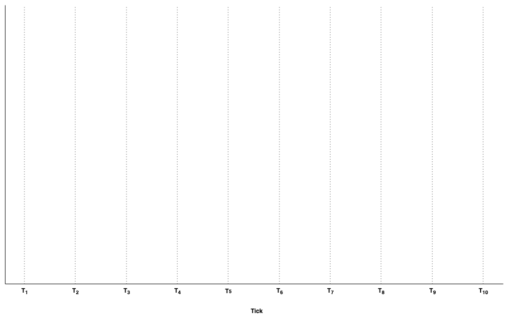

# Tick-Range Mechanism

## Introduction

In order to enable LPs to specify liquidity positions with customized price intervals, the protocol needed a way to track the aggregated liquidity across various price points. Uniswap V3 achieved this feat by partitioning the space of possible prices into discrete "ticks" whereby LPs could contribute liquidity between any two ticks.

Whenever you add/remove liquidity to a tick range (including a lowerTick and upperTick), the pool has to record how much virtual liquidity is kicked in/out when crossing these ticks and how many tokens are used to activate the liquidity within the range.

Critically, by defining ticks in relation to the price, it enables neighbouring ticks to scale according to the absolute price (i.e. each tick will always be a fixed % price movement from their neighbouring tick). As a result of this design, LPs are able to add liquidity within the closest tick ranges that approximates their preferred liquidity provision price range.

## Implementation overview

The series of diagrams below illustrates the tick-range mechanism for your convenience.

1. Price space is divided into discrete ticks (refer [Technical explanation](tick-range-mechanism.md#technical-explanation) below for exact formula)

<figure><figcaption><p>Discrete ticks</p></figcaption></figure>

2. LPs add their positions to selected tick ranges as indicated in the table below. Note that the contributed liquidity is evenly spread across all the tick intervals within the selected tick range.

<table><thead><tr><th width="115.33333333333331">Position</th><th width="126">Total Value </th><th width="152">Tick Range</th><th width="148">Tick Intervals</th><th>TVL Per Tick Interval</th></tr></thead><tbody><tr><td>1</td><td>500</td><td><span class="math">T_1 - T_6</span></td><td>5</td><td>100</td></tr><tr><td>2</td><td>1200</td><td><span class="math">T_4 - T_8</span></td><td>4</td><td>300 </td></tr><tr><td>3</td><td>500</td><td><span class="math">T_5 - T_{10}</span></td><td>5</td><td>100 </td></tr></tbody></table>

<figure><figcaption><p>3 separate liquidity positions</p></figcaption></figure>

3. From the protocol's perspective, it is now able to track the total liquidity per tick interval as well as the proportional split between all positions within that interval.

<table><thead><tr><th width="181.33333333333331">Tick Interval</th><th width="129">TVL</th><th>P1 Proportion</th><th>P2 Proportion</th><th>P3 Proportion</th></tr></thead><tbody><tr><td><span class="math">T_1 - T_2</span></td><td>100</td><td>100 (100%)</td><td>-</td><td>-</td></tr><tr><td><span class="math">T_2 - T_3</span></td><td>100</td><td>100 (100%)</td><td>-</td><td>-</td></tr><tr><td><span class="math">T_3 - T_4</span></td><td>100</td><td>100 (100%)</td><td>-</td><td>-</td></tr><tr><td><span class="math">T_4 - T_5</span></td><td>400</td><td>100 (25%)</td><td>300 (75%)</td><td>-</td></tr><tr><td><span class="math">T_5 - T_6</span></td><td>500</td><td>100 (20%)</td><td>300 (60%)</td><td>100 (20%)</td></tr><tr><td><span class="math">T_6 - T_7</span></td><td>400</td><td>-</td><td>300 (75%)</td><td>100 (25%)</td></tr><tr><td><span class="math">T_7 - T_8</span></td><td>400</td><td>-</td><td>300 (75%)</td><td>100 (25%)</td></tr><tr><td><span class="math">T_8 - T_9</span></td><td>100</td><td>-</td><td>-</td><td>100 (100%)</td></tr><tr><td><span class="math">T_9 - T_{10}</span></td><td>100</td><td>-</td><td>-</td><td>100 (100%)</td></tr></tbody></table>

<figure><figcaption><p>Tick TVL with each position shown</p></figcaption></figure>

As long as the market continues to trade within a particular tick interval, the fees will be distributed to the LP according to the proportion of liquidity that the LP added to the active tick. As the market moves towards either extremes of the tick interval, the corresponding liquidity in the pool will be gradually depleted until only a single token is left in that interval. Upon crossing a tick, the protocol then activates the liquidity within the next interval and the process is repeated according to the direction of price movement.

The amplitude of the tick range can be controlled by the protocol by specifying a tick spacing which determines the potential active ticks. Based on the price correlation between assets in the pool, capital can be more efficiently utilized by setting a smaller tick interval (as more liquidity is concentrated into a smaller interval to support trades). The flipside of this is that additional gas is consumed whenever a tick is crossed as the liquidity within the activated tick has to be activated. Due to these factors, pools with various fee tiers have been created to cater to the different liquidity preferences of LPs.

## Technical explanation

A tick is approximated as the square root price that is an integer power of $$\sqrt{1.0001}$$:

> $$\sqrt{p(i)} = 1.0001^i$$

Through the above equation, it allowed each tick to be defined as a \~0.5 basis point price movement from its neighbouring ticks. By specifying the tick spacing, the protocol can then determine the potential active ticks for each pool. For example, a tick spacing of 2 would result in each neighbouring tick being within \~1 basis point of the active tick.

### Ticks concentrated liquidity - LinkedList[​](https://docs.kyberswap.com/overview/elastic-walkthrough#ticks-concentrated-liquidity---linkedlist) <a href="#ticks-concentrated-liquidity---linkedlist" id="ticks-concentrated-liquidity---linkedlist"></a>

KyberSwap implements this tick range mechanism via a linked list data structure. As mentioned above, we need to store information about each tick to track the amount of net liquidity that should be added and removed when the tick is crossed. As a result, the tick's variables must contain the net liquidity of liquidity providers and the fee outside of the tick.

All these information is stored in the **TickData** struct

```
struct TickData
    uint128 liquidityGross;
    int128 liquidityNet;
    uint256 feeGrowthOutside;
    uint128 secondsPerLiquidityOutside;
 
```

Indeed, when swapping, the total amount of liquidity that is added or removed when the tick is crossed goes left and right. So we need to track the **liquidityNet**, which is the total amount of liquidity that is added and removed when the tick is crossed. This value is one signed integer: the amount of liquidity added when price moves rightward, and if we're moving leftward, we interpret **liquidityNet** as the opposite sign.

Between several ticks, there remains a possibility that we will not have any liquidity. As a result, to optimize, we only initialize a tick if and only if it has liquidity referencing the tick. The **liquidityGross** ensures that if net liquidity at a tick is 0, we can still know if a tick is referenced by at least one underlying position, which tells us whenever to initialize the tick.

We use **feeGrowthOutside** to track how much fees were accumulated within a given range. **feeGrowthOutside** needs to be updated each time the tick is crossed.

There could be several ticks that are not initialized and we only access/process data of initalized ticks, we need a data structure to store all initialized ticks with the ability to move from one initialized tick to its 2 adjacent initialized ticks optimally. To do so, we use a doubly linked list to store all initialized ticks.

The doubly linked list of initialized ticks is stored in the **initializedTicks** from the **PoolStorage**, each Linkedlist data consists of 2 variables:

```
struct Data
    int24 previous; // the previous data in the doubly linked list
    int24 next;     // the next data in the doubly linked list
```

| Field      | Type    | Explanation                                 |
| ---------- | ------- | ------------------------------------------- |
| `previous` | `int24` | the previous data in the doubly linked list |
| `next`     | `int24` | the next data in the doubly linked list     |

Initiallly, its **HEAD** is **MIN\_TICK** and its **TAIL** is **MAX\_TICK**, they will never be removed from the **initializedTicks**.

#### **Add new tick to the linked list**[**​**](https://docs.kyberswap.com/overview/elastic-walkthrough#add-new-tick-to-the-linked-list)

When adding a new tick **X,**  users will need to specify the tick **Y** that is initialized. To save on gas, the tick **Y** will have to be the tick that is closest and lower than the added tick **X**. However, due to on-chain delay/human error, there are few scenarios that could happen:

* **X** has been initialized, ignore this case.
* **Y** has been removed, the transaction will be reverted.
* There are several ticks have been initialized/added between **X** and **Y**, to avoid reverting, we allow to jump at most **MAX\_TICK\_TRAVEL** from **Y** to the right to find the nearest initialized tick that is lower than **X** in the current linked list, i.e: **Y < X < Y.next**.

Logic

```
if Y is removed -> revert
While (Y.next <= X && iteration <= MAX_TICK_TRAVEL):
    Y = Y.next
    iteration++;
if Y >= X or Y.next <= X -> revert - invalid lower value

// Add new tick X between Y and Y.next
X.next = Y.next
X.previous = Y
Y.next.previous = X
Y.next = X
```

#### **Remove a tick from the linked list**[**​**](https://docs.kyberswap.com/overview/elastic-walkthrough#remove-a-tick-to-the-linked-list)

When removing a tick **X**, there are 3 cases:

* **X** is **MIN\_TICK** or **MAX\_TICK**, ignore this case.
* **X** has been removed, the transaction will be reverted.
* Otherwise, remove **X** by linking its 2 adjacent ticks to each other, and return the previous tick.

Logic:

```
if X == X.previous -> return X; // X is the lowest tick
if X == X.next -> return X.previous; // X is the highest tick
// Remove tick X by linking its 2 adjacent ticks
X.previous.next = X.next;
X.next.previous = X.previous;
delete X
```

### Range mechanism[​](https://docs.kyberswap.com/explanation/appendix#appendix-a-range-mechanism) <a href="#appendix-a-range-mechanism" id="appendix-a-range-mechanism"></a>

#### Objective[​](https://docs.kyberswap.com/explanation/appendix#objective) <a href="#objective" id="objective"></a>

The goal is to accurately account a position's accured fees accured and duration for which it is active. A position is defined to be active if the current pool tick lies within the lower and upper ticks of the position.

#### Global value[​](https://docs.kyberswap.com/explanation/appendix#global-value) <a href="#global-value" id="global-value"></a>

The `feeGrowthGlobal` and `secondsPerLiquidityGlobal` variables represent the total amount for 1 unit of unbounded liquidity.&#x20;

<figure><figcaption></figcaption></figure>

#### Outside value[​](https://docs.kyberswap.com/explanation/appendix#outside-value) <a href="#outside-value" id="outside-value"></a>

The outside value (`feeGrowthOutside` and `secondsPerLiquidityOutside`) for a tick represents the accumulated value relative to the currentTick. By definition, we can visually represent it to be as such:

*   tick <= currentTick&#x20;

    <figure><figcaption></figcaption></figure>
*   tick > currentTick&#x20;

    <figure><figcaption></figcaption></figure>

#### **Initialization**[**​**](https://docs.kyberswap.com/explanation/appendix#initialization)

When a tick is initialized, all growth is assumed to happen below it. Hence, the outside value is initialized to the following values under these cases:

* tick <= currentTick: `outside value := global value`
* tick > currentTick: `outside value := 0`

#### Crossing ticks[​](https://docs.kyberswap.com/explanation/appendix#crossing-ticks) <a href="#crossing-ticks" id="crossing-ticks"></a>

Due to the definition of the outside value, a tick's outside value is reversed whenever the pool tick crosses it. Specifically, `outside value := global value - outside value`.

**Note**[**​**](https://docs.kyberswap.com/explanation/appendix#note)

When swapping downtick, the current tick is further decremented by 1. This is to ensure a tick's outside value is interpreted correctly. `swapData.currentTick = willUpTick ? tempNextTick : tempNextTick - 1;`

#### Calculating value inside ticks[​](https://docs.kyberswap.com/explanation/appendix#calculating-value-inside-ticks) <a href="#calculating-value-inside-ticks" id="calculating-value-inside-ticks"></a>

The current tick can be

1.  below a position (currentTick < lowerTick)  The value inside can therefore be calculated as `tickLower's outside value - tickUpper's outside value`

    <figure><figcaption></figcaption></figure>
2.  within a position (lowerTick <= currentTick < upperTick) &#x20;

    <figure><figcaption></figcaption></figure>

    The value inside can therefore be calculated as `global value - (lower + upper tick's outside values)`
3.  above a position (upperTick <= currentTick) &#x20;

    <figure><figcaption></figcaption></figure>

    The value inside can therefore be calculated as `tickUpper's outside value - tickLower's outside value`

### Tick-range mechanism[​](https://docs.kyberswap.com/explanation/appendix#appendix-b-tick-range-mechanism) <a href="#appendix-b-tick-range-mechanism" id="appendix-b-tick-range-mechanism"></a>

* To represent liquidity mapping, Kyberswap Elastic uses linked list, the linked list always starts by MIN\_TICK and ends by MAX\_TICK.
* The pool also need to track to the highest initialized tick which is lower than or equal to currentTick (aka `nearestCurrentTick`).

For example:

* the pool is initialized at tick 5, the linked list will be `[MIN_TICK, MAX_TICK]` and`nearestCurrentTick` will be MIN\_TICK.
* A adds liquidity at tick `[-5, 10]`, the linked list will be `[MIN_TICK, -5, 10, MAX_TICK]` and `nearestCurrentTick` will be -5.
* C adds liquidity at tick `[0, 100]`, the linked list will be `[MIN_TICK, -5, 0, 10, 100, MAX_TICK]` and `nearestCurrentTick` will be 0.
* B swaps and currentTick = 15, then `nearestCurrentTick` will be 10
* A remove all liquidity at tick `[-5, 10]`, the linked list will be `[MIN_TICK, 0, 100, MAX_TICK]` and`nearestCurrentTick` will be 0.
