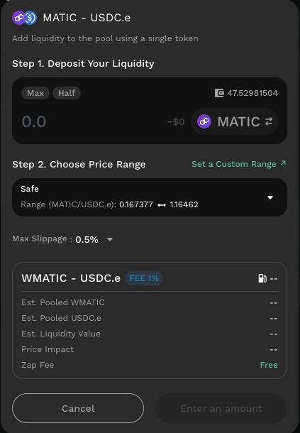
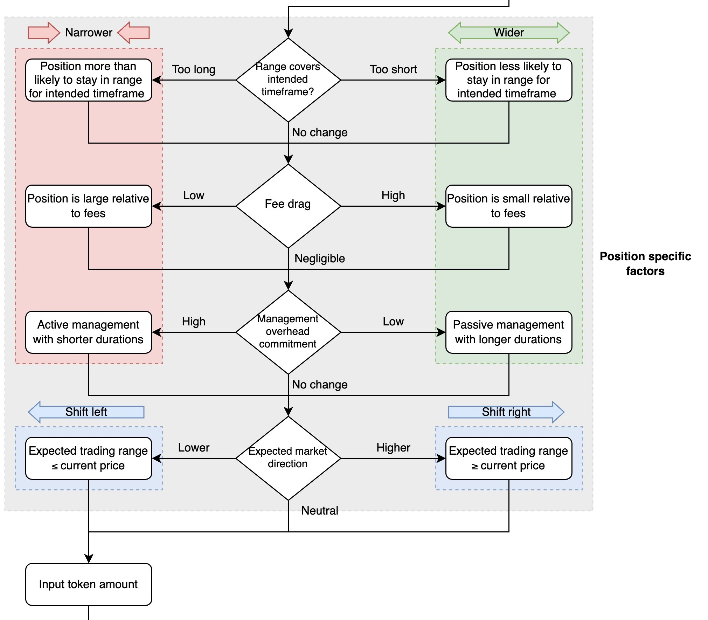
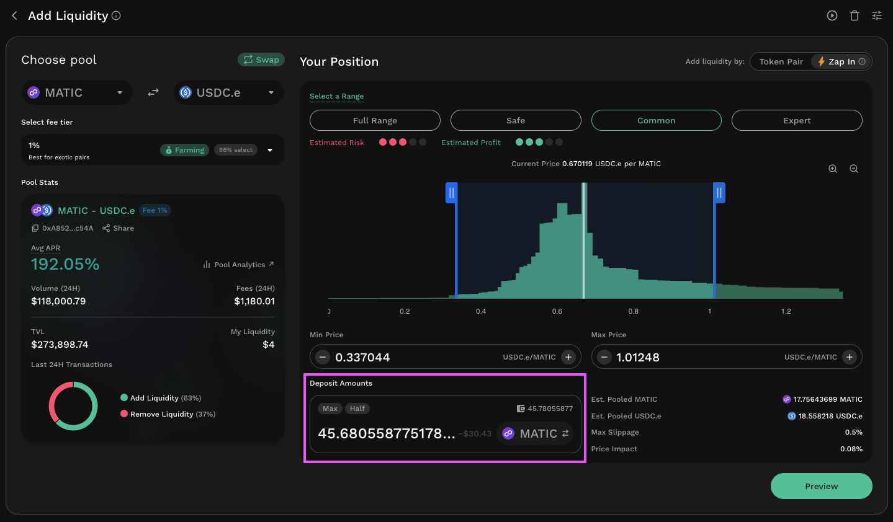
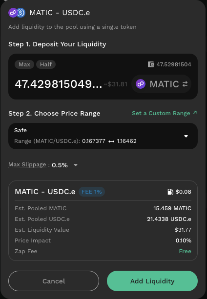
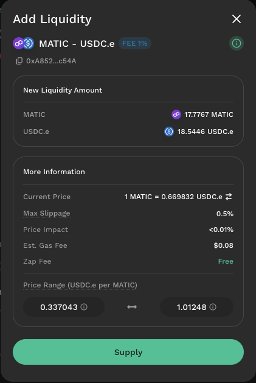

# Add Liquidity To An Existing Elastic Pool

## Introduction

In order to participate in a **KyberSwap Elastic** pool and earn fees, you first need to add liquidity to the pool. Adding liquidity to a pool opens a new position. You can add liquidity either to an existing pool, or as part of creating a new pool. This guide describes the steps required to **add liquidity to an existing pool**.

Note: “Adding Liquidity” should not be confused with “Increasing Liquidity.” Adding Liquidity means creating a new position, whereas Increasing Liquidity pertains to increasing the size of a position you currently hold. Please refer to [Increasing Liquidity On Elastic](increasing-liquidity-on-elastic.md) if you have an existing position that you would like to add more liquidity to.

Liquidity Provider Flow

Still deciding on which solution suits you best?&#x20;

* **Overview**: [Earn Yield By Contributing Liquidity](../../../kyberswap-solutions/kyberswap-interface/user-guides/earn-yield-by-contributing-liquidity.md)
* **Detailed comparison**:  [Classic vs Elastic](../../classic-vs-elastic/)&#x20;

#### Next steps

1. [Connect Your Wallet](../../../kyberswap-solutions/kyberswap-interface/user-guides/connect-your-wallet.md)
2. [Switching Networks](../../../kyberswap-solutions/kyberswap-interface/user-guides/selecting-preferred-network.md)
3. [Elastic Pool Creation ](elastic-pool-creation.md)
4. **Add Liquidity To An Existing Elastic Pool <-**
5. [Increasing Liquidity On Elastic](increasing-liquidity-on-elastic.md)
6. [Elastic Fee Collection](elastic-fee-collection.md)
7. [Yield Farming On Elastic](broken-reference)
8. [Removing Liquidity On Elastic](removing-liquidity-on-elastic.md)

## Adding liquidity to an existing pool

Here are the steps for opening a new position using an existing liquidity pool.

### **Step 1**: View available pools

Ensure you are on the correct network, and then choose the tokens to provide as liquidity. You can do this through the token selectors at the top of the Elastic Pools interface. Once you’ve selected your pair of tokens, a filtered list of pools that use that pair will be displayed on the interface.

Note: If you know the contract address of the pool you want, you can also filter the list for the pool you want by inputting the address in the search bar.


#### Non-standard tokens

As a permissionless protocol, KyberSwap enables users to provide liquidity and market make for any token implementing the [ERC20](https://docs.openzeppelin.com/contracts/4.x/erc20) interface. While this standard interface enables interoperability between various DeFi protocols (including KyberSwap), token teams are still able to specify customized token mechanics (i.e. supply/demand, tokenomics, etc.) which could result in unexpected outcomes.

Note that the token mechanics are specified as part of the token's smart contract hence KyberSwap does not have any control over specific token implementations. Some examples of non-standard tokens are:

* **Fee-on-transfer (FOT)**: For every token transfer, a percentage of the tokens are burned or distributed to various wallets.&#x20;
* **Rebase**: Token supply is adjusted periodically to maintain price stability.
* **LP**: Tokens representing a proportional claim of a liquidity pool's assets.

To ensure the safety of our user's funds, KyberSwap Elastic does not support non-standard tokens. Please do your own research before providing liquidity using such tokens as KyberSwap was optimized to handle the standard ERC20 implementation.


### **Step 2**: Select pool

Select the pool you’d like to participate in by clicking on the appropriate “Add Liquidity” or "Zap In" :zap: button. This will open the Add Liquidity screen.&#x20;

LPs that would like to add liquidity to predefined ranges can also take advantage of our Quick Zap option.


:zap: **Elastic Zap** :zap:

LPs can now zap into Elastic pools! This means adding liquidity with just a single token without the complexities of sourcing the exact token ratios.

Please visit the [Elastic Zap](../concepts/elastic-zap.md) explainer on how KyberSwap is making the LP experience more convenient while minimizing position management costs and risks.

Supported on:

* Arbitrum (ChainID: 42161)
* Polygon PoS (ChainID: 137)
* Optimism (ChainID: 10)
* Avalanche (ChainID: 43114)
* Base (ChainID: 8453)
* Scroll (ChainID: 534352)




.png>)



<figure><figcaption>
Add Token Pair Page
</figcaption></figure>



<figure><figcaption>
Quick Zap Popup
</figcaption></figure>

Quick Zap enables LPs to skip the complexities of choosing their position ranges by selecting a preset range configuration. You can skip straight to [Step 5](add-liquidity-to-an-existing-elastic-pool.md#step-5-configure-token-amounts) if you are using the Quick Zap option.




#### Adding liquidity to an out of range pool

For the safety of our LPs, KyberSwap Elastic will notify LPs when adding liquidity to a pool that is out of range. This is because any liquidity additions that significantly deviates from the market price would immediately result in [impermanent loss](../../../getting-started/foundational-topics/decentralized-finance/impermanent-loss.md) as arbitrageurs sweep up the significantly discounted token from the position.

.png>)


### **Step 3**: Select fee tier&#x20;

For a list of fee tiers and their recommended applications, please refer to [Fee Tier Options](elastic-pool-creation.md#fee-tier-options).

### **Step 4**: Set your price range

This is the range at which your capital will be used in the pool. If the market price moves outside the range your capital will not be used and will not earn any fees.


#### Choosing The Best Range To Maximize LP Returns

A LPs returns are heavily dependent on the [position range selected](add-liquidity-to-an-existing-elastic-pool.md#step-4-set-your-price-range) for [concentrated liquidity](../concepts/concentrated-liquidity.md) protocols such as KyberSwap Elastic. To help you maximize your potential returns, [KyberSwap Insights](https://blog.kyberswap.com/learn/insights-en/) has created a simple flow diagram which walks you through each of the key decision points when determining a position range which best suites your risk-adjusted return preferences.

View and interact with the full diagram in greater detail [here](https://blog.kyberswap.com/choosing-the-best-range-to-maximize-lp-returns-flow-chart/).&#x20;


You can set your price range either using the sliders or by typing in prices manually.

Note: You can also choose to click on the “Full Price Range” option, but that will set your range to be between 0 and infinity, and your liquidity will be very thinly spread out, greatly impairing its fee-earning potential.


#### Single-sided liquidity for Token Pair additions

For the safety of our LPs, KyberSwap Elastic only allows single-sided liquidity to be added if the selected price range does not support the current market price. This is because the addition of double-sided liquidity outside the market price would immediately result in [impermanent loss](../../../getting-started/foundational-topics/decentralized-finance/impermanent-loss.md) as arbitrageurs sweep up the significantly discounted token from the position.

Whenever a position outside the market price is created, the deposit amount for the corresponding token that is prone to immediate impermanent loss is disabled.

.png>)


### **Step 5**: Configure token amounts

Specify the deposit amount(s), or how much liquidity you would like to add to open this position. With the "Zap In" option, you can easily specify a single token amount which will automatically be converted into a position of the same value. See [Elastic Zap](../concepts/elastic-zap.md) for more details.

You can either manually type in amounts or use the “Max” and “Half” buttons.&#x20;

Note: The proportion of liquidity deposited for each leg of the pair is determined by your price range, so it is helpful to set the price range before specifying your deposit amounts.



<figure><figcaption>
Zap In Deposit Amount
</figcaption></figure>

You can switch which pool token that you will be zapping in with by selecting the token toggle. Once an amount has been set, you will be able to see the estimated token ratios for the position to be created.

Additionally, do take note of the corresponding [slippage](../../../getting-started/foundational-topics/decentralized-finance/slippage.md) and [price impact](../../../getting-started/foundational-topics/decentralized-finance/price-impact.md) as well. The slippage for the zap can be set in the dropdown menu bar on the top right.




Once you specify the deposit amount for one leg of the pair, the corresponding leg’s amount will be automatically calculated and populated for you.



<figure><figcaption>
Quick Zap Deposit Amount
</figcaption></figure>

You can switch which pool token that you will be zapping in with by selecting the token toggle. Once an amount has been set, you will be able to see the estimated token ratios for the position to be created.

Additionally, do take note of the corresponding [slippage](../../../getting-started/foundational-topics/decentralized-finance/slippage.md) and [price impact](../../../getting-started/foundational-topics/decentralized-finance/price-impact.md) as well. The slippage for the zap can be set in the dropdown menu bar on the top right.



### **Step 6**: Authorize contract

If you haven’t already done so, you will need to authorize the KyberSwap smart contract to transact using your tokens on this network. Click the “Approve \[Token]” button to do so. This will open the approval dialog window on your wallet.

Once the approval is confirmed, the previously-greyed-out “Preview” button will be clickable.

### **Step 7**: Review liquidity provision

Click on the “Preview” button to bring up the preview screen.&#x20;


#### Slippage: Protecting your liquidity

As an AMM protocol, any additions of liquidity to the pool might result in slippage whereby the final amount deposited differs from the expected amount. To minimize the effects of slippage, KyberSwap Elastic enables you to configure a slippage tolerance that caps the amount of slippage above which your transaction will be reverted (i.e. failed and cancelled).

Please refer to [AMM Slippage](../../../getting-started/foundational-topics/decentralized-finance/slippage.md#amm-slippage) for further details on why slippage occurs and how to protect your liquidity additions or removals.




<figure><figcaption>
Zap In Preview
</figcaption></figure>







Once you have reviewed the information on this screen, click on the “Supply” button to proceed.

You will need to confirm this transaction in your wallet.

Once you’ve confirmed the transaction you will see a screen informing you that the transaction has been submitted. You can click on “View Transaction” to view your transaction on the appropriate blockchain explorer.

Your new position should now be visible on the My Pools page on KyberSwap.

