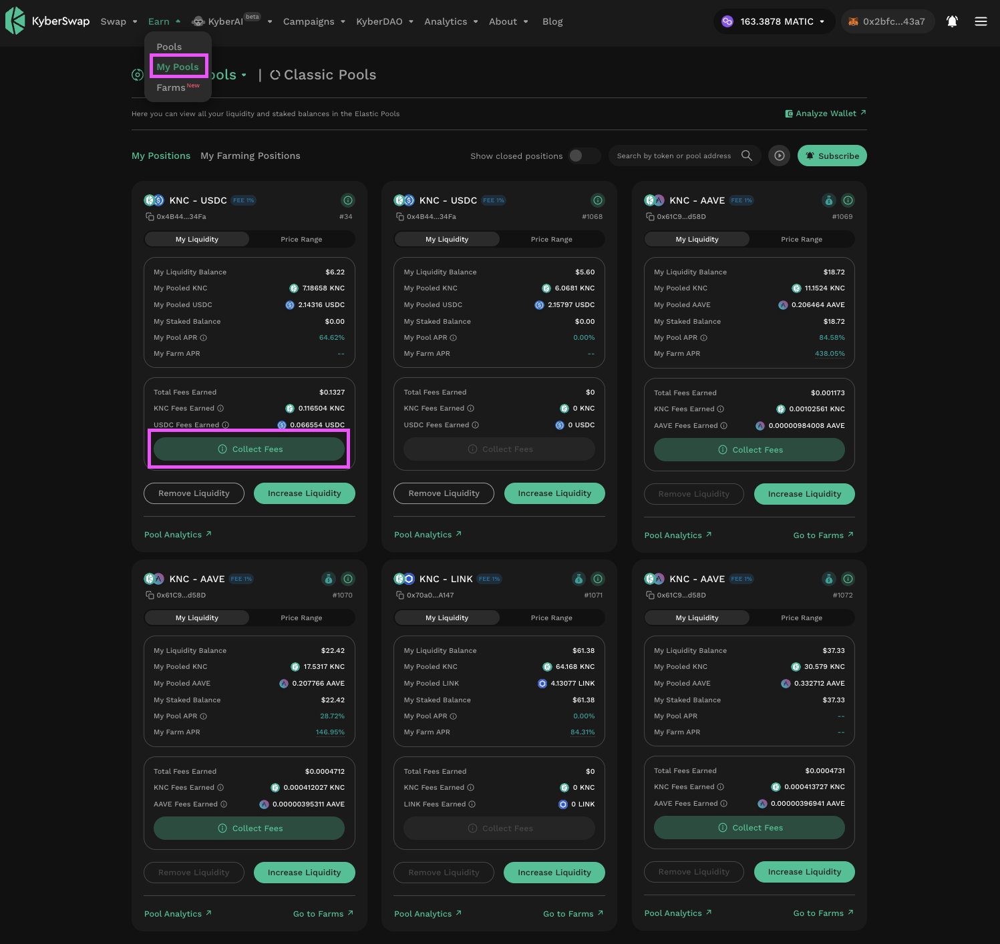
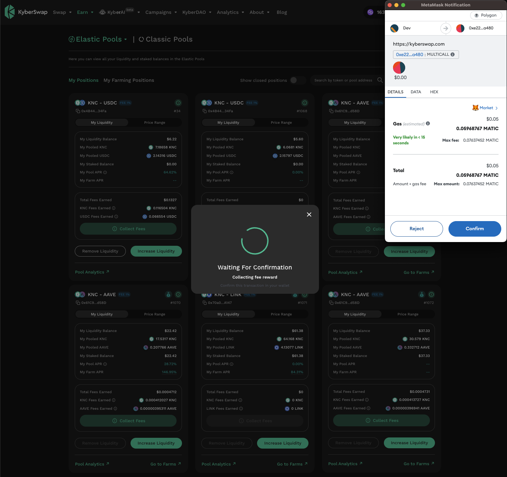
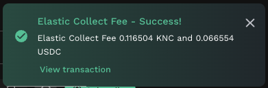
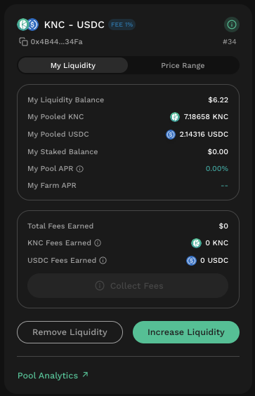

# Elastic Fee Collection

## Introduction

Whenever your active position goes into supporting trades, the market making fees are automatically reinvested into the pool. Consequently, fees are automatically compounded and accrued to your position. KyberSwap Elastic provides LPs the option to independently collect their accrued fees without affecting the underlying liquidity position. This means that LPs are able to reap the benefits of their auto-compounded yields at any time.


#### Fee collection for positions staked in farms

KyberSwap Elastic enables you to continue [earning farming rewards](broken-reference) while collecting the trading fees accrued to your position. If your liquidity position has been staked to a farm, you do not need to unstake your position in order to collect the accrued fees. You can proceed with the fee collection as per normal while your farming position remains unchanged.

This means that fees can be collected at anytime without having to worry about missing out on farming rewards nor the gas fees that accompanies a staking and unstaking of an underlying liquidity position.


Liquidity Provider Flow

Still deciding on which solution suits you best?&#x20;

* **Overview**: [Earn Yield By Contributing Liquidity](../../../kyberswap-solutions/kyberswap-interface/user-guides/earn-yield-by-contributing-liquidity.md)
* **Detailed comparison**:  [Classic vs Elastic](../../classic-vs-elastic/)&#x20;

#### Next steps

1. [Connect Your Wallet](../../../kyberswap-solutions/kyberswap-interface/user-guides/connect-your-wallet.md)
2. [Switching Networks](../../../kyberswap-solutions/kyberswap-interface/user-guides/selecting-preferred-network.md)
3. [Elastic Pool Creation ](elastic-pool-creation.md)
4. [Add Liquidity To An Existing Elastic Pool ](add-liquidity-to-an-existing-elastic-pool.md)
5. [Increasing Liquidity On Elastic](increasing-liquidity-on-elastic.md)&#x20;
6. **Elastic Fee Collection <-**
7. [Yield Farming On Elastic](broken-reference)
8. [Removing Liquidity On Elastic](removing-liquidity-on-elastic.md)

## Collecting your auto-compounded fees

### Step 1: Select position&#x20;

From the My Pools page, choose the position from which to collect fees. You will be able to view the total fees which your position has earned on the position card. Note that the "Collect Fees" button will only be enabled in green if trading fees have been accrued to your liquidity position.

<figure><figcaption>
Elastic pools dashboard
</figcaption></figure>

### Step 2: Collect the fees

Click on the "Collect Fees" button and you will prompted to confirm this action in Metamask. Note that this will remove 100% of the accrued fees.

<figure><figcaption>
Confirm fee collection
</figcaption></figure>


#### Fee-on-transfer tokens

Certain ERC20 token smart contracts implement a fee-on-transfer (FOT) mechanism whereby for every token transfer, a percentage of the tokens are burned or distributed to various wallets.

To ensure the safety of our user's funds as well as avoid any unexpected outcomes, KyberSwap Elastic does not support FOT tokens. All KyberSwap Elastic transactions involving any FOT token will be failed as a safety precaution.

Note that the FOT tax is specified in the FOT token's smart contract (i.e. the FOT token team) hence KyberSwap does not have any control over the FOT mechanism. Users are advised to trade such tokens at their own risk as KyberSwap was optimized to handle the standard ERC20 implementation.


#### Step 3: Fees collected

KyberSwap will notify you of the fee collection success upon confirmation of the transaction.

<figure><figcaption>
KyberSwap fee collection success notification
</figcaption></figure>

Notice that the fees have also been removed from your position.

<figure><figcaption>
Fees removed
</figcaption></figure>
