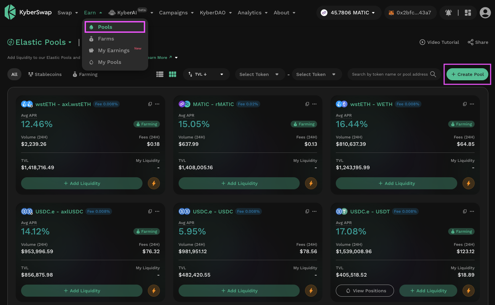
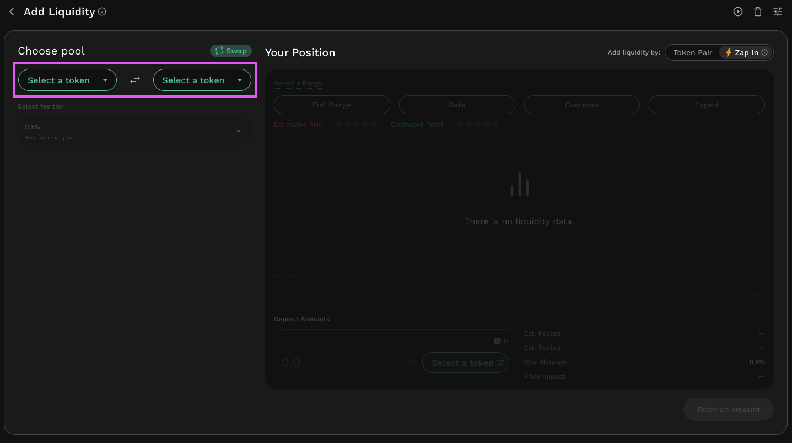
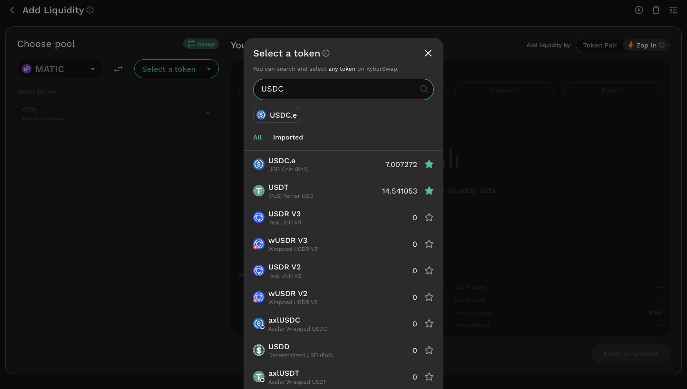
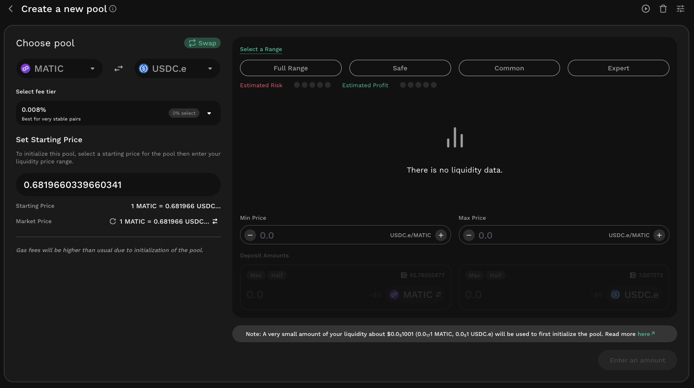

# Elastic Pool Creation


**KyberSwap Elastic Security Incident**

On 22 Nov 2023, the Elastic protocol experienced a security incident. More details can be found via our [official channels](https://x.com/KyberNetwork?s=20).

All other KyberSwap products ([Aggregator](../../../kyberswap-solutions/kyberswap-aggregator/), [Limit Order](../../../kyberswap-solutions/limit-order/), & [Classic](../../kyberswap-classic/)) continue to be fully operational.


## Introduction

In order to participate in a **KyberSwap Elastic** pool and earn fees, you first need to add liquidity to the pool. Adding liquidity to a pool opens a new position. You can add liquidity either to an existing pool, or as part of creating a new pool. This guide describes the steps required to **create a new pool by adding liquidity**.

Note: “Adding Liquidity” should not be confused with “Increasing Liquidity.” Adding Liquidity means creating a new position, whereas Increasing Liquidity pertains to increasing the size of a position you currently hold. You can refer to [Add Liquidity To An Existing Elastic Pool](add-liquidity-to-an-existing-elastic-pool.md) for a guide on increasing your liquidity position.

Liquidity Provider Flow

Still deciding on which solution suits you best?&#x20;

* **Overview**: [Earn Yield By Contributing Liquidity](../../../kyberswap-solutions/kyberswap-interface/user-guides/earn-yield-by-contributing-liquidity.md)
* **Detailed comparison**:  [Classic vs Elastic](../../classic-vs-elastic/)&#x20;

#### Next steps

1. [Connect Your Wallet](../../../kyberswap-solutions/kyberswap-interface/user-guides/connect-your-wallet.md)
2. [Switching Networks](../../../kyberswap-solutions/kyberswap-interface/user-guides/selecting-preferred-network.md)
3. **Elastic Pool Creation <-**
4. [Add Liquidity To An Existing Elastic Pool ](add-liquidity-to-an-existing-elastic-pool.md)
5. [Increasing Liquidity On Elastic](increasing-liquidity-on-elastic.md)
6. [Elastic Fee Collection](elastic-fee-collection.md)
7. [Yield Farming On Elastic](broken-reference)
8. [Removing Liquidity On Elastic](removing-liquidity-on-elastic.md)

## Adding liquidity to create a new pool

Here are the steps to create a new pool and by definition, to open a new position.

### **Step 1**: Create a pool

Ensure you are on the correct network, and then click the “Create Pool” button at the top right of the screen.

<figure><figcaption>
Elastic Pool page
</figcaption></figure>

This will bring up the Add Liquidity screen, but it will be fairly empty until the parameters of the pool are properly specified.

<figure><figcaption>
Pool creation screen
</figcaption></figure>

### **Step 2**: Select tokens to add

Select the pair of tokens you would like to create the pool with. You can choose from already whitelisted tokens or [import any token](../../../kyberswap-solutions/kyberswap-interface/user-guides/add-your-favourite-tokens.md) on your chosen network.

#### Note on pool initilization for low-decimal, high-value tokens

As an open and permissionless protocol, KyberSwap Elastic allows any ERC20 token pool to be created. Consequently, **users are responsible for checking the decimals of exotic tokens** as providing low-decimal but high unit value tokens might result in higher than expected pool initialization costs.&#x20;

This is due to a small portion of the provided liquidity being allocated to meet the minimum liquidity requirements when creating a new [reinvestment curve](../concepts/reinvestment-curve.md). While care has been taken when designing this anti-spam mechanism to suit the vast majority of tokens, token teams are still free to define their own tokens. Please refer to [Pool Initialization](../concepts/pool-process-flows.md#pool-unlocking--initialization) for further details.

<figure><figcaption>
Select token pair
</figcaption></figure>

<figure><figcaption>
Token pair selected
</figcaption></figure>

If the token pair selected already has an existing pool, the corresponding pool data will be displayed. The interface above will only be shown If you're creating a new pool with a unique fee tier (see below) for the token pair.

Notice that upon selecting the token pair, the current market price is also displayed for reference. Additionally, when creating a new pool, a small amount of liquidity will be needed to seed the pool's liquidity in order to [prevent spam](../concepts/pool-process-flows.md#pool-unlocking--initialization).


#### Non-standard tokens

As a permissionless protocol, KyberSwap enables users to provide liquidity and market make for any token implementing the [ERC20](https://docs.openzeppelin.com/contracts/4.x/erc20) interface. While this standard interface enables interoperability between various DeFi protocols (including KyberSwap), token teams are still able to specify customized token mechanics (i.e. supply/demand, tokenomics, etc.) which could result in unexpected outcomes.

Note that the token mechanics are specified as part of the token's smart contract hence KyberSwap does not have any control over specific token implementations. Some examples of non-standard tokens are:

* **Fee-on-transfer (FOT)**: For every token transfer, a percentage of the tokens are burned or distributed to various wallets.&#x20;
* **Rebase**: Token supply is adjusted periodically to maintain price stability.
* **LP**: Tokens representing a proportional claim of a liquidity pool's assets.

To ensure the safety of our user's funds, KyberSwap Elastic does not support non-standard tokens. Please do your own research before providing liquidity using such tokens as KyberSwap was optimized to handle the standard ERC20 implementation.


### **Step 3:** Select fee tier

With the token pair selected, you will then be required to select your fee tier. For your convenience, the distribution of liquidity is also displayed in the dropdown to allow you to see which are the most popular fee tiers for your selected token pairs. Additionally, pools which are eligible for [farming rewards](broken-reference) are also highlighted via the :moneybag: icon.

<figure><figcaption>
Select fee tier
</figcaption></figure>

KyberSwap Elastic currently offers the following tiers to cater for different token pair correlations:

<strong>Fee tier options</strong>

In general, the lower the token correlation, the higher the recommended fee tier. Higher fee tiers offsets the impermanent loss risks which accompanies less correlated pairs.

1. **Best for very stable pairs: 0.008%, 0.01%, 0.02%**\
   These fee tiers are ideal for token pairs that typically trade at a fixed or extremely high correlated rate, such as pairs of stablecoins (e.g. DAI-USDC). Liquidity providers take on minimal price risk in these pools, and traders expect to pay minimal fees.
2. **Best for stable pairs: 0.04%** \
   The 0.04% fee tier is ideal for token pairs that typically trade at a fixed or highly correlated rate, such as pairs of stablecoins (e.g. DAI-USDC). Liquidity providers take on minimal price risk in these pools, and traders expect to pay minimal fees.
3. **Best for most pairs: 0.1%, 0.25%, 0.3%**\
   These fee tiers are best suited for less correlated token pairs such as the ETH-DAI token pair, which are subject to significant price movements to either upside or downside. This higher fee is more likely to compensate liquidity providers for the greater price risk that they take on relative to stablecoin LPs.
4. **Best for exotic pairs: 1%** \
   The 1% fee tier is best suited for even less correlated token pairs such as the ETH-KNC token pair, which are subject to significant price movements to either upside or downside. This higher fee is more likely to compensate liquidity providers for the greater price risk that they take on relative to stablecoin liquidity providers.
5. **Best for very volatile pairs: 2%**\
   The 2% fee tier is best suited for very volatile pairs which are subject to extreme price movements to either the upside or downside. The significantly higher fee is more likely to compensate liquidity providers for the significant price risk.
6. **Best for rare use cases: 5%** \
   The 5% fee tier is created specifically for the purpose of price discovery for new tokens against exotic tokens such as KNC. As the final price of the token pair can differ significantly from launch, a higher fee compensates LPs for the extreme IL risks during this highly volatile period.


#### Adding liquidity to an existing fee tier

Selecting a fee tier with existing liquidity will result in your position being added to the existing pool. A separate guide has been created just for [Adding Liquidity To An Existing Elastic Pool](add-liquidity-to-an-existing-elastic-pool.md#step-4-set-your-price-range).


### **Step 4: Set starting price**

Upon selecting a new fee tier, you will then need to specify the starting price for the pool. For reference, the current market price of the token pair selected is also displayed. The starting price will determine the specific [price curve](../../../getting-started/foundational-topics/decentralized-finance/automated-market-maker.md#price-curves) that is implemented for the pool.

<figure><figcaption>
Set starting price
</figcaption></figure>


#### Price deviations

As a safety precaution, KyberSwap Elastic will prompt the LP if the specified pool price deviates significantly from the market price.This is because any liquidity additions that significantly deviates from the market price would immediately result in [impermanent loss](../../../getting-started/foundational-topics/decentralized-finance/impermanent-loss.md) as arbitrageurs sweep up the significantly discounted token from the position.

.png>)


### **Step 5**: Set price range

This is the range at which your capital will be used in the pool. If the market price moves outside this range, your capital will not be used and will not earn any fees.


#### Choosing The Best Range To Maximize LP Returns

A LPs returns are heavily dependent on the [position range selected](add-liquidity-to-an-existing-elastic-pool.md#step-4-set-your-price-range) for [concentrated liquidity](../concepts/concentrated-liquidity.md) protocols such as KyberSwap Elastic. To help you maximize your potential returns, [KyberSwap Insights](https://blog.kyberswap.com/learn/insights-en/) has created a simple flow diagram which walks you through each of the key decision points when determining a position range which best suites your risk-adjusted return preferences.

View and interact with the full diagram in greater detail [here](https://blog.kyberswap.com/choosing-the-best-range-to-maximize-lp-returns-flow-chart/).&#x20;


You can set your price range either by typing in the prices manually or ussing the +/- buttons. For new pools, as there is no existing liquidity, no liquidity data will be shown.

<figure><figcaption>
Select price range
</figcaption></figure>

For convenience, KyberSwap also provides you the option to choose from a list of preset ranges which correspond to different DeFi familiarity and risk profiles. The section below provides some guidance on the percentage-based options matched to the token pair correlation which is calculated by KyberSwap.

Full Range

**All token pairs:** Suitable for pairs with high price volatility. Although you always earn fees, your capital efficiency is the lowest among all choices.

Safe

**Exotic:** Suitable for high-risk appetite LPs for pairs with high price volatility. Anticipating price to fluctuate within \~150%. You can earn fees even if the price goes up by 75% or goes down by 75%.

**Normal:** Suitable for pairs with low price volatility. Anticipating price to fluctuate within \~45%. You can earn fees even if the price goes up by 22.5% or goes down by 22.5%.

**Stable:** Suitable for stablecoin or stable correlated pairs. Anticipating price to fluctuate within \~3%. You can earn fees even if the price goes up by 1.5% or goes down by 1.5%.

**Super stable:** Suitable for stable pairs. Anticipating price to fluctuate within \~1.5%. You can earn fees even if the price goes up by 0.75% or goes down by 0.75%.

Common

**Exotic:** Suitable for low-risk appetite LPs for pairs with high price volatility. Anticipating price to fluctuate within \~100%. You can earn fees even if the price goes up by 50% or goes down by 50%.

**Normal:** Suitable for pairs with low price volatility. Anticipating price to fluctuate within \~30%. You can earn fees even if the price goes up by 15% or goes down by 15%.

**Stable:** Suitable for stablecoin or stable correlated pairs. Anticipating price to fluctuate within \~2%. You can earn fees even if the price goes up by 1% or goes down by 1%.

**Super stable:** Suitable for stable pairs. Anticipating price to fluctuate within \~1%. You can earn fees even if the price goes up by 0.5% or goes down by 0.5%.

Expert

**Exotic:** Suitable for stable pairs. Anticipating price to fluctuate within \~1%. You can earn fees even if the price goes up by 0.5% or goes down by 0.5%.

**Normal:** Suitable for pairs with low price volatility. Anticipating price to fluctuate within \~9%. You can earn fees even if the price goes up by 4.5% or goes down by 4.5%.

**Stable:** Suitable for stablecoin or stable correlated pairs. Anticipating price to fluctuate within \~0.6%. You can earn fees even if the price goes up by 0.3% or goes down by 0.3%.

**Super stable:** Suitable for stable pairs. Anticipating price to fluctuate within \~0.3%. You can earn fees even if the price goes up by 0.15% or goes down by 0.15%.

### **Step 5**: Specify liquidity amount

Specify the deposit amounts, or how much liquidity you would like to add to open this position. You can either manually type in amounts or use the “Max” and “Half” buttons. Once you specify the deposit amount for one leg of the pair, the corresponding leg’s amount will be automatically calculated and populated for you.

Note: The proportion of liquidity deposited for each leg of the pair is determined by your price range, so it is helpful to set the price range before specifying your deposit amounts.

<figure><figcaption>
Specify deposit amount
</figcaption></figure>

### **Step 6**: Authorize contract

If you haven’t already done so, you will need to need to authorize the KyberSwap smart contract to transact using your tokens on this network. Click the “Approve \[Token]” button to do so. This will open the approval dialog window on your wallet.

Once the approval is confirmed, the previously-greyed-out “Preview” button will be clickable.

### **Step 7**: Review liquidity provision transaction

Click on the “Preview” button to bring up the preview screen. Once you have reviewed the information on this screen, click on the “Supply” button to proceed.

<figure><figcaption>
Add liquidity preview for confirmation
</figcaption></figure>

You will need to confirm this transaction in your wallet.

<figure><figcaption>
Add liquidity confirmation
</figcaption></figure>

Once you’ve confirmed the transaction you will see a screen informing you that the transaction has been submitted. You can click on “View Transaction” to view your transaction on the appropriate blockchain explorer.

Your new position should now be visible on the My Pools page on KyberSwap.

<figure><figcaption>
My pools
</figcaption></figure>
