# Yield Farming On Dynamic Farms


#### Dynamic Farms: Market driven rewards

Following feedback on Dynamic Farms, KyberSwap has introduced an alternative Elastic Farming mechanism in Static Farms to enable for more customizable reward distribution parameters.&#x20;

Unlike Dynamic Farms which require the underlying liquidity position to support the active market price, Static Farms enable LPs to continue earning farming rewards by contributing liquidity towards an operator defined farm range. Please refer to [Tick-Based Farming](../concepts/tick-based-farming.md) for a detailed comparison between the two mechanisms.

For a guide on Static Farms, please refer to [Yield Farming On Static Farms](yield-farming-on-static-farms.md).


## Introduction

Yield Farming or Liquidity Mining is a aspect of DeFi that allows Liquidity Providers (LPs) to passively earn a return on capital contributed to a liquidity pool. The Yield Farm provides LPs with rewards over time to incentivize LPs to continue to provide liquidity to the pool as well as to help offset their risk.

This guide covers yield farming on KyberSwap Elastic Dynamic Farms. It covers the following aspects of yield farming on Dynamic Farms:

* [Staking Liquidity Positions](yield-farming-on-dynamic-farms.md#staking-liquidity-positions)
* [Harvesting and Claiming Rewards](yield-farming-on-dynamic-farms.md#harvesting-and-claiming-rewards)
* [Unstaking Liquidity Positions](yield-farming-on-dynamic-farms.md#unstaking-liquidity-positions)

Liquidity Provider Flow

Still deciding on which solution suits you best?&#x20;

* **Overview**: [Earn Yield By Contributing Liquidity](../../../kyberswap-solutions/kyberswap-interface/user-guides/earn-yield-by-contributing-liquidity.md)
* **Detailed comparison**:  [Classic vs Elastic](../../classic-vs-elastic/)&#x20;

#### Next steps

1. [Connect Your Wallet](../../../kyberswap-solutions/kyberswap-interface/user-guides/connect-your-wallet.md)
2. [Switching Networks](../../../kyberswap-solutions/kyberswap-interface/user-guides/selecting-preferred-network.md)
3. [Elastic Pool Creation ](elastic-pool-creation.md)
4. [Add Liquidity To An Existing Elastic Pool ](add-liquidity-to-an-existing-elastic-pool.md)
5. [Increasing Liquidity On Elastic](increasing-liquidity-on-elastic.md)&#x20;
6. [Elastic Fee Collection](elastic-fee-collection.md)&#x20;
7. **Yield Farming**
   * **On Dynamic Farms <-**
   * [On Static Farms ](yield-farming-on-static-farms.md)
8. [Removing Liquidity On Elastic](removing-liquidity-on-elastic.md)

## Staking liquidity positions

### Step 1: Select farm and open a position

<figure>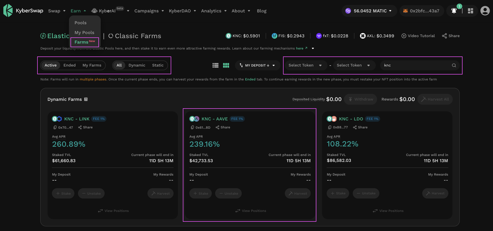<figcaption>
Select Dynamic Farm
</figcaption></figure>

You can view and filter the list of active farms on the [Farms page](https://kyberswap.com/farms/). For the purposes of this guide, we will use a KNC - LINK pool with a fee tier of 1% on Polygon PoS.&#x20;


#### Dynamic Farms reward eligibility

You will continue to earn Dynamic Farming rewards as long as the token continues to trade within the position's selected range. That is, your position's selected range must encompass the active market price to be eligible for farming rewards.

You can refer to [Dynamic Farms concept guide](../concepts/tick-based-farming.md#dynamic-farms) if you require further information on the exact farming mechanism.


Do note that an existing position will be required to be eligible for farming rewards. You can skip this section if you have an existing eligible position. For the complete guide on how to add liquidity to an Elastic pool, please refer to [Add Liquidity To An Existing Elastic Pool](add-liquidity-to-an-existing-elastic-pool.md).

<figure>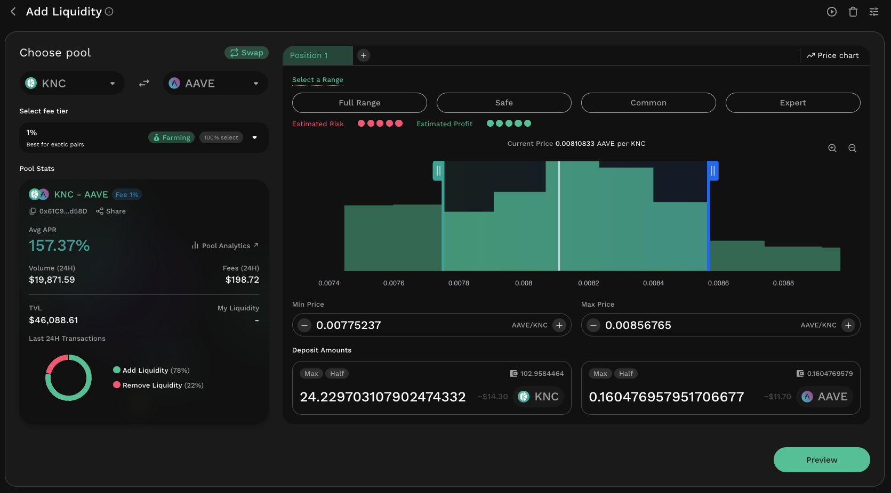<figcaption>
Open liquidity position
</figcaption></figure>

### Step 2: Approve the farming contract

<figure>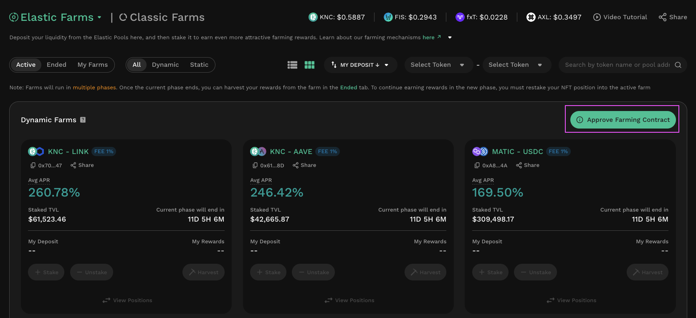<figcaption>
Approve farming contract
</figcaption></figure>

If this is your first time interacting with Elastic Dynamic Farms on this particular network, you will need to give approval for the farming smart contract to manage your wallet and balances.

Click on the “Approve Farming Contract” button on the Farms page to begin. This will require an onchain approval through your Web3 wallet.

Note: Be sure to check that the smart contract address is correct before authorizing the smart contract. KyberSwap Elastic farming smart contract addresses can be found [here](../contracts/elastic-farming-contract-addresses.md).

### **Step 3**: Stake your position in the farm


#### Stake directly into Dynamic Farms

As an added convenience feature, Liquidity Providers are now able to directly stake their positions into their selected farm without first having to deposit their NFT positions into the Dynamic Farms contract. Positions are automatically deposited and staked into the farm hence LPs will only have to sign a single transaction to reap the farming rewards.


<figure>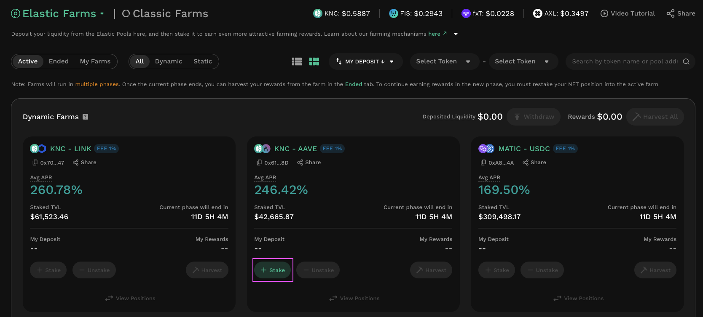<figcaption>
Stake position
</figcaption></figure>

Click on the “+ Stake” button to stake your NFT position.&#x20;

<figure>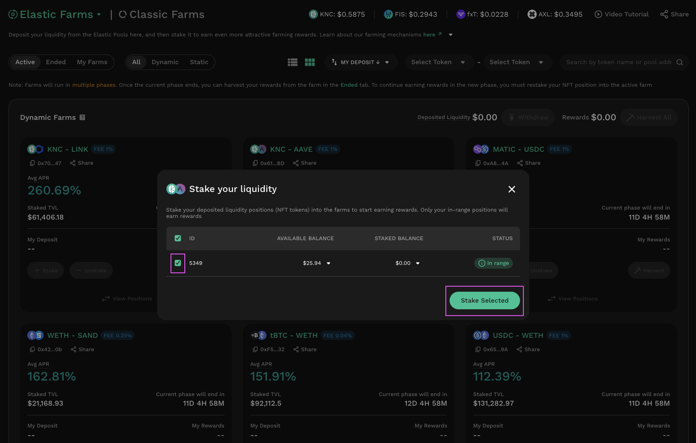<figcaption>
Select positions to be staked
</figcaption></figure>

Select the appropriate NFT from the list on the next screen and click the “Stake Selected” button to proceed. (This is an onchain transaction.)

Your position is staked and is now eligible to accumulate rewards for the duration of the farming phase. You should now also be able to see your farming pool under the “My Farms” tab. This page will also display ended phases for the farms that you are currently participating in.

Note: Depending on the [farming mechanism](../concepts/tick-based-farming.md) associated with your farm, your rewards will be calculated depending on the value of your liquidity position staked in the farm relative to other farmers, how long your liquidity position has been active in the pool (i.e. in range), and the trading volume utilizing your active liquidity position in the pool.

### Step 4: View your staked positions

<figure>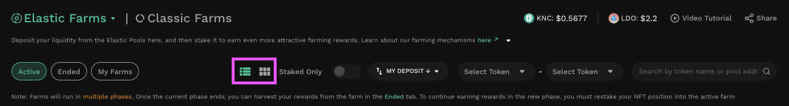<figcaption>
Toggle farm view
</figcaption></figure>

KyberSwap Elastic farms provides you two options when viewing your staked positions. This can be toggled using the view option in the filter bar located at the top of the page.



In the grid view, all active farms will be displayed as individual cards in a grid. Your staked farms will be prioritized at the beginning of the grid. Note that in the grid overview page, you will be able to see how many of your positions are in or out of range by referring to the top right of each card.

<figure>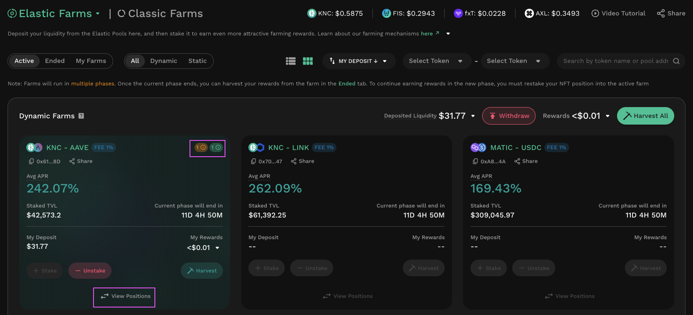<figcaption>
Farm grid overview
</figcaption></figure>

To expose further details, you can select on the "View Positions" button at the bottom of each farm card.

<figure>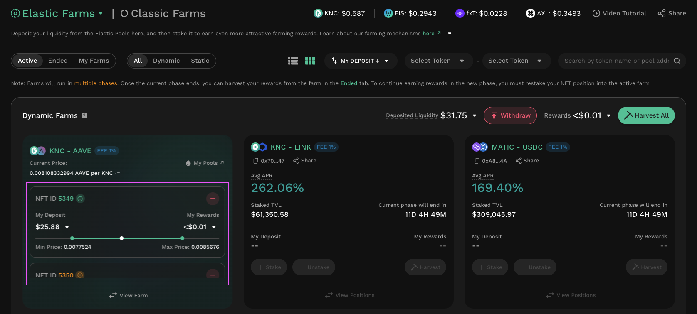<figcaption>
Farm grid details
</figcaption></figure>

By viewing the positions in farms where you have a staked position, you will be able to view all the staked positions within the particular farm as well as the active price relative to the range of your staked positions.



In the list view, all active farms will be displayed as individual rows within a list. Your staked farms will be prioritized at the top of the list. Note that in the list overview page, you will be able to see how many of your positions are in or out of range under the "My Deposit" row.&#x20;

<figure>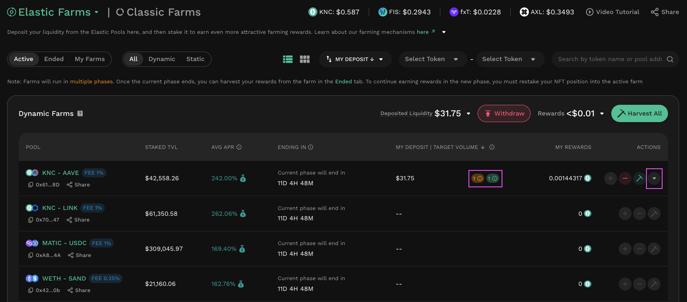<figcaption>
Farm list overview
</figcaption></figure>

To expose further details, you can select on the dropdown icon at the right of each farm entry.

<figure>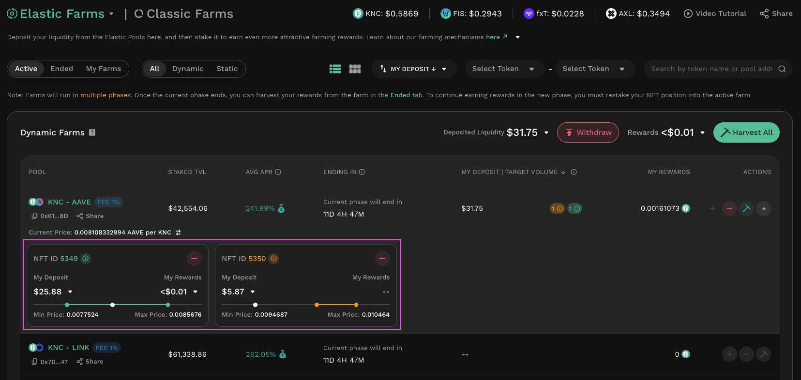<figcaption>
Farm list details
</figcaption></figure>

By expanding the farm rows where you have a staked position, you will be able to view all the staked positions within the particular farm as well as the active price relative to the range of your staked positions.



## Harvesting and claiming rewards

After you have accumulated rewards, you can harvest them from the pool and subsequently claim them (i.e. withdraw rewards to your wallet).

### **Step 1**: Select pools to harvest

From the Farms page, click on the small “pickaxe” button associated with your desired pool to bring up the Harvest helper. Alternatively, if you have multiple pool farms and would like to harvest them all at once, you can use the “Harvest All” button to batch all the harvest transactions together. Please note that this does not save you any gas fees since every individual harvest call of the smart contract still needs to be broadcasted to the blockchain.

<figure>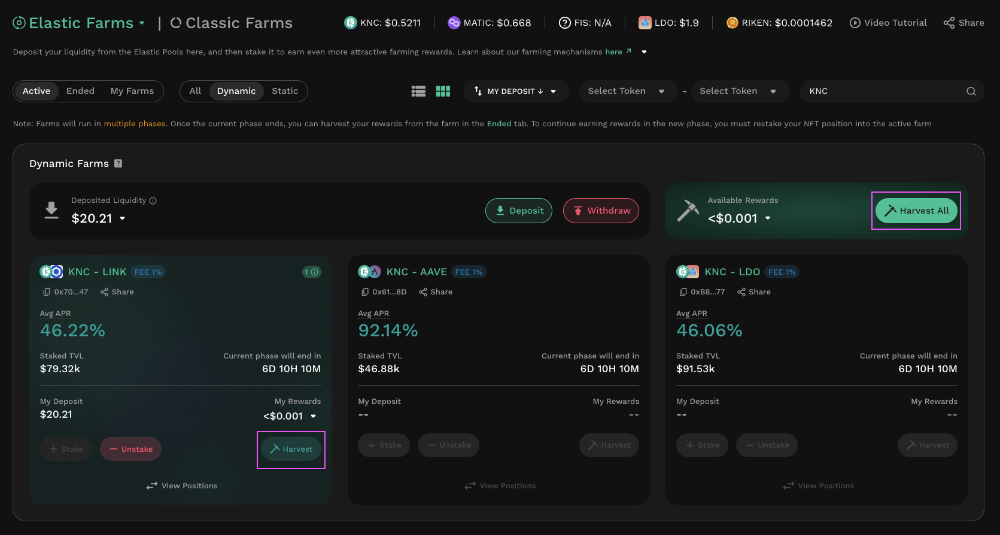<figcaption>
Harvest rewards
</figcaption></figure>

### Step 2: Confirm harvest

From the Harvest screen that appears, click on the “Harvest” or "Harvest All" button to proceed. This is an onchain transaction that will require wallet confirmation.

<figure>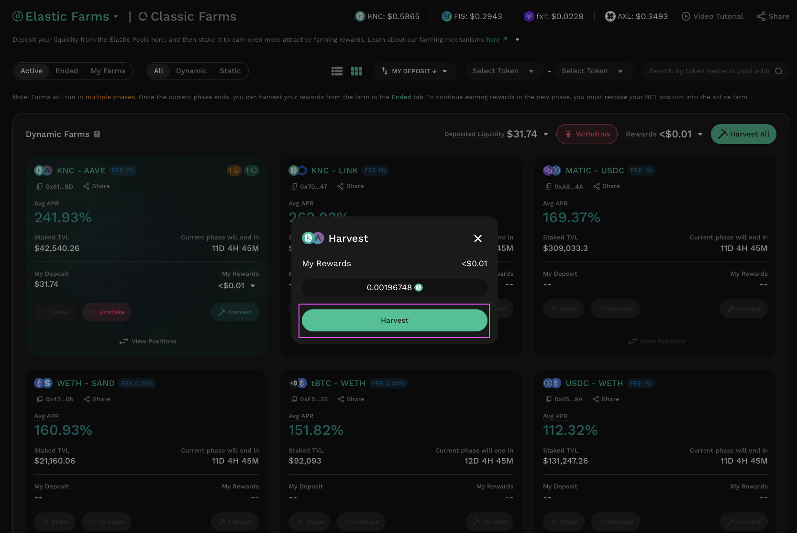<figcaption>
Harvest all pop-up
</figcaption></figure>

If the pool does not have a rewards vesting schedule, your rewards will automatically be sent to your wallet. But if the pool has a vesting schedule, you will need to wait some time after harvesting for the rewards to vest before you can claim them.

### **Step 3**: Claim vested rewards (vested pools only)

This step only applies to certain pools with a vesting schedule for rewards. Rewards harvested from such pools will need to be claimed in a separate action. Click the “Claim” button in the Vesting tab of the Farms page.

Note: The vast majority of active yield farming pools on KyberSwap do not have a vesting schedule, and these do not require this separate claim step.

## Unstaking liquidity positions

If a farming phase ends and a new phase begins, you will first need to unstake your liquidity position from the pool and re-stake it in order to resume accumulation of rewards. You may also choose to unstake from a farming pool at any time, even while the farm is still active.

### **Step 1: Select pool to unstake**

On the Farms page, click on the “- Unstake” button of the pool you would like to unstake from.

<figure>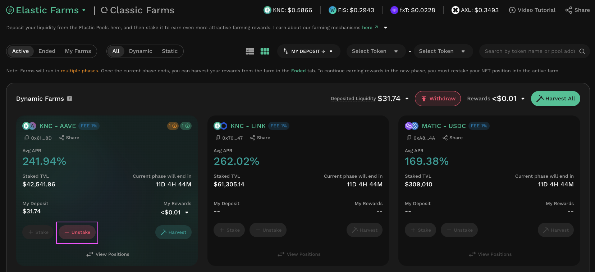<figcaption>
Unstake position from farm
</figcaption></figure>

### Step 2: Confirm unstake

On the unstake helper. select the liquidity position(s) that you would like to unstake and then click the “Unstake Selected” button. This is an onchain transaction.

<figure>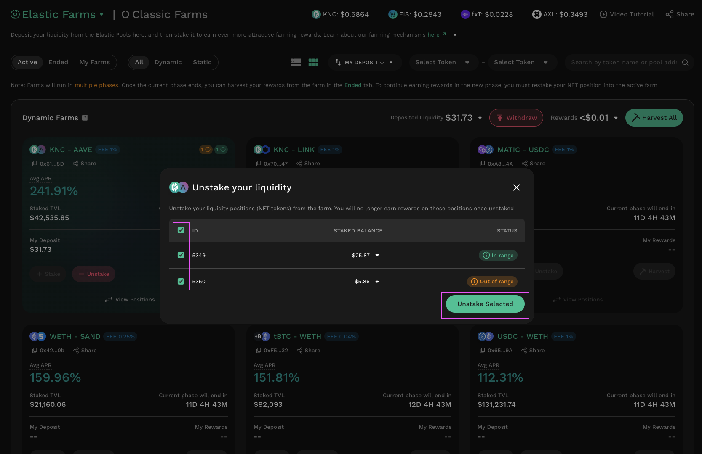<figcaption>
Select position to unstake
</figcaption></figure>

As part of this action, any as-yet unharvested rewards will also automatically be harvested.

From this point on, your liquidity position can either once again be staked into an active phase of the pool to earn rewards, or it can be withdrawn entirely from the farming contract.

### **Step 3**: Withdraw from farming contract&#x20;

<figure>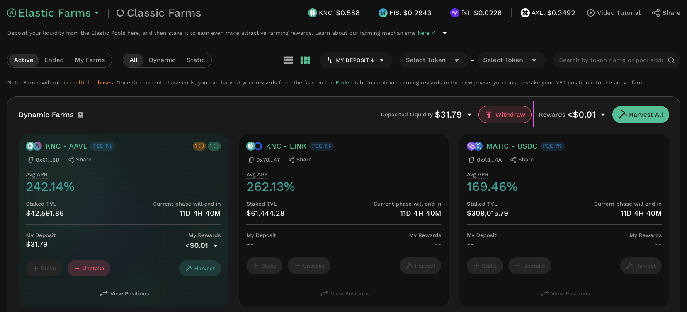<figcaption>
Withdraw from farm
</figcaption></figure>

If you no longer want to participate in the farm, you can withdraw your liquidity from the farming contract. Click the “Withdraw” button on the Farms page.&#x20;

<figure>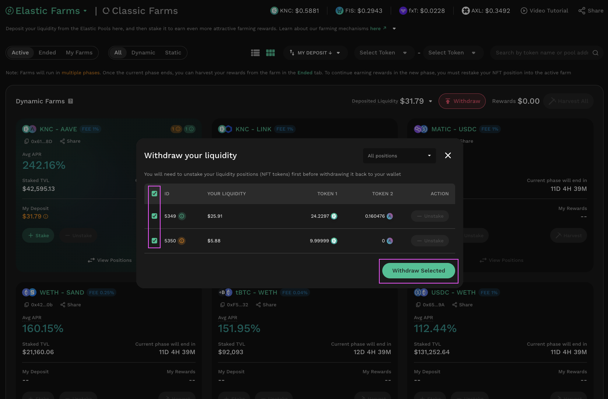<figcaption>
Select positions to withdraw from farming contract
</figcaption></figure>

From the helper that appears, select the liquidity positions to withdraw and click the “Withdraw Selected” button. This is an onchain transaction.

Note: You can only withdraw liquidity positions that have already been unstaked. Staked positions will be greyed out and unselectable.
